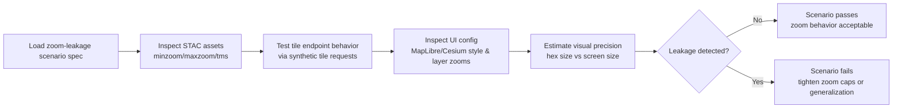

<div align="center">

# 🧪 **Zoom-Leakage CI Scenario (Geo Generalization)**  
`docs/standards/data-generalization/geo/examples/ci-scenarios/zoom_leakage.md`

**Purpose**  
Define CI scenarios that detect **zoom leakage**: cases where tile services, metadata, or frontend styles allow users to zoom beyond governance‑approved levels so that generalized regions (H3 cells, coarse polygons) look like precise point locations.  
If real KFM deployments are more “zoomed‑in” or visually precise than these scenarios permit, CI must fail before any sensitive layer is exposed.

</div>

---

## 📘 Overview

Zoom leakage happens when:

- A generalized spatial layer (e.g., H3 r5/r6, buffered region) is **technically coarse**, but  
- Tile endpoints or UI allow zooming far enough that:

  - Cell boundaries fill the viewport like a single parcel or building, or  
  - Icons/markers make a hex appear as a precise point, or  
  - Legends and styling imply exactness beyond what CARE governance allows.

This scenario pattern:

- Encodes **zoom, TMS, and styling constraints** for sensitive layers.  
- Specifies how CI should interpret **STAC asset zoom fields**, TMS definitions, and UI configuration.  
- Provides both **unsafe** and **corrected** examples for regression testing.

---

## 🧭 Context

This CI scenario is aligned with:

- 🏺 `docs/standards/data-generalization/README.md`  
  Sensitive Site & CARE governance.  

- 🗺️ `docs/standards/data-generalization/geo/README.md`  
  Geo generalization standard (H3 vs concealment, zoom caps).  

- 🛡️ `docs/standards/geospatial/geoprivacy-masking/README.md`  
  Donut masking + sensitivity‑radius mapping.  

- 🧱 `docs/standards/geo/tiling-and-pyramids.md`  
  COG + WebMercatorQuad, `minzoom`/`maxzoom` rules.  

- 🛰️ `docs/standards/geo/stac-geo-spec.md`  
  STAC 1.0 geo metadata, tile asset fields, and TMS semantics.  

Zoom leakage is primarily a **front‑of‑house risk**:

- It emerges at the interface between tile APIs and MapLibre/Cesium configuration.  
- It can occur **even if** STAC, CRS, and masking metadata are technically correct.

---

## 📦 Data & Metadata

### 1. Scenario definition (conceptual JSON)

A zoom‑leakage CI spec might look like:

```json
{
  "scenario_id": "geo-zoom-leakage-v11-basic",
  "description": "Test that a sensitive heritage H3 layer cannot be viewed at zoom levels that imply parcel- or structure-scale precision.",
  "sensitive_layer": {
    "id": "heritage_h3",
    "type": "h3_hex",
    "sensitivity_level": "L3",
    "h3_resolution": 5,
    "stac_asset": {
      "href": "https://tiles.example.org/heritage_h3/{z}/{x}/{y}.pbf",
      "type": "application/vnd.mapbox-vector-tile",
      "roles": ["tiles"],
      "tms": "WebMercatorQuad",
      "minzoom": 5,
      "maxzoom": 9
    }
  },
  "ui_config": {
    "maplibre_style_layer_id": "heritage_h3_layer",
    "minzoom": 5,
    "maxzoom": 9,
    "paint": {
      "fill-opacity": 0.5
    }
  },
  "rules": {
    "forbid_tiles_above_maxzoom": true,
    "forbid_ui_maxzoom_above_asset_maxzoom": true,
    "forbid_point_markers_for_hexes": true,
    "max_safe_pixels_per_hex_edge": 128
  },
  "expected_result": "fail_if_asset_or_ui_allows_zoom_leakage",
  "governance_ref": "council:decision:example-zoom-leakage"
}
```

Key rule ideas:

- **Tile service** MUST NOT serve tiles above the declared `maxzoom` in STAC.  
- **UI** MUST NOT set `maxzoom` higher than the STAC asset’s `maxzoom`.  
- **Hex edge size** in pixels at highest zoom must be below a threshold that visually suggests a single building / parcel.  
- **No icons**: sensitive hexes must be rendered as polygons, not point markers.

### 2. STAC tile asset snippet

For a compliant asset:

```json
"assets": {
  "heritage_h3_tiles": {
    "href": "https://tiles.example.org/heritage_h3/{z}/{x}/{y}.pbf",
    "type": "application/vnd.mapbox-vector-tile",
    "roles": ["tiles"],
    "tms": "WebMercatorQuad",
    "minzoom": 5,
    "maxzoom": 9,
    "tile_size": 256,
    "kfm:sensitivity_level": "L3",
    "kfm:h3_resolution": 5,
    "kfm:layer_visibility": "restricted"
  }
}
```

CI must verify that:

- The tile server **behaves** consistently with these values (no tiles at z > 9).  
- The UI honors or is stricter than these zoom limits.

---

## 🧱 Architecture

### 1. Zoom-leakage analysis flow



Checks include:

1. **STAC vs Tile Service**  

   - For a set of zooms (`z_test > maxzoom`), CI issues requests like:  
     `https://tiles.example.org/heritage_h3/{z}/{x}/{y}.pbf`  

   - Expected behavior:  

     - HTTP `404` / `410` / explicit error for out‑of‑range zooms, **not** a valid tile.  
     - No silent fallback to “closest available zoom” that still returns data.

2. **STAC vs UI**  

   - UI `maxzoom` for the sensitive layer must be:  

     - ≤ asset `maxzoom`, and  
     - ≤ a **governance‑defined** maximum for that sensitivity level (e.g., L3 capped at z9 or z10).

3. **Visual precision estimate**  

   - Approximate edge length (in pixels) of an H3 hex or generalized polygon at `maxzoom` on common viewport sizes.  
   - If hexes span most of the viewport and align tightly with visible land parcels / structures, the layer may **appear** more precise than allowed.  
   - This does not need to be precise physics; a conservative heuristic is sufficient for CI.

4. **Style semantics**  

   - Check that the layer uses polygon fills, not icons/circles.  
   - Point markers on hex centroids at high zoom levels are treated as **leakage** because they visually imply a point location.

---

## 🧪 Validation & CI/CD

This scenario supports a CI job such as:

- `geo-zoom-leakage-check.yml`

Suggested steps:

1. Load `zoom_leakage` scenario spec (YAML/JSON fixture).  
2. Parse referenced STAC Item / Collection for the sensitive layer.  
3. Execute **synthetic tile requests** to the declared `href` for:

   - `z = minzoom - 1` (below minimum).  
   - `z = maxzoom` (expected OK).  
   - `z = maxzoom + 1` (must not return sensitive data).  

4. Inspect frontend configuration (style JSON where stored) to ensure:

   - `minzoom`/`maxzoom` are within allowed range for the sensitivity level.  
   - No icon‑based representation for hexes at high zoom.  

5. Optionally run a geometric heuristic:

   - For a typical viewport, estimate hex edge size (in px) at `maxzoom`.  
   - If edge size exceeds `max_safe_pixels_per_hex_edge`, flag as potential leakage (requires governance tuning).

CI should treat **both** of the following as required sanity checks:

- A **known bad fixture** (e.g., responding at z=14 when `maxzoom=9`) must **fail**.  
- A **known corrected fixture** (tile service + UI both capped at 9) must **pass**.

A PR is **blocked** if:

- Any sensitive layer under test can be successfully requested at a zoom beyond its STAC `maxzoom`.  
- UI config exposes a sensitive layer at a zoom beyond its allowed range.  
- Style semantics turn generalized regions into point‑like markers at high zoom.

Telemetry for this CI job may track:

- Number of tile endpoints tested.  
- Count of endpoints that attempted to serve above `maxzoom`.  
- Distribution of `maxzoom` by sensitivity level.  
- Counts of style violations (markers vs polygons).

---

## 🕰️ Version History

| Version | Date       | Status            | Summary                                                                                                        |
|--------:|------------|-------------------|----------------------------------------------------------------------------------------------------------------|
| v11.0.0 | 2025-12-06 | Active / Enforced | Initial zoom‑leakage CI scenario for geo generalization; defines tile/zoom/style checks for sensitive layers. |

---

<div align="center">

🧪 **KFM v11 — Zoom-Leakage CI Scenario (Geo Generalization)**  
“If the map lets you zoom too far in, the test must zoom out the deployment.”

CC‑BY‑NC 4.0 · FAIR+CARE Council · MCP‑DL v6.3  

[⬅ Back to CI Scenario Index](README.md) · [🗺 Geo Generalization Standard](../../README.md) · [⚖ Governance](../../../../governance/ROOT-GOVERNANCE.md)

</div>

