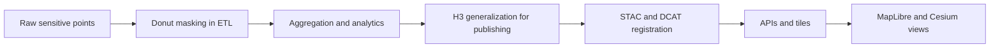

<div align="center">

# 🍩 **Donut Masking vs H3 Generalization — Example Guide (v11.0.0)**  
`docs/standards/data-generalization/geo/examples/donut-vs-h3/README.md`

**Purpose**  
Provide **worked, non‑sensitive examples** showing how KFM combines:

- **Deterministic donut geomasking** (record‑level masking in ETL), and  
- **H3 generalization** (dataset‑ and UI‑level representation)  

to protect sensitive locations while preserving usable spatial patterns.  
This guide helps authors, ETL engineers, and UI teams choose and configure each method correctly under the v11 geoprivacy and CARE governance standards.

</div>

---

## 📘 Overview

KFM v11 uses **two complementary layers of spatial protection**:

1. **Donut masking**  
   - Applied inside ETL to individual sensitive points.  
   - Uses a deterministic offset based on `record_id` and secret salt.  
   - Ensures re‑runs are stable while raw coordinates stay in a secure vault only.

2. **H3 generalization**  
   - Applied when publishing or visualizing datasets.  
   - Represents clusters, counts, or aggregates as hexagonal regions.  
   - Enforces **minimum uncertainty radii** at map and STAC levels.

This guide illustrates:

- When donut masking is **required** vs when H3 alone is sufficient.  
- How to **compose** donut masking plus H3 generalization in a single workflow.  
- How to record **STAC, DCAT, and PROV** metadata for each approach.  
- Example patterns for **Archaeology L1–L4** and other sensitive domains.

All coordinates and hex IDs here are synthetic and non‑sensitive by design.

---

## 🧭 Context

This example guide is downstream of and must remain consistent with:

- 🛡️ Geoprivacy & Cultural‑Safety Masking Standard  
  `docs/standards/geospatial/geoprivacy-masking/README.md`  

- 🏺 Archaeology & Indigenous Sensitive Location Standard  
  `docs/standards/geo/archaeology-sensitive-locations.md`  

- 🏺 Sensitive Site Data Generalization & CARE Governance Guide  
  `docs/standards/data-generalization/README.md`  

- 🗺 Geo Generalization for Sensitive Sites  
  `docs/standards/data-generalization/geo/README.md`  

It is **non‑normative** as policy, but **normative as examples**:

- If a real workflow exposes more detail than the “safe” examples here, CI and governance should treat that as a red flag.  
- If a real workflow behaves like the “unsafe” variants, it must not be deployed.

---

## 📦 Data & Metadata

### 1. Conceptual landscape

We consider a synthetic cluster of sensitive points:

- Three heritage features in a rural valley.  
- One sacred location on a ridge.  
- Nearby public roads and a small town.

We never use real coordinates. Instead, we talk in **relative** or H3 terms:

- Donut‑masked points: `lat_masked`, `lon_masked`  
- H3 cells: `h3_r7_cell_id`, `h3_r5_cell_id`  

### 2. Donut‑masked point example (ETL‑internal)

Minimal ETL‑level record (conceptual):

```json
{
  "record_id": "heritage.0001",
  "sensitivity_label": "sensitive",
  "lat_masked": 38.0005,
  "lon_masked": -96.9994,
  "kfm:privacy_method": "donut_geomask_v1",
  "kfm:r_min_m": 1000,
  "kfm:r_max_m": 3000,
  "kfm:seed_strategy": "HMAC(record_id, secret_salt)",
  "kfm:masking_run_id": "urn:kfm:etl-run:2025-12-01T00:00Z"
}
```

These records are **never** exposed directly in public STAC or UI. They feed into **aggregations** that produce H3‑generalized outputs.

### 3. H3‑generalized output example (publishable)

Example generalized cell:

```json
{
  "h3_id": "8728308ffffff",
  "h3_resolution": 7,
  "site_count": 3,
  "sensitivity_max": "L2",
  "domains": ["archaeology"],
  "kfm:geo_generalization": {
    "mode": "h3",
    "h3_resolution": 7,
    "coordinates_removed": true
  }
}
```

This can be attached to a STAC Item or served as a vector tile layer (MVT) at restricted zoom levels.

---

## 🧱 Architecture

### 1. Donut‑first, H3‑second pipeline



**Key architectural rule:**

- Donut masking protects **record‑level** detail in ETL and analysis.  
- H3 generalization protects **dataset‑level** and **UI‑level** views.  
- Raw coordinates are never allowed beyond node A.

---

### 2. Example A — L2 heritage (donut + H3)

Scenario:

- L2 restricted archaeological sites in low‑risk rural terrain.  
- Objective: allow **regional research and education** while protecting exact locations.

**Pipeline pattern:**

1. ETL reads raw coordinates from vault.  
2. Donut masking applied with radius range appropriate for `sensitive` (for example 1–3 km).  
3. Analysis uses masked points, never raw coordinates.  
4. Publication aggregates masked points to **H3 r7** cells and drops point geometries.  
5. STAC and tile endpoints use only H3 polygons.

Outcome:

- Donut ensures **deterministic scatter** of record locations.  
- H3 ensures that the **public shape** is a region with multiple possible candidate sites.

### 3. Example B — L3 heritage (H3 only, no public donut)

Scenario:

- L3 Indigenous cultural landscape region.  
- Objective: show that a **region is important** without hinting at particular features.

Pipeline:

1. Raw coordinates remain in secure vault for governance and limited expert work.  
2. No donut‑masked points are ever published.  
3. A community‑approved **H3 r5** grid is generated directly from secure data; each cell indicates presence or theme, not counts.  
4. STAC and tiles contain only H3 polygons and high‑level summaries.

Outcome:

- Donut is used internally only if needed for analysis.  
- External systems see **coarse hexes** with no record‑level interpretation.

### 4. Example C — WID or hydrology with sensitive tributary sites

Scenario:

- Hydrologic modeling of a reach that includes sensitive heritage along the banks.  
- Objective: support water management models without disclosing site adjacency.

Pattern:

- Donut‑masked points used to compute distances to channels.  
- Hydrologic rasters and vector outputs **never** include any donut points.  
- Heritage presence is only signaled through coarse H3 overlays on top of hydrologic layers, at restricted zoom levels.

---

## 🧪 Validation & CI/CD

These examples feed into CI checks by providing **target patterns**:

- If a pipeline publishes donut‑masked points as vector layers at any zoom, CI should fail.  
- If H3 is skipped for L3/L4 and donut alone is exposed via tiles, CI should fail.  
- If STAC metadata suggests donut masking but **no H3 generalization** and **no zoom limits** are applied, CI should fail.

Example CI expectations:

- For L2:  
  - Donut masking present in ETL logs and PROV.  
  - H3 r7 or coarser in STAC and tiles.  
- For L3:  
  - No public donut points.  
  - H3 r5 or coarser, zoom‑limited.  
- For L4:  
  - No donut or H3 exposure at all (complete concealment in public catalogs).

Implementations can serialize these examples into fixtures so that:

- A **known safe configuration** (matching Example A or B) passes tests.  
- A **known unsafe configuration** (points exposed, missing H3, or over‑zoomed tiles) fails tests.

---

## 🕰️ Version History

| Version | Date       | Status            | Summary                                                                                          |
|--------:|------------|-------------------|--------------------------------------------------------------------------------------------------|
| v11.0.0 | 2025-12-06 | Active / Enforced | Initial donut vs H3 generalization example guide; aligned with v11 geoprivacy and CARE standards.|

---

<div align="center">

🍩 **KFM v11 — Donut Masking vs H3 Generalization Example Guide**  
“Mask at the record, generalize at the map, protect all the way through.”

CC‑BY‑NC 4.0 · FAIR+CARE Council · MCP‑DL v6.3  

[⬅ Back to Geo Examples](../README.md) · [🧪 CI Scenarios](../ci-scenarios/README.md) · [⚖ Governance](../../../../../governance/ROOT-GOVERNANCE.md)

</div>

