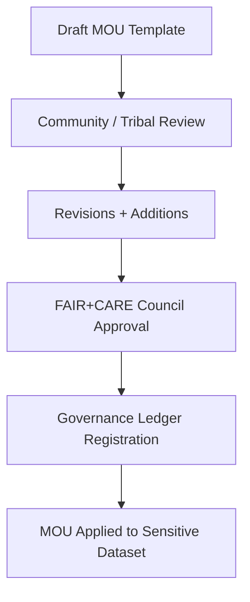

<div align="center">

# 📄 **Kansas Frontier Matrix — Sensitive Data MOU Templates Index**  
`docs/standards/data-generalization/governance/MOU_TEMPLATES/README.md`

**Purpose:**  
Provide authoritative **Memorandum of Understanding (MOU) templates** for managing cultural, archaeological, ecological, and community-governed sensitive datasets within the Kansas Frontier Matrix (KFM).  
MOUs formalize **Authority to Control**, define **generalization requirements**, and ensure ethical sharing aligned with **FAIR+CARE**, **CIDOC CRM**, **DCAT 3.0**, and **MCP-DL v6.3**.

[](../../../README.md)  
[](../../faircare.md)  
[](../../../../LICENSE)  
[](../../../../releases/v10.2.0/)
</div>

---

## 📘 Overview

Sensitive dataset publication in the KFM ecosystem **requires prior agreement** through a formal, community-reviewed **Memorandum of Understanding (MOU)**.

MOUs define:

- Who holds **Authority to Control**  
- What generalization/masking methods are required  
- What rights, restrictions, or obligations exist  
- How high-precision data may be archived  
- Review cadence and emergency withdrawal protocols  
- FAIR+CARE alignment for ethical stewardship  

This directory stores **reusable MOU templates** for tribal partners, cultural institutions, land stewards, and archival collaborators.

---

## 🗂️ Directory Layout

```plaintext
docs/standards/data-generalization/governance/MOU_TEMPLATES/
├── README.md                         # This index
├── TEMPLATE_GENERAL_MOU.md           # Standard general-use MOU
├── TEMPLATE_TRIBAL_SOVEREIGNTY_MOU.md# Indigenous/Tribal authority agreement
├── TEMPLATE_SENSITIVE_SITE_MOU.md    # High-risk archaeological/heritage site MOU
├── TEMPLATE_DATA_RESTRICTION_MOU.md  # Partial or conditional release agreement
└── TEMPLATE_SECURE_ARCHIVE_MOU.md    # High-precision retention & encrypted storage MOU
```

---

## 🧾 Required Elements in All MOUs

| Section | Purpose | Required |
|--------|----------|----------|
| **Parties Involved** | Define all signatories, community authorities, and KFM contacts. | ✅ |
| **Dataset Identification** | Identify sensitive dataset(s) by ID, path, and source. | ✅ |
| **Sensitivity Class** | High / Very High classifications per governance standard. | ✅ |
| **Authority to Control** | Name the community, tribe, or entity with legal/cultural authority. | ✅ |
| **Generalization Requirements** | Rounding, aggregation, masking, or full suppression rules. | ✅ |
| **Retention Policy** | Define secure storage, access rights, and long-term retention. | ⚙️ |
| **Publication Conditions** | Describe masking level required for public release. | ✅ |
| **CARE Compliance Statement** | Required ethical governance declaration. | ✅ |
| **Review Interval** | Annual / biannual / episodic re-authorization. | ⚙️ |
| **Emergency Withdrawal Clause** | Authority to retract public datasets immediately. | ⚙️ |
| **Signatures & Dates** | Authorized representation for all parties. | ✅ |

---

## 🧩 Template Summary

| Template | Use Case | Sensitivity Level |
|----------|----------|--------------------|
| `TEMPLATE_GENERAL_MOU.md` | Generic agreements for moderate sensitivity datasets | Moderate |
| `TEMPLATE_TRIBAL_SOVEREIGNTY_MOU.md` | Agreements requiring **tribal sovereignty and cultural authority** | High / Very High |
| `TEMPLATE_SENSITIVE_SITE_MOU.md` | High-risk archaeological or sacred sites | Very High |
| `TEMPLATE_DATA_RESTRICTION_MOU.md` | Conditional access or embargo-based datasets | Moderate / High |
| `TEMPLATE_SECURE_ARCHIVE_MOU.md` | Retention of precise coordinates in encrypted vaults | High / Very High |

---

## 🧬 MOU Metadata Block (Required)

Each MOU template begins with a standardized machine-readable metadata block for governance indexing:

```yaml
mou_id: "mou-template-general-v1"
version: "v1.0.0"
authority_to_control: "<community-or-tribe>"
review_cycle: "Annual / FAIR+CARE Council"
sensitivity_class: "High"
legal_contact: "<email/phone>"
governance_register_ref: "../../governance_register.json"
```

This metadata is automatically validated in CI via:

- `faircare-validate.yml`
- `docs-lint.yml`
- `telemetry-export.yml`

---

## ⚙️ Example: Required CARE Statement

Each MOU must contain:

```text
This dataset contains culturally sensitive information.  
Publication, redistribution, or derivative use is only permitted  
under the authority and continued oversight of the identified Indigenous  
or community governance body, as supported by the KFM FAIR+CARE Council.
```

---

## 📊 Governance Integration

All MOU decisions are indexed in:

```
docs/standards/data-generalization/governance/governance_register.json
```

All approvals, signatures, and publication decisions are logged in:

```
reports/audit/governance-ledger.json
```

Telemetry events recorded in:

```
releases/v10.2.0/focus-telemetry.json
```

---

## 🧭 Workflow (Mermaid)



---

## 🕰️ Version History

| Version | Date | Author | Summary |
|---------|---------|--------|---------|
| v10.2.2 | 2025-11-12 | FAIR+CARE Council | Added template index, metadata requirements, and telemetry integration. |
| v10.0.0 | 2025-11-09 | FAIR+CARE Council | Initial release of MOU template framework. |

---

<div align="center">

© 2025 Kansas Frontier Matrix — CC BY-NC 4.0  
Master Coder Protocol v6.3 · FAIR+CARE Certified · Diamond⁹ Ω / Crown∞Ω Ultimate Certified  
[Back to Generalization Governance](../README.md) · [Standards Index](../../README.md)

</div>

