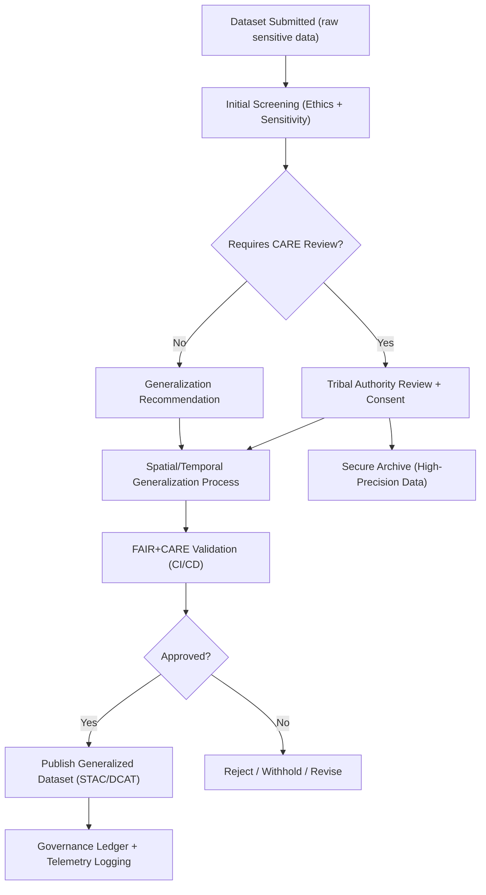

<div align="center">

# 🏺 **Kansas Frontier Matrix — Sensitive Data Governance & Community Oversight Protocol**  
`docs/standards/data-generalization/governance/README.md`

**Purpose:**  
Define the **ethical, procedural, and community-governed oversight system** for handling **archaeological, Indigenous, and culturally sensitive datasets** in the Kansas Frontier Matrix (KFM).  
Ensures full compliance with **FAIR+CARE**, **CIDOC CRM**, **DCAT 3.0**, and **Master Coder Protocol (MCP-DL v6.3)** using transparent validation, tribal authority, and governance ledger tracking.

[](../../../README.md)  
[](../../faircare.md)  
[](../../../../LICENSE)  
[](../../../../releases/v10.2.0/)
</div>

---

## 📘 Overview

This governance document defines **how sensitive cultural and archaeological datasets move through review, approval, masking, and publication** phases in the Kansas Frontier Matrix.

Core goals:

- Protect Indigenous cultural heritage  
- Enforce **Authority to Control** through tribal governance  
- Guarantee ethical publication with **minimum-necessary openness**  
- Maintain transparent governance records  
- Apply reproducible technical controls  
- Integrate tightly with FAIR+CARE validation workflows  

All sensitive data **must** follow this governance protocol before entering `data/processed/`, `data/archive/`, or public STAC/DCAT catalogs.

---

## 🗂️ Directory Layout

```plaintext
docs/standards/data-generalization/governance/
├── README.md                                   # This file (governance protocol)
├── MOU_TEMPLATES/                               # Memorandum of Understanding templates
├── CARE_APPROVAL_FORMS/                         # Tribal + Council approval forms
├── REVIEW_LOGS/                                 # Council-level review sessions
├── generalization_decisions.json                # Machine-readable ruling history
└── governance_register.json                     # Index of all sensitive dataset governance states
```

---

## 🧭 Governance Pipeline (End-to-End)



---

## 🧩 Roles & Responsibilities

| Role | Responsibilities | Required Actions |
|------|------------------|------------------|
| **Tribal Authority** | Cultural sovereignty, approval/denial of release. | Sign CARE approval form; define required masking level. |
| **FAIR+CARE Council** | Ethical oversight, conflict resolution, governance audits. | Review sensitive submissions; authorize publication. |
| **Heritage Data Custodian** | Technical generalization & metadata creation. | Apply masking, build DCAT/STAC metadata. |
| **KFM Governance Secretariat** | Maintain registers, ledgers, and MOUs. | Archive decisions; sync telemetry. |

A release **cannot** proceed without explicit acknowledgement by tribal authorities for “High” or “Very High” sensitivity datasets.

---

## ⚖️ Sensitivity Classification Rules

| Class | Meaning | Required Action |
|-------|---------|------------------|
| **Low** | Minimal risk, already public information | Simple contract validation |
| **Moderate** | Heritage importance but not restricted | Rounding + metadata CARE block |
| **High** | Archaeological sites, burial grounds | Tribal approval + strong generalization |
| **Very High** | Sacred sites / active spiritual use | No coordinates; metadata-only release |

---

## 🧾 Required Governance Metadata Fields

To be included in every sensitive dataset manifest (`data/sources/*.json`):

```json
{
  "sensitivity_class": "High",
  "authority_to_control": "Prairie Band Potawatomi Nation",
  "access_policy": "Restricted",
  "care": {
    "status": "approved",
    "reviewer": "FAIR+CARE Council",
    "date_reviewed": "2025-11-10",
    "statement": "Coordinates generalized at community request.",
    "notes": "Original high-precision data stored in encrypted archive."
  }
}
```

---

## 🧾 Required Governance Decision Record

Tracked in:

```
docs/standards/data-generalization/governance/generalization_decisions.json
```

### Example:
```json
{
  "id": "generalized_site_0007",
  "decision": "approved",
  "authority_to_control": "Ioway Tribe of Kansas and Nebraska",
  "method_used": "1km_rounding",
  "review_timestamp": "2025-11-10T19:22:00Z",
  "ledger_ref": "reports/audit/governance-ledger.json"
}
```

---

## 📑 MOU Requirements (Memoranda of Understanding)

Every High/Very High sensitivity dataset must carry an MOU that specifies:

- Stewardship rights  
- Who can access precise coordinates  
- Generalization technique chosen  
- How long retention applies  
- Governance re-review interval  
- Emergency withdrawal procedures  

Templates stored under:  
`docs/standards/data-generalization/governance/MOU_TEMPLATES/`

---

## 🔐 Secure Archive Protocol

High-precision data is **never** published publicly.

### Storage Requirements:
- Encrypted at rest (AES-256)  
- Tribal-access-only decryption keys  
- Logged access attempts  
- Long-term retention policies defined in MOU

All access logged in:  
`docs/standards/data-generalization/governance/governance_register.json`

---

## 🧪 Validation & CI Governance Integration

Sensitive dataset workflows integrate with:

| Workflow | Purpose |
|----------|---------|
| `faircare-validate.yml` | CARE status enforcement & consent validation |
| `stac-validate.yml` | Ensure generalization fields, accessLevel, CARE metadata |
| `docs-lint.yml` | Documentation integrity & accessibility |
| `telemetry-export.yml` | Governance telemetry → unified ledger |

Telemetry appended to:  
`releases/v10.2.0/focus-telemetry.json`

---

## 📊 Governance Register Structure

`governance_register.json` tracks the canonical state of every sensitive dataset.

```json
{
  "datasets": [
    {
      "id": "kfm-sensitive-site-0032",
      "sensitivity_class": "Very High",
      "care_status": "approved",
      "authority": "Kickapoo Tribe in Kansas",
      "generalization_method": "suppression",
      "ledger_ref": "reports/audit/governance-ledger.json"
    }
  ]
}
```

---

## 🧭 Ethical Review Checklist

| Requirement | Status |
|------------|--------|
| MOU signed by authority-to-control | ✔ |
| Sensitivity class evaluated | ✔ |
| Spatial/temporal generalization applied | ✔ |
| CARE block validated | ✔ |
| FAIR metadata validated | ✔ |
| Governance ledger updated | ✔ |
| Telemetry event added | ✔ |

---

## 🕰️ Version History

| Version | Date | Author | Summary |
|--------|---------|---------|---------|
| v10.2.2 | 2025-11-12 | FAIR+CARE Council | Initial release of sensitive site governance protocol. |
| v10.0.0 | 2025-11-09 | FAIR+CARE Council | Drafted governance model for generalization and cultural approval. |

---

<div align="center">

© 2025 Kansas Frontier Matrix — CC BY-NC 4.0  
Master Coder Protocol v6.3 · FAIR+CARE Certified · Diamond⁹ Ω / Crown∞Ω Ultimate Certified  
[Back to Generalization Guide](../README.md) · [Standards Index](../../README.md)

</div>
