<div align="center">

# 🏺 **Kansas Frontier Matrix — Sensitive Data Governance & Community Oversight Protocol**  
`docs/standards/data-generalization/governance/README.md`  
**Diamond⁹ Ω / Crown∞Ω Ultimate Certified**

**Purpose:**  
Establish the **comprehensive governance system** for all sensitive, archaeological, Indigenous, ecological, and culturally important datasets in KFM.  
Defines **authority structures**, **ethical frameworks**, **generalization requirements**, **MOU rules**, **review pipelines**, **ledger logging**, **retention policies**, **data sovereignty mandates**, **CI enforcement**, and **secure archival procedures**.  
Integrates guidelines from **MCP-DL v6.3**, **MCP-2.0**, **FAIR+CARE**, **CIDOC-CRM**, **GeoSPARQL**, **OWL-Time**, **DCAT 3.0**, **STAC 1.x**, and **KFM-MDP v11**.

</div>

---

# 🧭 **1. Scope & Purpose (Normative)**

This protocol governs:

- All datasets containing **sensitive cultural, archaeological, Indigenous, ecological, ceremonial, hydrological, sacred, or restricted information**.
- All workflows involving **generalization**, **concealment**, **sovereignty permissions**, **cultural review**, and **ethical approval**.
- All publication outputs, including:
  - STAC Items  
  - DCAT Datasets  
  - Focus Mode v3 narratives  
  - Story Node v3 elements  
  - MapLibre layers  
  - Analytical overlays  
  - Public reports  
  - Derived models and simulations  

This document supersedes all earlier governance policies for sensitive KFM data.

Sensitive data governance exists to:

- **Protect communities, histories, cultural sites, and ecological resources**  
- **Honor Indigenous authority and sovereignty**  
- **Prevent looting, damage, misinterpretation, or misuse**  
- **Ensure KFM remains an ethical, trustworthy steward**

---

# 🧠 **2. Principles & Ethical Foundations (Normative)**

KFM governance is built on the following mandatory principles:

---

## 🔶 **2.1 FAIR Principles (Technical Obligations)**

- **F1 – Findable**: Only generalized metadata is findable. Raw site metadata is not indexed.
- **A1 – Accessible**: Access to sensitive content is **tiered, controlled, and revocable**.
- **I1 – Interoperable**: Generalized representations must map to STAC/DCAT/CIDOC standards.
- **R1 – Reusable**: Reuse is subject to CARE + MOU conditions.

---

## 🟫 **2.2 CARE Principles (Ethical & Sovereignty Obligations)**

CARE is **mandatory** for all sensitive datasets:

| Principle | Requirement |
|----------|-------------|
| **C – Collective Benefit** | Data releases MUST support communities, never harm them. |
| **A – Authority to Control** | Tribal nations retain absolute authority over release, suppression, timing, precision, and narrative. |
| **R – Responsibility** | KFM MUST prevent harm even when legally permitted to release. |
| **E – Ethics** | Ethical review overrides technical or academic interests. |

**KFM recognizes Indigenous sovereignty as non-negotiable.**

---

## 🟦 **2.3 MCP-DL v6.3 & MCP-2.0 Alignment**

This protocol integrates:

- **MCP-DL v6.3** (documentation-first + experiment-logged governance)
- **MCP-2.0** (scientific rigor, reproducibility, lineage, reliability)
- **CIDOC CRM mapping** for cultural/historical data modeling
- **OWL-Time** for temporal generalization standards
- **GeoSPARQL** for geometric generalization patterns

---

# 🧭 **3. Definitions & Sensitivity Model**

---

## 🗝️ **3.1 Sensitive Data (Mandatory Definition)**

Sensitive data includes any geospatial, temporal, narrative, or descriptive data whose exposure could:

- Reveal the location of archaeological, ceremonial, burial, sacred, or ecological sites  
- Reveal Indigenous knowledge requiring permission to share  
- Enable trespass, looting, exploitation, or misrepresentation  
- Cause cultural, spiritual, ecological, or political harm  
- Break trust with community partners  

---

## 🛑 **3.2 Sensitivity Classes**

Every dataset covered by this protocol MUST be assigned one of the following:

| Class | Description | Release Status |
|-------|-------------|----------------|
| **Low** | Public info, low risk | Allowed, minimal generalization |
| **Moderate** | Heritage relevance, some risk | Required rounding + CARE review |
| **High** | Archaeological, burial, cultural | Requires tribal approval + H3 ≥ r7 |
| **Very High** | Sacred, ceremonial, restricted | No coordinates, no geometry, metadata-only |

No dataset may be downgraded without tribal approval.

---

## 🔒 **3.3 Raw vs. Generalized vs. Withheld Data**

| Type | Definition | Where Stored |
|------|------------|--------------|
| **Raw** | Exact geometry, dates, attributes | Tier-1 Secure Archive (encrypted) |
| **Generalized** | H3, grids, synthetic approximations | Public/Restricted catalogs |
| **Withheld** | No geometry; safe summaries only | Public/Restricted docs |

Raw data may **never** appear outside Tier-1 under any circumstance without explicit authority.

---

# 🧭 **4. Governance Roles & Authorities (Continued)**

The KFM sensitive data governance ecosystem consists of **multi-tiered authorities**, each with distinct powers, responsibilities, and veto rights.

---

## 👑 **4.1 Tribal/Indigenous Authority (Highest Authority)**

**This authority supersedes all other forms of governance within KFM.**

### Required Powers
Tribal Nations hold the right to:

- **Approve or deny** any release of sensitive data  
- **Set the required masking or concealment level**  
- **Dictate narrative boundaries** for Story Nodes or Focus Mode  
- **Define embargo periods** and retention policies  
- **Request immediate takedown** of any dataset or derived product  
- Require the destruction of specific raw dataset copies  
- Approve or prohibit the use of *any* AI model trained on sensitive data  
- Control the release of cultural timelines, maps, or ceremonial references  
- Require inclusion of community narratives, disclaimers, or context  

### Required KFM Behavior
KFM MUST:

- Treat tribal authority directives as **binding and final**  
- Implement governance decisions within **72 hours** or less  
- Provide transparent logs of takedown or change operations  
- Ensure all technical staff honor sovereignty protocols  
- Provide communities access to formatted, audit-ready governance logs on request  

---

## 🧡 **4.2 FAIR+CARE Council**

The council ensures:

- Alignment with **CARE** ethics  
- Verification of tribal approval  
- Verification of technical generalization sufficiency  
- Authorization of publication or rejection  
- Annual governance audits  
- Oversight of takedown and emergency withdrawal events  

Members MUST include:

- Cultural heritage experts  
- Tribal representatives  
- Ethics officers  
- Technical maintainers trained in CARE compliance  

The council may **pause, deny, or revoke** data releases at any time.

---

## 🛠️ **4.3 Heritage Data Custodian**

Technical role responsible for:

- H3 spatial masking  
- Temporal aggregation  
- Attribute suppression  
- Secure archival of raw data  
- Generating STAC/DCAT metadata  
- Running CI validation pipelines  
- Ensuring contract compliance  
- Producing governance ledger entries  

Custodians MUST NOT:

- Modify cultural information without community approval  
- Generate synthetic interpretations without labeling them as synthetic  
- Alter generalization levels without new governance review  

---

## 🏛️ **4.4 KFM Governance Secretariat**

Administrative authority responsible for:

- Managing MOUs, agreements, approvals  
- Maintaining governance registers and decision logs  
- Documenting provenance chains  
- Issuing protocol updates  
- Ensuring compliance during repository merges  
- Synchronizing telemetry with governance-ledger events  

Secretariat staff MUST be:

- Vetted  
- CARE-literate  
- Bound by confidentiality for restricted decisions  

---

## 🧪 **4.5 Scientific/Research Contributors**

Research contributors may request access to:

- Restricted generalized data (never raw sensitive coordinates)  
- Temporal aggregated data  
- Dataset summaries  

Researchers MUST:

- Complete a CARE ethics certification  
- Agree to non-disclosure of sensitive data  
- Publish derivatives under MOU-permitted terms  
- Document all experiments in accordance with **MCP-DL v6.3** or **MCP-2.0**  

Researchers MAY NOT:

- Request raw coordinates unless explicitly permitted by tribal authorities  
- Infer or attempt to reconstruct precise site locations  
- Use generalized datasets to generate de-anonymized models  

---

## 🛡️ **4.6 Emergency Oversight Committee**

Activated in case of:

- Data breaches  
- Unauthorized disclosure  
- Accidental publication  
- Rapid escalations of sensitivity due to current events  
- Unanticipated community concerns  

The committee includes:

- Tribal representatives  
- FAIR+CARE Council  
- Data Custodian  
- Executive governance personnel  

They MUST:

- Freeze related pipelines  
- Pull affected datasets from circulation  
- Initiate takedown workflows  
- Notify affected communities within **24 hours**  
- Document incident in governance ledger  

---

# 🔥 **5. Legal, Ethical & Sovereignty Frameworks (Normative)**

Sensitive-site governance is supported by:

---

## 📜 **5.1 Indigenous Sovereignty Framework**

All sensitive cultural data governance is derived from:

- Tribal law
- Tribal cultural protocols  
- Intergovernmental MOUs  
- Community stewardship principles  

No KFM policy overrides sovereignty.

---

## ⚖️ **5.2 U.S. Legal Frameworks (Non-Exhaustive)**

Though KFM is a technical project, it aligns with:

### **NHPA §304**
Allows withholding of archeological locations from public records.

### **NAGPRA**
Protects burial sites and culturally significant objects.

### **ARPA**
Restricts archaeological excavation and site disclosure.

### **FOIA Exemptions**
Sensitive data exempt from public request due to cultural/heritage protections.

### **Endangered Species Act (ESA)**
Certain ecological locations may require concealment.

**These laws guide but do not replace Tribal authority.**

---

## 🌍 **5.3 International & Ethical Frameworks**

KFM voluntarily aligns with:

- UNESCO heritage protection  
- CARE Principles (GIDA)  
- UNDRIP (United Nations Declaration on the Rights of Indigenous Peoples)  
- OCAP (Ownership, Control, Access, Possession)  
- ISO 26000 (Ethical Guidance)  

---

# 🔐 **6. Data Categories & Protection Levels**

Sensitive data is divided into four categories:

---

## 🟥 **6.1 Category A — Sacred / Ceremonial / Burial Sites (Very High Sensitivity)**

MUST:

- NEVER disclose coordinates  
- NEVER publish polygons, buffers, or approximate shapes  
- Use metadata-only, MOU-approved summaries  
- Require tribal approval for *any* mention  
- Be excluded from Story Nodes unless community directs content  

---

## 🟧 **6.2 Category B — Archaeological Features (High Sensitivity)**

MUST:

- Use H3 generalization (res ≥ 7)  
- Remove or alter sensitive attributes  
- Round timestamps to broad ranges  
- Require full CARE review  

---

## 🟨 **6.3 Category C — Cultural Geography (Moderate Sensitivity)**

MUST:

- Round spatial data (≥ 1 km)  
- Mask or suppress certain names  
- Use temporal aggregation if requested  
- Include CARE metadata  

---

## 🟩 **6.4 Category D — Ecological / Hydrological Sites (Conditional Sensitivity)**

- Generalization required if:
  - site contains endangered species  
  - site is culturally important  
  - site is vulnerable to exploitation  

---

# 📦 **7. Data Handling Architecture (Technical Requirements)**

Sensitive-site data must flow through the following architectural tiers:

---

## 🧊 **7.1 Tier-1 — Secure Archive (Raw Sensitive Data)**

Raw coordinates, attributes, and timestamps MUST be stored in:

- Encrypted vault  
- With tribal-access-only keys  
- Access logging (immutable)  
- Zero inclusion in public Git history  
- Zero presence in STAC collections  

Tier-1 MUST meet:

- AES-256 encryption  
- Zero-trust policy  
- Role-based access  
- Quarterly audits  

---

## 📦 **7.2 Tier-2 — Generalized Restricted Data**

Includes:

- H3 generalized features  
- Grid aggregations  
- Masked geomorphology  
- Temporal windows  

Used for:

- Restricted internal dashboards  
- Research within approved groups  

---

## 🌐 **7.3 Tier-3 — Public Generalized Data**

Includes:

- Synthetic geometries  
- High-level summaries  
- Coarse bounding boxes  
- Narrative-safe descriptions  

No attribute may allow inference of precise location.

---

# 🧱 **8. Required Metadata Structures (Normative)**

Sensitive-site generalized datasets MUST include the following metadata layers:

---

## 🧾 **8.1 CARE Metadata**

```json
{
  "care": {
    "status": "approved | restricted | withheld",
    "authority_to_control": "Example Tribal Nation",
    "reviewer": "FAIR+CARE Council",
    "review_date": "2025-11-12",
    "statement": "Generalization applied at community request; raw coordinates withheld.",
    "notes": "Synthetic geometries generated; only high-level attributes preserved."
  }
}
```

---

## 🛰 **8.2 STAC Required Properties**

```json
{
  "kfm:h3_generalization": true,
  "kfm:h3_resolution": 7,
  "kfm:coordinates_removed": true,
  "kfm:legal_basis": "NHPA §304; Tribal MOU",
  "kfm:care_status": "restricted",
  "kfm:sensitivity_level": "high"
}
```

---

## 📚 **8.3 DCAT Required Properties**

```json
{
  "dct:accessLevel": "restricted",
  "dct:rights": "CARE-governed",
  "dct:provenance": "Generalized from protected raw coordinates; raw data withheld.",
  "dcat:spatialResolutionInMeters": 5000
}
```

---

# 🛠️ **9. Generalization Requirements (Normative, Strict Enforcement)**

Generalization is **mandatory** for *all* sensitive datasets.  
The following rules MUST be followed with zero exceptions.

---

## 🧱 **9.1 Spatial Generalization (Mandatory)**

### ✔ H3 Generalization (Primary Method)
- Default required resolution: **r ≥ 7**  
  (~1.22 km hex diameter)
- Sacred/burial/ceremonial sites:  
  **r ≥ 5** (coarser) OR full concealment (preferred)
- Allowed outputs:
  - `h3_id`
  - generalized polygons
  - aggregated attributes

### ❌ Prohibited:
- Any exposure of raw lat/lon  
- Any buffer derived from raw coordinates  
- Any geometry that implies precise location  
- Polygon simplification alone (insufficient)

---

## 🧱 **9.2 Grid Aggregation (Secondary Method)**

For datasets representing counts over space:

- Grid sizes MUST be ≥ **5 km × 5 km**  
- No per-site information allowed  
- Attributes must be aggregated or suppressed  
- Temporal attributes MUST be generalized (see §9.3)

Used for:
- Ecological summaries  
- Cultural density studies  
- Demographic overlays

---

## 🧱 **9.3 Temporal Generalization (Mandatory)**

Exact timestamps MUST be replaced by:

- Decade ranges (e.g., `"1850–1860"`)  
- Cultural periods (e.g., `"Late Precontact Period"`)  
- Broad ranges (e.g., `"1400–1700 CE"`)  

Exact dates MAY NOT appear in:

- STAC Items  
- DCAT Datasets  
- Public-facing metadata  
- Story Nodes  
- Focus Mode narratives

Exceptions require:
- Tribal authority approval  
- FAIR+CARE Council signoff  
- Documented rationale

---

## 🧱 **9.4 Attribute Suppression (Mandatory)**

Attributes MUST be removed or generalized if they include:

- Sacred names  
- Ritual indicators  
- Burial-specific descriptors  
- Restricted cultural knowledge  
- Detailed directions  
- Artifact types that imply location  
- Photographs with identifiable landmarks

Allowed attributes:
- Cultural era  
- High-level site type (e.g., “habitation,” “camp,” “earthwork”)  
- Non-specific counts (e.g., “5–10 artifacts”)

---

## 🧱 **9.5 Complete Concealment (Required for Sacred/Burial Sites)**

The following MUST NOT be published:

- Coordinates  
- Geometry  
- H3 values  
- Shapes, centroids, footprints  
- Raster cutouts  
- Photos with identifiable terrain  
- Archaeological descriptions with spatial implications

Published representations MUST be:

- Metadata-only  
- Community-approved  
- Narrative-safe summaries  
- High-level cultural explanation (if allowed)

---

# 🛰️ **10. Metadata Obligations For Sensitive Datasets**

Sensitive datasets MUST implement:

- **CARE metadata block**  
- **Generalization metadata block**  
- **DCAT compliance**  
- **STAC compliance**  
- **Provenance metadata (PROV-O / KFM lineage)**  
- **Temporal ontology mapping (OWL-Time)**  
- **Spatial ontology mapping (GeoSPARQL)**  
- **CIDOC CRM mapping** for cultural/historic content

---

## 📜 **10.1 Required Metadata Block (Master Template)**

```json
{
  "id": "kfm-sensitive-XXXX",
  "title": "Generalized Cultural Features — Example Region",
  "description": "Generalized sensitive data, exhibiting H3 spatial masking and temporal aggregation.",
  "sensitivity_class": "High",
  "care": {
    "status": "approved",
    "authority_to_control": "Example Tribal Nation",
    "reviewer": "FAIR+CARE Council",
    "review_date": "2025-11-01",
    "statement": "Generalization required to protect community heritage.",
    "notes": "No raw coordinates included."
  },
  "kfm:h3_generalization": true,
  "kfm:h3_resolution": 7,
  "kfm:coordinates_removed": true,
  "dct:accessLevel": "restricted",
  "dcat:spatialResolutionInMeters": 5000,
  "prov:wasGeneratedBy": "kfm-h3-generalization-pipeline-v2.1",
  "prov:used": "Tier-1-archive-sensitive-records",
  "updated": "2025-11-20T00:00:00Z"
}
```

---

# 🧱 **11. Validation Pipeline (Strict CI/CD Enforcement)**

All sensitive datasets MUST pass:

---

## 🧪 **11.1 FAIR+CARE Validation**

Workflow: `faircare-validate.yml`

Checks:

- CARE completeness  
- Tribal authority fields  
- Sensitivity class  
- Status ("approved" / "restricted")  
- Temporal and spatial generalization applied  
- Prohibited fields absent  

Failure → dataset cannot enter ANY public or restricted catalog.

---

## 🧪 **11.2 STAC/DCAT Validation**

Workflow: `stac-validate.yml`

Ensures:

- No raw geometry  
- `kfm:*` generalization flags exist  
- DCAT access level correct  
- Spatial resolution ≥ 1 km  
- All ontology alignments satisfied

---

## 🧪 **11.3 Data Contract Validation**

Workflow: `data-contract-validate.yml`

Confirms:

- All required metadata fields present  
- CARE block valid  
- Lineage fields structured correctly  
- Temporal windows valid  

---

## 🧪 **11.4 Narrative Safety Validation**

Workflow: `storynode-sensitive-validate.yml` (new in v11)

Ensures:

- Story Nodes do not reveal sensitive coordinates  
- Focus Mode anchors to H3, not points  
- Narrative phrasing conforms to cultural protocols  
- No inference of sacred/burial locations  

---

## 🧪 **11.5 Documentation Integrity Validation**

Workflow: `docs-lint.yml`

Ensures:

- Proper directory layout  
- Markdown complies with KFM-MDP v11  
- YAML front matter valid  
- No accidental leakage in examples  

---

## 🧪 **11.6 Telemetry Export**

Workflow: `telemetry-export.yml`

Exports:

- governance events  
- energy/carbon cost of generalization  
- user actions (masked)  
- number of datasets generalized  
- CI compliance rates  

Stored in:

```
releases/v11.0.0/focus-telemetry.json
```

---

# 🔒 **12. Governance Ledger Requirements (Normative)**

KFM MUST maintain a machine-readable governance ledger for:

- Generalization decisions  
- Approvals & denials  
- MOU changes  
- Authority-to-control decisions  
- Embargoes  
- Declassification reviews  
- Emergency withdrawals  

Ledger must be:

- Immutable  
- Append-only  
- Timestamped  
- CI-updated  

---

## 📘 **12.1 Governance Ledger Entry (Template)**

```json
{
  "event_type": "generalization_decision",
  "dataset_id": "kfm-sensitive-XXXX",
  "sensitivity_class": "High",
  "care_status": "approved",
  "authority_to_control": "Example Tribal Nation",
  "resolution": 7,
  "raw_coordinates_removed": true,
  "temporal_generalization": "1850–1900",
  "timestamp": "2025-11-20T14:22:00Z",
  "review_ref": "council:decision:2025-10-12"
}
```

---

## 🧾 **12.2 Secure Storage of Ledger Files**

Location:

```
docs/reports/audit/governance-ledger.json
```

Rules:

- MUST NOT be public-facing  
- MUST be encrypted if containing restricted details  
- Access MUST be logged  
- Annual archival to long-term encrypted storage  

---

# ⏳ **13. Declassification, Embargoes & Retention**

Sensitive datasets follow **tiered declassification** based on legal, cultural, ethical, and sovereignty requirements.

---

## 🟥 **13.1 Embargo Categories**

| Embargo Type | Definition | Release Requirements |
|--------------|------------|----------------------|
| **Cultural Embargo** | Community prohibits any release for cultural/spiritual reasons. | NEVER automatically expires; requires explicit community approval. |
| **Research Embargo** | Data restricted temporarily during active analysis or collaboration. | Usually 1–5 years; MUST be renewed or lifted via formal review. |
| **Legal Embargo** | Restricted due to NHPA §304, NAGPRA, ARPA, ESA, or confidentiality laws. | Lifted only when law permits; Council + tribal authority must concur. |
| **Protection Embargo** | Data withheld due to risk of looting, vandalism, or ecological harm. | Reviewed annually; release requires strong generalization and authority approval. |

---

## 🔐 **13.2 Embargo Management Protocol**

All embargoed datasets MUST include:

```json
{
  "embargo": {
    "type": "cultural | research | legal | protection",
    "expires": "never | YYYY-MM-DD",
    "authority_to_extend": "Example Tribal Nation",
    "renewal_required": true,
    "notes": "Embargo reviewed annually under FAIR+CARE oversight."
  }
}
```

Rules:
- Cultural embargoes **never auto-expire**.  
- Research embargoes MUST be reviewed at least once every 2 years.  
- Legal embargoes follow statutory timelines and MUST NOT be overridden.  

---

## 🔄 **13.3 Declassification Workflow**

```mermaid
flowchart TD
    A["Embargoed Dataset"] --> B["Tribal + Council Joint Review"]
    B --> C{"Culturally safe to declassify?"}
    C -->|No| D["Embargo Extended<br/>Update Governance Ledger"]
    C -->|Yes| E["Apply New Generalization<br/>H3 ≥ r7 or Withheld"]
    E --> F["FAIR+CARE + STAC Validation"]
    F --> G{"Approved?"}
    G -->|No| D
    G -->|Yes| H["Publish Generalized Dataset"]
```



---

## 🧾 **13.4 Declassification Ledger Entry**

```json
{
  "event_type": "declassification_review",
  "dataset_id": "kfm-sensitive-XXXX",
  "previous_embargo": "cultural",
  "new_status": "generalized_public",
  "reviewer": "FAIR+CARE Council",
  "authority_to_control": "Example Tribal Nation",
  "timestamp": "2025-11-20T12:11:00Z"
}
```

---

# 🔥 **14. Emergency Withdrawal & Rapid Takedown Protocol**

Sensitive datasets may require immediate removal due to:

- Discovery of new cultural importance  
- Community request or updated sovereignty directive  
- Evidence of risk (looting, vandalism, exploitation)  
- Technical error (accidental coordinate leak)  
- Legal or ethical conflict (NAGPRA triggers, ARPA conflict)  
- Ecological danger (endangered species exposure)

---

## 🚨 **14.1 Activation Triggers**

Any of the following triggers emergency withdrawal:

- Community initiates takedown request  
- FAIR+CARE Council votes emergency override  
- Governance Secretariat receives evidence of disclosure risk  
- Security systems detect unauthorized access  
- Story Node or Focus Mode content inadvertently increases locational precision  

---

## 🛑 **14.2 Immediate Actions (Must occur within 24 hours)**

1. **Freeze** all related pipelines & automated deployments  
2. **Remove** dataset from:
   - STAC catalogs  
   - DCAT catalogs  
   - Public map layers  
   - API responses  
   - Story Node/Focus Mode context  
   - Documentation pages  
3. **Replace** public references with:
   > “Content temporarily withdrawn pending cultural review.”

4. **Notify** affected communities  
5. **Log** all events to the governance ledger  
6. **Encrypt & quarantine** any exposed raw or generalized files  

---

## 🔧 **14.3 Emergency Takedown Record (Ledger Entry)**

```json
{
  "event_type": "emergency_takedown",
  "dataset_id": "kfm-sensitive-XXXX",
  "reason": "Community request citing cultural risk",
  "actions_taken": [
    "Catalog removal",
    "Story Node suppression",
    "Focus Mode suppression",
    "API removal"
  ],
  "timestamp": "2025-11-20T15:04:00Z",
  "authority_to_control": "Example Tribal Nation",
  "review_required": true
}
```

---

# 🧊 **15. Secure Storage & Archival Requirements**

Sensitive raw data MUST follow strict cryptographic and procedural requirements.

---

## 🔐 **15.1 Tier-1 Archive (Raw Data)**

- AES-256 encryption  
- Key-splitting between KFM + community partners  
- Zero-trust, RBAC-limited access  
- No public endpoints  
- Immutable append-only logs  

### Mandatory Audit Pattern:

- Quarterly permission reviews  
- Annual key-rotation  
- Tribal authority co-sign required for access  

---

## 📦 **15.2 Tier-2 Archive (Restricted Generalized Data)**

Contains:

- H3 generalized data  
- Grid aggregations  
- Masked temporal ranges  
- Synthetic approximations  

Can be accessed by:

- Approved researchers  
- Internal maintainers  
- Community-data stewards  

MUST be:

- Encrypted  
- Audited  
- Subject to retention controls  

---

## 🌐 **15.3 Tier-3 Archive (Public Generalized Data)**

Contains:

- Coarse synthetic geometries  
- Non-sensitive attribute summaries  
- Narrative-safe metadata  

No data here may enable reverse inference of real sensitive sites.

---

# 🧾 **16. Multi-Party MOU Requirements (Full Templates Included)**

This section includes the **full MOU templates**, as requested.

Sensitive dataset handling requires a signed **Memorandum of Understanding (MOU)** between:

- Tribal/Indigenous Authority  
- FAIR+CARE Council  
- KFM Governance Secretariat  
- Heritage Data Custodian  
- Any research collaborators (where applicable)

The MOU defines:

- Sovereignty  
- Data access  
- Generalization levels  
- Term limits  
- Renewal cycles  
- Storage rules  
- Publication constraints  
- Narrative restrictions  
- Emergency withdrawal procedures  

---

# 📝 **16.1 Full MOU Template — Cultural Stewardship Agreement**

```text
MEMORANDUM OF UNDERSTANDING  
Between  
The Kansas Frontier Matrix (KFM) Project  
And  
<Tribal Nation / Indigenous Authority Name>

Effective Date: <YYYY-MM-DD>  
Document ID: <urn:kfm:mou:####>

1. PURPOSE  
   This MOU establishes the cultural, ethical, and governance requirements for handling
   sensitive cultural, archaeological, ecological, or ceremonial data associated with  
   <Tribal Nation> within the Kansas Frontier Matrix project.

2. DEFINITIONS  
   "Sensitive Data" includes, but is not limited to: archaeological locations, sacred sites,
   ceremonial spaces, burial grounds, ecological sites of cultural relevance, and all
   associated narratives or temporal details.

3. AUTHORITY TO CONTROL  
   <Tribal Nation> retains full sovereignty and authority over all sensitive data, including:
   - approval or denial of any data release;  
   - determination of spatial generalization level;  
   - narrative permissions for Story Nodes / Focus Mode;  
   - takedown and withdrawal rights.

4. DATA ACCESS  
   Raw data access shall be limited to approved individuals only, requiring:
   - tribal co-sign;  
   - encrypted channel access;  
   - audit logging;  
   - time-limited credentials.

5. DATA GENERALIZATION  
   All spatial data shall follow default rules:  
   - H3 res ≥ 7 (or coarser as specified)  
   - Full concealment for sacred/burial sites  
   - Temporal aggregation to ranges

6. PUBLICATION  
   No data may be published without explicit approval from <Tribal Nation> and the
   FAIR+CARE Council. All published data must include CARE metadata and legal basis.

7. STORAGE & SECURITY  
   Raw data stored in Tier-1 archive under AES-256 encryption, with key-splitting
   between KFM and <Tribal Nation>. Annual review required.

8. TERM & RENEWAL  
   This MOU remains in effect for <X years> and renews automatically unless revoked.

9. WITHDRAWAL  
   <Tribal Nation> may request immediate withdrawal of any dataset or narrative. KFM must act
   within 24 hours and document withdrawal in governance ledger.

10. SIGNATURES  
   <Tribal Leader Name/Title>  
   <FAIR+CARE Council Chair>  
   <KFM Governance Secretariat>  
   <Heritage Data Custodian>
```

---

# 📝 **16.2 Full MOU Template — Research Access & Ethical Use Agreement**

```text
MEMORANDUM OF UNDERSTANDING  
Between  
The Kansas Frontier Matrix (KFM)  
And  
<Research Institution / Partner Organization>  
And  
<Tribal Nation / Indigenous Authority>

Effective Date: <YYYY-MM-DD>  
Document ID: <urn:kfm:mou:research:####>

1. PURPOSE  
   This MOU governs the ethical access and use of community-governed sensitive cultural
   data by <Research Institution> within KFM-managed systems and workflows.

2. SCOPE  
   This agreement covers ANY sensitive cultural, archaeological, ecological, or ceremonial
   datasets provided to or accessed by <Research Institution>, including generalized data,
   restricted data, temporal summaries, and non-spatial metadata.

3. ETHICAL REQUIREMENTS  
   All users must complete CARE ethics certification and commit to:
   - no reconstruction of concealed locations;  
   - no publication without tribal approval;  
   - attribution rules;  
   - compliance with MCP-DL v6.3 documentation-first workflows;  
   - transparent reporting and reproducibility logs.

4. DATA ACCESS CONDITIONS  
   Access to restricted generalized datasets requires:
   - KFM-issued credentials;  
   - two-factor authentication;  
   - controlled environment (no cloud export);  
   - audit logging enabled at all times.

5. PUBLICATION RULES  
   Publications MUST:
   - omit precise coordinates or sensitive details;  
   - include CARE metadata in methods section;  
   - be pre-reviewed by <Tribal Nation> and FAIR+CARE Council;  
   - use synthetic or high-level figures only.

6. PROHIBITED ACTIONS  
   The following are strictly forbidden:
   - reverse-engineering precise site locations;  
   - redistributing any KFM tier-2 or tier-1 data;  
   - using sensitive data in model training without explicit permission.

7. SECURITY & STORAGE  
   Researchers MUST NOT store sensitive data locally except within:
   - encrypted drives;  
   - institution-certified confidential environments;  
   - approved secure compute clusters.

8. WITHDRAWAL & TERMINATION  
   Tribal authorities may revoke access at any time without cause.  
   Upon withdrawal:
   - data must be destroyed;  
   - all cached copies erased;  
   - audit logs exported for governance review.

9. SIGNATURES  
   <Lead Researcher>  
   <Tribal Authority>  
   <FAIR+CARE Council Chair>  
   <KFM Governance Secretariat>
```

---

# 📝 **16.3 Full MOU Template — Joint Stewardship & Shared Custody Agreement**

```text
MEMORANDUM OF UNDERSTANDING  
Between  
The Kansas Frontier Matrix (KFM)  
And  
<Tribal Nation / Indigenous Authority>  
And  
<Partner Organization / Archive>

Document ID: <urn:kfm:mou:stewardship:####>  
Effective Date: <YYYY-MM-DD>

1. PURPOSE  
   This document defines shared custodial responsibilities for sensitive cultural or
   archaeological datasets preserved jointly between KFM, <Tribal Nation>, and
   <Partner Organization>.

2. PRINCIPLES  
   This agreement recognizes:
   - Indigenous sovereignty and rights over cultural data;  
   - CARE governance as the primary ethical framework;  
   - Permanent protections for burial, sacred, or ceremonial sites.

3. RESPONSIBILITIES  
   KFM shall:
   - maintain secure Tier-1/2 data archives;  
   - implement generalization rules;  
   - ensure CI validation of all releases;  
   - maintain governance ledger & telemetry.

   <Tribal Nation> shall:
   - define masking/coarsening level;  
   - approve or deny releases;  
   - approve narrative framing;  
   - set embargo and declassification terms.

   <Partner Organization> shall:
   - maintain long-term archival storage;  
   - comply with CARE & legal requirements;  
   - coordinate with tribal authority for any data access.

4. STORAGE MODEL  
   Raw data held ONLY in:
   - Tier-1 secure vault (AES-256);  
   - dual-key system requiring tribal approval.

5. INTEROPERABILITY  
   Shared custody data MUST align with:
   - DCAT catalog rules;  
   - STAC Item metadata standards;  
   - CIDOC CRM cultural entity modeling.

6. EMERGENCY OPERATIONS  
   In case of breach or misuse:
   - data access is revoked immediately;  
   - withdrawal protocols activated;  
   - tribal authority notified within 24 hrs.

7. SIGNATURES  
   <Tribal Authority>  
   <KFM Governance Secretariat>  
   <Partner Organization Representative>
```

---

# 🧱 **17. Story Nodes & Focus Mode Governance (Mandatory v11 Rules)**

Sensitive cultural content in Story Nodes and Focus Mode v3 MUST follow strict restrictions.

---

## 🎙️ **17.1 Story Node v3 Restrictions**

Story Nodes MUST NOT include:

- precise coordinates  
- directional markers (“2 miles east of…”)  
- identifiable landmarks near withheld sites  
- ritual names, sequences, or ceremonial vocabulary  
- sensitive ethnographic details not cleared by community governance  
- links to map layers with non-generalized data

Allowed:

- region-level descriptions  
- high-level cultural or historical context  
- community-approved narratives  
- synthetic maps with coarse boundaries  
- time ranges (NOT exact dates)

---

## 🧭 **17.2 Focus Mode v3 Anchoring Rules**

Focus Mode uses:

- Entities  
- Temporal anchors  
- Spatial anchors  
- Narrative fragments  

Sensitive datasets MUST use:

- **H3 anchors** instead of coordinates  
- **Period-level temporal anchors** (e.g., “Late Precontact Period”)  
- **Synthetic bounding shapes**  
- **Culturally approved summaries**  
- **Non-specific spatial language** (“in the region now known as…”)  

Focus Mode is forbidden from:

- inferring exact site locations  
- combining multiple datasets to triangulate precision  
- producing unapproved cultural interpretations  

---

## 🧠 **17.3 Narrative Safety CI Pipeline**

Workflow: `storynode-sensitive-validate.yml`

Validation includes:

- detection of sensitive phrases  
- detection of precise locational hints  
- detection of unreviewed cultural terms  
- ensuring `care:` metadata is present and correct  
- mapping narrative to approved Story Node IDs  

Fails if:

- spatial specificity exceeds allowed resolution  
- narrative contradicts community direction  
- cultural content appears unreviewed  
- unapproved Story Nodes are referenced  

---

# 🛰 **18. STAC, DCAT, CIDOC, OWL-Time & GeoSPARQL Integration Rules**

Integration rules ensure sensitive metadata complies with international standards.

---

## 🛰️ **18.1 STAC Compliance Requirements**

Generalized STAC Items MUST include:

```json
{
  "kfm:h3_generalization": true,
  "kfm:h3_resolution": 7,
  "kfm:coordinates_removed": true,
  "kfm:care_status": "restricted"
}
```

Forbidden:

- `"geometry"` reflecting true site shape  
- `"bbox"` implying precise bounds  
- `"assets"` containing sensitive imagery  

---

## 📚 **18.2 DCAT 3.0 Mappings**

Sensitive datasets MUST include:

```json
{
  "dct:accessLevel": "restricted",
  "dct:rights": "CARE-governed",
  "dcat:spatialResolutionInMeters": 5000
}
```

---

## 🏛️ **18.3 CIDOC CRM Cultural Modeling**

All sensitive data MUST map to:

- `E27 Site`
- `E53 Place`
- `E4 Period`
- `E5 Event`
- `E7 Activity` (if describing practices)

Site location MUST be expressed as:

- generalized bounding region (`E53 Place`)  
- NOT as direct coordinates  

---

## 🧭 **18.4 OWL-Time Requirements**

Temporal fields MUST align with:

- `time:Interval` (ranges)  
- `time:Instant` (internal only)  
- `time:hasBeginning` & `time:hasEnd`  

Exact instants are **not publicized**.

---

## 🌐 **18.5 GeoSPARQL Rules**

Spatial fields MUST express:

- generalized polygons  
- H3 hex references  
- centroid-free regions  

No geometry may allow plausible re-identification.

---

# 🔭 **19. Research, Derivatives & Model Training Restrictions**

Sensitive datasets MAY be used only under strict conditions.

---

## ❌ **19.1 Prohibited Uses**

- AI model training without tribal approval  
- Deriving predictive models of site locations  
- Reverse-engineering generalized geometries  
- Using site attributes as proxies for location  
- Publishing raw data or precise timings  

---

## ✔ **19.2 Allowed With Approval**

- Cultural education  
- High-level regional visualizations  
- Statistical summaries  
- CARE-approved Story Nodes  
- Focus Mode contextual narratives  
- Ecological overlays with ≥1 km resolution  

---

## 🧪 **19.3 MCP-DL v6.3 Experiment Logs Required**

Every sensitive-data research workflow MUST contain:

```yaml
experiment:
  id: <uuid>
  title: "<Study Name>"
  data_used: "kfm-sensitive-XXXX (generalized)"
  transformations: 
    - "H3 resolution 7"
    - "temporal range 1850–1900"
  care_status: "approved"
  authority_to_control: "<Tribal Nation>"
  reproducibility_score: 0.98
  notes: "Compliant with MCP-DL v6.3"
```

---

# 📜 **20. MOU Annex — Sensitive Data Withdrawal Protocol**

This annex provides the complete withdrawal procedure required by tribal authorities.

```text
Annex A — Withdrawal Protocol  
Version: v11.0.0

1. TRIGGERING EVENTS  
   Withdrawal may be triggered by:
   - Sovereignty request  
   - Cultural reevaluation  
   - New ceremonial sensitivity  
   - External threats (looting, intrusion)  
   - Internal error or unintended disclosure  

2. IMMEDIATE ACTIONS (WITHIN 24 HOURS)  
   - Remove dataset from STAC/DCAT  
   - Remove dataset from UI/Map layers  
   - Suppress Story Nodes referencing dataset  
   - Invalidate API keys with access to restricted data  
   - Freeze related workflows  

3. MEDIUM-TERM ACTIONS  
   - Audit all access logs  
   - Notify community partners  
   - Create withdrawal ledger entry  

4. LONG-TERM ACTIONS  
   - Permanently replace dataset with redacted placeholder  
   - Update documentation to reflect withdrawal  
   - Review generalization protocol for future iterations  

5. SIGN-OFF  
   - <Tribal Authority>  
   - FAIR+CARE Council  
   - Governance Secretariat  
```

---

# 🧾 **21. Version History**

| Version | Date | Author | Summary |
|--------:|------------|------------------|---------|
| v11.0.0 | 2025-11-20 | FAIR+CARE Council | Full v11 governance super-standard, including MOU templates, declassification, emergency withdrawal, STAC/DCAT/CIDOC/OWL-Time/GeoSPARQL integration, narrative safety, CI enforcement, and sovereignty-centered review protocols. |
| Earlier | — | — | Fully superseded by v11.0.0 |

---

<div align="center">

🏺 **Kansas Frontier Matrix — Sensitive Data Governance Super-Standard (v11)**  
“Protect the place. Honor the people.”

© 2025 Kansas Frontier Matrix — CC-BY-NC 4.0  
FAIR+CARE Certified · Master Coder Protocol v6.3  
Diamond⁹ Ω / Crown∞Ω Ultimate Certified  

[⬅ Back to Standards Index](../../../README.md)

</div>
