<div align="center">

# 📨 **CARE Access Request Logs — Index**  
`docs/standards/data-generalization/governance/REVIEW_LOGS/access_requests/README.md`

**Purpose:**  
Provide a governed index for all **CARE Access Requests** submitted to view, analyze, or handle **restricted or culturally sensitive datasets** within the Kansas Frontier Matrix (KFM).  
All requests are subject to **CARE Principles**, Indigenous data sovereignty protocols, and validation under **MCP-DL v6.3** governance standards.

[](../../../../../docs/README.md)  
[](../../../faircare.md)  
[](../../../../../LICENSE)

</div>

---

## 📘 Overview

This directory stores all formal **CARE Access Requests**, representing the first stage of the CARE governance pipeline.  
These requests allow community-governed datasets—especially those containing archaeological, ceremonial, ecological, or culturally sensitive site information—to remain protected while still enabling **purpose-driven approved research**.

Each entry documents:
- The requesting individual or institution  
- Purpose of access  
- Dataset(s) involved  
- Cultural & ethical justification  
- Reviewer(s) from Tribal or FAIR+CARE authorities  
- Final decision and conditions  
- Telemetry & ledger integration for audit and transparency  

---

## 🗂️ Directory Layout

```plaintext
docs/standards/data-generalization/governance/REVIEW_LOGS/access_requests/
├── README.md                       # This file — index
└── access-request-####.md          # Individual access request logs
```

Expected filenames:
```
access-request-0001.md
access-request-0002.md
access-request-0003.md
```

All logs must follow the **CARE Access Request Form Template**, located in:

```
docs/standards/data-generalization/governance/CARE_APPROVAL_FORMS/FORM_CARE_ACCESS_REQUEST.md
```

---

## 🧾 Required Elements of an Access Request Log

| Section | Required Content |
|---------|------------------|
| **Requester Identity** | Name, affiliation, contact |
| **Dataset(s) Requested** | STAC/DCAT IDs, sensitivity class |
| **Purpose of Access** | Research, conservation, community project, legal review |
| **Cultural Impact Statement** | Rationale & CARE justification |
| **Security & Storage Plan** | How data will be stored, secured, and handled |
| **Reviewers** | Tribal authority + FAIR+CARE Council |
| **Decision** | Approved / Approved with conditions / Denied |
| **Conditions** | E.g., no redistribution, no precise coordinates, no publication |
| **Ledger Reference** | Governance ledger entry pointer |
| **Telemetry Reference** | Must emit to `focus-telemetry.json` |

---

## ⚙️ CARE Access Request Workflow

```mermaid
flowchart TD
  A["Access Request Submitted"] --> B["Initial Tribal Review (Authority to Control)"]
  B --> C{"Approved for Review?"}
  C -->|No| D["Denied · Log to Ledger"]
  C -->|Yes| E["FAIR+CARE Council Review"]
  E --> F{"Approved?"}
  F -->|Yes| G["Conditions Applied + Access Granted"]
  F -->|No| H["Denied · Ethical or Risk Concerns"]
  G --> I["Telemetry Event + Ledger Update"]
  D --> I
  H --> I
```



---

## 🧠 Reviewer Roles

| Reviewer | Responsibility |
|----------|----------------|
| **Tribal Cultural Authority** | Primary decision-maker on culturally sensitive data. |
| **FAIR+CARE Council** | Secondary review ensuring ethical + technical compliance. |
| **Data Steward** | Implements controlled access and monitors compliance. |
| **Governance Secretariat** | Logs decisions, telemetry, and ledger entries. |

---

## 🧮 Telemetry Event Example

```json
{
  "event_type": "care_access_request",
  "request_id": "access-request-0004",
  "dataset_id": "kfm-sensitive-0032",
  "decision": "approved_with_conditions",
  "reviewed_by": ["Iowa Tribe of Kansas and Nebraska", "FAIR+CARE Council"],
  "timestamp": "2025-11-12T20:48:00Z",
  "telemetry_schema": "schemas/telemetry/data-generalization-access-requests-v1.json"
}
```

Telemetry merges into:

```
releases/v10.2.0/focus-telemetry.json
```

---

## 🏛️ Governance Responsibilities

| Role | Duty |
|------|------|
| **Tribal Authorities** | Exercise CARE “Authority to Control” over cultural data access. |
| **FAIR+CARE Council** | Conduct formal ethical review. |
| **Data Stewards** | Implement access-tier changes & monitoring. |
| **Sustainability & Ethics Secretariat** | Maintain audit integrity and ledger compliance. |

---

## 🕰️ Version History

| Version | Date | Author | Summary |
|---------|------|--------|---------|
| v10.2.2 | 2025-11-12 | FAIR+CARE Council | Established index for CARE Access Request logs; aligned with telemetry v2 and governance schema. |

---

<div align="center">

**© 2025 Kansas Frontier Matrix — CC BY-NC 4.0**  
FAIR+CARE Council · Indigenous Data Sovereignty · Master Coder Protocol v6.3  
Diamond⁹ Ω / Crown∞Ω Ultimate Certified  

[Back to Generalization Governance](../../README.md) · [Root Governance Charter](../../../governance/ROOT-GOVERNANCE.md)

</div>

