<div align="center">

# 📝 **CARE Approval Logs — Sensitive Data Governance**
`docs/standards/data-generalization/governance/REVIEW_LOGS/approvals/README.md`

**Purpose:**  
Document all **approved CARE reviews** for datasets containing sensitive archaeological, Indigenous, ecological, or cultural information.  
These logs record ethical decisions, generalization requirements, tribal approvals, and final clearance for public or restricted release under **FAIR+CARE**, **Indigenous Data Sovereignty**, and **MCP-DL v6.3** governance.

[](../../../../../README.md)  
[](../../../faircare.md)  
[](../../../../../../LICENSE)

</div>

---

## 📘 Overview

This directory contains **all CARE-approved decisions** for sensitive datasets within the Kansas Frontier Matrix (KFM).  
Every approval entry confirms:

- Community/tribal authority explicitly approved publication  
- Generalization techniques were applied correctly (if required)  
- Dataset meets FAIR+CARE and cultural sovereignty criteria  
- Ethical risks were mitigated and documented  
- Governance Ledger has recorded the approval  
- Telemetry entry emitted for full audit traceability  

Approvals stored here **must not be modified** after publication — supersession occurs through new entries.

---

## 🗂️ Directory Layout

```plaintext
REVIEW_LOGS/approvals/
├── README.md                    # This index
├── care-approval-0001.json      # Example approval record
├── care-approval-0002.md        # Optional markdown approval form
└── ...
```

---

## 🧾 Required Metadata for Each Approval Record

| Field | Description |
|-------|-------------|
| `log_id` | Unique approval ID (UUIDv4 recommended). |
| `dataset_id` | Dataset under review. |
| `decision` | Must be `"approved"` or `"approved_with_conditions"`. |
| `reviewer` | Tribal/community or FAIR+CARE Council reviewer. |
| `authority_to_control` | Cultural authority retaining governance rights. |
| `timestamp` | ISO8601 timestamp. |
| `care_notes` | Rationale for approval + cultural considerations. |
| `actions_required` | Required generalization / access policy steps. |
| `telemetry_ref` | Unified telemetry ledger reference. |

---

## 🧭 Review Workflow

```mermaid
flowchart TD
  A["CARE Review Submitted"] --> B["Community / Council Evaluation"]
  B --> C{"Approval?"}
  C -->|Yes| D["Approval Logged → Ledger + Telemetry"]
  C -->|Conditional| E["Approval w/ Required Protections"]
  E --> D
```



---

## 🧩 Example Approval (JSON)

```json
{
  "log_id": "care-approval-0028",
  "dataset_id": "kfm-sensitive-site-0021",
  "decision": "approved_with_conditions",
  "reviewer": "Ioway Tribe of Kansas and Nebraska Cultural Office",
  "authority_to_control": "Ioway Tribe of Kansas and Nebraska",
  "timestamp": "2025-11-11T17:30:00Z",
  "care_notes": "Dataset approved contingent upon 5 km grid masking.",
  "actions_required": [
    "apply_grid_generalization_5km",
    "suppress_exact_temporal_resolution"
  ],
  "telemetry_ref": "releases/v10.2.0/focus-telemetry.json"
}
```

---

## 📊 Telemetry & Governance Integration

Approval actions contribute to:

- CARE Review Counts  
- Active Approvals vs Pending Reviews  
- Generalization Requirements Fulfilled  
- Sovereignty/Community Authority Metrics  
- Governance Audit Scoring  

All aggregated into:

```
docs/reports/telemetry/governance_scorecard.json
```

And preserved in:

```
reports/audit/governance-ledger.json
```

---

## 🕰️ Version History

| Version | Date | Author | Summary |
|---------|------|--------|---------|
| v10.2.2 | 2025-11-12 | FAIR+CARE Council | Initial creation of CARE Approval Logs index with ledger/telemetry integration. |

---

<div align="center">

© 2025 Kansas Frontier Matrix  
FAIR+CARE Certified · Indigenous Data Sovereignty · MCP-DL v6.3  
Diamond⁹ Ω / Crown∞Ω Ultimate Certified  

[Back to Review Logs Index](../README.md) · [Governance Charter](../../../governance/ROOT-GOVERNANCE.md)

</div>

