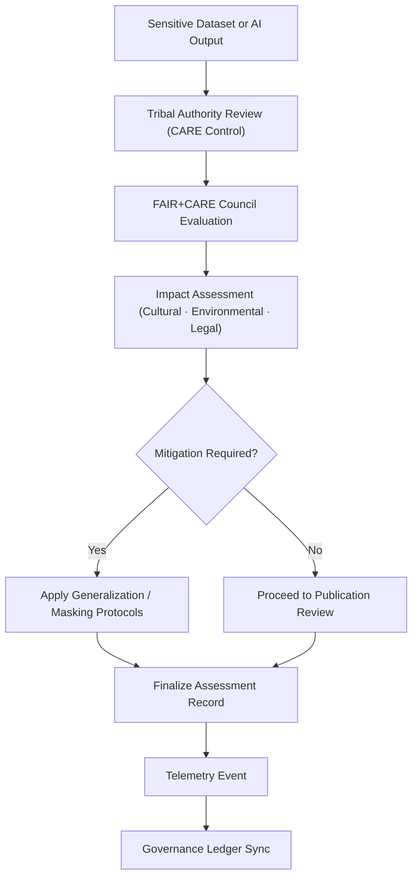

<div align="center">

# 📊 **CARE Impact Assessment Logs — Index**  
`docs/standards/data-generalization/governance/REVIEW_LOGS/impact_assessments/README.md`

**Purpose:**  
Provide an indexed repository for all **CARE Impact Assessment Records** that evaluate the cultural, environmental, social, and legal impacts of handling, transforming, or publishing **sensitive-site data** within the Kansas Frontier Matrix (KFM).  
These assessments support **Indigenous data sovereignty**, **FAIR+CARE governance**, and the **Master Coder Protocol v6.3** audit lifecycle.

[](../../../../../docs/README.md)  
[](../../../faircare.md)  
[](../../../../../LICENSE)

</div>

---

## 📘 Overview

CARE Impact Assessments are required whenever a dataset, model output, narrative, or visualization involves:

- **Culturally sensitive Indigenous locations**
- **Archaeological or ceremonial sites**
- **Ecologically vulnerable areas**
- **Restricted temporal or spatial information**
- **AI-generated interpretations involving sacred or community-governed knowledge**

Each assessment documents:
- Community-authorized review  
- Potential risks or harms  
- Required mitigations (e.g., spatial generalization, redaction)  
- Final governance decision  
- Telemetry and ledger entries ensuring transparency  

These logs form a permanent part of KFM’s **ethical evidence chain**.

---

## 🗂️ Directory Layout

```plaintext
docs/standards/data-generalization/governance/REVIEW_LOGS/impact_assessments/
├── README.md                       # This index
└── impact-####.md                  # Individual CARE impact assessments
```

Expected examples:
```
impact-0001.md
impact-0002.md
impact-0003.md
```

All entries must follow the **CARE Impact Assessment Template (v10.2.2)** and be certified by the FAIR+CARE Council.

---

## 🧾 Required Elements of Each Assessment

| Section | Required Content |
|---------|------------------|
| **Dataset / Site ID** | STAC/DCAT dataset identifier |
| **Reviewer(s)** | Tribal authority + FAIR+CARE Council representatives |
| **Impact Domains** | Cultural, ecological, legal, environmental, social |
| **Risk Level** | `low`, `moderate`, `high`, or `critical` |
| **Mitigation Requirements** | Masking, redaction, access-tier changes |
| **Consent Status** | Approved / Conditional / Revoked |
| **Final Recommendation** | Publish / Publish with Conditions / Withhold |
| **Telemetry Reference** | Must emit event to `focus-telemetry.json` |
| **Ledger Entry** | Logged in `governance-ledger.json` |

---

## ⚙️ CARE Impact Assessment Workflow



---

## 🧠 Impact Domains Evaluated

| Domain | Description |
|--------|-------------|
| **Cultural Impact** | Risk of revealing sacred sites, oral histories, or ceremonies. |
| **Environmental Impact** | Potential ecological harm from publicizing precise locations. |
| **Legal Impact** | Compliance with treaties, MOUs, NAGPRA, and heritage protections. |
| **Social Impact** | Community well-being, trust, and knowledge sovereignty. |
| **Technical Impact** | Risks posed by precision, metadata leakage, or AI misinterpretation. |

---

## 🧮 Telemetry Requirements

All assessments must generate an event in the unified telemetry ledger:

```json
{
  "event_type": "care_impact_assessment",
  "dataset_id": "kfm-sensitive-0007",
  "impact_level": "high",
  "mitigation_required": true,
  "timestamp": "2025-11-12T20:32:00Z",
  "reviewed_by": ["Prairie Band Potawatomi Nation", "FAIR+CARE Council"],
  "telemetry_schema": "schemas/telemetry/data-generalization-impact-assessment-v1.json"
}
```

Telemetry merges into:

```
releases/v10.2.0/focus-telemetry.json
```

---

## 🏛️ Governance Responsibilities

| Role | Responsibility |
|-------|---------------|
| **Tribal Cultural Authorities** | Primary ethical authority over sensitive-site data. |
| **FAIR+CARE Council** | Secondary governance reviewer; ensures compliance with global standards. |
| **Data Stewards** | Implement generalization, masking, and redaction policies. |
| **Governance Secretariat** | Maintains logs, telemetry, and ledger invariant integrity. |

---

## 🕰️ Version History

| Version | Date | Author | Summary |
|---------|------|--------|---------|
| v10.2.2 | 2025-11-12 | FAIR+CARE Council | CARE impact assessment index established for generalization governance hierarchy. |

---

<div align="center">

**© 2025 Kansas Frontier Matrix — CC BY-NC 4.0**  
FAIR+CARE Council · Indigenous Data Sovereignty · Master Coder Protocol v6.3  
Diamond⁹ Ω / Crown∞Ω Ultimate Certified  

[Back to Generalization Governance](../../README.md) · [Root Governance Charter](../../../governance/ROOT-GOVERNANCE.md)

</div>

