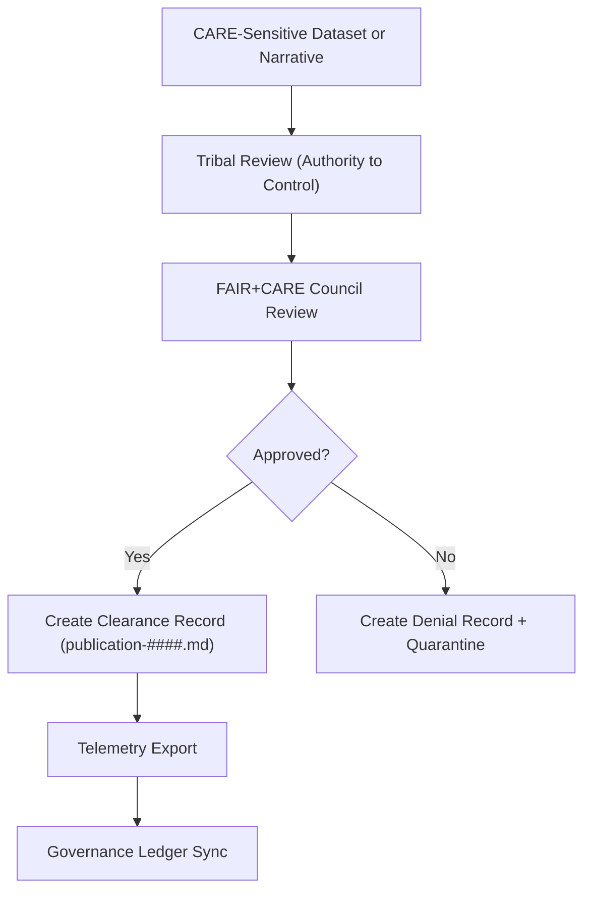

<div align="center">

# 📰 **CARE Publication Clearance Logs — Index**  
`docs/standards/data-generalization/governance/REVIEW_LOGS/publication_clearance/README.md`

**Purpose:**  
Provide an indexed directory for all **CARE Publication Clearance Records**, documenting when culturally sensitive datasets, maps, narratives, or AI-generated outputs are authorized (or denied) for **public release**.  
All entries are binding under **FAIR+CARE governance**, Indigenous sovereignty protections, and **Master Coder Protocol v6.3**.

[](../../../../../docs/README.md)  
[](../../../faircare.md)  
[](../../../../../LICENSE)

</div>

---

## 📘 Overview

This directory contains **formal publication clearance decisions** for any material involving:

- Indigenous sacred or ceremonial site data  
- Generalized archaeological or ecological locations  
- Culturally sensitive narratives or AI-generated outputs  
- Datasets requiring CARE-restricted access tiers (`restricted`, `conditional`)  

Each record includes governance notes, tribal authority decisions, spatial/temporal masking requirements, and clearance conditions.

**All publication events must:**
1. Pass *FAIR+CARE validation* (automated + human review).  
2. Be approved by the *FAIR+CARE Council* AND *relevant Tribal Authorities*.  
3. Be recorded in the **Governance Ledger** + **CARE Review Logs**.  
4. Emit a telemetry event under schema `data-generalization-reviewlogs-publication-v1`.

---

## 🗂️ Directory Layout

```plaintext
docs/standards/data-generalization/governance/REVIEW_LOGS/publication_clearance/
├── README.md                # This index
└── publication-####.md      # Individual publication clearance records
```

Example entries may include:

```
publication-0001.md
publication-0002.md
publication-0003.md
```

All files follow the **standardized CARE Publication Clearance Template** (v10.2.2).

---

## 🧾 Required Elements of Each Publication Clearance Record

| Section | Requirement |
|---------|-------------|
| **Dataset ID** | Must match STAC/DCAT ID. |
| **Governance Authority** | Tribal reviewers + FAIR+CARE Council. |
| **Decision Code** | `approved`, `approved_with_conditions`, `denied`. |
| **Required Masking** | Spatial, temporal, narrative redaction notes. |
| **Legal Basis** | CARE sovereignty rights, MOU references. |
| **Telemetry Reference** | Must append to `focus-telemetry.json`. |
| **Ledger Entry** | Must sync to `governance-ledger.json`. |

---

## ⚖️ Publication Clearance Workflow



---

## 🧠 Publication Decision Types

| Decision | Meaning | Implication |
|----------|---------|-------------|
| **Approved** | Fully cleared for public release | Dataset published to STAC/DCAT catalog |
| **Approved with Conditions** | Allowed after masking/generalization | Conditional license or restricted tier |
| **Denied** | Not permitted for public visibility | Dataset remains internal or archived securely |

---

## 🧮 Telemetry Integration Requirements

Each clearance record **must** generate a telemetry event:

```json
{
  "event_type": "care_publication_clearance",
  "dataset_id": "kfm-sensitive-site-0021",
  "decision": "approved_with_conditions",
  "timestamp": "2025-11-12T19:44:00Z",
  "masking_required": true,
  "sovereignty": "Kaw Nation",
  "telemetry_schema": "schemas/telemetry/data-generalization-reviewlogs-publication-v1.json"
}
```

All events are merged into:

```
releases/v10.2.0/focus-telemetry.json
```

---

## 🏛️ Governance Responsibilities

| Body | Responsibility |
|-------|---------------|
| **FAIR+CARE Council** | Final oversight, ethical review, and approval. |
| **Tribal Cultural Authorities** | Sovereignty, cultural integrity, masking requirements. |
| **Heritage Data Stewards** | Implement generalization and release controls. |
| **KFM Governance Secretariat** | Ensures records, telemetry, and ledger accuracy. |

---

## 🕰️ Version History

| Version | Date | Author | Summary |
|---------|------|--------|---------|
| v10.2.2 | 2025-11-12 | FAIR+CARE Council | Initial publication clearance index for CARE-governed sensitive-site generalization workflow. |

---

<div align="center">

**© 2025 Kansas Frontier Matrix — CC BY-NC 4.0**  
FAIR+CARE Council · Indigenous Data Sovereignty · Master Coder Protocol v6.3  
Diamond⁹ Ω / Crown∞Ω Ultimate Certified  

[Back to CARE Governance](../../README.md) · [Generalization Standard](../../../README.md) · [Root Charter](../../../governance/ROOT-GOVERNANCE.md)

</div>

