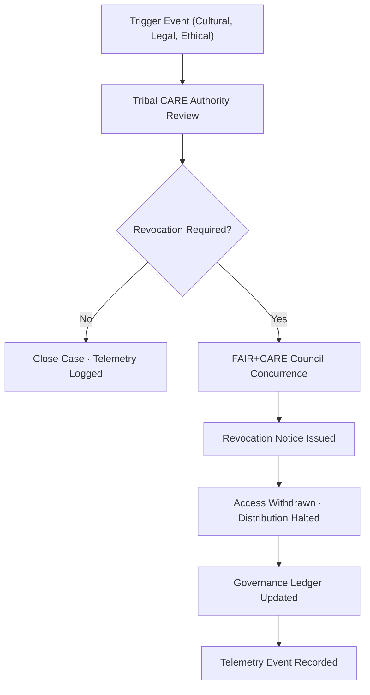

<div align="center">

# ⛔ **CARE Revocation Logs — Index**  
`docs/standards/data-generalization/governance/REVIEW_LOGS/revocations/README.md`

**Purpose:**  
Provide a governed, auditable index of all **CARE Revocation Notices** issued for sensitive datasets in the Kansas Frontier Matrix (KFM).  
Revocations may occur when Indigenous communities, tribal authorities, or the FAIR+CARE Council determine that previously granted access or publication **must be withdrawn** to protect cultural sovereignty, ecological sensitivity, or community safety.

[](../../../../../docs/README.md)  
[](../../../faircare.md)  
[](../../../../../LICENSE)

</div>

---

## 📘 Overview

This directory contains all formal **CARE Revocation Logs**, representing the final stage of the CARE governance pipeline when data access or publication must be reversed.

A revocation may be triggered by:
- New cultural or archaeological discoveries  
- Community decisions regarding sovereignty or privacy  
- Identified misuse, mishandling, or security concerns  
- Reclassification of risk level (e.g., site now considered “High Sensitivity”)  
- Updated CARE evaluations or tribal governance rulings  

Each revocation record provides:
- Originating community or council authority  
- Reason(s) for revocation  
- Scope of withdrawn access  
- Required remediation actions  
- Timestamp and governance ledger entry  
- Telemetry event captured for audit and transparency  

---

## 🗂️ Directory Layout

```plaintext
docs/standards/data-generalization/governance/REVIEW_LOGS/revocations/
├── README.md                      # This file — revocation index
└── revocation-####.md             # Individual CARE Revocation Notices
```

Expected filename format:
```
revocation-0001.md
revocation-0002.md
```

All revocation notices must follow the template:

```
docs/standards/data-generalization/governance/CARE_APPROVAL_FORMS/FORM_CARE_REVOCATION_NOTICE.md
```

---

## ❗ Reasons for Revocation

| Category | Description |
|----------|-------------|
| **Cultural Sensitivity Reassessment** | Community determines dataset is too sensitive for sharing. |
| **Improper Use** | Dataset used in ways not covered by approved conditions. |
| **Security / Privacy Risks** | New risk of site disturbance, looting, or ecological harm. |
| **Legal / Sovereignty Action** | Tribal authority issues new legal or governance restrictions. |
| **Ethics / CARE Non-Compliance** | CARE requirements were ignored, bypassed, or invalidated. |

---

## ⚙️ CARE Revocation Workflow



---

## 🧠 Required Elements of a Revocation Log

| Section | Description |
|---------|-------------|
| **Dataset Identifier(s)** | STAC/DCAT IDs, sensitivity class |
| **Revoking Authority** | Tribal nation, cultural steward, or FAIR+CARE Council |
| **Reason for Revocation** | Cultural, ethical, legal, or security rationale |
| **Impacted Parties** | Individuals or institutions whose access is revoked |
| **Actions Required** | Takedown, retraction, masking, or generalization |
| **Reviewer Notes** | Council or community commentary |
| **Ledger Ref** | Pointer to governance entry |
| **Telemetry Ref** | Entry merged into `focus-telemetry.json` |

---

## 🧮 Telemetry Example

```json
{
  "event_type": "care_revocation",
  "revocation_id": "revocation-0003",
  "dataset_id": "kfm-sensitive-0021",
  "reason": "Reclassified as culturally restricted by Tribal Council",
  "action": "Full withdrawal of access; dataset masked",
  "timestamp": "2025-11-12T21:17:00Z",
  "reviewed_by": ["Kickapoo Tribe in Kansas", "FAIR+CARE Council"],
  "telemetry_schema": "schemas/telemetry/data-generalization-revocations-v1.json"
}
```

---

## 🏛️ Governance Responsibilities

| Role | Responsibility |
|------|----------------|
| **Tribal Cultural Authority** | Primary authority for revocation decisions. |
| **FAIR+CARE Council** | Confirms and formalizes revocation notice. |
| **Governance Secretariat** | Maintains revocation logs and telemetry. |
| **Data Stewards** | Enforce takedowns, masking, and access withdrawal. |

---

## 🕰️ Version History

| Version | Date | Author | Summary |
|---------|------|--------|---------|
| v10.2.2 | 2025-11-12 | FAIR+CARE Council | Established revocation logs index; aligned with telemetry v2 and governance flow. |

---

<div align="center">

**© 2025 Kansas Frontier Matrix — CC BY-NC 4.0**  
FAIR+CARE Council · Indigenous Data Sovereignty · Master Coder Protocol v6.3  
Diamond⁹ Ω / Crown∞Ω Ultimate Certified  

[Back to Generalization Governance](../../README.md) · [Root Governance Charter](../../../governance/ROOT-GOVERNANCE.md)

</div>

