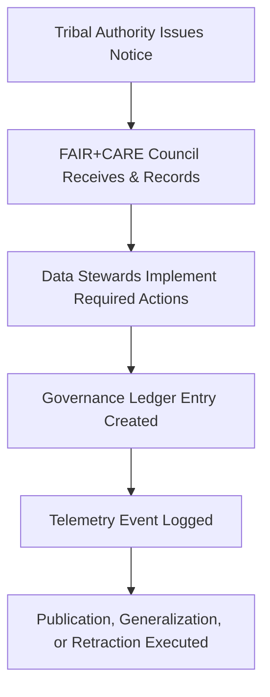

<div align="center">

# 🪶 **Sovereign Governance Notices — Index**  
`docs/standards/data-generalization/governance/REVIEW_LOGS/sovereign_notices/README.md`

**Purpose:**  
Serve as the canonical index of **Tribal Sovereignty Notices** submitted to the Kansas Frontier Matrix (KFM), including requests, directives, restrictions, clarifications, or amendments issued by **recognized Tribal Nations or Indigenous Governance Bodies**.  
These notices override all other governance layers and are binding under **CARE Principle C2 — Authority to Control**, **FAIR+CARE Council policy**, and **MCP-DL v6.3 sovereignty compliance**.

[](../../../../../docs/README.md)  
[](../../../faircare.md)  
[](../../../../../LICENSE)

</div>

---

## 📘 Overview

This directory archives **formal communications, directives, and notices issued by Tribal Nations or Indigenous Heritage Authorities** regarding:

- Data access rights  
- Publication restrictions  
- Cultural sensitivity classifications  
- Required masking or generalization  
- Community-reviewed corrections  
- Revocation or reinstatement of prior approvals  
- Clarification of sovereignty boundaries, stewardship, or attribution  

Sovereign notices take precedence over:
- FAIR validations  
- STAC/DCAT publication routines  
- Automated CI/CD decisions  
- KFM internal governance rulings  

Every notice triggers:
1. **Immediate compliance action** from Data Stewards  
2. **FAIR+CARE Council ratification**  
3. **Governance Ledger entry**  
4. **Telemetry event** (merged into `focus-telemetry.json`)  
5. **Possible dataset retraction or reclassification**

---

## 🗂️ Directory Layout

```plaintext
docs/standards/data-generalization/governance/REVIEW_LOGS/sovereign_notices/
├── README.md                          # This file — index
└── sovereign-notice-####.md           # Individual Sovereign Notices
```

Filename format:
```
sovereign-notice-0001.md
sovereign-notice-0002.md
...
```

Each file must follow:  
```
docs/standards/data-generalization/governance/MOU_TEMPLATES/TEMPLATE_TRIBAL_SOVEREIGNTY_MOU.md
```

---

## 🧠 What Constitutes a Sovereign Notice?

A notice qualifies as a Tribal Sovereignty Notice when issued by:

- A recognized Tribal Nation  
- A Tribal Historic Preservation Office (THPO)  
- A sovereign Indigenous Governance Body  
- A Tribal Council or authorized cultural authority  
- Delegated Indigenous Data Stewardship organizations  

### Common Notice Types

| Type | Description |
|------|-------------|
| **Restriction Notice** | Requests masking, generalization, or removal of sensitive data. |
| **Authorization Notice** | Grants permission for specific dataset usage or publication. |
| **Boundary Clarification** | Updates cultural, territorial, or geographic sovereignty definitions. |
| **Data Sovereignty Directive** | Sets new policy requirements for a dataset category. |
| **Cultural Protocol Notice** | Requires specific cultural handling, attribution, or disclaimers. |
| **Revocation or Override** | Cancels prior approvals or council rulings. |

---

## ⚙️ Sovereign Notice Workflow



---

## 🧾 Required Sections in Each Sovereign Notice

| Section | Description |
|--------|-------------|
| **Issuing Authority** | Tribal Nation or Indigenous governance body. |
| **Reference Dataset(s)** | IDs, STAC paths, or catalog entries. |
| **Type of Notice** | Restriction, authorization, boundary, protocol, revocation, etc. |
| **Sovereignty Basis** | Cultural, legal, treaty-based, historical justification. |
| **Actions Required** | Masking, retraction, generalization, updated metadata, etc. |
| **Urgency / Priority Level** | Standard, time-sensitive, emergency directive. |
| **Communication Log** | Emails, meetings, resolutions, or documentation supporting notice. |
| **Governance Ledger Ref** | Pointer to ledger entry. |
| **Telemetry Ref** | Linked telemetry event in `focus-telemetry.json`. |

---

## 🧮 Telemetry Example Entry

```json
{
  "event_type": "sovereign_notice",
  "notice_id": "sovereign-notice-0012",
  "tribal_authority": "Ioway Nation of Kansas and Nebraska",
  "required_action": "Generalize coordinates to 10km grid and withhold site lineage data",
  "dataset_id": ["kfm-sensitive-0034"],
  "timestamp": "2025-11-12T22:04:00Z",
  "reviewed_by": ["FAIR+CARE Council"],
  "governance_status": "binding",
  "telemetry_schema": "schemas/telemetry/data-generalization-sovereign-notices-v1.json"
}
```

---

## 🏛️ Governance Hierarchy (Binding Order)

```markdown
1. Tribal Sovereignty Notices (highest authority)
2. FAIR+CARE Council Decisions
3. Governance Charter Policies
4. CI/CD Automated Validation Rules
5. Internal Documentation Standards
```

A sovereign notice **overrides all other logic** across KFM.

---

## 📜 Example Use Cases

- A Tribal Nation restricts precise archaeological locations to prevent looting.  
- A cultural authority requests attribution corrections in dataset metadata.  
- A sovereignty clarification updates recognized treaty boundaries affecting spatial masking rules.  
- A tribe revokes prior permission for dataset publication based on new consultations.  

---

## 🕰️ Version History

| Version | Date | Author | Summary |
|--------:|------|--------|---------|
| v10.2.2 | 2025-11-12 | FAIR+CARE Council | Established sovereign notice index; aligned to telemetry v2; clarified workflow authority precedence. |

---

<div align="center">

**© 2025 Kansas Frontier Matrix — CC BY-NC 4.0**  
Indigenous Data Sovereignty • FAIR+CARE Governance • Master Coder Protocol v6.3  
Diamond⁹ Ω / Crown∞Ω Ultimate Certified

[Back to Governance Index](../../README.md) · [Root Governance Charter](../../../governance/ROOT-GOVERNANCE.md)

</div>

