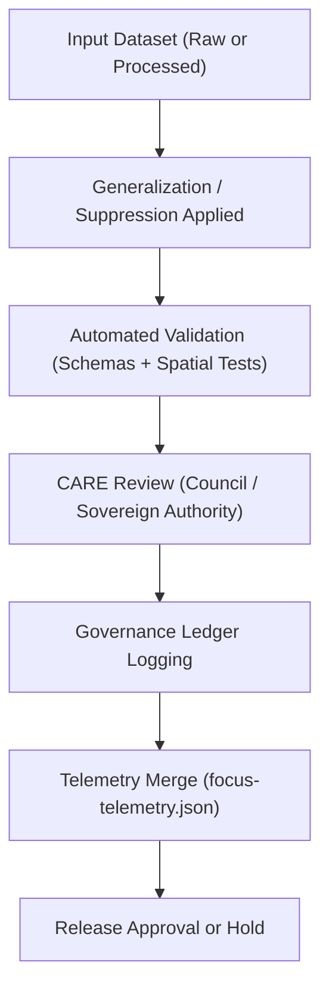

<div align="center">

# 🧪 **Kansas Frontier Matrix — Sensitive Data Generalization Validation Framework**  
`docs/standards/data-generalization/validation/README.md`

**Purpose:**  
Define the **validation rules, checks, workflows, and ethical gates** that govern the release of generalized or suppressed sensitive cultural, archaeological, ecological, or Indigenous site data.  
Ensures that **every generalization action is auditable, justified, FAIR+CARE-aligned, and sovereignty-respecting** under **MCP-DL v6.3**.

[](../../../README.md)  
[](../../faircare.md)  
[](../../../../LICENSE)

</div>

---

## 📘 Overview

This validation framework governs **how generalized, masked, or fully-suppressed sensitive data is authenticated, verified, and ethically approved** before entering any KFM release.

It provides a **multi-layered validation pipeline** covering:

- Spatial/temporal generalization accuracy  
- CARE governance checks and sovereign review  
- Metadata compliance (STAC/DCAT/CIDOC CRM/ISO 19115)  
- Provenance completeness  
- Telemetry integrity  
- Suppression justification & documentation requirements

All validation results feed into:

```
data/processed/generalization_reports/
docs/standards/data-generalization/governance/REVIEW_LOGS/
releases/v10.2.0/focus-telemetry.json
```

---

## 🗂️ Directory Layout

```plaintext
docs/standards/data-generalization/validation/
├── README.md                         # This file
├── schemas/                          # JSON Schemas for validation
│   ├── generalization-schema.json
│   ├── suppression-schema.json
│   └── care-governance-schema.json
├── rules/                            # Rule sets and gating requirements
│   ├── spatial_rules.md
│   ├── temporal_rules.md
│   └── care_rules.md
└── reports/                          # FAIR+CARE and validation examples
    ├── sample_generalization_report.json
    ├── sample_suppression_notice.json
    └── sample_care_audit.json
```

---

## 🧬 Validation Pipeline — High-Level Flow



---

## 🧩 Required Validation Components

### 1. Metadata Schema Validation  
Every dataset must pass validation against:

- `generalization-schema.json` — for bounded generalization  
- `suppression-schema.json` — for full suppression cases  
- `care-governance-schema.json` — for CARE alignment and data sovereignty

Validated via:

```
scripts/validate_generalization.py
scripts/validate_care_metadata.py
```

---

### 2. Spatial Accuracy Checks

| Validation | Requirement | Example |
|------------|------------|----------|
| Grid alignment | Aggregated coordinates must match defined grid size. | 1 km / 10 km / 50 km |
| Random displacement range | Must fall within allowed noise radius. | ≤ 2 km |
| Rounding precision | Must match standard rounding rules. | 2–3 decimal places |
| Reverse-engineering risk | Must pass “non-invertibility” test. | No site recovery possible |

---

### 3. Temporal Generalization Rules

| Rule | Description |
|------|-------------|
| Replace specific dates with time ranges when needed. |
| Avoid revealing exact ceremonial or cultural dates. |
| Use culturally appropriate temporal granularity. |
| Temporal masking must align with CARE review. |

---

### 4. CARE Governance Validation

All generalized or suppressed datasets must include:

| Field | Required | Example |
|--------|---------|----------|
| `care.status` | ✅ | `"approved"`, `"restricted"` |
| `care.statement` | ⚙️ | `"Generalized per tribal review"` |
| `care.reviewer` | ⚙️ | `"FAIR+CARE Council"` |
| `authority_to_control` | ⚙️ | `"Prairie Band Potawatomi Nation"` |

Validation failures automatically route datasets to:

```
data/work/staging/tabular/abandonment_candidates/
```

---

### 5. Provenance & Audit Linkage

All validated generalizations must include:

- Full lineage summary  
- SHA-256 checksums  
- Reviewer identities  
- Governing MOU references  
- CARE authority decision  
- Provenance tracing (using PROV-O, CIDOC CRM)  
- DCAT distribution metadata

---

### 6. Telemetry Integration

For each validation event, the following are logged:

| Metric | Description |
|--------|-------------|
| `validation_time_sec` | Total validation runtime |
| `energy_wh` | Estimated or measured energy cost |
| `generalization_type` | `rounded`, `grid`, `random-offset`, `suppressed` |
| `sovereign_review_required` | Boolean |
| `care_status` | Approved / Restricted / Pending |
| `errors` | Array of validation failures |

Telemetry merges into:

```
releases/v10.2.0/focus-telemetry.json
```

---

## 🧪 Validation Compliance Checklist

| Requirement | Status |
|------------|--------|
| Metadata conforms to JSON schema | ☐ |
| Spatial generalization passes accuracy thresholds | ☐ |
| Temporal generalization aligns with cultural safety | ☐ |
| CARE review completed | ☐ |
| Sovereign authority approval recorded | ☐ |
| Governance ledger entry generated | ☐ |
| Suppression notice (if required) complete | ☐ |
| Telemetry event generated | ☐ |

---

## 📁 Required Outputs per Validated Dataset

| Output | Path | Description |
|--------|------|-------------|
| Generalization Report | `data/processed/generalization_reports/` | Full validation + CARE summary |
| CARE Review Entry | `REVIEW_LOGS/approvals/` | Council or sovereign authority decision |
| Suppression Notice (if used) | `REVIEW_LOGS/sovereign_notices/` | Required for any fully masked site |
| Telemetry Event | `focus-telemetry.json` | Governance and sustainability metrics |

---

## ⚖️ Governance Integration

Once validation is complete, results sync to:

- `reports/audit/governance-ledger.json`  
- `reports/audit/release-manifest-log.json`  
- `docs/reports/telemetry/governance_scorecard.json`  

Governance entries include:

```json
{
  "event": "generalization_validation",
  "dataset_id": "kfm-sensitive-arch-sites-001",
  "status": "approved",
  "reviewer": "FAIR+CARE Council",
  "timestamp": "2025-11-12T18:45:00Z",
  "telemetry_ref": "releases/v10.2.0/focus-telemetry.json"
}
```

---

## 🕰️ Version History

| Version | Date | Author | Summary |
|--------:|------|--------|--------|
| v10.2.2 | 2025-11-12 | FAIR+CARE Council | Initial validation framework for sensitive-data generalization (spatial, temporal, CARE, telemetry). |

---

<div align="center">

**© 2025 Kansas Frontier Matrix — CC BY-NC 4.0**  
FAIR+CARE Sovereignty Protection · Ethical Data Stewardship · MCP v6.3  
Diamond⁹ Ω / Crown∞Ω Ultimate Certified  

[Back to Generalization Standards](../README.md) · [Governance](../../governance/README.md)

</div>
