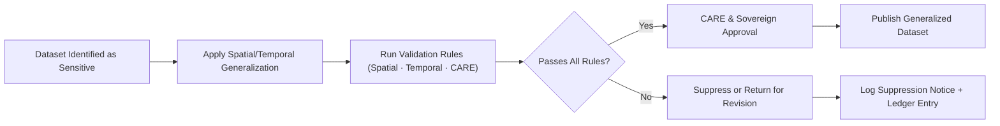

<div align="center">

# 🧩 **Kansas Frontier Matrix — Generalization Validation Rulebook**  
`docs/standards/data-generalization/validation/rules/README.md`

**Purpose:**  
Define the **full rule sets**—spatial, temporal, CARE-governance, and suppression controls—required for verifying generalized or protected sensitive datasets before they can be released through the Kansas Frontier Matrix (KFM).  
These rules enforce **FAIR+CARE**, **ISO 19115**, **CIDOC CRM**, **DCAT 3.0**, and **Indigenous data sovereignty** requirements.

[](../../../../README.md)  
[](../../../faircare.md)  
[](../../../../../LICENSE)

</div>

---

## 📘 Overview

This rulebook represents the **strict validation canon** that governs whether sensitive spatial/cultural datasets may be:

- Generalized (rounded, aggregated, masked)  
- Published with reduced precision  
- Fully suppressed (withheld)  
- Released only under **CARE approvals**  
- Retained in secure archives  

All datasets undergoing sensitive-site processing must comply with these rule sets, which are enforced through:

```
faircare-validate.yml
stac-validate.yml
telemetry-export.yml
generalization-schema.json
care-governance-schema.json
```

---

## 🗂️ Directory Layout

```plaintext
docs/standards/data-generalization/validation/rules/
├── README.md                    # This rulebook
├── spatial_rules.md             # Spatial generalization and masking requirements
├── temporal_rules.md            # Temporal aggregation rules
└── care_rules.md                # Governance, consent, sovereignty, ethics rules
```

---

## 🧭 Validation Rule Categories

### 1️⃣ Spatial Generalization Rules  
Ensures no published coordinates can be reverse-engineered.

| Rule | Requirement | Example |
|------|-------------|---------|
| **R1.1: Minimum Generalization Threshold** | Must coarsen precision to ≥1 km or apply ±1.5–2 km random offset. | 38.913 → 38.91 |
| **R1.2: Non-Reversibility Test** | Dataset must pass anti-inference verification. | Grid centroid ≠ original point |
| **R1.3: High-Risk Site Suppression** | Sacred sites must not be published even generalized. | `"location": "withheld"` |
| **R1.4: Noise Envelope Diversity** | Random offsets must vary per-region to avoid patterning. | Rotated random vectors |

---

### 2️⃣ Temporal Generalization Rules  
Protects culturally sensitive time periods.

| Rule | Requirement | Example |
|------|-------------|---------|
| **T2.1: Temporal Coarsening** | Dates generalized to year, decade, or era depending on cultural risk. | `1868-04-22` → `"1860s"` |
| **T2.2: Event Masking** | Ceremonial seasons must be obscured. | `"Ceremony: Spring"` → `"Ceremony: Seasonal"` |
| **T2.3: Range Substitution** | Replace exact dates with 5–50 yr windows. | `"1854–1900"` |

---

### 3️⃣ CARE Governance & Sovereignty Rules  
Approved by tribal nations, heritage councils, and the FAIR+CARE Council.

| Rule | Requirement | Example |
|------|-------------|---------|
| **C3.1: Sovereign Review Required** | Indigenous-led review before generalization or publication. | PBPN or KIC review |
| **C3.2: Consent Before Disclosure** | No dataset enters public release without explicit approval. | `"care.status": "approved"` |
| **C3.3: Cultural Sensitivity Rating** | Every dataset must include a `sensitivity_class`. | `"High"` |
| **C3.4: Access Governance** | Restricted datasets require access agreements (MOU). | `"access_policy": "Restricted by MOU"` |
| **C3.5: Ancestral Lands Priority** | Boundaries respected and verified per tribal maps. | `"within_ancestral_lands": true"` |

---

### 4️⃣ Suppression & Withholding Rules  
Applies when generalization alone is insufficient.

| Rule | Requirement |
|------|-------------|
| **S4.1: Automatic Suppression for High-Risk Points** | Sacred, burial, ceremonial, or threatened sites. |
| **S4.2: Publication Prohibition** | No partial precision allowed for suppressed points. |
| **S4.3: Mandatory CARE Notice** | Suppression must produce a `site_suppression_notice.md`. |
| **S4.4: Ledger Logging** | All suppressed entries logged under `REVIEW_LOGS/sovereign_notices/`. |

---

### 5️⃣ Metadata Integrity Rules  
Ensures all generalized datasets remain technically compliant.

| Rule | Requirement |
|------|-------------|
| **M5.1** | STAC/DCAT metadata must reflect generalized resolution. |
| **M5.2** | All CARE fields must be present if dataset contains sensitive elements. |
| **M5.3** | Checksums must correspond to generalized product, not raw source. |
| **M5.4** | Provenance chain must include generalization method and parameters. |

---

## 🧪 Validation Workflow Responsibilities

| Actor | Responsibilities |
|--------|------------------|
| **Generalization Engineer** | Performs spatial/temporal masking; generates transformation report. |
| **CARE Authority / Tribal Reviewer** | Reviews cultural impact, approves or denies release. |
| **FAIR+CARE Council** | Final approval, ensures CARE + FAIR compliance. |
| **Governance Ledger Steward** | Logs decisions and telemetry to release artifacts. |

---

## 🧩 Required Artifacts (Per Dataset)

| Artifact | Description | Location |
|----------|-------------|----------|
| Generalization Report | Full transformation + validation record | `data/processed/generalization_reports/` |
| CARE Approval Form | Formal consent from sovereignty authority | `CARE_APPROVAL_FORMS/` |
| Review Log | Decision and notes from council | `REVIEW_LOGS/` |
| Suppression Notice | Required if any site is withheld | `templates/template_site_suppression_notice.md` |
| Telemetry Record | Energy, duration, compliance metrics | `releases/v10.2.0/focus-telemetry.json` |

---

## 🧭 Mermaid — Rule Application Flow



---

## 🕰️ Version History

| Version | Date | Author | Summary |
|--------:|------|--------|---------|
| v10.2.2 | 2025-11-12 | FAIR+CARE Council | Established complete rule set for spatial, temporal, CARE, metadata, and suppression validation. |

---

<div align="center">

**© 2025 Kansas Frontier Matrix — CC BY-NC 4.0**  
Sensitive Cultural Data Protection · FAIR+CARE Sovereignty Governance · MCP v6.3  
Diamond⁹ Ω / Crown∞Ω Ultimate Certified  

[Back to Validation Index](../README.md) · [Generalization Standards](../../README.md)

</div>

