<div align="center">

# ⚖️ **CARE Governance Validation Rules**  
`docs/standards/data-generalization/validation/rules/care_rules.md`

**Purpose:**  
Define the **CARE-aligned validation rules** applied to all sensitive cultural, Indigenous, and archaeological datasets within the Kansas Frontier Matrix (KFM).  
These rules enforce **Collective Benefit, Authority to Control, Responsibility, and Ethics** while ensuring lawful, respectful, and community-governed data practices.

[](../../../../README.md)  
[](../../../faircare.md)  
[](../../../../../LICENSE)

</div>

---

## 📘 Overview

CARE governance validation guarantees:

- Proper consent and authority-to-control  
- Cultural sensitivity classification  
- Ethical use conditions  
- Non-extractive benefit-sharing  
- Sovereign decision-making  
- Legally respectful data handling

All datasets with cultural sensitivity **must pass CARE compliance** before publication, regardless of spatial/temporal generalization success.

---

## 🧭 CARE Validation Requirements

### 1️⃣ **Collective Benefit (C1)**  
Ensures communities benefit from data use.

| Rule | Requirement | Example |
|------|------------|---------|
| **C1.1 — Benefit Declaration** | Dataset must include a meaningful community benefit statement. | “Supports language preservation initiative.” |
| **C1.2 — Non-Extractive Use** | Data cannot be used for extractive, exploitative purposes. | Prohibited categories listed in MOU. |
| **C1.3 — Community Visibility** | Communities must be acknowledged in metadata. | `"community_attribution": "Kickapoo Nation"` |

---

### 2️⃣ **Authority to Control (C2)**  
Communities must retain governance authority over their data.

| Rule | Requirement | Example |
|------|------------|---------|
| **C2.1 — Permission Required** | Consent required for any dataset containing cultural knowledge. | CARE approval form. |
| **C2.2 — CARE Steward Review** | Indigenous data steward must review and approve release. | PBPN heritage office. |
| **C2.3 — Access Policy Defined** | Clear policy for public, restricted, or MOU-only access. | `"access_policy": "Restricted by Tribal MOU"` |
| **C2.4 — Withdrawal Right** | Communities may revoke rights to share dataset. | Revocation form triggers suppression. |

---

### 3️⃣ **Responsibility (C3)**  
KFM must ethically steward all cultural knowledge.

| Rule | Requirement | Example |
|------|------------|---------|
| **C3.1 — Provenance Requirement** | All datasets must document cultural source and stewardship. | `"provenance": "PBPN Archaeology Division"` |
| **C3.2 — Transparent Processing** | Generalization steps must be documented. | Transformation report. |
| **C3.3 — Risk Assessment Required** | Impact assessment required for each sensitive dataset. | CARE Impact Assessment form. |
| **C3.4 — Accountability Logging** | Decisions must be written to governance ledger. | `REVIEW_LOGS/impact_assessments/` |

---

### 4️⃣ **Ethics (C4)**  
Avoid harm, misrepresentation, or cultural exposure.

| Rule | Requirement | Example |
|------|------------|---------|
| **C4.1 — Sensitivity Class Mandated** | Dataset must carry a cultural risk classification. | `"sensitivity_class": "High"` |
| **C4.2 — Withholding High-Risk Data** | Burial/sacred sites always withheld regardless of generalization. | `"location": "withheld"` |
| **C4.3 — Cultural Review Documentation** | Formal ethical review must be completed. | CARE Publication Clearance form. |
| **C4.4 — Accuracy & Representation** | Dataset must not misrepresent histories or identities. | Community-verified descriptions. |

---

## 🧩 Required Metadata Fields for CARE Validation

```json
{
  "care": {
    "status": "approved | revision | restricted",
    "reviewer": "Prairie Band Potawatomi Nation – Heritage Office",
    "statement": "Generalized dataset approved for non-commercial educational use.",
    "sensitivity_class": "Medium",
    "access_policy": "Restricted by MOU",
    "date_reviewed": "2025-11-10"
  }
}
```

---

## 🧪 Validation Workflow (CARE Phase)

```mermaid
flowchart TD
  A["Dataset Identified as Sensitive"] --> B["CARE Metadata Extraction"]
  B --> C["CARE Rules Validation (C1–C4)"]
  C --> D{"Pass?"}
  D -->|Yes| E["Sovereign Approval Required"]
  D -->|No| F["Reject or Request Revision"]
  E --> G["CARE Approval Logged → Governance Ledger"]
```



---

## 🧾 CARE Validation Failure Conditions

| Failure Code | Condition | Required Action |
|--------------|-----------|-----------------|
| **C-F01** | Missing CARE block | Reject publication |
| **C-F02** | No sovereign reviewer | Block & escalate |
| **C-F03** | Sensitivity not declared | Return for revision |
| **C-F04** | High-risk cultural site included | Suppress immediately |
| **C-F05** | Revocation notice issued | Remove dataset from catalogs |

---

## 🧮 Governance Logging Requirements

Every CARE validation step must produce entries in:

- `REVIEW_LOGS/approvals/`  
- `REVIEW_LOGS/revocations/`  
- `REVIEW_LOGS/sovereign_notices/`  
- `releases/v10.2.0/focus-telemetry.json`  
- `reports/audit/governance-ledger.json`

---

## 🕰️ Version History

| Version | Date | Author | Summary |
|--------:|------|--------|---------|
| v10.2.2 | 2025-11-12 | FAIR+CARE Council | Full CARE rule classification added; integrated revocation, sensitivity classes, and sovereign approval workflow. |

---

<div align="center">

**© 2025 Kansas Frontier Matrix — CC BY-NC 4.0**  
FAIR+CARE Sovereignty Governance · Cultural Data Protection · MCP v6.3  
Diamond⁹ Ω / Crown∞Ω Ultimate Certified  

[Back to Rule Index](README.md) · [Generalization Standards](../../README.md)

</div>

