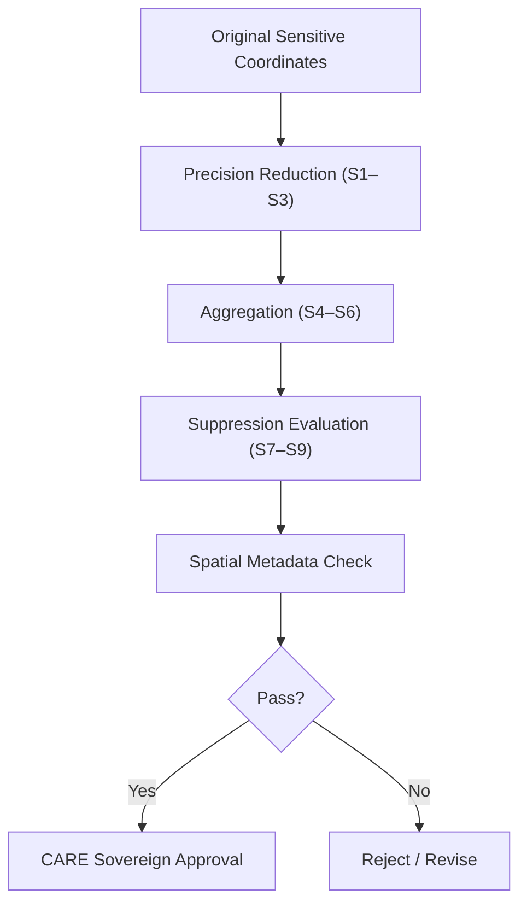

<div align="center">

# 📐 **Spatial Generalization Validation Rules**  
`docs/standards/data-generalization/validation/rules/spatial_rules.md`

**Purpose:**  
Define the **spatial-risk mitigation and generalization validation rules** required for releasing sensitive cultural, archaeological, ecological, or sovereign-site geographic datasets within the Kansas Frontier Matrix (KFM).  
Ensures spatial masking follows **FAIR+CARE**, **CIDOC CRM**, **OGC**, and **ISO 19115** ethical geospatial standards.

[](../../../../README.md)  
[](../../../faircare.md)  
[](../../../../../LICENSE)

</div>

---

## 📘 Overview

Spatial generalization ensures that **precise geographic locations** of sensitive cultural sites are *never* exposed publicly.  
This includes:
- Indigenous archaeological sites  
- Sacred landscapes  
- Burial grounds  
- Ecologically fragile or endangered habitats  
- Community-governed resource locations  

Spatial generalization is mandatory for all **CARE-classified** datasets.

---

## 🧭 Required Spatial Validation Criteria

### 1️⃣ **Geospatial Precision Reduction**
Sensitive sites **must not** retain original coordinates.

| Rule | Requirement | Minimum Standard |
|------|------------|------------------|
| **S1 — Coordinate Rounding** | Must round lat/long values. | ≥ 2 decimal places (≈1.1 km) |
| **S2 — Spatial Buffering** | Apply uncertainty radius around locations. | ≥ 1 km buffer |
| **S3 — Randomized Offset** | Add reproducible-but-random spatial jitter. | ± 1–3 km |

> Sensitive burial/sacred sites → **never published**, even generalized.

---

### 2️⃣ **Spatial Aggregation Requirements**

When point precision reduction is insufficient:

| Rule | Requirement | Example |
|------|------------|---------|
| **S4 — Grid Aggregation** | Snap to a spatial grid centroid. | 1 km × 1 km or 10 km × 10 km |
| **S5 — Polygon Generalization** | Replace exact geometries with bounding areas. | Convex hull, buffered polygon |
| **S6 — Density Rasterization** | Convert points to density/heat rasters. | Kernel density or count grid |

---

### 3️⃣ **Suppression Requirements**

| Rule | Case | Required Action |
|------|------|-----------------|
| **S7 — Total Suppression** | Sacred, burial, or tribe-restricted sites | Remove from public dataset |
| **S8 — Conditional Suppression** | Sites with repeated re-identification risk | Remove or replace with “Location Withheld” |
| **S9 — Sovereign Notice Trigger** | Tribal revocation or access withdrawal | Remove dataset or suppress coordinates immediately |

Suppression decisions must be logged in:  
`REVIEW_LOGS/sovereign_notices/` and telemetry.

---

## 🧩 Spatial Metadata Requirements

All generalized datasets must include a **spatial-generalization metadata block**:

```json
{
  "spatial_generalization": {
    "method": "rounded + jitter",
    "rounding_precision": 2,
    "jitter_radius_km": 2,
    "grid_resolution_m": 1000,
    "suppression_applied": false,
    "reviewer": "KFM Sensitive Sites Council",
    "date_reviewed": "2025-11-12"
  }
}
```

---

## 📊 Automated Spatial Validation Workflow



---

## 🧪 Spatial Validation Failure Conditions

| Code | Condition | Required Action |
|-------|-----------|-----------------|
| **S-F01** | Original precision not masked | Reject |
| **S-F02** | No spatial metadata block present | Reject |
| **S-F03** | Buffer/jitter radius below minimum | Revision |
| **S-F04** | Sacred site not fully suppressed | Block & escalate |
| **S-F05** | Re-identification risk detected | Apply suppression |
| **S-F06** | Missing community reviewer | Escalate to FAIR+CARE Council |

---

## 🧮 Governance Logging Requirements

All spatial validation decisions must append entries to:

- `REVIEW_LOGS/approvals/`  
- `REVIEW_LOGS/revocations/`  
- `REVIEW_LOGS/sovereign_notices/`  
- `releases/v10.2.0/focus-telemetry.json`  
- `reports/audit/governance-ledger.json`

---

## 🕰️ Version History

| Version | Date | Author | Summary |
|--------:|------|--------|---------|
| v10.2.2 | 2025-11-12 | FAIR+CARE Council | Added S1–S9 spatial rules, metadata block, suppression logic, and sovereign integration. |

---

<div align="center">

**© 2025 Kansas Frontier Matrix — CC BY-NC 4.0**  
FAIR+CARE Spatial Governance · Sovereignty Protection · MCP v6.3  
Diamond⁹ Ω / Crown∞Ω Ultimate Certified  

[Back to Rule Index](README.md) · [Generalization Standards](../../README.md)

</div>

