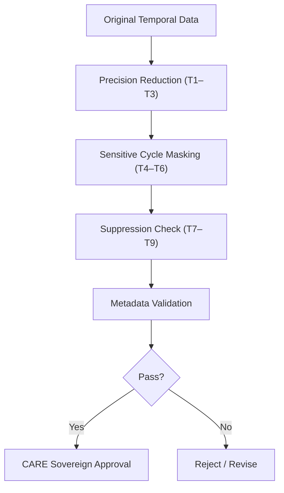

<div align="center">

# ⏳ **Temporal Generalization Validation Rules**  
`docs/standards/data-generalization/validation/rules/temporal_rules.md`

**Purpose:**  
Define the **temporal-risk mitigation, masking, and audit rules** governing sensitive archaeological, Indigenous, historical, or ecological datasets within the Kansas Frontier Matrix (KFM).  
Ensures all temporal data follows **FAIR+CARE**, **CIDOC CRM**, **OWL-Time**, and **ISO 19108** temporal metadata standards.

[](../../../../README.md)  
[](../../../faircare.md)  
[](../../../../../LICENSE)

</div>

---

## 📘 Overview

Temporal precision—like spatial precision—can expose culturally sensitive information.  
Exact years, discovery timestamps, or ritual calendar markers may **reveal culturally restricted cycles**, burial timelines, or sacred historical events.

Temporal generalization rules ensure:
- **No high-precision dates** for CARE-restricted assets  
- **Coarsened, culturally appropriate ranges**  
- **Temporal masking for ceremony-linked data**  
- **Full suppression** when temporal details carry cultural or sovereign harm

---

## 🧭 Required Temporal Validation Criteria

### 1️⃣ **Temporal Precision Reduction**

| Rule | Requirement | Minimum Standard |
|------|------------|------------------|
| **T1 — Year Generalization** | Convert exact dates → years or decades. | “1873-05-21” → “1870s” |
| **T2 — Range Expansion** | Expand precise intervals into broader windows. | “1856–1857” → “1850–1860” |
| **T3 — Uncertain Time Encoding** | Use CIDOC CRM *E52 Time-Span* + open ranges. | `"begin_of_the_begin": "1850"` |

---

### 2️⃣ **Event & Ritual Cycle Masking**

Some temporal events are culturally sensitive.

| Rule | Case | Required Action |
|------|------|-----------------|
| **T4 — Ceremony/Season Masking** | Ritual, ceremony, or sacred cycles | Replace with season or half-year |
| **T5 — Anniversary Suppression** | Annual remembrance or tribal dates | Remove specific day/month |
| **T6 — Colonial Impact Events** | Trauma-linked periods | Expand to broad ranges (e.g., “late 19th century”) |

---

### 3️⃣ **Full Temporal Suppression**

| Rule | Condition | Required Action |
|------|-----------|-----------------|
| **T7 — Sovereign Temporal Restriction** | Community identifies dates as culturally protected | Replace with `"temporal_withheld": true` |
| **T8 — Re-identification Risk** | Dates can expose exact site or family lineage | Remove temporal field entirely |
| **T9 — Cross-Correlation Risk** | Combined spatial + temporal signals deanonymize | Apply decade-level generalization |

---

## 🧩 Temporal Metadata Block (Required)

All generalized datasets must include a **temporal_generalization** metadata object:

```json
{
  "temporal_generalization": {
    "method": "decade-range",
    "precision_removed": true,
    "range_start": "1850",
    "range_end": "1860",
    "ceremony_masking": false,
    "suppression_applied": false,
    "reviewer": "KFM Sensitive Sites Council",
    "date_reviewed": "2025-11-12"
  }
}
```

---

## 🔎 Automated Temporal Validation Workflow



---

## 🧪 Failure Conditions

| Code | Condition | Required Action |
|-------|-----------|-----------------|
| **T-F01** | Exact dates remain present | Reject |
| **T-F02** | Date precision < 1 year for CARE datasets | Revise |
| **T-F03** | Missing or incomplete temporal metadata block | Reject |
| **T-F04** | Ceremony-linked timestamps left unmasked | Block & escalate |
| **T-F05** | Re-identification risk detected | Revise → broader range |
| **T-F06** | Tribal reviewer missing | Escalate to Council |

---

## 🧮 Governance Logging Requirements

Temporal decisions must be logged in:

- `REVIEW_LOGS/approvals/`  
- `REVIEW_LOGS/revocations/`  
- `REVIEW_LOGS/sovereign_notices/`  
- `releases/v10.2.0/focus-telemetry.json`  
- `reports/audit/governance-ledger.json`

---

## 🕰️ Version History

| Version | Date | Author | Summary |
|--------:|------|--------|---------|
| v10.2.2 | 2025-11-12 | FAIR+CARE Council | Added T1–T9 rule set, temporal masking logic, and CARE sovereignty triggers. |

---

<div align="center">

**© 2025 Kansas Frontier Matrix — CC BY-NC 4.0**  
Temporal CARE Governance · Cultural Sovereignty Protection · MCP v6.3  
Diamond⁹ Ω / Crown∞Ω Ultimate Certified  

[Back to Rule Index](README.md) · [Generalization Standards](../../README.md)

</div>

