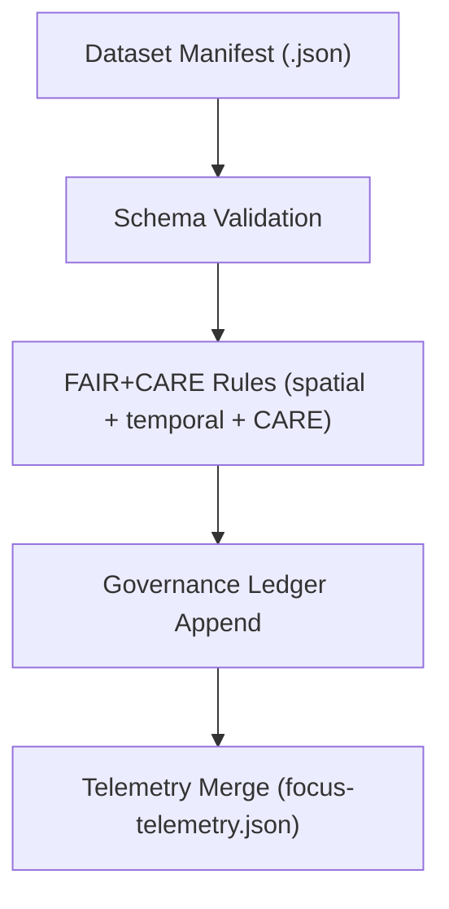

<div align="center">

# 📐 **Generalization Validation Schemas Index**  
`docs/standards/data-generalization/validation/schemas/README.md`

**Purpose:**  
Provide the authoritative index for **JSON Schema definitions** governing spatial, temporal, and CARE-compliance validation for sensitive-site generalization in the Kansas Frontier Matrix (KFM).  
These schemas ensure all generalized datasets follow **FAIR+CARE**, **CIDOC CRM**, **DCAT 3.0**, **GeoJSON**, **ISO 19115**, and **OWL-Time** metadata standards.

[](../../../../README.md)  
[](../../../faircare.md)
[](../../../../../LICENSE)
[]()

</div>

---

## 📘 Overview

This directory contains the **machine-validated schema definitions** used by KFM’s automated workflows:

- `.github/workflows/faircare-validate.yml`
- `.github/workflows/stac-validate.yml`
- `.github/workflows/docs-lint.yml`

These schemas strictly govern:
- Spatial generalization  
- Temporal generalization  
- CARE ethics blocks  
- Masking/suppression logic  
- Sovereignty notes & access restrictions  
- Generalization metadata objects  

All schemas integrate with:
- **FAIR+CARE governance**  
- **CARE authority review**  
- **Generalization rule sets (spatial_rules.md, temporal_rules.md, care_rules.md)**  
- **Telemetry tracking (focus-telemetry.json)**  

---

## 🗂️ Directory Layout

```plaintext
docs/standards/data-generalization/validation/schemas/
├── README.md                               # Schema index (this file)
├── spatial_generalization.schema.json       # Spatial generalization compliance schema
├── temporal_generalization.schema.json      # Temporal precision/masking schema
├── care_metadata.schema.json                # CARE sovereignty & ethics schema
├── generalization_bundle.schema.json        # Unified schema for full dataset validation
└── examples/                                # Example payloads for validation tests
```

---

## 🧱 Schema Summary Table

| Schema File | Purpose | Standards Referenced |
|-------------|---------|----------------------|
| **spatial_generalization.schema.json** | Validate rounding, grids, random offsets, suppression rules | GeoJSON, ISO 19115, DCAT 3.0 |
| **temporal_generalization.schema.json** | Validate time coarsening, ranges, ceremony masking, suppression | OWL-Time, CIDOC CRM |
| **care_metadata.schema.json** | Validate CARE fields: authority, restrictions, ethics notes | CARE Principles |
| **generalization_bundle.schema.json** | Composite validator for full sensitive-site objects | FAIR+CARE, MCP v6.3 |

---

## 📦 Expected Schema Capabilities

Each schema must support:

### 1️⃣ **Structural Validation**
- Required fields  
- Type enforcement  
- Enumerated values  
- AdditionalProperties = false  

### 2️⃣ **Rule-Level Validation**
- Spatial resolution thresholds  
- Degree of coordinate masking  
- Random offset validation  
- Temporal precision limits  
- CARE sovereignty flag requirements  

### 3️⃣ **Governance Metadata Validation**
- Reviewers  
- Sovereignty authorities  
- Consent timestamps  
- Telemetry integration references  

---

## 🧾 Example — Generalization Bundle Schema (Excerpt)

```json
{
  "$schema": "https://json-schema.org/draft/2020-12/schema",
  "title": "KFM Sensitive-Site Generalization Schema (v10)",
  "type": "object",
  "required": ["spatial", "temporal", "care"],
  "properties": {
    "spatial": { "$ref": "spatial_generalization.schema.json" },
    "temporal": { "$ref": "temporal_generalization.schema.json" },
    "care": { "$ref": "care_metadata.schema.json" }
  }
}
```

---

## ⚙️ Validation Workflow Integration



**Workflow Outputs:**
- `reports/faircare/schema_validation.json`
- `reports/faircare/generalization_audit.json`
- `reports/audit/governance-ledger.json`

---

## 🕵️ Automated Failure Conditions

| Code | Condition | Action |
|------|-----------|--------|
| **S-GEN-01** | Missing generalization metadata block | Reject |
| **S-GEN-02** | Spatial precision too high | Reject |
| **T-GEN-01** | Exact dates found in sensitive dataset | Reject |
| **C-GEN-01** | CARE block missing/invalid | Escalate to Council |
| **C-GEN-02** | No authority_to_control specified | Reject & notify Council |
| **SCHEMA-ERR** | Schema mismatch | Halt CI |

---

## 🧮 Governance & Telemetry Mapping

Validated schema outputs feed into:

- `focus-telemetry.json`
- `governance-ledger.json`
- `governance/REVIEW_LOGS/**`
- `data/checksums/manifest.json`
- `releases/v10.2.0/manifest.zip`

---

## 🕰️ Version History

| Version | Date | Author | Summary |
|--------:|------|--------|---------|
| v10.2.2 | 2025-11-12 | FAIR+CARE Council | Schema index established; aligned with spatial/temporal/CARE rule sets and v10 telemetry. |

---

<div align="center">

**© 2025 Kansas Frontier Matrix — CC BY-NC 4.0**  
Generalization Schema Governance · FAIR+CARE Protected · MCP v6.3  
Diamond⁹ Ω / Crown∞Ω Certified  

[Back to Validation Index](../README.md) • [Generalization Standards](../../README.md)

</div>

