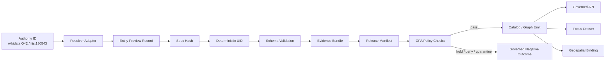
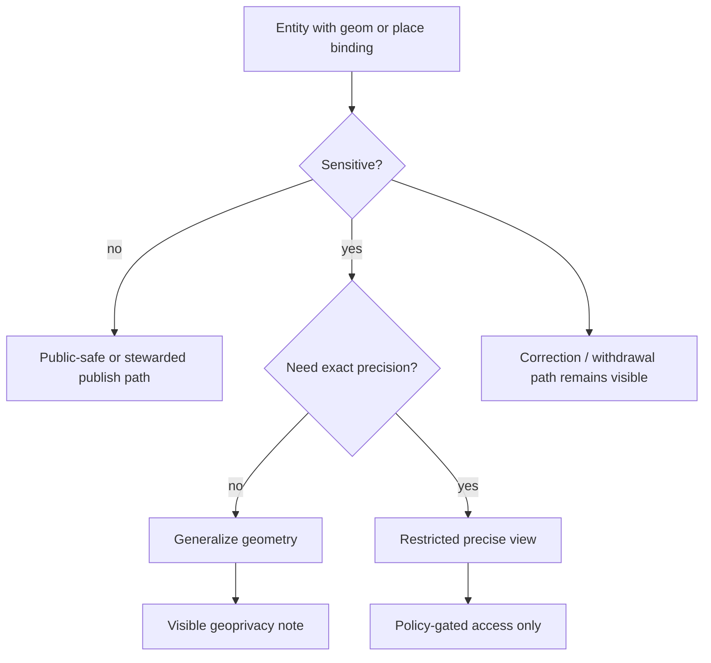
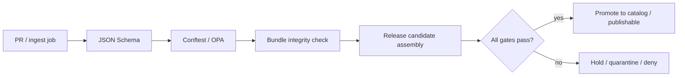

<!--
doc_id: NEEDS VERIFICATION
title: KFM Entity Publication Extension
type: standard
version: v1
status: draft
owners: [@bartytime4life, NEEDS VERIFICATION]
created: NEEDS VERIFICATION
updated: 2026-04-05
policy_label: public
related: [docs/governance/ROOT_GOVERNANCE.md, docs/governance/ETHICS.md, docs/governance/SOVEREIGNTY.md, NEEDS VERIFICATION]
tags: [kfm, entities, evidence, publication, graph, api, opa, geospatial]
notes: [PROPOSED standard; file path and owners NEEDS VERIFICATION, aligns to KFM evidence-first publication model]
-->

# KFM Entity Publication Extension

**Purpose:** define a governed path from authority-linked entity previews to evidence-backed publication, API delivery, graph emission, and trust-visible UI surfaces.

**Repo fit:** `NEEDS VERIFICATION` → intended for a standards or architecture lane adjacent to entity, evidence, and publication contracts; upstream from ingest/resolver adapters and downstream to catalog, graph, API, and Focus surfaces.

**Accepted inputs:** entity preview records, authority resolver outputs, evidence references, EvidenceBundle-like contracts, policy outputs, geospatial bindings.

**Exclusions:** this document does **not** claim live implementation, production enforcement, or existing endpoint availability unless verified in-repo.

---

**Status:** Draft  
**Owners:** @bartytime4life, `NEEDS VERIFICATION`  
**Scope:** Evidence-first, authority-aware, publication-gated  
**Verification:** Mounted repo paths and active enforcement `NEEDS VERIFICATION`


**Quick jump:** [Scope](#scope) · [Repo fit](#repo-fit) · [Inputs](#inputs) · [Exclusions](#exclusions) · [Architecture](#architecture) · [Contracts](#contracts) · [OPA policy pack](#opa-policy-pack) · [API contract](#api-contract) · [Graph schema](#graph-schema) · [Geospatial binding](#geospatial-binding) · [CI gates](#ci-gates) · [Task list](#task-list) · [FAQ](#faq)

---

## Scope

This standard extends the minimal entity preview shape into a fuller KFM publication path:

1. resolve authoritative IDs into normalized entities,
2. bind claims to evidence,
3. require policy-visible promotion gates,
4. emit graph-ready statements,
5. expose a trust-visible surface for public or stewarded clients.

This is a **PROPOSED** extension compatible with the KFM truth path: source edge → RAW → WORK/QUARANTINE → PROCESSED → CATALOG/TRIPLET → PUBLISHED.

> [!IMPORTANT]
> Consequential entity claims should be resolvable through evidence references and policy checks. If evidence is absent, stale, restricted, or insufficient, the safe KFM outcomes remain: **ABSTAIN**, **DENY**, **HOLD**, **QUARANTINE**, or **GENERALIZE**.

[Back to top](#kfm-entity-publication-extension)

---

## Repo fit

| Item | Value |
|---|---|
| Intended file path | `NEEDS VERIFICATION` |
| Likely neighboring docs | `docs/governance/ROOT_GOVERNANCE.md`, `docs/governance/ETHICS.md`, `docs/governance/SOVEREIGNTY.md` |
| Upstream producers | ingest adapters, authority resolvers, evidence collectors |
| Downstream consumers | catalog builders, triplet emitters, governed APIs, Focus Drawer / evidence surfaces |
| Live implementation status | `UNKNOWN` |
| Fit assessment | **INFERRED** from KFM governance and publication doctrine |

### Suggested placement

```text
docs/
  standards/
    entity-publication-extension.md                  # NEEDS VERIFICATION
schemas/
  entity-preview.schema.json                        # PROPOSED
  evidence-bundle.schema.json                       # PROPOSED
  release-manifest.entity.schema.json               # PROPOSED
  entity-graph-node.schema.json                     # PROPOSED
  entity-edge.schema.json                           # PROPOSED
policy/
  opa/
    entity/
      deterministic_uid.rego                        # PROPOSED
      require_license.rego                          # PROPOSED
      require_evidence.rego                         # PROPOSED
      authority_precedence.rego                     # PROPOSED
      geoprivacy_guard.rego                         # PROPOSED
api/
  openapi/
    entity-resolution.openapi.yaml                  # PROPOSED
tools/
  kfm_uid.py                                        # PROPOSED
```

[Back to top](#kfm-entity-publication-extension)

---

## Inputs

This extension assumes the minimal preview record already exists.

### Required minimum input

```json
{
  "uid": "deterministic:sha256(aaaaaaaaaaaaaaaaaaaaaaaaaaaaaaaaaaaaaaaaaaaaaaaaaaaaaaaaaaaaaaaa)",
  "source": "ingest/example:v1",
  "license": "cc0",
  "ts": "2026-04-05T00:00:00Z",
  "geom": null,
  "entity": {
    "kind": "person",
    "authority": "wikidata",
    "id": "Q42"
  },
  "evidence_refs": [
    {
      "source_uri": "https://www.wikidata.org/wiki/Q42",
      "artifact_etag": "sha256:bbbbbbbbbbbbbbbbbbbbbbbbbbbbbbbbbbbbbbbbbbbbbbbbbbbbbbbbbbbbbbbb",
      "rights": "public"
    }
  ],
  "spec_hash": "sha256:cccccccccccccccccccccccccccccccccccccccccccccccccccccccccccccccc"
}
```

### Additional accepted inputs

| Input class | Purpose |
|---|---|
| Resolver output | hydrate authority ID into normalized fields |
| Evidence bundle input | aggregate and seal evidence items |
| Release manifest input | bind entity set to publish decision |
| Policy evaluation output | show pass/fail/deny/hold reasons |
| Geospatial binding | attach place/observation relation with exposure controls |

[Back to top](#kfm-entity-publication-extension)

---

## Exclusions

This standard does **not**:

- declare an entity sovereign over authoritative sources,
- allow derived claims to silently supersede authoritative truth,
- publish precise sensitive coordinates by default,
- assume every preview record becomes publishable,
- imply current APIs, schemas, or OPA policies already exist in-repo.

> [!WARNING]
> Public delivery of entity-linked ecology, archaeology, genealogy, or culturally sensitive geography must remain subordinate to policy, precision controls, and steward review.

[Back to top](#kfm-entity-publication-extension)

---

## Directory tree

```text
KFM entity publication flow (logical)
├─ ingest/
│  ├─ authority resolvers
│  └─ preview record emitters
├─ work/
│  ├─ schema validation
│  ├─ OPA policy evaluation
│  └─ quarantine / hold / promote
├─ processed/
│  ├─ evidence bundles
│  ├─ release manifests
│  └─ normalized entity snapshots
├─ catalog/
│  ├─ entity registry
│  ├─ graph nodes
│  └─ triplet emissions
└─ published/
   ├─ governed API payloads
   ├─ focus drawer trust surfaces
   └─ generalized geospatial products
```

---

## Quickstart

### 1) Validate the preview record

```bash
python tools/kfm_uid.py \
  --authority wikidata \
  --id Q42 \
  --source ingest/genealogy-gedcom:v1 \
  --spec-hash sha256:cccccccccccccccccccccccccccccccccccccccccccccccccccccccccccccccc \
  --ts 2026-04-05T00:00:00Z
```

### 2) Run schema + policy checks

```bash
# illustrative only — command wiring NEEDS VERIFICATION
conftest test entity-preview.json --policy policy/opa/entity
```

### 3) Bind evidence and release metadata

```json
{
  "bundle_id": "eb:sha256:dddddddddddddddddddddddddddddddddddddddddddddddddddddddddddddddd",
  "release_id": "rel:entity:sha256:eeeeeeeeeeeeeeeeeeeeeeeeeeeeeeeeeeeeeeeeeeeeeeeeeeeeeeeeeeeeeeee"
}
```

### 4) Emit only gated statements

If validation or policy checks fail, hold in `WORK/QUARANTINE` rather than silently publishing.

[Back to top](#kfm-entity-publication-extension)

---

## Architecture

The extension makes policy and evidence first-class, not decorative.



### Trust interpretation

| Layer | KFM reading |
|---|---|
| Authority resolver | authoritative anchor, not final publication right |
| Preview record | minimal stable identity carrier |
| Evidence bundle | resolvable support for claims |
| Release manifest | publish decision envelope |
| Policy evaluation | visible gate, not hidden convenience |
| Focus drawer | trust-visible client surface |

[Back to top](#kfm-entity-publication-extension)

---

## Contracts

## 1. Entity Preview (baseline)

**Status:** **PROPOSED** as a standard shape in this document; preview shape itself is **INFERRED** from prior discussion.

```json
{
  "uid": "deterministic:sha256(aaaaaaaaaaaaaaaaaaaaaaaaaaaaaaaaaaaaaaaaaaaaaaaaaaaaaaaaaaaaaaaa)",
  "source": "ingest/example:v1",
  "license": "cc0",
  "ts": "2026-04-05T00:00:00Z",
  "geom": null,
  "entity": {
    "kind": "person",
    "authority": "wikidata",
    "id": "Q42"
  },
  "evidence_refs": [
    {
      "source_uri": "https://www.wikidata.org/wiki/Q42",
      "artifact_etag": "sha256:bbbbbbbbbbbbbbbbbbbbbbbbbbbbbbbbbbbbbbbbbbbbbbbbbbbbbbbbbbbbbbbb",
      "rights": "public"
    }
  ],
  "spec_hash": "sha256:cccccccccccccccccccccccccccccccccccccccccccccccccccccccccccccccc"
}
```

---

## 2. EvidenceBundle

**Purpose:** seal the evidence set used for consequential claims.

```json
{
  "bundle_id": "eb:sha256:dddddddddddddddddddddddddddddddddddddddddddddddddddddddddddddddd",
  "created": "2026-04-05T00:00:00Z",
  "items": [
    {
      "ref_id": "ref:1",
      "source_uri": "https://www.wikidata.org/wiki/Q42",
      "retrieved_at": "2026-04-05T00:00:00Z",
      "artifact_hash": "sha256:bbbbbbbbbbbbbbbbbbbbbbbbbbbbbbbbbbbbbbbbbbbbbbbbbbbbbbbbbbbbbbbb",
      "license": "cc0",
      "rights": "public"
    }
  ],
  "integrity": {
    "hash": "sha256:ffffffffffffffffffffffffffffffffffffffffffffffffffffffffffffffff"
  }
}
```

### Required invariants

| Field | Rule |
|---|---|
| `bundle_id` | deterministic or content-addressed |
| `items[]` | at least one item for publishable entity claim |
| `artifact_hash` | immutable reference to fetched content or artifact |
| `license` | explicit and non-unknown |
| `integrity.hash` | required for sealed bundle |

---

## 3. ReleaseManifest binding

**Purpose:** connect entity publication to a visible decision.

```json
{
  "release_id": "rel:entity:sha256:eeeeeeeeeeeeeeeeeeeeeeeeeeeeeeeeeeeeeeeeeeeeeeeeeeeeeeeeeeeeeeee",
  "ts": "2026-04-05T00:00:00Z",
  "entities": [
    "deterministic:sha256(aaaaaaaaaaaaaaaaaaaaaaaaaaaaaaaaaaaaaaaaaaaaaaaaaaaaaaaaaaaaaaaa)"
  ],
  "evidence_bundle": "eb:sha256:dddddddddddddddddddddddddddddddddddddddddddddddddddddddddddddddd",
  "policy_checks": {
    "license_valid": true,
    "uid_valid": true,
    "evidence_present": true,
    "authority_precedence_ok": true,
    "geoprivacy_ok": true
  },
  "status": "candidate"
}
```

### Promotion interpretation

| Status | Meaning |
|---|---|
| `candidate` | assembled but not yet publishable |
| `publishable` | all required gates pass |
| `held` | insufficient evidence or review pending |
| `quarantined` | policy concern, integrity problem, or unsafe exposure |
| `withdrawn` | correction or supersession path applied |

[Back to top](#kfm-entity-publication-extension)

---

## Resolver model

Resolvers normalize authority records while preserving source primacy.

### Resolver responsibilities

- fetch authority record,
- map to stable normalized fields,
- capture retrieval metadata,
- emit evidence references,
- avoid silently inferring unsupported claims.

### Normalized resolver output

```json
{
  "entity": {
    "kind": "person",
    "authority": "wikidata",
    "id": "Q42",
    "name": "Douglas Adams"
  },
  "resolver": {
    "retrieved_at": "2026-04-05T00:00:00Z",
    "source_uri": "https://www.wikidata.org/wiki/Q42",
    "adapter": "wikidata:v1"
  },
  "spec_hash": "sha256:1111111111111111111111111111111111111111111111111111111111111111"
}
```

### Authority precedence table

| Entity kind | Preferred anchor | Secondary / crosswalk |
|---|---|---|
| person | `wikidata` | `viaf`, `lcnaf` |
| taxon | `itis` or `gbif` depending lane | other taxonomic crosswalks `NEEDS VERIFICATION` |
| place-like relation | authoritative gazetteer `NEEDS VERIFICATION` | derived KFM joins subordinate |
| observation-linked occurrence | observed source remains primary | modeled surfaces subordinate |

> [!NOTE]
> Which taxonomic anchor is preferred in a given KFM lane is likely domain-specific. This document treats that choice as **NEEDS VERIFICATION** rather than asserting a single global rule.

---

## OPA policy pack

This pack is intentionally small and composable. It is designed to fail closed.

### Policy inventory

| Policy file | Purpose | Status |
|---|---|---|
| `deterministic_uid.rego` | verify UID format and derivation | **PROPOSED** |
| `require_license.rego` | reject missing or unknown license | **PROPOSED** |
| `require_evidence.rego` | require evidence for publishable claims | **PROPOSED** |
| `authority_precedence.rego` | prevent derived layer from outranking source authority | **PROPOSED** |
| `geoprivacy_guard.rego` | block or generalize sensitive coordinates | **PROPOSED** |

### Example: deterministic UID policy

```rego
package kfm.entity.deterministic_uid

canonical_tuple := sprintf("%s|%s|%s|%s|%s", [
  input.entity.authority,
  input.entity.id,
  input.source,
  input.spec_hash,
  input.ts,
])

expected_prefix := "deterministic:sha256("

deny[msg] {
  not startswith(input.uid, expected_prefix)
  msg := "uid must use deterministic:sha256(...) format"
}
```

### Example: require license

```rego
package kfm.entity.require_license

allowed := {"cc0", "cc-by", "odc-by", "public-domain"}

deny[msg] {
  not input.license
  msg := "missing license"
}

deny[msg] {
  input.license == "unknown"
  msg := "license cannot be unknown"
}

deny[msg] {
  input.license
  not allowed[input.license]
  msg := sprintf("license not allowed: %v", [input.license])
}
```

### Example: require evidence for publication

```rego
package kfm.entity.require_evidence

deny[msg] {
  input.release.status == "publishable"
  count(input.evidence_refs) == 0
  msg := "publishable entity requires at least one evidence reference"
}
```

### Example: authority precedence

```rego
package kfm.entity.authority_precedence

authoritative_person := {"wikidata", "viaf", "lcnaf"}
authoritative_taxon := {"itis", "gbif"}

deny[msg] {
  input.entity.kind == "person"
  not authoritative_person[input.entity.authority]
  msg := "person entity uses non-approved authority"
}

deny[msg] {
  input.entity.kind == "taxon"
  not authoritative_taxon[input.entity.authority]
  msg := "taxon entity uses non-approved authority"
}
```

### Example: geoprivacy guard

```rego
package kfm.entity.geoprivacy_guard

sensitive_kinds := {"taxon"}

deny[msg] {
  input.entity.kind == "taxon"
  input.geom.type == "Point"
  input.policy.exposure_class == "public-safe"
  input.policy.sensitive_location == true
  msg := "precise sensitive taxon point cannot be published as public-safe"
}
```

### Policy outcome model

```json
{
  "decision": "HOLD",
  "reasons": [
    "precise sensitive taxon point cannot be published as public-safe"
  ]
}
```

[Back to top](#kfm-entity-publication-extension)

---

## API contract

This section defines a minimal governed API surface. It does **not** assert live endpoints.

### Endpoint inventory

| Method | Path | Purpose | Status |
|---|---|---|---|
| `GET` | `/v1/entities/{authority}/{id}` | resolve and return normalized entity | **PROPOSED** |
| `POST` | `/v1/entities/preview` | submit preview for validation | **PROPOSED** |
| `POST` | `/v1/entities/release` | bind preview set to release evaluation | **PROPOSED** |
| `GET` | `/v1/entities/{uid}/focus` | trust-visible Focus Drawer payload | **PROPOSED** |
| `GET` | `/v1/entities/{uid}/graph` | graph view or node/edge neighborhood | **PROPOSED** |

### 1) Resolve entity

```yaml
openapi: 3.1.0
info:
  title: KFM Entity Resolution API
  version: 1.0.0
paths:
  /v1/entities/{authority}/{id}:
    get:
      summary: Resolve an authority-backed entity
      parameters:
        - in: path
          name: authority
          required: true
          schema:
            type: string
            enum: [wikidata, viaf, lcnaf, itis, gbif]
        - in: path
          name: id
          required: true
          schema:
            type: string
      responses:
        "200":
          description: Resolved entity
```

### 2) Preview validation response

```json
{
  "uid": "deterministic:sha256(aaaaaaaaaaaaaaaaaaaaaaaaaaaaaaaaaaaaaaaaaaaaaaaaaaaaaaaaaaaaaaaa)",
  "decision": "ANSWER",
  "validation": {
    "schema_valid": true,
    "policy_valid": true
  },
  "release_candidate": false
}
```

### 3) Release evaluation response

```json
{
  "release_id": "rel:entity:sha256:eeeeeeeeeeeeeeeeeeeeeeeeeeeeeeeeeeeeeeeeeeeeeeeeeeeeeeeeeeeeeeee",
  "decision": "HOLD",
  "reasons": [
    "bundle integrity missing"
  ]
}
```

### Finite outcome rule

KFM runtime outcomes should remain finite:

| Outcome | Meaning |
|---|---|
| `ANSWER` | safe to resolve and present |
| `ABSTAIN` | not enough evidence |
| `DENY` | policy prohibits disclosure or action |
| `ERROR` | system or contract failure |
| `HOLD` | review or additional evidence required |
| `QUARANTINE` | unsafe or invalid until remediated |

[Back to top](#kfm-entity-publication-extension)

---

## Graph schema

The graph model must preserve authority, evidence, and correction lineage.

### Node types

| Node label | Purpose |
|---|---|
| `Entity` | normalized person/taxon/place-like identity |
| `AuthorityRecord` | source anchor or source snapshot |
| `EvidenceBundle` | evidence aggregation |
| `Release` | publication decision object |
| `Observation` | observed occurrence or claim source |
| `Place` | governed place binding |
| `Correction` | supersession / narrowing / withdrawal lineage |

### Edge types

| Edge | Meaning |
|---|---|
| `IDENTIFIED_BY` | entity ↔ authority record |
| `SUPPORTED_BY` | entity/claim ↔ evidence bundle |
| `RELEASED_IN` | entity ↔ release |
| `OBSERVED_AT` | observation ↔ place |
| `ABOUT` | evidence or release ↔ entity |
| `SUPERSEDES` | correction lineage |
| `NARROWS` | precision or scope reduction |
| `WITHDRAWS` | explicit removal |

### Graph node example

```json
{
  "label": "Entity",
  "uid": "deterministic:sha256(aaaaaaaaaaaaaaaaaaaaaaaaaaaaaaaaaaaaaaaaaaaaaaaaaaaaaaaaaaaaaaaa)",
  "kind": "person",
  "authority": "wikidata",
  "authority_id": "Q42",
  "name": "Douglas Adams",
  "spec_hash": "sha256:cccccccccccccccccccccccccccccccccccccccccccccccccccccccccccccccc"
}
```

### Graph edge example

```json
{
  "type": "SUPPORTED_BY",
  "from": "deterministic:sha256(aaaaaaaaaaaaaaaaaaaaaaaaaaaaaaaaaaaaaaaaaaaaaaaaaaaaaaaaaaaaaaaa)",
  "to": "eb:sha256:dddddddddddddddddddddddddddddddddddddddddddddddddddddddddddddddd",
  "ts": "2026-04-05T00:00:00Z"
}
```

### Triplet emission model

Only emit a claim as a triplet when evidence and policy gates pass.

```json
{
  "subject": "wikidata:Q42",
  "predicate": "instance_of",
  "object": "wikidata:Q5",
  "evidence": "eb:sha256:dddddddddddddddddddddddddddddddddddddddddddddddddddddddddddddddd",
  "release": "rel:entity:sha256:eeeeeeeeeeeeeeeeeeeeeeeeeeeeeeeeeeeeeeeeeeeeeeeeeeeeeeeeeeeeeeee",
  "ts": "2026-04-05T00:00:00Z"
}
```

### RDF / Neo4j alignment

| Concern | RDF-friendly mapping | Neo4j-friendly mapping |
|---|---|---|
| Authority ID | IRI / CURIE | indexed property |
| Evidence linkage | named graph or reified statement | edge to `EvidenceBundle` |
| Correction lineage | explicit correction predicates | `SUPERSEDES`, `NARROWS`, `WITHDRAWS` relationships |
| Release binding | provenance graph | `RELEASED_IN` relationship |

> [!TIP]
> Reified or attributed statements are preferable where claim-level evidence must remain queryable.

[Back to top](#kfm-entity-publication-extension)

---

## Geospatial binding

This is where entity publication meets KFM’s geoprivacy and stewardship rules.

### Binding goals

- allow entity ↔ place ↔ observation joins,
- preserve precision controls,
- separate exact, generalized, and withheld outputs,
- prevent exact sensitive locations from leaking through convenience layers.

### Geospatial binding contract

```json
{
  "entity_uid": "deterministic:sha256(aaaaaaaaaaaaaaaaaaaaaaaaaaaaaaaaaaaaaaaaaaaaaaaaaaaaaaaaaaaaaaaa)",
  "place_ref": "kfm://place/123",
  "observation_ref": "kfm://observation/456",
  "geometry_mode": "generalized",
  "geom": {
    "type": "Polygon",
    "coordinates": [[[0,0],[0,1],[1,1],[1,0],[0,0]]]
  },
  "exposure_class": "public-safe",
  "reason": "sensitive occurrence generalized"
}
```

### Geometry modes

| Mode | Meaning |
|---|---|
| `exact` | precise coordinates, steward-only unless explicitly approved |
| `generalized` | reduced precision for public-safe delivery |
| `withheld` | no public geometry exposed |
| `derived_surface` | modeled or interpolated geometry, not observation truth |

### Exposure classes

| Class | Intended audience |
|---|---|
| `public-safe` | public clients |
| `generalized` | public, visibly reduced precision |
| `steward-only` | authorized steward workflows |
| `restricted-precise-view` | tightly governed internal access |
| `withheld` | no delivery beyond metadata notice |

### Geospatial policy diagram



### Binding rules

| Rule | Interpretation |
|---|---|
| observed ≠ modeled | do not present derived surface as direct observation |
| sensitive exact coordinates | default to generalize/withhold |
| place binding without point | allowed where exact point is unsafe |
| geometry omitted with metadata | valid when withholding is required |

[Back to top](#kfm-entity-publication-extension)

---

## Focus Drawer contract

The Focus Drawer is where users see the trust story.

### Payload

```json
{
  "entity": {
    "label": "Douglas Adams",
    "authority": "wikidata",
    "id": "Q42"
  },
  "confidence": "observed",
  "evidence": [
    {
      "source": "Wikidata",
      "uri": "https://www.wikidata.org/wiki/Q42",
      "license": "cc0"
    }
  ],
  "status_flags": [
    "authoritative",
    "verified"
  ],
  "publication_state": "publishable"
}
```

### Focus rules

| Rule | Why |
|---|---|
| evidence visible | cite or abstain |
| authority visible | prevents convenience layer sovereignty |
| license visible | downstream reuse clarity |
| derived/model flags visible | uncertainty made explicit |
| narrowed/withheld notices visible | fail calmly but visibly |

---

## CI gates

### Minimum publish gate set

| Gate | Required |
|---|---|
| Preview schema valid | yes |
| Deterministic UID valid | yes |
| License explicit and allowed | yes |
| Evidence reference count > 0 | yes |
| Evidence bundle integrity hash | yes |
| Release manifest present | yes |
| Authority precedence passes | yes |
| Geoprivacy guard passes | yes for geometry-bearing or place-linked entities |

### Example CI sequence



### Example task runner

```bash
# illustrative only — exact project commands NEEDS VERIFICATION
python tools/kfm_uid.py --authority wikidata --id Q42 --source ingest/example:v1 --spec-hash sha256:cccc... --ts 2026-04-05T00:00:00Z
jsonschema -i examples/entity-preview.json schemas/entity-preview.schema.json
conftest test examples/entity-release.json --policy policy/opa/entity
```

[Back to top](#kfm-entity-publication-extension)

---

## Usage notes

### People

- Prefer `wikidata` as the primary reusable person anchor.
- Keep `viaf` and `lcnaf` as crosswalks where needed.
- If evidence is restricted or genealogically sensitive, expose a narrowed public surface.

### Taxa

- Use `itis` or `gbif` according to lane needs.
- Rare species and culturally sensitive occurrences are **not** publish-by-default with precise points.
- Observed occurrence, modeled habitat, and derived suitability should remain visually and contractually distinct.

### Cross-domain joins

- Entity ↔ place joins should carry exposure class.
- Entity ↔ observation joins should preserve observed vs derived semantics.
- Entity ↔ correction joins should remain queryable and visible.

---

## Task list

- [ ] Verify intended file path in mounted repo.
- [ ] Verify whether baseline entity preview schema already exists.
- [ ] Add `schemas/entity-preview.schema.json`.
- [ ] Add `schemas/evidence-bundle.schema.json`.
- [ ] Add `schemas/release-manifest.entity.schema.json`.
- [ ] Add `policy/opa/entity/*.rego`.
- [ ] Add example payload fixtures under `examples/` or equivalent path.
- [ ] Wire CI to fail on missing license, invalid UID, absent evidence, and geoprivacy violations.
- [ ] Define Focus Drawer renderer contract path.
- [ ] Confirm authority preference rules per lane with maintainers.
- [ ] Document correction/supersession lifecycle for entity claims.

### Definition of done

A merge against this standard should not be considered complete until:

1. schema files exist,
2. OPA policies run in CI,
3. example fixtures cover pass and fail cases,
4. geoprivacy behavior is tested,
5. trust-visible UI payload fields are documented.

[Back to top](#kfm-entity-publication-extension)

---

## FAQ

### Is this claiming KFM already has these APIs and schemas?
No. This document treats them as **PROPOSED** unless verified in-repo.

### Why bind entities to ReleaseManifest and EvidenceBundle?
Because KFM doctrine favors visible evidence routes and publication gates over quiet convenience-layer promotion.

### Why are negative outcomes first-class?
Because abstain/deny/hold/quarantine/generalize preserve trust when certainty, rights, or safety are insufficient.

### Why separate exact, generalized, and withheld geometry?
Because exact sensitive geography can cause harm, and a public-safe system must not quietly leak precise locations.

### Can derived graph statements outrank authority?
No. Derived layers remain subordinate unless explicitly promoted through governed correction or replacement paths.

[Back to top](#kfm-entity-publication-extension)

---

## Appendix A — Truth labels used here

| Label | Meaning in this document |
|---|---|
| **CONFIRMED** | directly supported by attached or visible repo evidence |
| **INFERRED** | strongly implied by KFM doctrine but not live-verified |
| **PROPOSED** | target shape recommended by this standard |
| **UNKNOWN** | no reliable evidence in this session |
| **NEEDS VERIFICATION** | path, owner, enforcement, or implementation detail requires repo confirmation |

---

## Appendix B — Example release payload

```json
{
  "preview": {
    "uid": "deterministic:sha256(aaaaaaaaaaaaaaaaaaaaaaaaaaaaaaaaaaaaaaaaaaaaaaaaaaaaaaaaaaaaaaaa)",
    "source": "ingest/example:v1",
    "license": "cc0",
    "ts": "2026-04-05T00:00:00Z",
    "geom": null,
    "entity": {
      "kind": "person",
      "authority": "wikidata",
      "id": "Q42"
    },
    "evidence_refs": [
      {
        "source_uri": "https://www.wikidata.org/wiki/Q42",
        "artifact_etag": "sha256:bbbbbbbbbbbbbbbbbbbbbbbbbbbbbbbbbbbbbbbbbbbbbbbbbbbbbbbbbbbbbbbb",
        "rights": "public"
      }
    ],
    "spec_hash": "sha256:cccccccccccccccccccccccccccccccccccccccccccccccccccccccccccccccc"
  },
  "bundle": {
    "bundle_id": "eb:sha256:dddddddddddddddddddddddddddddddddddddddddddddddddddddddddddddddd",
    "created": "2026-04-05T00:00:00Z",
    "items": [
      {
        "ref_id": "ref:1",
        "source_uri": "https://www.wikidata.org/wiki/Q42",
        "retrieved_at": "2026-04-05T00:00:00Z",
        "artifact_hash": "sha256:bbbbbbbbbbbbbbbbbbbbbbbbbbbbbbbbbbbbbbbbbbbbbbbbbbbbbbbbbbbbbbbb",
        "license": "cc0",
        "rights": "public"
      }
    ],
    "integrity": {
      "hash": "sha256:ffffffffffffffffffffffffffffffffffffffffffffffffffffffffffffffff"
    }
  },
  "release": {
    "release_id": "rel:entity:sha256:eeeeeeeeeeeeeeeeeeeeeeeeeeeeeeeeeeeeeeeeeeeeeeeeeeeeeeeeeeeeeeee",
    "ts": "2026-04-05T00:00:00Z",
    "entities": [
      "deterministic:sha256(aaaaaaaaaaaaaaaaaaaaaaaaaaaaaaaaaaaaaaaaaaaaaaaaaaaaaaaaaaaaaaaa)"
    ],
    "evidence_bundle": "eb:sha256:dddddddddddddddddddddddddddddddddddddddddddddddddddddddddddddddd",
    "policy_checks": {
      "license_valid": true,
      "uid_valid": true,
      "evidence_present": true,
      "authority_precedence_ok": true,
      "geoprivacy_ok": true
    },
    "status": "publishable"
  }
}
```

---

## Appendix C — Suggested companion files

| File | Purpose |
|---|---|
| `schemas/entity-preview.schema.json` | preview validation |
| `schemas/evidence-bundle.schema.json` | evidence bundle validation |
| `schemas/release-manifest.entity.schema.json` | release validation |
| `policy/opa/entity/require_evidence.rego` | publish evidence gate |
| `policy/opa/entity/geoprivacy_guard.rego` | spatial exposure guard |
| `api/openapi/entity-resolution.openapi.yaml` | governed API surface |
| `examples/entity-release.pass.json` | passing fixture |
| `examples/entity-release.fail.json` | failing fixture |

---
