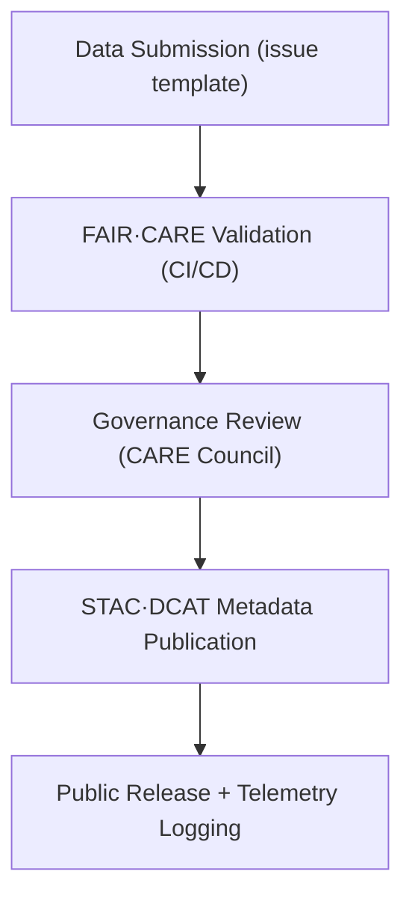

<div align="center">

# ⚖️ **Kansas Frontier Matrix — FAIR+CARE Data Governance Framework**
`docs/standards/faircare.md`

**Purpose:** Define the ethical, procedural, and technical framework for applying **FAIR (Findable, Accessible, Interoperable, Reusable)** and **CARE (Collective Benefit, Authority to Control, Responsibility, Ethics)** principles within the Kansas Frontier Matrix (KFM).  
This framework governs all data, AI, and documentation workflows under the **Master Coder Protocol (MCP-DL v6.3)**.

[](../README.md)
[](../../LICENSE)
[](faircare.md)
[]()
</div>

---

## 📘 Overview

The **FAIR+CARE Framework** ensures that all KFM assets—datasets, models, experiments, and documents—adhere to open science and ethical stewardship.  
FAIR governs **technical interoperability and openness**, while CARE governs **social and cultural responsibility**, especially regarding Indigenous and community data.

Automated enforcement is provided by:
- **FAIR+CARE Validation** → `.github/workflows/faircare-validate.yml`  
- **Governance Ledger Review** → `reports/audit/governance-ledger.json`  
- **Quarterly Council Audits** → `docs/standards/governance/ROOT-GOVERNANCE.md`

---

## 🧭 FAIR Principles

| Principle | Definition | KFM Implementation |
|---|---|---|
| **F1 — Findable** | Discoverable by humans/machines | Global IDs, STAC/DCAT indexing, searchable JSON-LD metadata |
| **F2 — Accessible** | Retrievable via open protocols | Public HTTP/Range-GET, Parquet/CSV/GeoJSON, open APIs |
| **F3 — Interoperable** | Uses standard vocabularies | STAC 1.0, DCAT 3.0, CIDOC-CRM, schema.org, PROV-O |
| **F4 — Reusable** | Licensed, documented, with provenance | SPDX licenses, checksums, SBOM + release manifest linkage |

**Technical Gates**
- `stac-validate.yml` → schema conformance  
- `faircare-validate.yml` → FAIR field completeness  
- `telemetry-export.yml` → FAIR metrics → `focus-telemetry.json`

---

## 🤝 CARE Principles

| Principle | Definition | KFM Implementation |
|---|---|---|
| **C1 — Collective Benefit** | Equitable benefits for communities | Open education datasets; public dashboards with context |
| **C2 — Authority to Control** | Community voice on use/sharing | Council review for culturally sensitive data; CARE fields in manifests |
| **C3 — Responsibility** | Duty of care in stewardship | Provenance, redaction, and ethical statements required |
| **C4 — Ethics** | Avoid harm or exploitation | No PII; ethical notes + approvals in governance ledger |

**Ethical Controls**
- `.github/ISSUE_TEMPLATE/governance_form.yml` for human review inputs  
- CARE-flagged datasets trigger manual audits and delayed publication

---

## 🧱 Integration Framework

### 🧬 Data Lifecycle within FAIR+CARE Governance



All stages append events to the **Governance Ledger** and write metrics to `focus-telemetry.json`.

---

## 🧮 Validation Workflow Summary

| Stage | Automated Tool | Output |
|---|---|---|
| FAIR Metadata Validation | `faircare-validate.yml` | `reports/fair/faircare_summary.json` |
| CARE Review Trigger | `governance_form.yml` | `reports/audit/governance-ledger.json` |
| STAC/DCAT Compliance | `stac-validate.yml` | `reports/self-validation/stac/_summary.json` |
| Documentation Review | `docs-lint.yml` | `reports/self-validation/docs/lint_summary.json` |
| Governance Audit Export | `telemetry-export.yml` | `releases/v10.0.0/focus-telemetry.json` |

---

## 🗃️ Governance Data Fields ( Manifests: `data/sources/*.json` )

| Field | Description | Required |
|---|---|---|
| `id` | Unique dataset identifier | ✅ |
| `title` | Human-readable dataset name | ✅ |
| `license` | SPDX/CC license | ✅ |
| `provenance` | Source organization | ✅ |
| `checksum` | SHA-256 digest | ✅ |
| `care.status` | `approved` \| `revision` \| `restricted` | ⚙️ |
| `care.statement` | Short ethical review note | ⚙️ |
| `care.reviewer` | Council or reviewer entity | ⚙️ |

**Example**
```json
{
  "id": "usgs_hydrography_1890",
  "title": "Historic Hydrography of Kansas (1890)",
  "license": "Public Domain",
  "provenance": "USGS National Hydrography Dataset",
  "checksum": "sha256-2f7c3a...",
  "care": {
    "status": "approved",
    "statement": "Reviewed for Indigenous representation and approved.",
    "reviewer": "FAIR+CARE Council"
  }
}
```

---

## 📒 Ledgers & Public Reporting

| Ledger | Description | Output |
|---|---|---|
| `governance-ledger.json` | Council decisions & CARE reviews | Governance events |
| `github-workflows-ledger.json` | Automated FAIR validation runs | CI/CD traces |
| `release-manifest-log.json` | Version + checksum + SBOM | Provenance |
| `docs/reports/telemetry/governance_scorecard.json` | FAIR+CARE KPIs | Dashboard inputs |

---

## 📏 FAIR+CARE Compliance Score (FCS)

**Formula**
```
FCS = (FAIR * 0.7) + (CARE * 0.3)
```

| Component | Criteria | Weight |
|---|---|---|
| **FAIR** | Metadata completeness, license, provenance, interoperability | 70% |
| **CARE** | Ethical review, community oversight, cultural sensitivity | 30% |

| Range | Rating | Interpretation |
|---|---|---|
| 95–100 | ✅ Excellent | Fully compliant |
| 80–94 | ⚙️ Strong | Minor gaps only |
| 65–79 | ⚠️ Review | Needs council oversight |
| <65 | 🚫 Non-Compliant | Publication blocked |

**Telemetry** → Scores emitted to `releases/v10.0.0/focus-telemetry.json`.

---

## 🔄 Quarterly Audit Cycle

Audit outcomes recorded in:
```
reports/audit/governance-ledger.json
reports/audit/release-manifest-log.json
```

| Stage | Action | Frequency |
|---|---|---|
| Metadata Review | Verify FAIR fields | Quarterly |
| CARE Review | Ethics & sovereignty checks | Quarterly |
| AI Model Review | Bias + governance metadata | Biannual |
| Public Report | Governance dashboard update | Quarterly |

---

## 🔗 Interoperability Alignment

| Standard | Purpose | FAIR/CARE Integration |
|---|---|---|
| **STAC 1.0.0** | Geospatial dataset metadata | FAIR discovery + asset catalogs |
| **DCAT 3.0** | Web catalog vocabulary | FAIR+CARE publication fields |
| **CIDOC CRM** | Cultural heritage ontology | CARE-aware mappings |
| **PROV-O** | Provenance ontology | `prov:wasGeneratedBy` lineage |
| **OWL-Time** | Temporal model | Event/date normalization |

---

## 🧾 Example Governance Ledger Entry

```json
{
  "event": "faircare_review",
  "dataset_id": "noaa_storms_1950_2025",
  "reviewer": "FAIR+CARE Council",
  "decision": "approved",
  "timestamp": "2025-11-10T16:00:00Z",
  "notes": "Complies with FAIR+CARE; no sensitivities detected.",
  "telemetry_ref": "releases/v10.0.0/focus-telemetry.json"
}
```

---

## 📊 Dashboard & Telemetry

The **Governance Dashboard** visualizes compliance trends, CARE reviews, and license coverage.  
Input source:
```
docs/reports/telemetry/governance_scorecard.json
```

---

## 🕰️ Version History

| Version | Date | Author | Summary |
|---:|---|---|---|
| v10.0.0 | 2025-11-10 | A. Barta | Upgraded to v10; refreshed release/telemetry refs; added interoperability & score telemetry alignment. |
| v9.7.0 | 2025-11-05 | A. Barta | Established authoritative FAIR+CARE framework and scoring model. |
| v9.5.0 | 2025-10-20 | A. Barta | Added telemetry + governance ledger integration. |
| v9.0.0 | 2025-06-01 | KFM Core Team | Created FAIR+CARE baseline structure. |

---

<div align="center">

**© 2025 Kansas Frontier Matrix — CC-BY 4.0**  
Governed under **Master Coder Protocol v6.3** · FAIR+CARE Certified · Diamond⁹ Ω / Crown∞Ω Ultimate Certified  
[Back to Standards Index](README.md) · [Root Governance Charter](governance/ROOT-GOVERNANCE.md)

</div>