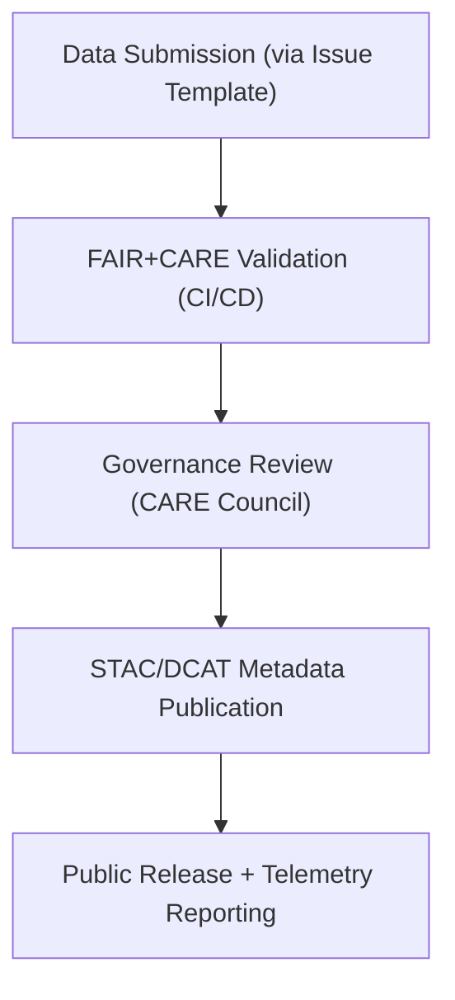

<div align="center">

# ⚖️ **Kansas Frontier Matrix — FAIR+CARE Data Governance Framework**
`docs/standards/faircare.md`

**Purpose:** Define the ethical, procedural, and technical framework for applying **FAIR (Findable, Accessible, Interoperable, Reusable)** and **CARE (Collective Benefit, Authority to Control, Responsibility, Ethics)** principles within the Kansas Frontier Matrix (KFM).  
This framework guides all data, AI, and documentation workflows under the **Master Coder Protocol (MCP v6.3)**.

[](../README.md)
[](../../LICENSE)
[](faircare.md)
[]()

</div>

---

## 📘 Overview

The **FAIR+CARE Framework** ensures that all KFM assets — datasets, models, experiments, and documents — adhere to both open science and ethical data stewardship principles.  
FAIR governs **technical interoperability and openness**, while CARE governs **social and cultural responsibility**, especially regarding Indigenous and community data.

These principles are enforced automatically by:
- **FAIR+CARE Validation Workflow** (`.github/workflows/faircare-validate.yml`)
- **Governance Ledger Review** (`reports/audit/governance-ledger.json`)
- **Quarterly Council Audits** (`docs/standards/governance/ROOT-GOVERNANCE.md`)

---

## ⚙️ FAIR Principles

| Principle | Definition | KFM Implementation |
|------------|-------------|--------------------|
| **F1 — Findable** | Data and metadata must be easily discoverable by humans and machines. | All datasets include globally unique IDs, searchable metadata, and STAC/DCAT indexing. |
| **F2 — Accessible** | Data must be retrievable through standardized open protocols. | Public access through GitHub, GeoTIFF/GeoJSON downloads, and STAC API. |
| **F3 — Interoperable** | Metadata must use standardized formats and vocabularies. | Uses STAC, DCAT, CIDOC CRM, and schema.org for interoperability. |
| **F4 — Reusable** | Data must include detailed provenance and usage licensing. | SPDX licenses, checksum verification, and JSON provenance fields are mandatory. |

**Technical Enforcement:**
- `stac-validate.yml` confirms schema compliance.  
- `faircare-validate.yml` ensures FAIR metadata completeness.  
- `telemetry-export.yml` logs compliance metrics.

---

## 🧭 CARE Principles

| Principle | Definition | KFM Implementation |
|------------|-------------|--------------------|
| **C1 — Collective Benefit** | Data should benefit communities equitably. | Data contributions are designed to advance education, research, and public good for all Kansans. |
| **C2 — Authority to Control** | Communities must have a voice in how data is used and shared. | Indigenous partners review and approve culturally sensitive datasets through governance forms. |
| **C3 — Responsibility** | Data stewards must ensure integrity, security, and respect for contributors. | Metadata includes provenance and CARE review statements; datasets flagged for cultural review undergo manual audit. |
| **C4 — Ethics** | Data use must not harm or exploit individuals or communities. | Ethical reviews recorded in `governance-ledger.json`; no private or PII data permitted. |

**Ethical Enforcement:**
- `.github/ISSUE_TEMPLATE/governance_form.yml` captures human review.  
- CARE-relevant datasets trigger review workflows.  
- Quarterly governance reports summarize outcomes.

---

## 🧱 Integration Framework

### Data Lifecycle within FAIR+CARE Governance



Each stage is logged in the **Governance Ledger** and linked to telemetry metrics for reproducibility and transparency.

---

## 🧮 Validation Workflow Summary

| Stage | Automated Tool | Output |
|--------|----------------|---------|
| FAIR Metadata Validation | `faircare-validate.yml` | `reports/fair/faircare_summary.json` |
| CARE Review Trigger | `governance_form.yml` | `reports/audit/governance-ledger.json` |
| STAC/DCAT Compliance | `stac-validate.yml` | `reports/self-validation/stac/_summary.json` |
| Documentation Review | `docs-lint.yml` | `reports/self-validation/docs/lint_summary.json` |
| Governance Audit Export | `telemetry-export.yml` | `releases/v9.7.0/focus-telemetry.json` |

---

## 🧾 Governance Data Fields

Each dataset or record subject to FAIR+CARE governance includes the following metadata fields in its manifest (`data/sources/*.json`):

| Field | Description | Required |
|--------|-------------|-----------|
| `id` | Unique dataset identifier. | ✅ |
| `title` | Human-readable dataset name. | ✅ |
| `license` | SPDX or CC-compliant license. | ✅ |
| `provenance` | Source organization or repository. | ✅ |
| `checksum` | SHA-256 checksum for data integrity. | ✅ |
| `care` | CARE-specific governance metadata. | ⚙️ |
| `care.statement` | Text describing ethical review results. | ⚙️ |
| `care.reviewer` | FAIR+CARE Council or reviewer entity. | ⚙️ |
| `care.status` | “approved”, “revision”, or “restricted”. | ⚙️ |

**Example:**
```json
{
  "id": "usgs_hydrography_1890",
  "title": "Historic Hydrography of Kansas (1890)",
  "license": "Public Domain",
  "provenance": "USGS National Hydrography Dataset",
  "checksum": "sha256-2f7c3a...",
  "care": {
    "statement": "Dataset reviewed for Indigenous representation and approved.",
    "reviewer": "FAIR+CARE Council",
    "status": "approved"
  }
}
```

---

## 🧩 Governance Ledgers & Reporting

FAIR+CARE decisions and validation results are stored in immutable JSON ledgers for transparency and reproducibility.

| Ledger | Description | Output |
|---------|-------------|--------|
| `governance-ledger.json` | Council decisions, CARE reviews, ethical notes. | Governance events |
| `github-workflows-ledger.json` | Automated FAIR validation and CI/CD logs. | Workflow runs |
| `release-manifest-log.json` | Version, checksum, and SBOM tracking. | Provenance traceability |
| `telemetry/focus_telemetry_snapshot.json` | Aggregated FAIR+CARE metrics for dashboard visualization. | Governance reporting |

---

## 🧠 Scoring & Metrics

Each dataset and document is assigned a **FAIR+CARE Compliance Score (FCS)** recorded in telemetry.

**Formula:**
```
FCS = (FAIR * 0.7) + (CARE * 0.3)
```

| Component | Criteria | Weight |
|------------|-----------|--------|
| **FAIR** | Metadata completeness, provenance, license, interoperability | 70% |
| **CARE** | Ethical review, community oversight, and cultural sensitivity | 30% |

**Score Ranges:**
| Range | Rating | Interpretation |
|--------|---------|----------------|
| 95–100 | ✅ Excellent | Fully compliant with FAIR+CARE and MCP |
| 80–94 | ⚙️ Strong | Meets most technical and ethical requirements |
| 65–79 | ⚠️ Review | Requires governance oversight or metadata improvement |
| <65 | 🚫 Non-Compliant | Fails FAIR or CARE standards |

---

## 🧮 Quarterly Audit Cycle

All datasets, AI models, and experiments undergo quarterly review by the **FAIR+CARE Council**.  
Audit outcomes are stored in:
```
reports/audit/governance-ledger.json
reports/audit/release-manifest-log.json
```

| Stage | Action | Frequency |
|--------|--------|------------|
| **Metadata Review** | Check FAIR field completeness. | Quarterly |
| **CARE Review** | Evaluate ethics and sovereignty compliance. | Quarterly |
| **AI Model Review** | Assess bias and governance metadata. | Biannual |
| **Public Report** | Publish governance dashboard metrics. | Quarterly |

---

## ⚖️ Interoperability Alignment

| Standard | Purpose | FAIR/CARE Integration |
|-----------|----------|------------------------|
| **STAC 1.0.0** | Geospatial dataset metadata | Links to FAIR metadata for discovery |
| **DCAT 3.0** | Catalog and metadata publication | Provides interoperability between FAIR and web data catalogs |
| **CIDOC CRM** | Historical and cultural ontology | CARE-aware ontology mapping |
| **PROV-O** | Provenance and lineage ontology | Used for `prov:wasGeneratedBy` relations |
| **OWL-Time** | Temporal metadata model | Ensures standardized event dating |

---

## 🧾 Example Governance Ledger Entry

```json
{
  "event": "faircare_review",
  "dataset_id": "noaa_storms_1950_2025",
  "reviewer": "FAIR+CARE Council",
  "decision": "approved",
  "timestamp": "2025-11-05T19:20:00Z",
  "notes": "Dataset includes open-access data and complies with CARE principles.",
  "telemetry_ref": "releases/v9.7.0/focus-telemetry.json"
}
```

---

## 🧮 Telemetry Dashboard Integration

FAIR+CARE validation outcomes are visualized in the **Governance Dashboard**, which tracks:
- Dataset compliance trends
- CARE review frequency
- Ethical approval timelines
- License and provenance distribution

**Data Source:**  
```
docs/reports/telemetry/governance_scorecard.json
```

---

## 🕰️ Version History

| Version | Date | Author | Summary |
|----------|------|---------|----------|
| v9.7.0 | 2025-11-05 | A. Barta | Established authoritative FAIR+CARE data governance framework with validation schema and scoring metrics. |
| v9.5.0 | 2025-10-20 | A. Barta | Added telemetry and governance ledger integration. |
| v9.0.0 | 2025-06-01 | KFM Core Team | Created FAIR+CARE baseline structure for data ethics compliance. |

---

<div align="center">

**© 2025 Kansas Frontier Matrix — CC-BY 4.0**  
Governed under **Master Coder Protocol v6.3** · FAIR+CARE Certified · Diamond⁹ Ω / Crown∞Ω Ultimate Certified  
[Back to Standards Index](README.md) · [Root Governance Charter](governance/ROOT-GOVERNANCE.md)

</div>
