<div align="center">

# ⚖️ **Kansas Frontier Matrix — FAIR+CARE Data Governance Framework (v11.0.0)**  
`docs/standards/faircare.md`

**Purpose:**  
Define the **ethical, procedural, and technical governance framework** for applying  
**FAIR (Findable, Accessible, Interoperable, Reusable)** and  
**CARE (Collective Benefit, Authority to Control, Responsibility, Ethics)**  
principles across the entire Kansas Frontier Matrix (KFM) ecosystem.  

This standard governs all **datasets**, **metadata**, **models**, **AI pipelines**, **scientific workflows**,  
**Story Node v3 narratives**, and **Focus Mode v3 contexts**, ensuring an integrated approach to  
open science, community sovereignty, cultural protection, and ethical AI.

</div>

---

# 📘 1. Overview

The KFM FAIR+CARE Framework ensures:

### ✔ Technical interoperability (FAIR)  
### ✔ Cultural sovereignty & ethical governance (CARE)

It applies across:

- Data ingestion  
- Metadata creation  
- Modeling & simulation  
- Story Node generation  
- Focus Mode integration  
- Public datasets & internal restricted sets  
- Sustainability telemetry  
- AI model training restrictions  
- Governance-led decision-making  

All FAIR+CARE rules are **machine-enforced** using KFM CI pipelines.

---

# 🧭 2. FAIR Principles (v11 Implementation)

| Principle | Meaning | KFM v11 Implementation |
|----------|---------|------------------------|
| **F1 — Findable** | Persistent IDs & searchable metadata | Global UUIDs, STAC/DCAT identifiers, JSON-LD |
| **F2 — Accessible** | Retrievable through standard protocols | HTTPS, Range-GET, CDNs, tiered access |
| **F3 — Interoperable** | Shared vocabularies / ontologies | STAC 1.x, DCAT 3.0, CIDOC CRM, OWL-Time, schema.org |
| **F4 — Reusable** | Clear licensing & provenance | SPDX, SBOMs, checksums, KFM lineage chain |

### 🧪 FAIR CI Enforcement
- `stac-validate.yml`  
- `data-contract-validate.yml`  
- `docs-lint.yml`  
- `telemetry-export.yml`  

Outputs written to:

```
reports/self-validation/stac_validation.json
reports/fair/faircare_summary.json
```

---

# 🤝 3. CARE Principles (v11 Implementation)

| Principle | Meaning | KFM v11 Implementation |
|----------|---------|------------------------|
| **C1 — Collective Benefit** | Data should provide shared value | Contextual education layers, ethical Story Nodes |
| **C2 — Authority to Control** | Communities control data about them | CARE blocks, MOU signatures, sovereignty workflows |
| **C3 — Responsibility** | Stewards must protect from harm | Generalization, suppression, audits, access controls |
| **C4 — Ethics** | Prioritize rights, protection & context | Cultural protocols, spiritual site restrictions, narrative rules |

### 🎯 CARE Enforcement Mechanisms
- Required CARE block in all applicable datasets  
- Required tribal/Indigenous approval workflows  
- Required governance ledger entry for sensitive decisions  
- Required masking / generalization for sensitive sites  
- Required narrative validation for Story Nodes

---

# 🧱 4. FAIR+CARE Metadata Requirements (v11)

All datasets MUST contain:

### 🧩 4.1 Core Metadata
```json
{
  "id": "unique-id",
  "title": "Human title",
  "provenance": "Source or origin",
  "checksum": "sha256-...",
  "license": "CC-BY 4.0"
}
```

### 🛡 4.2 CARE Block (Required for any cultural/sensitive data)
```json
{
  "care": {
    "status": "approved | revision | restricted",
    "reviewer": "FAIR+CARE Council",
    "authority_to_control": "Tribal/Community Authority",
    "statement": "Ethical review notes",
    "date_reviewed": "2025-11-10"
  }
}
```

### 🌐 4.3 Interoperability Fields
- `dcat:accessLevel`
- `dct:rights`
- `time:hasBeginning` / `time:hasEnd`
- `geo:geometry` (generalized)
- `prov:wasGeneratedBy`
- `schema:creator`

---

# 🧬 5. FAIR+CARE Data Lifecycle (v11)

```mermaid
flowchart TD
  A["Data Submission"] --> B["FAIR+CARE Validation (CI/CD)"]
  B --> C{"FAIR-compliant?"}
  C -->|No| D["Reject · quarantine registry"]
  C -->|Yes| E["CARE Review (Council + Community)"]
  E --> F{"CARE-safe?"}
  F -->|No| D
  F -->|Yes| G["Metadata Enrichment (STAC/DCAT)"]
  G --> H["Publication (Public or Restricted)"]
  H --> I["Telemetry Logging (focus-telemetry.json)"]
```



---

# 🧪 6. Validation Pipeline (v11)

| Stage | Tool | Output |
|-------|------|--------|
| FAIR Metadata | `faircare-validate.yml` | `faircare_summary.json` |
| Sensitive Scan | PII/Spatial Scan | `pii_scan.json` |
| STAC/DCAT Validation | `stac-validate.yml` | `stac_validation.json` |
| Data Contract Validation | `data-contract-validate.yml` | `contract_validation.json` |
| Documentation | `docs-lint.yml` | `docs_lint_summary.json` |
| Telemetry | `telemetry-export.yml` | `focus-telemetry.json` |

---

# 🔐 7. Governance Ledger Compliance

All FAIR+CARE decisions MUST be logged in:

```
reports/audit/governance-ledger.json
```

### Example:
```json
{
  "event": "faircare_review",
  "dataset_id": "example_dataset_2025",
  "decision": "approved",
  "reviewer": "FAIR+CARE Council",
  "timestamp": "2025-11-20T14:55:00Z"
}
```

---

# 🧭 8. Narrative Governance (Story Nodes & Focus Mode v3)

FAIR+CARE rules apply to:

- Story Node narratives  
- Focus Mode event summaries  
- Temporal/spatial anchors  
- Inferred cultural content  

### Forbidden:
- Precise coordinates for sensitive data  
- Unreviewed cultural knowledge  
- Ritual detail  
- Tribal names without approval  
- Inference of sacred/burial sites  

### Required:
- Regional-scale spatial language  
- Cultural-contextual accuracy  
- CARE-approved narratives  
- Masked or abstracted Story Node maps  

---

# 🕰 9. Quarterly Audit & Scorecard System

Quarterly audits produce:

- FAIR+CARE scores  
- Dataset compliance trends  
- CARE status summaries  
- Deviation reports  

Published to:

```
docs/reports/telemetry/governance_scorecard.json
```

---

# 📊 10. FAIR+CARE Composite Score (FCS v11)

```text
FCS = (FAIR_score * 0.7) + (CARE_score * 0.3)
```

Ranges:

| Score | Label | Meaning |
|-------|--------|---------|
| 95–100 | ✔ Excellent | Fully compliant |
| 80–94 | ⚙ Strong | Minor gaps |
| 65–79 | ⚠ Review Needed | Delay publication |
| <65 | 🚫 Blocked | Not eligible for release |

---

# 🧾 11. Example Dataset Metadata (v11 Compliant)

```json
{
  "id": "historic_hydrography_1890",
  "title": "Historic Hydrography of Kansas (1890)",
  "provenance": "USGS Archive",
  "license": "Public Domain",
  "checksum": "sha256-aaaabbbbcccc",
  "care": {
    "status": "approved",
    "reviewer": "FAIR+CARE Council",
    "statement": "No cultural sensitivity issues.",
    "date_reviewed": "2025-11-15"
  },
  "dcat:accessLevel": "public",
  "prov:wasGeneratedBy": "digitization_pipeline_v3.2"
}
```

---

# 🕊 12. Ethical Requirements (v11 Expansion)

FAIR+CARE v11 prohibits:

- Misrepresentation of cultural narratives  
- Extraction or exploitation of cultural heritage  
- Publishing raw coordinates of sensitive sites  
- Training AI models on sensitive cultural data without tribal approval  
- Omitting cultural disclaimers in educational or public-facing outputs  

KFM MUST:

- Provide contextual disclaimers  
- Include Indigenous perspectives where appropriate  
- Avoid flattening cultural nuance  
- Respect community feedback and authority  

---

# 🧩 13. Integration with Sensitive Site Governance

This standard integrates directly with:

- `data-generalization/README.md`  
- `data-generalization/examples`  
- `data-generalization/governance`  

All sensitive datasets MUST:

- Undergo FAIR+CARE review  
- Include a CARE block  
- Use generalization rules (H3 ≥ 7)  
- Pass narrative safety validation  
- Produce governance ledger events  
- Produce telemetry events  

---

# 🔧 14. Sustainability & FAIR+CARE Telemetry

FAIR+CARE events include:

- Energy (ISO 50001)  
- Carbon (ISO 14064)  
- # of datasets passing validation  
- # of datasets withheld or revised  
- CARE category changes  
- Declassification and embargo reviews  
- Story Node cultural approvals  

Telemetry published to:

```
releases/v11.0.0/focus-telemetry.json
```

---

# 🕰 15. Version History

| Version | Date | Author | Summary |
|--------:|------------|----------------|---------|
| v11.0.0 | 2025-11-20 | KFM Governance Council | Fully upgraded FAIR+CARE framework for KFM v11; added ontology mappings, narrative governance rules, telemetry v11 integration, and MDP v11 compliance. |
| v10.2.2 | 2025-11-12 | A. Barta | Updated SBOM/manifest references; added DCAT and STAC alignment; extended FCS scoring. |
| v10.0.0 | 2025-11-10 | A. Barta | Major improvements, added telemetry and governance ledger integration. |
| v9.7.0  | 2025-11-05 | KFM Core Team | Established authoritative FAIR+CARE baseline. |

---

<div align="center">

⚖️ **Kansas Frontier Matrix — FAIR+CARE Governance**  
“Technical integrity × Ethical responsibility.”

© 2025 Kansas Frontier Matrix — CC-BY 4.0  
Master Coder Protocol v6.3 · FAIR+CARE Certified · Diamond⁹ Ω / Crown∞Ω Ultimate Certified  

[⬅ Back to Standards Index](README.md) ·  
[⚖ Root Governance Charter](governance/ROOT-GOVERNANCE.md)

</div>