<div align="center">

# ⚖️ **Kansas Frontier Matrix — FAIR+CARE Data Governance Framework**  
`docs/standards/faircare.md`

**Purpose:**  
Define the ethical, procedural, and technical framework for applying **FAIR (Findable, Accessible, Interoperable, Reusable)** and **CARE (Collective Benefit, Authority to Control, Responsibility, Ethics)** principles within the Kansas Frontier Matrix (KFM).  
This framework governs all data, AI, and documentation workflows under the **Master Coder Protocol (MCP-DL v6.3)**.

[](../README.md)
[](../../LICENSE)
[](faircare.md)
[]()

</div>

---

## 📘 Overview

The **FAIR+CARE Framework** ensures that all KFM assets—datasets, models, experiments, and documents—adhere to **open science** and **ethical stewardship**.

- **FAIR** governs **technical interoperability**, **findability**, and **reusability**.  
- **CARE** governs **social and cultural responsibility**, especially for Indigenous, community, and sensitive data.

Automated enforcement is provided by:

- `faircare-validate.yml` → FAIR+CARE & contract validation  
- `docs-lint.yml` → structural compliance for docs carrying FAIR+CARE metadata  
- `stac-validate.yml` → FAIR alignment for STAC/DCAT catalogs  
- `telemetry-export.yml` → FAIR+CARE metrics into `focus-telemetry.json`  
- Governance reviews → `reports/audit/governance-ledger.json`

---

## 🧭 FAIR Principles

| Principle | Definition | KFM Implementation |
|---|---|---|
| **F1 — Findable** | Data and metadata are discoverable by humans and machines. | Global IDs, STAC/DCAT indexing, searchable JSON-LD metadata. |
| **F2 — Accessible** | Data are retrievable via standard protocols. | HTTP(S) access, Range-GET, open APIs, public docs where allowed. |
| **F3 — Interoperable** | Data use shared vocabularies and formats. | STAC 1.0, DCAT 3.0, CIDOC CRM, schema.org, PROV-O, OWL-Time. |
| **F4 — Reusable** | Data have clear licenses, provenance, and quality notes. | SPDX licenses, checksums, SBOM, release manifests, data contracts. |

**Technical Gates**

- `stac-validate.yml` → STAC/DCAT structural and extension validation.  
- `faircare-validate.yml` → FAIR field completeness + contracts.  
- `telemetry-export.yml` → FAIR compliance metrics into `focus-telemetry.json`.

---

## 🤝 CARE Principles

| Principle | Definition | KFM Implementation |
|---|---|---|
| **C1 — Collective Benefit** | Data use should benefit communities. | Curated open education sets; public dashboards with contextual narratives. |
| **C2 — Authority to Control** | Communities have a say over their data. | Council review for culturally sensitive data; `care` blocks in manifests. |
| **C3 — Responsibility** | Stewards must act with care and accountability. | Provenance and audit trails; redaction and minimization policies. |
| **C4 — Ethics** | Avoid harm, exploitation, or misrepresentation. | No PII; ethical notes and decisions logged in governance ledger. |

**Ethical Controls**

- Issue templates (e.g., `governance_form.yml`) collect context for sensitive data.  
- CARE-flagged datasets trigger mandatory human review and may require **restricted** access.  
- Publication may be delayed or denied by the FAIR+CARE Council if risks are identified.

---

## 🧱 Integration Framework

### 🧬 Data Lifecycle under FAIR+CARE Governance

```mermaid
flowchart TD
  A["Data Submission (Issue · Manifest · PR)"] --> B["FAIR+CARE Validation (CI/CD)"]
  B --> C{"Compliant?"}
  C -->|Yes| D["Governance Review (CARE Council)"]
  C -->|No| E["Quarantine → abandonment_candidates + Registry"]
  D --> F["STAC/DCAT Metadata Publication"]
  F --> G["Public Release + Telemetry Logging"]
  E --> G
```



All stages append events to the **Governance Ledger** and record metrics in `focus-telemetry.json`.

---

## 🧮 Validation Workflow Summary

| Stage | Automated Tool | Primary Output |
|---|---|---|
| FAIR Metadata Validation | `faircare-validate.yml` | `reports/fair/faircare_summary.json` |
| PII & Sensitive Scan | `faircare-validate.yml` (PII module) | `reports/fair/pii_scan.json` |
| CARE Quarantine & Registry | `abandonment_triage.py` | `data/work/staging/tabular/abandonment_candidates/abandonment_registry.json` |
| STAC/DCAT Compliance | `stac-validate.yml` | `reports/self-validation/stac_validation.json` |
| Documentation Review | `docs-lint.yml` | `reports/self-validation/docs/lint_summary.json` |
| Governance Telemetry | `telemetry-export.yml` | `releases/v10.2.0/focus-telemetry.json` |

---

## 🗃️ Governance Data Fields (Manifests: `data/sources/*.json`)

| Field | Description | Required |
|---|---|---|
| `id` | Unique dataset identifier | ✅ |
| `title` | Human-readable dataset name | ✅ |
| `license` | SPDX/CC license string | ✅ |
| `provenance` | Source organization / origin | ✅ |
| `checksum` | SHA-256 digest or checksum:multihash | ✅ |
| `care.status` | `approved` \| `revision` \| `restricted` | ⚙️ |
| `care.statement` | Short ethical review note | ⚙️ |
| `care.reviewer` | Council or reviewer entity | ⚙️ |

**Example**

```json
{
  "id": "usgs_hydrography_1890",
  "title": "Historic Hydrography of Kansas (1890)",
  "license": "Public Domain",
  "provenance": "USGS National Hydrography Dataset",
  "checksum": "sha256-2f7c3a...",
  "care": {
    "status": "approved",
    "statement": "Reviewed for Indigenous representation and approved.",
    "reviewer": "FAIR+CARE Council"
  }
}
```

---

## 📒 Ledgers & Public Reporting

| Ledger | Description | File |
|---|---|---|
| **Governance Ledger** | Council decisions & CARE reviews | `reports/audit/governance-ledger.json` |
| **GitHub Workflows Ledger** | Automated FAIR/CI runs | `reports/audit/github-workflows-ledger.json` |
| **Release Manifest Log** | Version + checksum + SBOM references | `reports/audit/release-manifest-log.json` |
| **Governance Scorecard** | FAIR+CARE KPIs & trends | `docs/reports/telemetry/governance_scorecard.json` |

These ledgers provide an audit-ready chain of decisions and validations.

---

## 📏 FAIR+CARE Compliance Score (FCS)

A composite **FAIR+CARE Compliance Score (FCS)** is used to benchmark data and model readiness.

**Formula**

```text
FCS = (FAIR_score * 0.7) + (CARE_score * 0.3)
```

| Component | Criteria | Weight |
|---|---|---|
| **FAIR_score** | Metadata completeness, license, provenance, interoperability | 70% |
| **CARE_score** | Ethical review, community oversight, sensitivity handling | 30% |

| Range | Rating | Interpretation |
|---|---|---|
| 95–100 | ✅ Excellent | Fully compliant; eligible for release/citation |
| 80–94 | ⚙️ Strong | Minor gaps; fix in next cycle |
| 65–79 | ⚠️ Review | Requires council oversight before release |
| <65 | 🚫 Non-Compliant | Release blocked until remediated |

FCS values are emitted as telemetry in `focus-telemetry.json`.

---

## 🔄 Quarterly Audit Cycle

Quarterly FAIR+CARE audits verify that KFM continues to meet ethical and technical obligations.

| Stage | Action | Frequency |
|---|---|---|
| Metadata Review | Verify FAIR fields and contracts | Quarterly |
| CARE Review | Re-check sensitive/community datasets | Quarterly |
| AI Model Review | Evaluate bias/drift/ethics metrics | Biannual or after major releases |
| Public Governance Report | Update dashboards & transparency docs | Quarterly |

Audit outcomes are recorded in:

```plaintext
reports/audit/governance-ledger.json
reports/audit/release-manifest-log.json
docs/reports/telemetry/governance_scorecard.json
```

---

## 🔗 Interoperability Alignment

| Standard | Purpose | FAIR+CARE Integration |
|---|---|---|
| **STAC 1.0.0** | Geospatial catalog metadata | FAIR discovery + CARE flags via extensions |
| **DCAT 3.0** | Dataset catalog vocabulary | FAIR+CARE publication, licensing, and attribution |
| **CIDOC CRM** | Heritage & historical ontology | CARE-aware modeling of people/places/events |
| **PROV-O** | Provenance ontology | Lineage (`prov:wasGeneratedBy`) for FAIR/CARE events |
| **OWL-Time** | Temporal ontology | Event/time normalization for governance records |

---

## 🧾 Example Governance Ledger Entry

```json
{
  "event": "faircare_review",
  "dataset_id": "noaa_storms_1950_2025",
  "reviewer": "FAIR+CARE Council",
  "decision": "approved",
  "timestamp": "2025-11-12T16:00:00Z",
  "notes": "Complies with FAIR+CARE; no cultural sensitivities detected.",
  "telemetry_ref": "releases/v10.2.0/focus-telemetry.json"
}
```

---

## 📊 Dashboard & Telemetry

The **Governance Dashboard** visualizes:

- FAIR+CARE Compliance Scores (FCS) per dataset/model  
- CARE status counts (`approved`, `revision`, `restricted`)  
- Licensing & attribution coverage  
- Accessibility & sustainability correlations

Data sources:

```plaintext
docs/reports/telemetry/governance_scorecard.json
releases/v10.2.0/focus-telemetry.json
```

---

## 🕰️ Version History

| Version | Date | Author | Summary |
|---|---|---|---|
| v10.2.2 | 2025-11-12 | A. Barta | Updated SBOM/manifest/telemetry references to v10.2.0; clarified FCS scoring, quarterly audits, and interoperability mapping. |
| v10.0.0 | 2025-11-10 | A. Barta | Upgraded to v10; refreshed release/telemetry refs; added interoperability & telemetry alignment. |
| v9.7.0 | 2025-11-05 | A. Barta | Established authoritative FAIR+CARE framework and scoring model. |
| v9.5.0 | 2025-10-20 | A. Barta | Added telemetry + governance ledger integration. |
| v9.0.0 | 2025-06-01 | KFM Core Team | Created FAIR+CARE baseline structure. |

---

<div align="center">

**© 2025 Kansas Frontier Matrix — CC-BY 4.0**  
Governed under **Master Coder Protocol v6.3** · FAIR+CARE Certified · Diamond⁹ Ω / Crown∞Ω Ultimate Certified  
[Back to Standards Index](README.md) · [Root Governance Charter](governance/ROOT-GOVERNANCE.md)

</div>