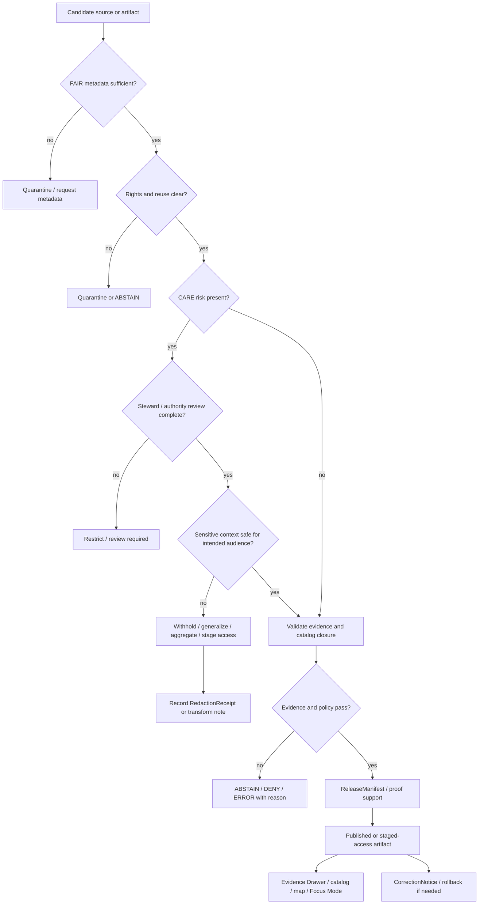

<!-- [KFM_META_BLOCK_V2]
doc_id: kfm://doc/NEEDS-VERIFICATION
title: FAIR+CARE Guide
type: standard
version: v1
status: draft
owners: @bartytime4life
created: NEEDS-VERIFICATION
updated: 2026-04-30
policy_label: TODO-VERIFY(public)
related: [./README.md, ../README.md, ../governance/ROOT_GOVERNANCE.md, ../sovereignty/INDIGENOUS-DATA-PROTECTION.md, ../KFM_STAC_PROFILE.md, ../KFM_DCAT_PROFILE.md, ../KFM_PROV_PROFILE.md, ../KFM_MARKDOWN_WORK_PROTOCOL.md]
tags: [kfm, standards, faircare, fair, care, stewardship, publication, redaction, reuse]
notes: [Revises the public-main brief guide into a substantive standards document while preserving its existing expectations around provenance, reuse, stewardship, sensitive-context handling, and policy-aligned release controls. doc_id and created date need governance-record verification. Owner is based on public-main broad CODEOWNERS fallback and should be rechecked in the mounted checkout. policy_label is a reviewable placeholder because public GitHub visibility is not the same as final KFM policy classification.]
[/KFM_META_BLOCK_V2] -->

<a id="top"></a>

# FAIR+CARE Guide

KFM standard for applying FAIR discovery/reuse and CARE stewardship/protection rules before evidence-bearing artifacts become reusable, public, AI-visible, or map-visible.

<p>
  
  
  
  
  
  
</p>

> [!IMPORTANT]
> **Impact block**
>
> | Field | Value |
> |---|---|
> | Status | `draft` standards guide |
> | Owners | `@bartytime4life` broad fallback; narrower FAIR+CARE stewardship **NEEDS VERIFICATION** |
> | Path | `docs/standards/faircare/FAIRCARE-GUIDE.md` |
> | Repo fit | downstream of [`./README.md`](./README.md) and [`../README.md`](../README.md); adjacent to governance, sovereignty, STAC, DCAT, PROV, and Markdown protocol standards |
> | Authority class | human-readable normative guidance; not a schema, policy bundle, workflow, fixture, source registry, or release proof |
> | Enforcement posture | **NEEDS VERIFICATION** until matching schemas, policy gates, fixtures, validators, workflows, review records, or proof objects are inspected |
>
> **Quick jumps:** [Scope](#scope) · [Repo fit](#repo-fit) · [Preserved baseline](#preserved-baseline) · [Reading rule](#reading-rule) · [FAIR+CARE bridge](#faircare-bridge) · [Requirements](#requirements) · [Decision matrix](#decision-matrix) · [Metadata minima](#metadata-minima) · [Flow](#flow) · [Surface map](#surface-map) · [Validation](#validation) · [Definition of done](#definition-of-done) · [Open verification](#open-verification) · [Appendix](#appendix)

---

## Scope

This guide governs how KFM contributors, reviewers, and stewards apply **FAIR** and **CARE** expectations to standards text, source intake, metadata, publication decisions, public map layers, AI-visible evidence, and reuse permissions.

It is intentionally cross-cutting. It should be inherited by domain lanes that publish or summarize evidence-bearing material, especially where public release could affect communities, cultural knowledge, sensitive locations, private persons, land interests, ecological exposure, infrastructure risk, or source-rights obligations.

### In scope

| Area | This guide controls |
|---|---|
| Source and dataset review | FAIR metadata expectations plus CARE stewardship, authority, responsibility, and ethics checks |
| Publication and reuse | whether an artifact can be public, restricted, generalized, delayed, quarantined, or denied |
| Redaction and generalization | when sensitive context must be withheld, generalized, transformed, or staged |
| AI and Focus Mode inputs | whether evidence may be retrieved, summarized, transformed, or withheld |
| Map and story surfaces | whether visible geometry, popups, legends, stories, and exported summaries remain public-safe |
| Standards text | how FAIR+CARE rules should be referenced without duplicating machine schemas or executable policy |

### Out of scope

| Do not put this here | Put it here instead |
|---|---|
| Machine-readable FAIR/CARE schema bodies | repo-confirmed schema home after schema authority verification |
| Executable policy gates, Rego, or decision grammar | repo-confirmed policy home |
| Valid/invalid fixtures, negative-path drills, or golden files | repo-confirmed tests / fixtures home |
| Source descriptor rows or source registry state | repo-confirmed source registry / data registry home |
| Operational release, rollback, or emergency procedures | owning runbook |
| Domain-specific ingest mechanics | owning domain architecture, source runbook, or pipeline docs |
| Indigenous data protection rules more specific than this guide | [`../sovereignty/INDIGENOUS-DATA-PROTECTION.md`](../sovereignty/INDIGENOUS-DATA-PROTECTION.md) |

[Back to top](#top)

---

## Repo fit

`FAIRCARE-GUIDE.md` is the substantive FAIR+CARE standards file in the FAIR+CARE lane.

| Relationship | Path | Role |
|---|---|---|
| This file | `docs/standards/faircare/FAIRCARE-GUIDE.md` | substantive FAIR+CARE norm text |
| Lane index | [`./README.md`](./README.md) | lane routing, scope, exclusions, and local ownership boundary |
| Standards index | [`../README.md`](../README.md) | root standards routing surface |
| Governance standard | [`../governance/ROOT_GOVERNANCE.md`](../governance/ROOT_GOVERNANCE.md) | cross-domain governance baseline |
| Sovereignty standard | [`../sovereignty/INDIGENOUS-DATA-PROTECTION.md`](../sovereignty/INDIGENOUS-DATA-PROTECTION.md) | Indigenous/community-sensitive handling rules |
| STAC profile | [`../KFM_STAC_PROFILE.md`](../KFM_STAC_PROFILE.md) | spatiotemporal asset discovery metadata |
| DCAT profile | [`../KFM_DCAT_PROFILE.md`](../KFM_DCAT_PROFILE.md) | dataset/distribution discovery metadata |
| PROV profile | [`../KFM_PROV_PROFILE.md`](../KFM_PROV_PROFILE.md) | provenance and lineage profile |
| Markdown protocol | [`../KFM_MARKDOWN_WORK_PROTOCOL.md`](../KFM_MARKDOWN_WORK_PROTOCOL.md) | governed Markdown authoring and review |

> [!WARNING]
> A standards guide does **not** prove enforcement. Enforcement requires verified schemas, validators, policy gates, fixtures, workflow checks, review records, receipts, proof packs, release manifests, or equivalent repo evidence.

[Back to top](#top)

---

## Preserved baseline

The existing public-main guide is brief, but its core expectations are worth preserving. This revision expands them into reviewable standards language without changing their direction.

| Existing expectation | Expanded KFM rule |
|---|---|
| Make provenance explicit | Every reusable or public-facing artifact must resolve to source, evidence, lineage, temporal scope, and review state. |
| Make reuse boundaries explicit | Rights, licenses, redistribution terms, citation requirements, access mode, and reuse limits must be visible before release. |
| Record stewardship responsibilities | Steward, reviewer, authority basis, escalation path, and correction responsibility must be recorded where risk matters. |
| Avoid exposing sensitive context | Exact locations, private data, cultural knowledge, security-sensitive context, and ecological exposure must be withheld, generalized, restricted, or denied when unresolved. |
| Require policy-aligned release controls | Uncertain rights, source terms, sensitivity, sovereignty, or public exposure must fail closed until reviewed. |

[Back to top](#top)

---

## Reading rule

Use the narrowest truthful label:

| Label | Meaning here |
|---|---|
| `CONFIRMED` | directly supported by current repo evidence, attached KFM doctrine, public-main file evidence, or verified artifacts |
| `INFERRED` | strongly suggested by adjacent KFM doctrine or repo routing but not directly proven as enforcement |
| `PROPOSED` | consistent design or standards guidance not yet proven by implementation |
| `UNKNOWN` | not verified strongly enough to state safely |
| `NEEDS VERIFICATION` | checkable item required before merge, release, enforcement, or public claim |

> [!NOTE]
> External standards sharpen vocabulary and interoperability. They do not override KFM’s truth path, trust membrane, review obligations, sensitivity controls, or fail-closed publication posture.

[Back to top](#top)

---

## FAIR+CARE bridge

KFM uses FAIR and CARE together. FAIR helps make evidence and metadata findable, accessible, interoperable, and reusable. CARE keeps people, communities, authority, responsibility, and ethics visible when data can affect rights, safety, culture, sovereignty, or public exposure.

| Principle | KFM interpretation | Minimum review question |
|---|---|---|
| **Findable** | Evidence, source records, releases, corrections, and metadata should have stable identifiers and discoverable context. | Can a reviewer find the supporting evidence, release scope, and correction lineage? |
| **Accessible** | Access mode should be explicit, auditable, and policy-aware; metadata may remain visible when data is restricted if that is safe. | Who can access this, under what conditions, and what is withheld? |
| **Interoperable** | Public discovery metadata should align with KFM STAC, DCAT, PROV, and controlled vocabulary expectations. | Can downstream systems interpret this without losing rights, evidence, or sensitivity meaning? |
| **Reusable** | Reuse requires rights, license, source role, citation, temporal/spatial support, uncertainty, and restrictions. | What can someone safely do with this artifact, and what must they not do? |
| **Collective Benefit** | Publication should identify legitimate public, steward, research, environmental, educational, or community benefit. | Who benefits, who could be harmed, and how is that reflected in release scope? |
| **Authority to Control** | Stewardship, consent, source authority, cultural review, and jurisdictional constraints must be visible when applicable. | Who has authority to approve, restrict, correct, or withdraw this material? |
| **Responsibility** | KFM must retain review pathways, correction duties, contact points, and transform receipts. | Who is responsible when the artifact is wrong, stale, harmful, or misused? |
| **Ethics** | Do not publish merely because metadata is technically complete; publish only when release is safe, justified, and reviewable. | Would this release expose people, communities, locations, resources, or sensitive contexts to avoidable harm? |

[Back to top](#top)

---

## Requirements

### 1. Provenance and evidence are not optional

Every consequential public or semi-public KFM output should be traceable to admissible evidence.

Required posture:

- resolve `EvidenceRef → EvidenceBundle` before public or AI-mediated claims;
- preserve source role, source time, observed/valid time, release time, and correction lineage;
- distinguish source-stated, extracted, inferred, modeled, interpreted, generalized, reviewed, and published states;
- keep derived layers, tiles, summaries, graph projections, search indexes, scenes, and story outputs downstream of release state.

Fail-closed triggers:

- evidence cannot be resolved;
- source role is unknown;
- provenance is incomplete for the intended release burden;
- the output would imply authority the source does not have.

### 2. Reuse boundaries must be visible

A KFM artifact is not reusable merely because it is visible.

For public or semi-public release, record:

- rights or license basis;
- redistribution limits;
- citation and attribution requirements;
- access mode;
- embargo, expiration, or review interval when applicable;
- transformations that affect meaning, precision, or completeness;
- permitted and prohibited AI transformations if the artifact may enter Focus Mode or other synthesis surfaces.

### 3. Stewardship is part of metadata

When material affects a community, steward, living person, sensitive species, cultural site, private location, or governed source relationship, the release record should identify who can review, restrict, correct, or withdraw it.

Minimum stewardship fields should include, when applicable:

| Field | Purpose |
|---|---|
| `steward_ref` | person, team, council, source owner, or steward body responsible for review |
| `authority_basis` | source authority, consent basis, governance authority, or review basis |
| `review_state` | draft, pending, reviewed, denied, restricted, released, corrected, withdrawn, or superseded |
| `review_path` | where reviewers go to inspect or change the decision |
| `correction_path` | how a correction, withdrawal, or restriction update is made visible |

### 4. Sensitive context must not leak through helpfulness

Do not expose sensitive context through examples, logs, screenshots, fixtures, popups, legends, alt text, AI summaries, story exports, map tiles, or generalized prose.

Sensitive context includes but is not limited to:

- archaeology, burial, sacred, ceremonial, or culturally sensitive locations;
- Indigenous or steward-controlled knowledge;
- rare species, sensitive habitat, nests, dens, roosts, hibernacula, or protected resource locations;
- private landowner exposure, living-person data, DNA/genomic information, or private genealogy context;
- critical infrastructure and security-sensitive facilities;
- credentials, private endpoints, secrets, or privileged operational details.

Allowed controls:

| Control | When to use |
|---|---|
| Withhold | exact release would be unsafe or unauthorized |
| Generalize | public interpretation is useful but precision is harmful |
| Aggregate | individual or exact-feature exposure is unnecessary |
| Stage access | trusted role-limited review is appropriate before broader publication |
| Delay | release timing creates avoidable harm |
| Quarantine | evidence, rights, or sensitivity state is unresolved |
| Deny | release violates policy, stewardship, rights, or safety constraints |

### 5. AI and search outputs must inherit CARE obligations

AI, search, and retrieval surfaces must not become a bypass around FAIR+CARE review.

Required posture:

- retrieve only admissible, release-appropriate evidence;
- screen retrieved evidence for rights, sensitivity, sovereignty, and exposure risk before synthesis;
- validate citations before returning an `ANSWER`;
- return `ABSTAIN` when evidence is insufficient;
- return `DENY` when disclosure would be unsafe or unauthorized;
- avoid generating exact-location, “how to find,” or exposure-amplifying content for sensitive subjects.

### 6. Publication is a governed state transition

Public or semi-public release must be reviewable as a decision, not treated as a file move.

Minimum release support should include the verified repo equivalent of:

- source descriptor or source intake record;
- evidence bundle or representative evidence closure;
- validation report;
- policy decision;
- review record where required;
- redaction or generalization receipt where transformation occurred;
- release manifest or proof pack;
- correction and rollback path.

### 7. Corrections must preserve lineage

When a published artifact is corrected, narrowed, generalized, withdrawn, or superseded, the prior state should remain reconstructable.

Do not silently replace:

- public descriptions;
- map layers;
- catalog records;
- AI-visible evidence;
- STAC/DCAT/PROV metadata;
- story nodes;
- release manifests;
- proof packs.

[Back to top](#top)

---

## Decision matrix

| Condition | Default KFM outcome | Required visible reason |
|---|---|---|
| Evidence resolved, rights clear, sensitivity low, review not required | Publish through governed release | `release_ready` |
| Evidence resolved, rights clear, sensitivity medium or contextual | Stage, generalize, or require review | `care_review_required` |
| Evidence resolved but exact geometry is unsafe | Generalize, aggregate, or withhold geometry | `sensitive_location_control` |
| Rights, source terms, or redistribution unclear | Quarantine or abstain | `rights_unresolved` |
| Stewardship or authority basis unclear | Hold for review | `authority_unresolved` |
| Indigenous/community-sensitive material without appropriate approval | Restrict or deny public release | `steward_approval_missing` |
| Living-person, DNA/genomic, private genealogy, or private land exposure | Restrict by default | `private_or_living_person_risk` |
| AI answer lacks citation support | `ABSTAIN` | `citation_validation_failed` |
| Output would expose harmful instructions or precise sensitive context | `DENY` | `unsafe_public_exposure` |
| Release artifact is stale or superseded | Mark stale, correct, rebuild, or withdraw | `stale_or_superseded` |

[Back to top](#top)

---

## Metadata minima

> [!IMPORTANT]
> This table is standards guidance, not a schema claim. Verify the repo’s schema home and field names before treating any row as executable.

| Minimum | Why it matters |
|---|---|
| `artifact_id` | stable identity for the thing being reviewed or released |
| `source_ref` | source identity and source role |
| `evidence_ref` | path from claim or artifact to EvidenceBundle |
| `rights_class` | reuse and redistribution posture |
| `access_mode` | public, staged, restricted, embargoed, or denied |
| `sensitivity_class` | exposure risk without leaking protected details |
| `care_label` | CARE-relevant release posture |
| `steward_ref` | accountable review or authority body |
| `authority_basis` | source, consent, law, stewardship, or policy basis |
| `spatial_support` | geometry, generalized area, withheld geometry, or non-spatial scope |
| `temporal_scope` | valid / observed / source / release time as applicable |
| `transforms_applied` | redaction, generalization, aggregation, masking, or none |
| `review_state` | draft, pending, reviewed, denied, released, corrected, withdrawn, superseded |
| `release_ref` | ReleaseManifest, proof pack, or published release identifier |
| `correction_state` | current, corrected, withdrawn, narrowed, superseded |
| `reuse_conditions` | allowed, restricted, citation-required, steward-review-required, no-derivatives, or other constraints |
| `ai_use_permissions` | allowed transformations and prohibited transformations |

### Illustrative metadata block

```json
{
  "artifact_id": "example_public_safe_layer_v1",
  "source_ref": "source:kfm-example-public",
  "evidence_ref": "evidence:bundle:example-public-safe-layer-v1",
  "rights_class": "public_reuse_with_attribution",
  "access_mode": "public",
  "sensitivity_class": "low",
  "care_label": "public_safe_reviewed",
  "steward_ref": "steward:kfm-review",
  "authority_basis": "source_terms_and_review",
  "spatial_support": "generalized_public_geometry",
  "temporal_scope": {
    "source_time": "REVIEW_REQUIRED",
    "release_time": "REVIEW_REQUIRED"
  },
  "transforms_applied": [
    "generalized_geometry"
  ],
  "review_state": "reviewed",
  "release_ref": "release:REVIEW_REQUIRED",
  "correction_state": "current",
  "reuse_conditions": [
    "cite_source",
    "preserve_generalization_notice"
  ],
  "ai_use_permissions": {
    "allowed": ["summary", "citation_extraction", "metadata_extraction"],
    "prohibited": ["infer_precise_location", "remove_generalization_notice"]
  }
}
```

[Back to top](#top)

---

## Flow



[Back to top](#top)

---

## Surface map

| Surface | FAIR+CARE obligation |
|---|---|
| Standards docs | state rules clearly; route machine enforcement elsewhere; mark unknowns |
| Source descriptors | capture source role, rights, cadence, access posture, and steward constraints |
| STAC/DCAT/PROV records | preserve discoverability, dataset/distribution linkage, provenance, release state, and correction state |
| EvidenceBundle | outrank generated language; preserve support for consequential claims |
| PolicyDecision | make rights, sensitivity, access, review, and release posture machine-readable |
| ReviewRecord | record human/steward decision when release burden requires it |
| RedactionReceipt | preserve what was transformed, why, and under whose authority |
| ReleaseManifest / proof pack | show what was released, what was withheld, and how rollback works |
| Map layers / tiles | inherit release scope, precision controls, stale state, and correction lineage |
| Evidence Drawer | show evidence, policy, review, release, and correction state at point of use |
| Focus Mode / governed AI | cite or abstain; deny unsafe exposure; avoid direct model or raw-store bypass |
| Story nodes / exports | communicate released claims without laundering uncertainty or sensitivity |

[Back to top](#top)

---

## Validation

### Review checks

A FAIR+CARE-affecting change should not merge until reviewers can answer:

1. What evidence supports the artifact or claim?
2. What rights and reuse terms apply?
3. Who is the steward or authority when CARE applies?
4. What audience is allowed to see it?
5. What was withheld, generalized, delayed, or transformed?
6. Does an AI, map, search, story, or export surface inherit the same restrictions?
7. What correction or rollback path exists?
8. What machine-facing schema, policy, fixture, validator, workflow, or review artifact will prove the rule later?

### Orientation commands

These commands are safe as checkout-orientation prompts only. They do not prove enforcement by themselves.

```bash
# Run from the repository root.
git status --short
git branch --show-current

# Inspect standards routing and FAIR+CARE references.
find docs/standards -maxdepth 3 -type f | sort
grep -RIn "FAIRCARE-GUIDE\|FAIR+CARE\|care_label\|fair_category" docs data schemas policy tests 2>/dev/null | sed -n '1,200p'

# Confirm the target guide has one H1 and the KFM meta block.
grep -n "KFM_META_BLOCK_V2\|^# " docs/standards/faircare/FAIRCARE-GUIDE.md
```

### Negative paths to test later

| Negative path | Expected result |
|---|---|
| missing `evidence_ref` for consequential claim | fail validation / abstain |
| unclear source rights | quarantine / abstain |
| missing steward for CARE-relevant material | review required |
| exact sensitive geometry in public artifact | deny or require generalization |
| missing redaction receipt after transformation | no public release |
| AI summary without citation support | abstain |
| map layer links to unreleased candidate data | fail closed |
| public example leaks restricted location | block merge |
| correction replaces artifact silently | fail review |

[Back to top](#top)

---

## Anti-patterns

Do not:

- treat “open” as automatically ethical;
- treat “metadata-complete” as automatically publishable;
- treat a technically valid STAC/DCAT/PROV record as a release decision;
- publish exact sensitive coordinates because the source is public elsewhere;
- let helpful examples, screenshots, fixtures, alt text, or AI summaries disclose protected context;
- let AI infer or reconstruct precise sensitive locations from generalized records;
- copy FAIR+CARE language into domain docs without routing back to this guide;
- call a release “FAIR+CARE compliant” without evidence, policy, review, and correction support;
- erase correction lineage when changing release posture.

[Back to top](#top)

---

## Definition of done

A change governed by this guide is ready for review when:

- [ ] the evidence basis is stated;
- [ ] source role and source terms are visible;
- [ ] rights, reuse, attribution, and redistribution posture are visible;
- [ ] CARE applicability has been checked;
- [ ] steward, authority basis, or review path is recorded where needed;
- [ ] public-sensitive context is withheld, generalized, restricted, or denied;
- [ ] AI/search/map/story/export surfaces inherit restrictions;
- [ ] metadata, catalog, provenance, release, and correction surfaces remain cross-linkable;
- [ ] examples and fixtures are public-safe;
- [ ] any schema, policy, workflow, validator, or enforcement claim is verified or marked `NEEDS VERIFICATION`;
- [ ] rollback or correction path is documented for public or semi-public release.

[Back to top](#top)

---

## Open verification

| Item | Why it matters | Status |
|---|---|---:|
| Stable `doc_id` | supports durable registry and cross-reference | `NEEDS VERIFICATION` |
| Original created date | prevents metadata drift | `NEEDS VERIFICATION` |
| Final policy label | public GitHub visibility does not prove internal KFM classification | `NEEDS VERIFICATION` |
| Narrow FAIR+CARE owner or council | broad fallback owner is not the same as stewardship authority | `NEEDS VERIFICATION` |
| Exact FAIR/CARE schema fields | avoids inventing executable field names | `NEEDS VERIFICATION` |
| Policy gate locations | avoids claiming enforcement without policy evidence | `NEEDS VERIFICATION` |
| Fixture and validator locations | needed before conformance claims | `NEEDS VERIFICATION` |
| Workflow enforcement depth | workflow docs are not the same as required checks | `NEEDS VERIFICATION` |
| Relationship to sovereignty-specific rules | prevents this guide from weakening stricter protected-knowledge standards | `NEEDS VERIFICATION` |
| Release/proof object names | must match repo-confirmed contracts and emitted artifacts | `NEEDS VERIFICATION` |

[Back to top](#top)

---

## Appendix

<details>
<summary><strong>External standards anchors for reviewers</strong></summary>

These links are reference anchors. They sharpen KFM interoperability language but do not override KFM doctrine.

| Anchor | Use in KFM |
|---|---|
| [FAIR Principles — GO FAIR](https://www.go-fair.org/fair-principles/) | reference for findable, accessible, interoperable, reusable digital assets |
| [CARE Principles — Global Indigenous Data Alliance](https://www.gida-global.org/care) | reference for collective benefit, authority to control, responsibility, and ethics |
| [OGC STAC](https://www.ogc.org/standards/stac/) | spatiotemporal asset metadata discovery |
| [W3C DCAT 3](https://www.w3.org/TR/vocab-dcat-3/) | dataset and distribution catalog interoperability |
| [W3C PROV-O](https://www.w3.org/TR/prov-o/) | provenance classes and properties for exchangeable lineage |

</details>

<details>
<summary><strong>Maintainer review prompts</strong></summary>

Use these questions before treating a FAIR+CARE change as release-ready:

1. Would this artifact still be safe if copied into a map popup, story export, search result, or AI answer?
2. Does the artifact identify what someone may reuse and what they must not reuse?
3. Does the metadata preserve the difference between source authority, KFM review, and public interpretation?
4. Does any exact geometry need to become generalized or withheld?
5. Is the release beneficial, necessary, and proportionate for the intended audience?
6. Is there a human/steward path to challenge or correct the release?
7. Did the change update adjacent standards, metadata profiles, policy, tests, runbooks, or release notes where needed?
8. Is every unverified implementation claim labeled honestly?

</details>

<details>
<summary><strong>Illustrative release note language</strong></summary>

```md
This release is public-safe for the stated audience. Sensitive geometry was generalized before publication.
Reuse requires attribution and preservation of the generalization notice. Evidence, review state, release state,
and correction lineage are available through the linked EvidenceBundle and ReleaseManifest. Do not use this
artifact to infer precise restricted locations.
```

</details>

[Back to top](#top)
