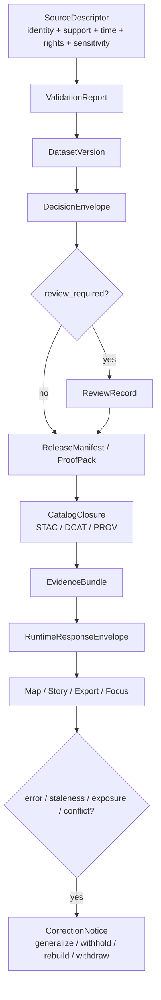

<!-- [KFM_META_BLOCK_V2]
doc_id: kfm://doc/<NEEDS_VERIFICATION_UUID>
title: FAIR+CARE Guide
type: standard
version: v1
status: draft
owners: @bartytime4life
created: 2026-03-05
updated: 2026-04-05
policy_label: <NEEDS_VERIFICATION_POLICY_LABEL>
related: [docs/standards/README.md, docs/standards/faircare/README.md, docs/standards/governance/ROOT_GOVERNANCE.md, docs/standards/sovereignty/INDIGENOUS-DATA-PROTECTION.md, policy/README.md, schemas/contracts/v1/README.md]
tags: [kfm, faircare]
notes: [doc_id and policy_label require verification; created date is inferred from public file history; updated date reflects the current-session draft and should be synchronized at merge]
[/KFM_META_BLOCK_V2] -->

# FAIR+CARE Guide

Normative guide for care-aware, rights-aware, trust-visible publication in Kansas Frontier Matrix.

<div align="center">
  
  
  
  
</div>

| Field | Value |
|---|---|
| Status | `draft` |
| Owners | `@bartytime4life` *(docs-lane fallback ownership; narrower steward roster needs verification)* |
| Path | `docs/standards/faircare/FAIRCARE-GUIDE.md` |
| Role | Cross-cutting standard for publication, redaction, stewardship, reuse, and trust-visible disclosure |
| Primary upstreams | [`../README.md`](../README.md), [`../governance/ROOT_GOVERNANCE.md`](../governance/ROOT_GOVERNANCE.md), [`../sovereignty/INDIGENOUS-DATA-PROTECTION.md`](../sovereignty/INDIGENOUS-DATA-PROTECTION.md) |
| Primary downstreams | [`../../../policy/README.md`](../../../policy/README.md), [`../../../schemas/contracts/v1/README.md`](../../../schemas/contracts/v1/README.md), [`../../../tests/README.md`](../../../tests/README.md), [`../../../.github/workflows/README.md`](../../../.github/workflows/README.md) |
| Public-main state | Replaces the current scaffold-only target file with a normative guide |

**Quick jumps**  
[Scope](#scope) · [Truth posture](#truth-posture-and-working-terms) · [Core rules](#core-faircare-rules) · [Artifacts](#artifact-responsibilities) · [Surfaces](#surface-obligations) · [Touchpoints](#current-public-main-touchpoints) · [Checklist](#faircare-change-checklist) · [Open verification](#open-verification-items)

> [!IMPORTANT]
> In KFM, FAIR-style discoverability is necessary but not sufficient. Care, sovereignty, privacy, exact-location risk, redistribution posture, and review state remain operational constraints.

> [!WARNING]
> This guide is normative, not evidentiary proof that every policy bundle, workflow, schema body, or runtime path is already fully implemented on current public `main`.

---

## Scope

**Status:** **CONFIRMED** doctrinal lane purpose and repo placement. **UNKNOWN** implementation depth beyond public-main docs, README surfaces, and placeholder contract files.

KFM treats FAIR+CARE as publication law, not as an ethics appendix. This guide defines how rights, sensitivity, precision, stewardship, review, runtime disclosure, and correction must shape outward publication.

### Repo fit

This file belongs in the `docs/standards/faircare/` lane because that lane is the normative home for:

- publication and redaction rules
- stewardship and reuse constraints
- cross-cutting FAIR+CARE expectations
- touchpoints spanning `SourceDescriptor`, `DecisionEnvelope`, `EvidenceBundle`, `RuntimeResponseEnvelope`, `ReleaseManifest / ProofPack`, `CorrectionNotice`, `Evidence Drawer`, and `Focus Mode`

### Accepted inputs

This file accepts:

- standards-level guidance that affects publication, redaction, stewardship, reuse, or evidence visibility
- cross-lane rules for rights, sensitivity, exact-location exposure, sovereignty, and review
- normative expectations for release, runtime, export, and correction behavior
- artifact responsibilities that must stay consistent across contracts, policy, and UI trust surfaces

### Exclusions

This file is **not** the home for:

- executable policy code or Rego bundles
- schema bodies or JSON Schema examples treated as authoritative contracts
- lane-specific runbooks for one data source or one pipeline
- implementation claims not yet reverified from the current repository or current session evidence
- broad ethics prose detached from concrete publication and runtime behavior

[Back to top](#faircare-guide)

---

## Truth posture and working terms

**Status:** **CONFIRMED** doctrinal labels and core vocabulary. **INFERRED** editorial packaging for this file.

### Truth labels used in this guide

| Label | Meaning here |
|---|---|
| **CONFIRMED** | Supported by attached KFM doctrine and/or current public-main repository evidence inspected in this session |
| **INFERRED** | Strongly implied by the source corpus or repo structure, but not directly proven in implementation |
| **PROPOSED** | Recommended standard behavior or starter structure not yet verified as implemented |
| **UNKNOWN** | Not verified in the current session |
| **NEEDS VERIFICATION** | Review item that should be checked before treating as settled repo fact |

### Working terms

| Term | Meaning in this guide |
|---|---|
| **Public-safe** | A release state that has passed rights, sensitivity, precision, and visibility checks for the relevant audience |
| **EvidenceBundle** | Request-time support package carrying released references, lineage hints, rights/sensitivity state, transforms, and preview policy |
| **DecisionEnvelope** | Machine-readable policy result carrying subject, action, lane, result, reasons, obligations, and audit linkage |
| **Surface state** | User-visible trust state such as promoted, generalized, partial, stale-visible, denied, abstained, or withdrawn |
| **Derived projection** | Rebuildable downstream surface such as graph, search, vector, tile, cache, scene, or summary layer |
| **Review-bearing lane** | A lane where rights, sensitivity, precision, or community/steward obligations require explicit steward or reviewer handling before outward use |

---

## What FAIR+CARE means in KFM

**Status:** **CONFIRMED** doctrine.

KFM does **not** treat FAIR and CARE as competing frameworks.

Instead:

- **FAIR** keeps resources findable, structured, linked, reusable, and inspectable.
- **CARE** determines whether reuse is allowed, under what precision, with what review burden, and on which surfaces.
- **KFM** resolves the two by requiring a **public-safe** release state before outward publication.

That means a resource can be:

- discoverable but still withheld
- well-described but still generalized
- admissible for steward review but not for public export
- usable for evidence resolution while still blocked from precise public display

---

## Core FAIR+CARE rules

**Status:** **CONFIRMED** doctrine unless explicitly marked otherwise.

### 1. Contract before trust

No source becomes trustworthy merely because it exists or can be fetched. Identity, support, time semantics, method, rights posture, and provenance must be declared before downstream trust.

### 2. Rights and sensitivity are required fields

Rights, redistribution posture, attribution, location-precision constraints, privacy/care obligations, and steward-review requirements are not optional metadata decoration. They belong in the intake and release path.

### 3. FAIR does not outrank care

A resource may be well cataloged and still inappropriate for exact public release. Discoverability does not override sovereignty, privacy, cultural sensitivity, community-held obligations, or exact-location risk.

### 4. Review-bearing material stays review-bearing

KFM does not flatten oral histories, archives, archaeology, biodiversity, community-contributed evidence, or sovereignty-bearing materials into frictionless public facts. These remain review-bearing lanes.

### 5. Runtime inherits publication law

`Focus Mode`, `Evidence Drawer`, `Story`, `Export`, and other outward trust surfaces must inherit the same rights, sensitivity, correction, and visibility rules as release-time publication.

### 6. Derived layers do not shed obligations

Graph projections, tiles, search indexes, caches, scenes, summaries, and embeddings remain derived by default. They do not become exempt from FAIR+CARE obligations simply because they are optimized for delivery.

### 7. Negative outcomes are valid outcomes

Generalize, withhold, abstain, deny, partial, source-dependent, conflicted, withdrawn, and stale-visible are valid and expected contract states. Fail-closed behavior is part of the standard.

### 8. Correction is part of care

If a post-release exposure, staleness, or rights issue appears, KFM preserves visible lineage through correction, narrowing, rollback, withdrawal, or replacement rather than silently mutating public meaning.

[Back to top](#faircare-guide)

---

## Starter reason and obligation codes

**Status:** **CONFIRMED** as starter doctrine-level code families. **UNKNOWN** current populated vocab contents on public `main`.

### Starter reason codes

| Code | Typical meaning | FAIR+CARE consequence |
|---|---|---|
| `rights.unknown` | Rights or redistribution posture is unresolved | Do not publish until resolved or reviewed |
| `sensitivity.exact_location` | Exact location is too sensitive for the requested audience | Generalize or withhold |
| `runtime.evidence_missing` | No reconstructible evidence path exists for the outward claim | Fail closed |
| `runtime.citation_failed` | Evidence was retrieved but visible claims failed citation verification | Do not emit confident prose |
| `validation.schema_failed` | Required schema or semantic validation failed | Stop promotion |
| `corroboration.conflicted` | Independent admissible sources disagree materially | Disclose conflict, escalate, or hold |
| `policy.denied` | Policy blocks the requested action or surface | Deny |
| `projection.stale` | Derived projection is older than its declared freshness basis | Rebuild or disclose stale state |

### Starter obligation codes

| Code | Typical consequence | Where it must remain visible |
|---|---|---|
| `generalize` | Serve only a generalized representation | Release records, EvidenceBundle, runtime surface |
| `withhold` | Do not publish or render on the requested surface | Review, release, and runtime outcomes |
| `review_required` | Escalate before outward use | DecisionEnvelope and reviewer workflow |
| `cite` | Attach inspectable evidence or fail closed | Focus, story, export, evidence surfaces |
| `disclose_partial` | Label incompleteness in place | Map, dossier, story, export, Focus |
| `disclose_modeled` | Label modeled / assimilated / forecast status in place | Any surface showing modeled output |
| `log_audit` | Emit audit linkage and decision trace | RuntimeResponseEnvelope and ops traces |
| `correction_notice` | Publish visible correction state | Affected public surfaces |
| `rebuild_projection` | Rebuild tiles/search/vector/scene outputs | Derived delivery and correction flow |

> [!NOTE]
> When `schemas/contracts/vocab/` becomes fully populated, this guide should align to the repo’s shipped vocab files rather than re-stating starter values in prose.

---

## Artifact responsibilities

**Status:** **CONFIRMED** contract families and minimum purposes. **INFERRED** FAIR+CARE emphasis per family.

| Contract family | Minimum FAIR+CARE job | What must stay explicit |
|---|---|---|
| **SourceDescriptor** | Declare the intake contract for a source or endpoint | Identity, support, cadence, rights posture, publication intent, steward review need |
| **IngestReceipt** | Prove a fetch and landing event occurred | Source reference, fetch time, integrity checks, result pointers |
| **ValidationReport** | Preserve passed, failed, and quarantined checks | Severity, reason codes, subject refs, quarantine triggers |
| **DatasetVersion** | Carry an authoritative candidate or promoted subject set | Stable ID, version ID, support, time semantics, provenance links |
| **CatalogClosure** | Publish outward metadata closure and lineage linkage | STAC / DCAT / PROV refs, identifiers, release linkage |
| **DecisionEnvelope** | Record the machine-readable policy result | Subject, action, lane, result, reasons, obligations, policy basis, audit ref |
| **ReviewRecord** | Capture human approval, denial, escalation, or note | Reviewer role, decision, timestamp, refs, comments |
| **ReleaseManifest / ProofPack** | Assemble public-safe release and proof | Version refs, catalog refs, decision refs, rollback/correction posture |
| **ProjectionBuildReceipt** | Prove a derived layer was built from known released scope | Release ref, projection type, surface class, freshness basis |
| **EvidenceBundle** | Package support for a claim, story, export preview, or answer | Released references, rights/sensitivity state, lineage summary, preview policy |
| **RuntimeResponseEnvelope** | Make runtime outcome accountable | Surface class, surface state, result, citation check, decision ref, audit ref |
| **CorrectionNotice** | Preserve visible lineage under change | Affected releases, replacement scope, rebuild refs, public note |

### Minimum FAIR+CARE field families that must not disappear

| Artifact | Field families that matter most here |
|---|---|
| **SourceDescriptor** | rights and sensitivity, access, semantics, validation, lineage |
| **DecisionEnvelope** | result, reason codes, obligation codes, policy basis, effective window |
| **EvidenceBundle** | scope echo, evidence members, rights/sensitivity state, lineage summary, negative-path trace |
| **RuntimeResponseEnvelope** | evaluated time, surface state, result, citation check, decision ref |
| **CorrectionNotice** | cause, affected surfaces, replacement refs, visible public note |

---

## Review-bearing triggers

**Status:** **CONFIRMED** doctrine for review-bearing classes and sensitivity handling. **INFERRED** packaging of the trigger list into one table.

| Trigger | Minimum FAIR+CARE response | Typical touchpoints |
|---|---|---|
| **Rights or redistribution unclear** | Hold, withhold, or route to review | SourceDescriptor, DecisionEnvelope |
| **Exact or inferable sensitive location** | Generalize or withhold | DecisionEnvelope, EvidenceBundle, runtime surfaces |
| **Oral history, public memory, heritage, archival narrative evidence** | Preserve context, reuse constraints, and reviewer handling | ReviewRecord, Story, Evidence Drawer |
| **Archaeology / heritage 2.5D or 3D context** | Keep evidence, policy, and correction model intact; do not treat 3D as a shortcut around sensitivity | ReviewRecord, ReleaseManifest, Controlled 3D |
| **Rare species / wildlife / biodiversity locations** | Apply geoprivacy, generalization, or withholding | DecisionEnvelope, EvidenceBundle, Export |
| **Indigenous or community-held knowledge** | Require publication class, steward review, and precision controls | ReviewRecord, DecisionEnvelope, CorrectionNotice |
| **Modeled / assimilated / forecast outputs** | Keep modeled status visible and avoid factual flattening | DatasetVersion, EvidenceBundle, RuntimeResponseEnvelope |
| **Post-release exposure, error, or staleness issue** | Publish visible correction state; rollback or withdraw if needed | CorrectionNotice, ReleaseManifest, ProjectionBuildReceipt |
| **Conflicted corroboration across independent sources** | Do not smooth disagreement into certainty | ValidationReport, DecisionEnvelope, runtime disclosure |

[Back to top](#faircare-guide)

---

## Surface obligations

**Status:** **CONFIRMED** trust-visible surface doctrine.

| Surface | FAIR+CARE must keep visible |
|---|---|
| **Map Explorer** | Time scope, layer state, freshness, and route to evidence |
| **Dossier** | Identity, dependencies, hazard/water/service context, gap notes, evidence links |
| **Story surface** | Evidence-linked excerpts, dates, perspective labels, review or correction state |
| **Evidence Drawer** | EvidenceBundle members, quote context, transforms, release state, preview limits |
| **Focus Mode** | Scoped retrieval, citation verification, audit reference, answer/abstain/deny/error outcome |
| **Review / Stewardship** | Diff, gate results, policy labels, review notes, receipts, no hidden approvals |
| **Compare** | Shared spatial/time anchor, explicit comparison basis, uncertainty cues |
| **Export** | Release scope, evidence linkage, preview policy, correction linkage |
| **Classroom / Civic variant** | Same truth rules, simplified but visible caveats |
| **Controlled 3D** | Same Evidence Drawer, same audit refs, same policy chips, same release/correction state |

> [!IMPORTANT]
> `Focus Mode` is not a CARE exception. A smooth answer without reconstructible evidence, policy state, and citation checks is a failure state, not a convenience feature.

---

## FAIR+CARE decision flow



---

## Current public-main touchpoints

**Status:** **CONFIRMED** public-main touchpoints. **UNKNOWN** code-level enforcement depth behind them.

| Surface | Current public-main signal | What this guide expects |
|---|---|---|
| [`README.md`](README.md) | Directory-level FAIR+CARE lane description and touchpoint list | Keep lane purpose and contract touchpoints synchronized |
| [`../README.md`](../README.md) | Standards index; FAIRCARE-GUIDE identified as present but scaffold-only | This file must now carry actual normative substance |
| [`../governance/ROOT_GOVERNANCE.md`](../governance/ROOT_GOVERNANCE.md) | Cross-domain governance law | FAIR+CARE stays aligned to trust membrane and release law |
| [`../sovereignty/INDIGENOUS-DATA-PROTECTION.md`](../sovereignty/INDIGENOUS-DATA-PROTECTION.md) | Sovereignty-specific protection standard | FAIR+CARE must defer to stricter sovereignty rules where applicable |
| [`../../../policy/README.md`](../../../policy/README.md) | Executable deny-by-default policy lane | This guide informs policy logic; it does not replace executable policy |
| [`../../../schemas/contracts/v1/README.md`](../../../schemas/contracts/v1/README.md) | Public schema-family inventory exists | Contract family semantics here should map cleanly to schema lanes |
| [`../../../tests/README.md`](../../../tests/README.md) | Verification lane exists | FAIR+CARE expectations should be gateable and testable |
| [`../../../.github/workflows/README.md`](../../../.github/workflows/README.md) | Workflow lane is README-only on public `main` | Do not claim implemented automation without direct proof |

### Contract-family file targets

These are the public-main contract touchpoints this guide should shape. Their current semantic depth still requires verification.

- [`../../../schemas/contracts/v1/source/source_descriptor.schema.json`](../../../schemas/contracts/v1/source/source_descriptor.schema.json)
- [`../../../schemas/contracts/v1/data/dataset_version.schema.json`](../../../schemas/contracts/v1/data/dataset_version.schema.json)
- [`../../../schemas/contracts/v1/policy/decision_envelope.schema.json`](../../../schemas/contracts/v1/policy/decision_envelope.schema.json)
- [`../../../schemas/contracts/v1/release/release_manifest.schema.json`](../../../schemas/contracts/v1/release/release_manifest.schema.json)
- [`../../../schemas/contracts/v1/evidence/evidence_bundle.schema.json`](../../../schemas/contracts/v1/evidence/evidence_bundle.schema.json)
- [`../../../schemas/contracts/v1/runtime/runtime_response_envelope.schema.json`](../../../schemas/contracts/v1/runtime/runtime_response_envelope.schema.json)
- [`../../../schemas/contracts/v1/correction/correction_notice.schema.json`](../../../schemas/contracts/v1/correction/correction_notice.schema.json)

### Vocab touchpoints

- [`../../../schemas/contracts/vocab/reason_codes.json`](../../../schemas/contracts/vocab/reason_codes.json)
- [`../../../schemas/contracts/vocab/obligation_codes.json`](../../../schemas/contracts/vocab/obligation_codes.json)
- [`../../../schemas/contracts/vocab/reviewer_roles.json`](../../../schemas/contracts/vocab/reviewer_roles.json)

[Back to top](#faircare-guide)

---

## FAIR+CARE change checklist

Use this before treating a FAIR+CARE-sensitive change as review-ready.

- [ ] The source or subject has explicit identity, support, time semantics, and method.
- [ ] Rights, redistribution posture, and attribution are explicit.
- [ ] Exact-location, privacy, sovereignty, and reuse constraints are explicit.
- [ ] The correct publication posture is chosen: public-safe, generalized, withheld, partial, source-dependent, conflicted, denied, abstained, or withdrawn.
- [ ] `DecisionEnvelope` semantics are explicit for the action being taken.
- [ ] A `ReviewRecord` exists when the lane is review-bearing.
- [ ] `EvidenceBundle` and `RuntimeResponseEnvelope` preserve rights/sensitivity state and audit linkage.
- [ ] Exports do not outrun release state, correction state, or publication scope.
- [ ] Derived projections inherit the same obligations as authoritative releases.
- [ ] A correction path exists if exposure, staleness, or conflict appears later.
- [ ] Docs, examples, and policy references stay synchronized.

---

## Open verification items

| Item | Why it remains open | Status |
|---|---|---|
| Exact `doc_id` UUID | No current-session source proves the final UUID | **NEEDS VERIFICATION** |
| Final `policy_label` taxonomy value | Public visibility does not itself prove the internal policy label | **NEEDS VERIFICATION** |
| Narrower steward roster beyond `@bartytime4life` | Public `CODEOWNERS` proves `/docs/` fallback only | **NEEDS VERIFICATION** |
| Exact machine field names for FAIR+CARE payloads | Public schema family files are present, but semantic maturity is not yet proven here | **NEEDS VERIFICATION** |
| Current public-main policy bundle coverage | `policy/` is visible, but executable lane depth is not proven from README-level evidence alone | **UNKNOWN** |
| Runtime steward drawer and generalized-vs-precise flows | Strong doctrine exists; current public implementation depth is not reverified | **UNKNOWN** |
| Workflow automation enforcing these rules | Public workflow lane is README-only on `main` | **UNKNOWN** |
| Merge-time metadata synchronization | `updated` and possibly related links may need adjustment at commit time | **NEEDS VERIFICATION** |

---

## Appendix

<details>
<summary><strong>Illustrative starter fragment — SourceDescriptor (rights/sensitivity emphasis)</strong></summary>

These field names are **illustrative only**. They show the semantic shape this guide expects and must not be mistaken for a confirmed shipped schema instance.

```yaml
source_id: example.source.family
title: Example source
provider: Example provider
access:
  mode: api
  cadence: periodic
semantics:
  support: event interval
  time_semantics: observed_at
  modeled_vs_observed: observed
rights_and_sensitivity:
  license_terms: needs-explicit-value
  redistribution_posture: review-before-publication
  attribution: required
  location_precision_constraints:
    - exact-location-risk
  care_obligations:
    - community-context-required
  steward_review_required: true
validation:
  schema_checks:
    - required-fields
    - unit-checks
lineage:
  emitted_proof_artifacts:
    - IngestReceipt
    - ValidationReport
```

</details>

<details>
<summary><strong>Illustrative starter fragment — DecisionEnvelope (generalize / withhold path)</strong></summary>

This example is also **illustrative only**.

```json
{
  "subject": "example.subject",
  "action": "publish",
  "lane": "biodiversity",
  "result": "generalized",
  "reason_codes": [
    "sensitivity.exact_location"
  ],
  "obligation_codes": [
    "generalize",
    "log_audit",
    "review_required"
  ],
  "policy_basis": [
    "FAIRCARE-GUIDE",
    "INDIGENOUS-DATA-PROTECTION"
  ],
  "audit_ref": "audit://needs-verification"
}
```

</details>

<details>
<summary><strong>Interpretation note</strong></summary>

When this guide and a lane-specific standard appear to pull in different directions, prefer the stricter publication posture until the conflict is explicitly resolved through governance or review. KFM loses trust faster by over-disclosing than by withholding briefly and documenting why.

</details>

[Back to top](#faircare-guide)
