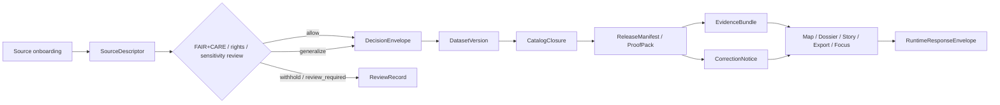

<!-- [KFM_META_BLOCK_V2]
doc_id: kfm://doc/<uuid>
title: FAIR+CARE Standards
type: standard
version: v1
status: review
owners: <NEEDS VERIFICATION>
created: YYYY-MM-DD
updated: YYYY-MM-DD
policy_label: <NEEDS VERIFICATION>
related: [./FAIRCARE-GUIDE.md, ../governance/ROOT-GOVERNANCE.md, ../sovereignty/INDIGENOUS-DATA-PROTECTION.md]
tags: [kfm, faircare, standards, governance]
notes: [owners/dates/policy label require repo verification; related paths are inferred from project document references because the mounted repo tree was not directly visible in this session]
[/KFM_META_BLOCK_V2] -->

# FAIR+CARE Standards

Landing page for KFM FAIR+CARE doctrine, review triggers, and adjacent standards that govern publication, redaction, stewardship, and reuse.

> **Status:** active *(NEEDS VERIFICATION against mounted repo state)*  
> **Owners:** `<NEEDS VERIFICATION>`  
>      
> **Quick jump:** [Scope](#scope) · [Repo fit](#repo-fit) · [Inputs](#inputs) · [Exclusions](#exclusions) · [Directory tree](#directory-tree) · [Quickstart](#quickstart) · [Usage](#usage) · [Diagram](#diagram) · [Reference tables](#reference-tables) · [Task list](#task-list) · [FAQ](#faq) · [Appendix](#appendix)

> [!IMPORTANT]
> This README is doctrine-grounded, but the live repository tree was **not** directly mounted in this session. Exact owners, dates, adjacent file inventory, workflow names, and local exceptions remain **UNKNOWN** until the repo is inspected.

> [!CAUTION]
> FAIR+CARE examples in this directory should not expose precise coordinates, “how to locate” instructions, signed URLs, or secrets. Where redaction is required, publish generalized or aggregated scope instead.

---

## Scope

This directory should anchor the **FAIR+CARE standards lane** for Kansas Frontier Matrix.

At KFM scale, FAIR-style discoverability and reuse are necessary but not sufficient. The project’s governing manuals repeatedly treat care, sovereignty, privacy, exact-location risk, rights posture, and review state as operational constraints that must remain visible at publication time, export time, and runtime—not as afterthoughts hidden in a policy appendix.

This README exists to do three jobs:

1. orient contributors to what belongs in `docs/standards/faircare/`;
2. point to the more detailed normative material that should carry the actual rule text; and
3. keep FAIR+CARE consequences connected to the artifacts and trust surfaces that KFM already treats as load-bearing.

[Back to top](#faircare-standards)

## Repo fit

| Item | Value |
|---|---|
| Path | `docs/standards/faircare/README.md` |
| Role | Directory README / standards landing page |
| Upstream links | [`../governance/ROOT-GOVERNANCE.md`](../governance/ROOT-GOVERNANCE.md) *(INFERRED path; verify in mounted repo)* · [`../sovereignty/INDIGENOUS-DATA-PROTECTION.md`](../sovereignty/INDIGENOUS-DATA-PROTECTION.md) *(INFERRED path; verify in mounted repo)* |
| Primary downstream link | [`./FAIRCARE-GUIDE.md`](./FAIRCARE-GUIDE.md) *(INFERRED path; verify in mounted repo)* |
| Cross-cutting consumers | source onboarding, policy decision grammar, release packaging, EvidenceBundle construction, outward runtime surfaces, export/publication review, domain-specific release rules |
| Current confidence | directory role is **INFERRED** from project doctrine and cross-document references; exact neighboring file inventory is **UNKNOWN** |

## Inputs

Accepted inputs for this directory include:

- normative FAIR+CARE rules that affect **admission, review, publication, export, correction, or reuse**;
- review triggers for **rights posture, stewardship obligations, Indigenous/community sensitivity, exact-location risk, and redistributability**;
- documentation that explains how FAIR+CARE constraints should appear in **SourceDescriptor**, **DecisionEnvelope**, **EvidenceBundle**, **ReleaseManifest / ProofPack**, **RuntimeResponseEnvelope**, or **CorrectionNotice** behavior;
- generalized or masked examples that clarify publication-safe practice;
- standards-facing guidance that changes contributor behavior across more than one domain lane.

## Exclusions

The following do **not** belong here, and should live elsewhere instead:

- **raw datasets, candidate data, or release artifacts** — keep them in the governed truth path, not in standards prose;
- **domain-specific methods writeups** that do not create project-wide FAIR+CARE rules — keep them in the relevant domain lane;
- **runtime code, policy bundles, or CI implementations** — keep them in `policy/`, runtime, or workflow surfaces unless the repo explicitly declares this directory authoritative;
- **UI copy** that explains one page but does not define a standard — keep it with the relevant surface;
- **precise location disclosures, signed URLs, secrets, or “how to locate” instructions** — do not place them in standards examples at all.

## Directory tree

```text
docs/
└── standards/
    └── faircare/
        ├── README.md                  # CONFIRMED target file
        └── FAIRCARE-GUIDE.md          # INFERRED from project document references
```

> [!NOTE]
> The current mounted workspace did not expose the live repo tree. The tree above shows the requested README plus the strongest adjacent-file inference available from project documents. Verify it before merge.

## Quickstart

1. Read this README first to decide whether the change is **directory-orientation**, **normative FAIR+CARE rule text**, or **something that belongs in another standards lane**.
2. Put durable rule text, escalation criteria, and worked examples in `FAIRCARE-GUIDE.md` **if that guide is present in the mounted repo**.
3. Thread any rule change into adjacent standards and artifacts:
   - governance;
   - sovereignty / Indigenous data protection;
   - source onboarding;
   - policy decision grammar;
   - release/export behavior;
   - runtime surface states.
4. Before merge, verify the repo-specific unknowns called out in this file: owners, adjacent paths, workflow references, and whether this directory is documentation-only or is consumed by machine checks.

Illustrative audit commands:

```bash
# Verify FAIR+CARE references across docs, contracts, policy, and tests
git grep -n "FAIRCARE\|care:\|care_gate_status\|sovereignty_gate"

# Verify inferred adjacent links and workflow names before committing
git grep -n "FAIRCARE-GUIDE.md\|ROOT-GOVERNANCE.md\|INDIGENOUS-DATA-PROTECTION.md\|faircare-audit.yml"
```

## Usage

### When to update this directory

Update this directory when a change affects any of the following:

1. **what may be published** and at what precision;
2. **who must review** before outward use;
3. **how redaction or generalization is expressed** in artifacts and UI surfaces;
4. **what obligations attach** to a release, export, or runtime answer;
5. **how FAIR+CARE language maps onto trust-visible states** such as generalized, withheld, partial, stale-visible, denied, or corrected.

### What every FAIR+CARE rule here should answer

A good rule in this lane should make six things explicit:

| Question | Why it matters in KFM |
|---|---|
| What object is being governed? | KFM treats claims, releases, exports, and runtime outcomes as typed trust objects. |
| What is the allowed publication scope? | Exact vs generalized vs withheld scope changes public meaning. |
| What review or stewardship step is required? | KFM favors explicit review state over silent allowance. |
| Which artifact records the decision? | Policy that cannot be attached to a contract or proof object drifts fast. |
| What user-visible label should appear? | Trust-visible surfaces are part of the doctrine, not polish. |
| What happens if status is unclear? | KFM’s default posture is fail-closed, not best-effort exposure. |

> [!IMPORTANT]
> If a FAIR+CARE rule cannot say where its decision is recorded, how it becomes visible, and what happens when status is unclear, it is probably still too abstract for KFM.

## Diagram



## Reference tables

### Minimum FAIR+CARE consequences in KFM

| Concern | Minimum rule this lane should keep visible | Typical visible consequence |
|---|---|---|
| Discoverability and reuse | FAIR-style discoverability is valuable, but not sufficient on its own where care, sovereignty, privacy, or exact-location risk are present. | Metadata may remain rich while actual public detail is narrowed. |
| Rights and redistribution | Publication is not admitted merely because data exists; rights posture and redistribution conditions must be explicit. | Source onboarding, release, and export rules change. |
| Exact-location risk | Precision is a policy decision, not a default. | Generalized, masked, aggregated, or withheld location output. |
| Indigenous / community stewardship | Review can be required even when technical validation passes. | Review state, steward routing, or blocked publication. |
| Governance ambiguity | Unclear status does not justify outward release. | Fail closed; escalate; keep decision visible. |
| Partial / modeled / disputed material | These states must be labeled in-place rather than implied away. | Runtime and export surfaces show explicit caveats. |

### Artifact touchpoints

| KFM artifact / surface | FAIR+CARE consequence that should be explicit here | Status |
|---|---|---|
| `SourceDescriptor` | rights posture, steward/contact, publication intent, validation and quarantine triggers, location-precision constraints | **CONFIRMED artifact family** |
| `DecisionEnvelope` | allow / generalize / withhold / review-required outcomes, reason codes, obligation codes, effective window | **CONFIRMED artifact family** |
| `EvidenceBundle` | public-safe vs generalized vs withheld state, evidence membership, lineage summary, rights/sensitivity posture | **CONFIRMED artifact family** |
| `RuntimeResponseEnvelope` | answer / abstain / deny / error outcome, citation check, surface state, audit reference | **CONFIRMED artifact family** |
| `ReleaseManifest / ProofPack` | publication posture, rollback/correction consequences, docs/accessibility gate linkage | **CONFIRMED artifact family** |
| `CorrectionNotice` | affected releases, replacement path, public note, rebuild implications | **CONFIRMED artifact family** |
| `Evidence Drawer` | point-of-use explanation of why a claim is visible, generalized, partial, or blocked | **CONFIRMED trust surface** |
| `Focus Mode` | bounded synthesis only; no uncited or policy-unchecked answers | **CONFIRMED trust surface** |

### Placement rules

| Material | Belongs here? | Better home when not |
|---|---|---|
| FAIR+CARE doctrine with project-wide force | Yes | — |
| One-off domain sensitivity judgment | Usually no | domain lane, review record, or release notes |
| CI implementation details | Not by default | workflow / policy / runtime surfaces |
| Example showing masked or generalized release behavior | Yes, if policy-significant and safe | — |
| Raw data samples or release artifacts | No | governed data or release paths |
| UI-only wording changes without standards effect | No | surface docs |

[Back to top](#faircare-standards)

## Task list

- [ ] Fill `doc_id`, owners, dates, and `policy_label` from mounted repo truth.
- [ ] Verify whether `FAIRCARE-GUIDE.md` is the authoritative normative guide for this directory.
- [ ] Verify cross-links to governance and sovereignty standards.
- [ ] Confirm whether a FAIR+CARE audit workflow exists and whether `faircare-audit.yml` is its authoritative name.
- [ ] Confirm which contract families currently surface care labels, generalization state, review requirements, and public-safe obligations.
- [ ] Add at least one reviewed example showing generalized vs withheld publication behavior.
- [ ] Confirm whether this README is new, replacement-grade, or a revision of an existing file.

**Definition of done:** this directory is easy to place in the repo, its authoritative guide is clear, adjacent standards are linked, FAIR+CARE review triggers are explicit, and all repo-specific placeholders are either verified or intentionally left visible.

## FAQ

### Is FAIR enough on its own for KFM?

No. KFM doctrine treats discoverability and reuse as important, but not sufficient wherever care, sovereignty, privacy, exact-location risk, or cultural sensitivity burdens are present.

### Should this README own executable policy bundles?

Not by default. This README should explain the standards lane. Executable policy lives elsewhere unless the mounted repo explicitly makes this directory authoritative.

### Can examples in this directory include precise coordinates?

They should not, unless the example is unquestionably public-safe and that precision is itself the point of the standard. The safer default is generalized or aggregated scope.

### What happens when governance status is unclear?

Fail closed, escalate to review, and keep that state visible instead of silently publishing a best-effort answer or export.

[Back to top](#faircare-standards)

## Appendix

<details>
<summary>Evidence posture, verification notes, and continuity cues</summary>

### What is directly grounded

The following are treated as **CONFIRMED doctrine** from the attached KFM manuals:

- KFM is governed by a truth path and trust membrane rather than by convenience layers.
- Evidence, policy, release state, and correction state remain operational at the point of use.
- FAIR-style discoverability matters, but it is not enough where care, sovereignty, privacy, exact-location risk, or cultural sensitivity burdens are present.
- Trust-visible surfaces such as the map shell, Evidence Drawer, export surfaces, and Focus Mode must expose meaningful state rather than bluff.

### What is inferred here

The following are **INFERRED continuity cues**, not mounted repo facts:

| Item | Status | Why it appears here |
|---|---|---|
| `./FAIRCARE-GUIDE.md` | INFERRED | referenced by project documentation examples as the likely detailed guide |
| `../governance/ROOT-GOVERNANCE.md` | INFERRED | referenced by project documentation examples as adjacent governance doctrine |
| `../sovereignty/INDIGENOUS-DATA-PROTECTION.md` | INFERRED | referenced by project documentation examples as adjacent sovereignty standard |
| `faircare-audit.yml` | INFERRED | named in continuity examples as a likely workflow surface, but not directly verified in the mounted repo |

### What still needs direct repo verification

- whether `docs/standards/faircare/README.md` already exists, and if so what strong material it contains;
- actual owners, dates, and label values for the KFM meta block;
- live file inventory under `docs/standards/faircare/`;
- whether FAIR+CARE is documentation-only in-repo or is tied to machine-enforced checks;
- exact relative links for adjacent standards files.

[Back to top](#faircare-standards)

</details>
