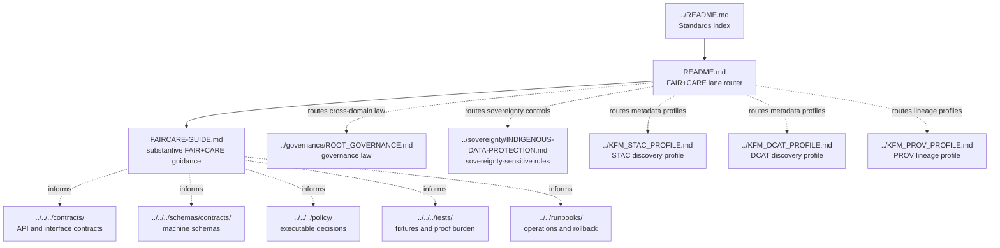

<!-- [KFM_META_BLOCK_V2]
doc_id: kfm://doc/REVIEW_REQUIRED_UUID
title: FAIR+CARE
type: standard
version: v1
status: draft
owners: @bartytime4life
created: REVIEW_REQUIRED_DATE
updated: REVIEW_REQUIRED_DATE
policy_label: public
related: [../README.md, ./FAIRCARE-GUIDE.md, ../governance/README.md, ../governance/ROOT_GOVERNANCE.md, ../sovereignty/README.md, ../sovereignty/INDIGENOUS-DATA-PROTECTION.md, ../KFM_STAC_PROFILE.md, ../KFM_DCAT_PROFILE.md, ../KFM_PROV_PROFILE.md, ../KFM_MARKDOWN_WORK_PROTOCOL.md, ../../runbooks/README.md, ../../../contracts/README.md, ../../../schemas/README.md, ../../../schemas/contracts/README.md, ../../../schemas/contracts/v1/README.md, ../../../policy/README.md, ../../../tests/README.md, ../../../.github/workflows/README.md]
tags: [kfm, standards, fair, care, stewardship, rights, sensitivity, reuse]
notes: [UUID and commit-level dates need verification; owner is inherited from the current public-main /docs/ CODEOWNERS signal and should be rechecked before merge; this README is the FAIR+CARE lane routing surface, while FAIRCARE-GUIDE.md owns substantive FAIR+CARE norm text.]
[/KFM_META_BLOCK_V2] -->

<a id="top"></a>

# FAIR+CARE

_Routing surface for KFM FAIR+CARE metadata, rights, sensitivity, stewardship, redaction, and reuse standards._

**Status:** `experimental`  
**Doc status:** `draft`  
**Owners:** `@bartytime4life` *(inherited `/docs/` ownership signal; narrower lane ownership still **NEEDS VERIFICATION**)*  
**Path:** `docs/standards/faircare/README.md`


**Quick jumps:** [Scope](#scope) · [Repo fit](#repo-fit) · [Accepted inputs](#accepted-inputs) · [Exclusions](#exclusions) · [Directory tree](#directory-tree) · [Quickstart](#quickstart) · [FAIR+CARE map](#faircare-map) · [Routing matrix](#routing-matrix) · [Validation](#validation) · [Definition of done](#definition-of-done) · [FAQ](#faq) · [Appendix](#appendix)

> [!IMPORTANT]
> This README is a **lane index and scope boundary**. It should help maintainers route FAIR+CARE-related changes to the right file. It should not duplicate the substantive rules owned by [`FAIRCARE-GUIDE.md`](./FAIRCARE-GUIDE.md), executable policy bundles, schemas, contracts, tests, runbooks, or release artifacts.

> [!NOTE]
> **Truth boundary:** current evidence supports the existence of a public-main FAIR+CARE lane with both `README.md` and `FAIRCARE-GUIDE.md`. Mounted-checkout parity, branch-local file contents, CODEOWNERS precision, and CI enforcement remain **NEEDS VERIFICATION** before merge.

---

## Scope

`docs/standards/faircare/` is the standards sub-lane for **FAIR+CARE routing, review triggers, stewardship expectations, and reuse-governance boundaries** across KFM.

In KFM terms, this lane answers:

- **What belongs under FAIR+CARE standards?**
- **Which file owns the rule?**
- **When must a data, map, AI, catalog, or publication change trigger FAIR+CARE review?**
- **When should a contributor route work to sovereignty, governance, policy, schemas, tests, or runbooks instead?**

This README is intentionally narrow. It keeps the lane navigable while preserving the stronger rule: **substantive FAIR+CARE norm text belongs in [`FAIRCARE-GUIDE.md`](./FAIRCARE-GUIDE.md).**

[Back to top](#top)

---

## Repo fit

| Item | Value |
|---|---|
| Path | [`docs/standards/faircare/README.md`](./README.md) |
| Path status | **CONFIRMED** as a public-main standards lane entry in the standards index; active branch parity **NEEDS VERIFICATION** |
| Role | Lane-local README, routing surface, scope boundary, exclusions map |
| Parent index | [`../README.md`](../README.md) |
| Docs root | [`../../README.md`](../../README.md) |
| Primary downstream standard | [`./FAIRCARE-GUIDE.md`](./FAIRCARE-GUIDE.md) |
| Closest governance peer | [`../governance/README.md`](../governance/README.md) · [`../governance/ROOT_GOVERNANCE.md`](../governance/ROOT_GOVERNANCE.md) |
| Closest sovereignty peer | [`../sovereignty/README.md`](../sovereignty/README.md) · [`../sovereignty/INDIGENOUS-DATA-PROTECTION.md`](../sovereignty/INDIGENOUS-DATA-PROTECTION.md) |
| Metadata/profile peers | [`../KFM_STAC_PROFILE.md`](../KFM_STAC_PROFILE.md) · [`../KFM_DCAT_PROFILE.md`](../KFM_DCAT_PROFILE.md) · [`../KFM_PROV_PROFILE.md`](../KFM_PROV_PROFILE.md) |
| Markdown protocol peer | [`../KFM_MARKDOWN_WORK_PROTOCOL.md`](../KFM_MARKDOWN_WORK_PROTOCOL.md) |
| Machine-facing neighbors | [`../../../contracts/README.md`](../../../contracts/README.md) · [`../../../schemas/README.md`](../../../schemas/README.md) · [`../../../schemas/contracts/README.md`](../../../schemas/contracts/README.md) · [`../../../schemas/contracts/v1/README.md`](../../../schemas/contracts/v1/README.md) |
| Enforcement / proof neighbors | [`../../../policy/README.md`](../../../policy/README.md) · [`../../../tests/README.md`](../../../tests/README.md) · [`../../../.github/workflows/README.md`](../../../.github/workflows/README.md) |
| Operational neighbor | [`../../runbooks/README.md`](../../runbooks/README.md) |

[Back to top](#top)

---

## Accepted inputs

Use this README for **routing-level** updates, not for every FAIR+CARE rule.

| Accepted here | Why it belongs here |
|---|---|
| Lane scope updates | Keeps `docs/standards/faircare/` navigable and reviewable |
| Links to newly added FAIR+CARE standards or companion notes | Keeps the lane index current without duplicating downstream rule text |
| Clarifications about what belongs in `FAIRCARE-GUIDE.md` | Prevents the README from becoming a second rulebook |
| Review-trigger summaries | Helps maintainers know when FAIR+CARE review is required |
| Routing decisions between FAIR+CARE, sovereignty, governance, policy, schemas, tests, and runbooks | Prevents authority collisions |
| README metadata, owner, and status updates | Keeps the file aligned with KFM documentation control expectations |
| Open verification items about the FAIR+CARE lane | Makes uncertainty visible instead of hiding it in prose |

[Back to top](#top)

---

## Exclusions

This README should not become a catch-all for all ethics, access, metadata, sovereignty, or publication logic.

| Does **not** belong in this README | Put it here instead |
|---|---|
| Substantive FAIR+CARE rules for publication, redaction, stewardship, obligations, and reuse | [`./FAIRCARE-GUIDE.md`](./FAIRCARE-GUIDE.md) |
| Cross-domain governance law, release-state transitions, review authority, or correction doctrine | [`../governance/ROOT_GOVERNANCE.md`](../governance/ROOT_GOVERNANCE.md) |
| Sovereignty-specific rules, Indigenous/community-sensitive publication controls, or protected-knowledge handling | [`../sovereignty/INDIGENOUS-DATA-PROTECTION.md`](../sovereignty/INDIGENOUS-DATA-PROTECTION.md) |
| STAC field-level metadata profile rules | [`../KFM_STAC_PROFILE.md`](../KFM_STAC_PROFILE.md) |
| DCAT dataset/distribution mapping rules | [`../KFM_DCAT_PROFILE.md`](../KFM_DCAT_PROFILE.md) |
| PROV entity/activity/agent lineage rules | [`../KFM_PROV_PROFILE.md`](../KFM_PROV_PROFILE.md) |
| JSON Schema, OpenAPI, DTO, or other machine-contract definitions | [`../../../contracts/`](../../../contracts/) and [`../../../schemas/contracts/`](../../../schemas/contracts/) |
| Rego, policy-as-code, deny/allow decisions, executable gates, or policy test fixtures | [`../../../policy/`](../../../policy/) and [`../../../tests/`](../../../tests/) |
| Runbooks for publication, rollback, correction, or incident handling | [`../../runbooks/README.md`](../../runbooks/README.md) and the owning runbook |
| Domain ingest instructions or source-specific ETL recipes | The owning domain docs, source registry, pipeline docs, or runbook |
| Exploratory idea packets or research notes | Research, planning, or idea-intake surfaces until promoted |

> [!TIP]
> If the change is mainly **“what must be true across multiple domains?”**, it may belong in standards. If it is mainly **“how does a machine decide?”**, route it to policy, schemas, contracts, or tests.

[Back to top](#top)

---

## Directory tree

The expected lane shape is intentionally small:

```text
docs/standards/faircare/
├── README.md
└── FAIRCARE-GUIDE.md
```

> [!CAUTION]
> This tree reflects the public-main standards snapshot used for this revision. Re-open the target branch before merge and update this README if additional FAIR+CARE files now exist.

[Back to top](#top)

---

## Quickstart

### 1) Decide whether the change is routing or rule text

| Question | If yes |
|---|---|
| “Are we changing what this lane is for?” | Update this README |
| “Are we changing FAIR+CARE requirements themselves?” | Update [`FAIRCARE-GUIDE.md`](./FAIRCARE-GUIDE.md) |
| “Are we adding a policy gate or deny reason?” | Update [`../../../policy/`](../../../policy/) and tests |
| “Are we adding fields or schema validation?” | Update [`../../../schemas/contracts/`](../../../schemas/contracts/) or the active schema authority |
| “Are we changing how a release is promoted, corrected, or withdrawn?” | Update the owning runbook and governance standard |
| “Are we handling Indigenous/community-sensitive data?” | Check [`../sovereignty/INDIGENOUS-DATA-PROTECTION.md`](../sovereignty/INDIGENOUS-DATA-PROTECTION.md) before changing FAIR+CARE prose |

### 2) Apply the KFM shorthand

> [!IMPORTANT]
> **Findable does not mean exposed.**  
> FAIR discovery can coexist with restricted access, redacted geometry, staged release, consent obligations, and abstention when support is insufficient.

### 3) Preserve the trust path

A FAIR+CARE-sensitive public output should not bypass the KFM truth path:

```text
RAW → WORK / QUARANTINE → PROCESSED → CATALOG / TRIPLET → PUBLISHED
```

Public clients should consume governed APIs, released artifacts, EvidenceBundle-backed responses, and trust-visible UI surfaces — not RAW, WORK, QUARANTINE, unpublished candidates, or direct model output.

[Back to top](#top)

---

## FAIR+CARE map

This compact map is for orientation only. The downstream guide owns the full normative treatment.

| Principle | KFM interpretation | Typical evidence or control |
|---|---|---|
| **Findable** | Resources can be discovered through identifiers, metadata, indexes, and catalog surfaces without exposing restricted substance | STAC/DCAT records, stable IDs, source descriptors, catalog entries |
| **Accessible** | Access conditions are explicit; access can be public, authenticated, restricted, staged, or denied | policy label, access notes, obligations, review state, authorization path |
| **Interoperable** | Metadata and outputs use shared vocabularies, profiles, schemas, and qualified links | STAC/DCAT/PROV profiles, schema references, ontology mappings |
| **Reusable** | Reuse is bounded by provenance, license, source role, quality, sensitivity, obligations, and correction lineage | license, attribution, EvidenceBundle, validation report, release manifest |
| **Collective Benefit** | Use and publication should support affected communities or steward-defined benefit, not extraction alone | benefit notes, steward review, public-interest rationale |
| **Authority to Control** | Communities, rights-holders, stewards, or governing bodies can define access, representation, reuse, and withdrawal conditions | consent record, data steward, obligations, policy gate |
| **Responsibility** | KFM must document custody, limitations, review duties, correction paths, and accountability for use | review receipt, correction record, run receipt, owner/steward contact |
| **Ethics** | Publication should minimize harm, respect sovereignty and privacy, and avoid misleading or unsafe representation | redaction/generalization receipt, sensitivity label, denial/abstention reason |

[Back to top](#top)

---

## Diagram



[Back to top](#top)

---

## Routing matrix

| Change or question | Owning surface | Review note |
|---|---|---|
| Update FAIR+CARE lane scope, links, or exclusions | This README | Keep it concise; do not add full rule text |
| Add or revise FAIR+CARE publication/redaction/stewardship/reuse requirements | [`FAIRCARE-GUIDE.md`](./FAIRCARE-GUIDE.md) | Check governance and sovereignty peers before merge |
| Add consent, obligations, or authority-to-control fields to a schema | Active schema authority under [`../../../schemas/`](../../../schemas/) | Link back to the guide; do not define schema shape only in prose |
| Add a fail-closed access or publication decision | [`../../../policy/`](../../../policy/) plus tests | README can route, but executable policy must live in policy |
| Add sensitive-location, Indigenous data, cultural knowledge, or protected-community handling rules | [`../sovereignty/INDIGENOUS-DATA-PROTECTION.md`](../sovereignty/INDIGENOUS-DATA-PROTECTION.md) and relevant policy/tests | FAIR+CARE review may still apply, but sovereignty controls are not optional |
| Add STAC/DCAT/PROV profile fields | STAC/DCAT/PROV profile files | FAIR+CARE can inform obligations, not duplicate profile definitions |
| Document a release, rollback, withdrawal, or correction procedure | [`../../runbooks/README.md`](../../runbooks/README.md) and owning runbook | Link FAIR+CARE review triggers in the runbook |
| Document a domain-specific source or ingest rule | Owning domain/pipeline/source-registry surface | Add FAIR+CARE labels and review triggers, but keep domain mechanics local |
| Add examples involving sensitive people, places, species, sites, or communities | Usually avoid; otherwise route for FAIR+CARE and sovereignty review | Use generalized or synthetic examples unless release basis is explicit |

[Back to top](#top)

---

## Validation

This README does not prove that CI enforcement exists on the target branch. Treat the checks below as merge expectations until branch-local workflows are directly inspected.

| Check | Expected result |
|---|---|
| Metadata block | KFM Meta Block V2 present, title synchronized with H1, placeholders reviewed |
| Heading structure | One H1; sections remain scannable and stable |
| Link check | Relative links resolve from `docs/standards/faircare/` |
| Authority check | This README routes; [`FAIRCARE-GUIDE.md`](./FAIRCARE-GUIDE.md) carries substantive norm text |
| Drift check | Parent [`../README.md`](../README.md) still describes this lane accurately |
| Sensitivity check | Examples do not expose restricted locations, living-person data, sensitive cultural knowledge, or steward-controlled content |
| Policy touchpoint check | Any change that affects release/access decisions references policy/tests rather than prose alone |
| Workflow check | Actual docs, standards, or FAIR+CARE validation workflow names are verified before claiming enforcement |

[Back to top](#top)

---

## Definition of done

A change to this lane is ready to merge when:

- [ ] The change lands in the owning surface: this README for routing, [`FAIRCARE-GUIDE.md`](./FAIRCARE-GUIDE.md) for substantive FAIR+CARE guidance, or the relevant downstream surface for machine/operational work.
- [ ] The KFM Meta Block V2 is present and unresolved placeholders are intentional.
- [ ] Owner, status, policy label, created date, and updated date are verified or explicitly marked for review.
- [ ] Relative links resolve from `docs/standards/faircare/`.
- [ ] The parent [`../README.md`](../README.md) still describes the FAIR+CARE lane accurately.
- [ ] The change does not silently duplicate governance, sovereignty, STAC, DCAT, PROV, schema, policy, test, or runbook authority.
- [ ] Sensitive or public-output-affecting changes include review triggers.
- [ ] Machine-facing requirements are represented in schemas/contracts/policy/tests where applicable.
- [ ] Examples are synthetic, generalized, or release-backed.
- [ ] Remaining **UNKNOWN** or **NEEDS VERIFICATION** items are visible.

[Back to top](#top)

---

## FAQ

### Does FAIR mean “open to everyone”?

No. In KFM, FAIR discovery and metadata can coexist with restricted access, authentication, redaction, delayed release, steward review, or denial. “Accessible” means the access conditions are knowable and governed; it does not mean unrestricted public exposure.

### Should this README repeat the FAIR+CARE guide?

No. This README should define scope, routing, exclusions, and review boundaries. [`FAIRCARE-GUIDE.md`](./FAIRCARE-GUIDE.md) should carry the substantive FAIR+CARE norm text.

### When does sovereignty outrank this lane?

When a change concerns Indigenous data, protected community knowledge, culturally sensitive places, steward-controlled records, or sovereignty-sensitive publication. In those cases, consult [`../sovereignty/INDIGENOUS-DATA-PROTECTION.md`](../sovereignty/INDIGENOUS-DATA-PROTECTION.md) and route policy/test work accordingly.

### Can policy decisions live in FAIR+CARE Markdown?

No. Markdown can explain the rule and route reviewers. Executable decisions, deny reasons, fixtures, and fail-closed behavior belong in policy and tests.

### What is the safest default when rights or sensitivity are unclear?

Use quarantine, redaction, generalization, staged access, delayed publication, or abstention until evidence, rights, steward review, and release state are strong enough.

[Back to top](#top)

---

## Appendix

<details>
<summary><strong>Known verification items</strong></summary>

### Repo-state items

- [ ] Replace `REVIEW_REQUIRED_UUID` with a real `kfm://doc/<uuid>` value.
- [ ] Replace `REVIEW_REQUIRED_DATE` values at commit time.
- [ ] Re-check whether `@bartytime4life` remains the correct owner for this lane or only a `/docs/` fallback.
- [ ] Verify the active target branch still contains `FAIRCARE-GUIDE.md`.
- [ ] Verify whether any additional files now exist under `docs/standards/faircare/`.
- [ ] Verify whether `.github/workflows/` has standards or FAIR+CARE validation workflow YAML, not only README documentation.
- [ ] Verify whether the active schema authority is `contracts/`, `schemas/contracts/`, or another documented path.
- [ ] Re-run link checks after any file move or rename.

### External principle anchors

Use these as conceptual anchors when revising the downstream guide, not as a substitute for KFM policy, schemas, or steward review:

- [GO FAIR — FAIR Principles](https://www.go-fair.org/fair-principles/)
- [Global Indigenous Data Alliance — CARE Principles](https://www.gida-global.org/care)
- [Data Science Journal — The CARE Principles for Indigenous Data Governance](https://datascience.codata.org/articles/dsj-2020-043)

### Authoring notes for maintainers

- Keep this README short enough to remain a lane router.
- Update the parent standards index when this lane’s role, file list, owner, or maturity changes.
- Do not call `FAIRCARE-GUIDE.md` scaffold-only if it remains substantive on the target branch.
- Do not use FAIR+CARE language to bypass sovereignty, policy, release, or review gates.
- Prefer explicit `CONFIRMED`, `PROPOSED`, `UNKNOWN`, and `NEEDS VERIFICATION` labels when repo state or enforcement maturity matters.

</details>

[Back to top](#top)