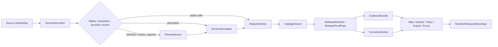

<!-- [KFM_META_BLOCK_V2]
doc_id: kfm://doc/<uuid>
title: FAIR+CARE Standards
type: standard
version: v1
status: review
owners: <NEEDS VERIFICATION>
created: YYYY-MM-DD
updated: YYYY-MM-DD
policy_label: <NEEDS VERIFICATION>
related: [./FAIRCARE-GUIDE.md, ../governance/ROOT-GOVERNANCE.md, ../sovereignty/INDIGENOUS-DATA-PROTECTION.md]
tags: [kfm, faircare, standards, governance]
notes: [target path inferred from uploaded draft; live repo owners/dates/policy label/adjacent paths still need direct verification in the mounted repository]
[/KFM_META_BLOCK_V2] -->

# FAIR+CARE Standards

Landing page for the KFM FAIR+CARE standards lane: publication safety, rights posture, stewardship triggers, and trust-visible release consequences.

> **Directory status:** active *(doctrine-grounded; live repo verification pending)*  
> **Doc status:** review  
> **Owners:** `<NEEDS VERIFICATION>`  
>      
> **Quick jump:** [Scope](#scope) · [Repo fit](#repo-fit) · [Inputs](#inputs) · [Exclusions](#exclusions) · [Directory tree](#directory-tree) · [Quickstart](#quickstart) · [Usage](#usage) · [Diagram](#diagram) · [Reference tables](#reference-tables) · [Task list](#task-list) · [FAQ](#faq) · [Appendix](#appendix)

> [!IMPORTANT]
> This README is grounded in attached KFM doctrine and continuity manuals. Some attached manuals report public-main repo observations, but the **live repository tree itself was not directly mounted in this session**. Treat owners, dates, exact adjacent file inventory, and machine-enforcement details as **NEEDS VERIFICATION** until checked in the mounted repo.

> [!CAUTION]
> FAIR+CARE examples in this directory should not expose precise coordinates, “how to locate” instructions, signed URLs, or secrets. Where review requires narrowing, use **generalized**, **aggregated**, or **withheld** public scope instead of silent overexposure.

---

## Scope

This directory should anchor the **FAIR+CARE standards lane** for Kansas Frontier Matrix.

In KFM, discoverability and reuse matter, but they do not outrank care, sovereignty, privacy, rights posture, exact-location risk, review state, or correction visibility. FAIR+CARE here is not a decorative ethics appendix. It is the standards lane that tells contributors how those constraints become operational at intake time, publication time, export time, and runtime.

This README does three jobs:

1. define what belongs in `docs/standards/faircare/`;
2. show where FAIR+CARE consequences are expected to appear in KFM artifact families and trust surfaces; and
3. keep **CONFIRMED doctrine**, **INFERRED repo continuity**, and **NEEDS VERIFICATION** visibly separate.

[Back to top](#faircare-standards)

## Repo fit

| Item | Value |
|---|---|
| Path | `docs/standards/faircare/README.md` *(INFERRED from uploaded draft; verify in mounted repo)* |
| Role | Directory README / standards landing page |
| Upstream links | [`../governance/ROOT-GOVERNANCE.md`](../governance/ROOT-GOVERNANCE.md) *(INFERRED path; verify)* · [`../sovereignty/INDIGENOUS-DATA-PROTECTION.md`](../sovereignty/INDIGENOUS-DATA-PROTECTION.md) *(INFERRED path; verify)* |
| Primary downstream link | [`./FAIRCARE-GUIDE.md`](./FAIRCARE-GUIDE.md) *(INFERRED path; verify)* |
| Cross-cutting consumers | source onboarding, policy evaluation, review/stewardship, release packaging, evidence resolution, export/publication, trust-visible runtime surfaces |
| Current confidence | doctrine is **CONFIRMED**; exact neighboring file inventory and current checked-in path layout remain **NEEDS VERIFICATION** |

## Inputs

Accepted inputs for this directory include:

- normative FAIR+CARE rules with **project-wide force**;
- review triggers for **rights posture, stewardship obligations, Indigenous/community sensitivity, exact-location risk, redistribution, or publication precision**;
- standards guidance showing how FAIR+CARE consequences should appear in **SourceDescriptor**, **DecisionEnvelope**, **EvidenceBundle**, **ReleaseManifest / ReleaseProofPack**, **RuntimeResponseEnvelope**, or **CorrectionNotice** behavior;
- safe examples that explain **generalized**, **public-safe**, or **withheld** release behavior;
- cross-lane guidance that changes contributor behavior in more than one domain lane.

## Exclusions

The following do **not** belong here, and should live elsewhere instead:

- raw datasets, candidate releases, or generated artifacts;
- lane-specific review judgments that do not establish a project-wide rule;
- executable policy bundles, CI wiring, or runtime code, unless the repo explicitly makes this directory authoritative;
- UI-only copy that explains a single screen but does not define a standard;
- precise coordinates, signed URLs, secrets, or “how to locate” instructions;
- uncited narrative claims presented as settled FAIR+CARE doctrine.

## Directory tree

```text
docs/
└── standards/
    └── faircare/
        ├── README.md           # this landing page (INFERRED target path)
        └── FAIRCARE-GUIDE.md   # likely detailed normative guide (INFERRED)
```

> [!NOTE]
> The tree above is intentionally conservative. It reflects the uploaded draft’s target path and the strongest adjacent-file continuity signal available from attached documentation, not a direct mounted-repo listing.

## Quickstart

### First pass

1. Read this README to decide whether the change is:
   - lane orientation,
   - durable FAIR+CARE doctrine,
   - or something that belongs in another directory.
2. Put detailed rule text, escalation logic, and worked examples in `FAIRCARE-GUIDE.md` **if that file exists in the mounted repo**.
3. Thread any changed rule into adjacent consequences:
   - governance,
   - sovereignty,
   - source onboarding,
   - policy decision grammar,
   - release/export behavior,
   - runtime trust surfaces.
4. Before merge, verify every placeholder in this file against the mounted repo.

### Useful audit commands

```bash
# Find FAIR+CARE and sensitivity-related references across docs, contracts, policy, and tests
git grep -n "FAIRCARE\|care_label\|sovereignty\|rights posture\|public-safe\|generalized\|withheld"

# Verify inferred adjacent documents before keeping relative links
git grep -n "FAIRCARE-GUIDE.md\|ROOT-GOVERNANCE.md\|INDIGENOUS-DATA-PROTECTION.md"

# Inspect contract and policy vocabulary that may surface FAIR+CARE consequences
git grep -n "SourceDescriptor\|DecisionEnvelope\|EvidenceBundle\|RuntimeResponseEnvelope\|CorrectionNotice"
```

## Usage

### When to update this directory

Update this directory when a change affects any of the following:

1. **what may be published** and at what precision;
2. **who must review** before outward use;
3. **how generalization, masking, or withholding is expressed** in artifacts or UI surfaces;
4. **what obligations attach** to a release, export, or runtime answer;
5. **how FAIR+CARE language maps onto trust-visible surface states** such as generalized, withheld, partial, stale-visible, denied, or corrected.

### Governing stance

KFM FAIR+CARE doctrine should stay aligned to five durable rules:

- **Public-safe beats merely discoverable.** A resource is not outwardly admitted just because it exists or can be indexed.
- **Precision is a policy decision.** Exact location is not a default.
- **Review state must travel with the claim.** Silent approval is not enough.
- **Negative outcomes are valid.** Generalized, withheld, denied, abstained, stale-visible, and corrected are real, first-class states.
- **Correction preserves lineage.** Narrowing or withdrawal should remain visible instead of silently rewriting history.

### What every FAIR+CARE rule here should answer

A good rule in this lane should make these questions explicit:

| Question | Why it matters in KFM |
|---|---|
| What object is being governed? | KFM governs typed trust objects, not only files. |
| What publication scope is allowed? | Exact vs generalized vs withheld changes the public meaning. |
| What review or stewardship step is required? | KFM favors visible review state over silent allowance. |
| Where is the decision recorded? | A rule that cannot be attached to an artifact or proof object drifts fast. |
| What user-visible label should appear? | Trust-visible surfaces are part of doctrine, not polish. |
| What happens if status is unclear? | KFM defaults fail-closed rather than best-effort exposure. |

> [!IMPORTANT]
> If a FAIR+CARE rule cannot say **where the decision lives**, **how it becomes visible**, and **what happens when status is unclear**, it is still too abstract for KFM.

### Illustrative doctrine-only example

> [!NOTE]
> **Illustrative example — doctrine-grounded, not current mounted-flow proof**
>
> A biodiversity, archaeology, or oral-history item may remain discoverable in outward metadata while its exact geometry is **generalized** or **withheld** on public surfaces until rights/sensitivity review establishes a public-safe scope. Public surfaces should show the narrowed state explicitly; steward surfaces should retain the decision record, obligations, and audit linkage.

[Back to top](#faircare-standards)

## Diagram



## Reference tables

### Minimum FAIR+CARE consequences in KFM

| Concern | Minimum rule this lane should keep visible | Typical visible consequence |
|---|---|---|
| Discoverability and reuse | FAIR-style discoverability is valuable, but not sufficient where care, sovereignty, privacy, exact-location risk, or cultural sensitivity burdens are present. | Metadata may stay rich while public detail narrows. |
| Rights and redistribution | Publication is not admitted merely because data exists. Rights posture and redistribution conditions must be explicit. | Intake, review, release, and export rules change. |
| Exact-location risk | Precision is a policy decision, not a convenience default. | Generalized, masked, aggregated, or withheld public output. |
| Indigenous / community stewardship | Technical validation may still be insufficient. | Review state, steward routing, or blocked publication. |
| Governance ambiguity | Unclear status does not justify outward release. | Fail closed, escalate, keep the state visible. |
| Partial / modeled / disputed material | These states must be labeled in-place. | Runtime and export surfaces show explicit caveats. |

### Review trigger matrix

| Trigger | Minimum lane response | Trust-visible consequence |
|---|---|---|
| Rights unclear or redistribution uncertain | Require explicit review before outward release | public-safe status withheld until resolved |
| Exact location could create harm | Narrow precision by rule, not by ad hoc judgment | generalized / masked / aggregated output |
| Indigenous, community, or culturally sensitive material | Route through stewardship logic even when technical checks pass | review-required or withheld state remains visible |
| Modeled, assimilated, forecast, or disputed material | Label support and limits explicitly | partial / modeled / source-dependent caveats |
| Runtime evidence cannot be verified | Do not bluff through synthesis | abstain / deny / narrow scope |
| Post-release exposure or correction issue | Preserve visible lineage under correction | correction notice, replacement path, rebuild or rollback note |

### Artifact touchpoints

| KFM artifact / surface | FAIR+CARE consequence that should be explicit here | Evidence status |
|---|---|---|
| `SourceDescriptor` | provider/steward, rights posture, publication intent, location-precision constraints, privacy/care obligations, review requirement | **CONFIRMED doctrine term** · current repo implementation **NEEDS VERIFICATION** |
| `DecisionEnvelope` | allow / generalize / withhold / review-required result, reason codes, obligation codes, policy basis, audit linkage | **CONFIRMED doctrine term** · current repo implementation **NEEDS VERIFICATION** |
| `ReviewRecord` | reviewer role, decision, timestamp, escalation or denial context | **CONFIRMED doctrine term** · current repo implementation **NEEDS VERIFICATION** |
| `ReleaseManifest / ReleaseProofPack` | public-safe release posture, decision references, rollback/correction posture | **CONFIRMED doctrine term** · current repo implementation **NEEDS VERIFICATION** |
| `EvidenceBundle` | public-safe / generalized / withheld state, evidence members, lineage summary, transform receipts, obligations | **CONFIRMED doctrine term** · current repo implementation **NEEDS VERIFICATION** |
| `RuntimeResponseEnvelope` | answer / abstain / deny / error outcome, surface state, citations check, decision reference | **CONFIRMED doctrine term** · current repo implementation **NEEDS VERIFICATION** |
| `CorrectionNotice` | affected releases, replacement path, cause, public note, rebuild refs | **CONFIRMED doctrine term** · current repo implementation **NEEDS VERIFICATION** |
| `Evidence Drawer` | point-of-use explanation for why a claim is visible, narrowed, partial, or blocked | **CONFIRMED trust surface** |
| `Focus Mode` | bounded synthesis only; no uncited or policy-unchecked answer | **CONFIRMED trust surface** |
| `Review / Stewardship` | moderation, quarantine inspection, promotion, denial, rollback, rights and sensitivity operations | **CONFIRMED trust surface** |
| `Export` | outward artifact generation stays policy-safe and evidence-linked | **CONFIRMED trust surface** |

### Surface consequences

| Surface | What FAIR+CARE must stay visible here |
|---|---|
| Map / Explorer | freshness, route to evidence, narrowed precision where required |
| Story surface | evidence-linked excerpts, dates, perspective labels, review or correction state |
| Evidence Drawer | rights/sensitivity state, release state, preview limits, transform context |
| Focus Mode | citation verification, audit linkage, answer/abstain/deny/error result |
| Review / Stewardship | policy labels, review notes, receipts, no hidden approvals |
| Export | release scope, evidence linkage, preview policy, correction linkage |

### Placement rules

| Material | Belongs here? | Better home when not |
|---|---|---|
| FAIR+CARE doctrine with project-wide force | Yes | — |
| One-off domain sensitivity judgment | Usually no | domain lane, review record, or release notes |
| Workflow implementation detail | Not by default | workflow / policy / runtime surfaces |
| Safe example showing generalized or withheld behavior | Yes, if it teaches a standard consequence | — |
| Raw samples or release artifacts | No | governed data or release paths |
| UI-only copy change without standards effect | No | surface docs |

[Back to top](#faircare-standards)

## Task list

- [ ] Fill `doc_id`, owners, dates, and `policy_label` from mounted repo truth.
- [ ] Verify whether `FAIRCARE-GUIDE.md` is the authoritative detailed guide for this lane.
- [ ] Verify cross-links to governance and sovereignty standards.
- [ ] Confirm whether FAIR+CARE is documentation-only in the repo or tied to machine-enforced checks.
- [ ] Confirm which contract families currently surface care labels, generalization state, review requirements, and public-safe obligations.
- [ ] Add at least one reviewed, repo-grounded example showing generalized vs withheld publication behavior.
- [ ] Confirm whether this README is new, replacement-grade, or a revision of an existing file.

**Definition of done:** this directory is easy to place in the repo, the detailed guide is clear, adjacent standards are linked, FAIR+CARE review triggers are explicit, and every repo-specific placeholder is either verified or intentionally left visible.

## FAQ

### Is FAIR enough on its own for KFM?

No. Discoverability and reuse matter, but KFM doctrine does not let them override care, sovereignty, privacy, exact-location risk, rights posture, review state, or correction visibility.

### Should this README own executable policy bundles?

Not by default. This README should explain the standards lane. Executable policy belongs in policy, workflow, or runtime surfaces unless the mounted repo explicitly declares otherwise.

### Can examples in this directory include precise coordinates?

Only when the example is unquestionably public-safe and that precision is itself the point being standardized. The safer default is generalized, masked, aggregated, or withheld scope.

### What happens when governance status is unclear?

Fail closed, escalate to review, and keep that state visible instead of silently publishing a best-effort answer or export.

### Does this README prove current implementation?

No. It can describe **CONFIRMED doctrine** and **INFERRED repo continuity**, but live implementation depth, exact paths, owners, and machine-enforcement state still require direct repo verification.

[Back to top](#faircare-standards)

## Appendix

<details>
<summary>Evidence posture, verification notes, and continuity cues</summary>

### What is directly grounded

The following are treated as **CONFIRMED doctrine** from the attached KFM manuals and continuity overlays:

- KFM is a governed spatial evidence system rather than a pile of disconnected surfaces.
- Every outward-facing value is treated as a publication event whose rights, sensitivity, provenance, and release state must still pass.
- FAIR-style discoverability matters, but it is not enough where care, sovereignty, privacy, exact-location risk, or cultural sensitivity burdens are present.
- Trust-visible surfaces such as the Evidence Drawer, Focus Mode, Review / Stewardship, and Export must expose meaningful state at the point of use.
- Negative outcomes such as generalized, withheld, denied, abstained, stale-visible, corrected, or withdrawn are valid states, not embarrassing exceptions.

### What is inferred here

The following are **INFERRED continuity cues**, not directly mounted repo facts:

| Item | Status | Why it appears here |
|---|---|---|
| `./FAIRCARE-GUIDE.md` | INFERRED | repeatedly referenced in project-style document front matter as the likely detailed FAIR+CARE guide |
| `../governance/ROOT-GOVERNANCE.md` | INFERRED | repeatedly referenced as adjacent governance doctrine |
| `../sovereignty/INDIGENOUS-DATA-PROTECTION.md` | INFERRED | repeatedly referenced as adjacent sovereignty doctrine |
| `docs/standards/faircare/README.md` | INFERRED target path | explicitly named in the uploaded draft, but not directly verified in a mounted repo tree |

### What still needs direct repo verification

- whether `docs/standards/faircare/README.md` already exists, and if so what strong material it already contains;
- actual owners, dates, and label values for the KFM meta block;
- live file inventory under `docs/standards/faircare/`;
- whether FAIR+CARE is tied to machine-enforced checks, review dashboards, or policy bundles in the current branch;
- exact relative links for governance and sovereignty neighbor docs.

### Authoring rule for future edits

When in doubt:

1. keep doctrine broad here;
2. put detailed rule text in the detailed guide;
3. keep implementation claims proportional to direct evidence;
4. prefer visible placeholders over polished invention.

[Back to top](#faircare-standards)

</details>
