<div align="center">

# 🧱 **Kansas Frontier Matrix — Raster Tiling & Pyramid Standard (v11.0.0)**  
`docs/standards/geo/tiling-and-pyramids.md`

**Purpose**  
Define the mandatory v11 rules for tiled geospatial data: Cloud‑Optimized GeoTIFF (COG) structure, raster pyramids, MapLibre/Cesium tile compatibility, zoom‑level constraints, tile matrix specifications, and STAC + PROV‑O metadata for tile generation.  
This standard makes raster tiling deterministic, reproducible, and interoperable across KFM’s ETL, catalogs, graph, APIs, MapLibre/Cesium frontends, Story Nodes, and Focus Mode.

</div>

---

## 🗂️ Directory Layout

```text
📂 docs/
└── 📂 standards/
    ├── 📂 geo/
    │   📄 README.md                  # 🌎 Geo Standards Index
    │   📄 crs-standard.md            # 🗺 CRS standard (v11 baseline)
    │   📄 vertical-axis-and-dod.md   # 📏 Vertical datums & DoD conventions
    │   📄 stac-geo-spec.md           # 🛰 STAC geospatial metadata specification
    │   📄 tiling-and-pyramids.md     # 🧱 Raster tiling & pyramid standard (this file)
    │   📄 soil-source-comparison.md  # 🌱 Soil source & provenance standard
    │   📄 hydrology-standards.md     # 💧 Hydrology & water-surface (legacy path)
    │   📄 archaeology-sensitive-locations.md  # 🛡 Archaeology & Indigenous overlays (legacy path)
    └── 📂 governance/
        📄 ROOT-GOVERNANCE.md         # ⚖ Root governance charter
```

Author rules:

- Any new tiling‑related documentation must live either:
  - Alongside this standard as a **guide/reference**, or  
  - In domain standards that explicitly reference this file as the tiling authority.  
- Changes to tiling behavior, zoom ranges, or COG structure must be reflected here and in associated schemas/CI.

---

## 📘 Overview

This standard governs all KFM v11 raster tiling and pyramid behavior, including:

- COG creation (tiling, block sizes, internal overviews).  
- Tile matrix set requirements (WebMercatorQuad) for MapLibre and Cesium.  
- Multi‑resolution pyramids for raster and vector tiles.  
- Deterministic tiling and reproducible generation pipelines.  
- STAC asset metadata for tiles and underlying COGs.  
- PROV‑O lineage for tile generation activities.  

It applies to:

- DEMs, DoDs, bathymetry, hydrology rasters, climate grids, landcover, and other map‑style rasters.  
- Any raster intended for interactive map rendering or multi‑resolution analysis in KFM.

---

## 🧭 Context

This standard is coupled to:

- **CRS Standard** — tiling assumes CRS has been normalized according to CRS rules.  
- **Vertical Axis & DoD Standard** — tiling of elevation/depth products respects vertical sign conventions.  
- **STAC Geospatial Metadata Spec** — publishes tiling metadata and provenance into catalogs.  
- **Geoprivacy & Archaeology Standards** — tiling must not undo masking or reveal sensitive locations by over‑detailed zooms or inappropriate TMS choices.

Pipeline context:

> Source raster → CRS/vertical normalization → COG creation → Pyramid generation → STAC registration → Tile services → MapLibre/Cesium → Story Nodes & Focus Mode

Tiling is **never** the place to “fix” CRS, vertical, or sensitivity errors; those must be resolved upstream.

---

## 🗺️ Diagrams

### Tiling pipeline overview

```mermaid
flowchart LR
    A[Source rasters – normalized CRS and vertical] --> B[COG creation – blocks and overviews]
    B --> C[Tile pyramid generation – WebMercatorQuad]
    C --> D[STAC registration – COG and tile assets]
    D --> E[Tile services / APIs – XYZ or WMTS]
    E --> F[MapLibre / Cesium clients]
    F --> G[Story Nodes and Focus Mode overlays]
```



Key points:

- COG creation is a **precondition** for tiling.  
- STAC registration binds COG + tiles to provenance and domain semantics.  
- Story Nodes and Focus Mode rely on STAC and tiling metadata to align narratives with rendered surfaces.

---

## 📦 Data & Metadata

### 1. Cloud‑Optimized GeoTIFF (COG) rules

All KFM raster assets intended for tiling or multi‑resolution access **must** be COGs.

**COG structure:**

```text
Block size:      512 x 512
Compression:     LZW or ZSTD
Tiled:           true
Overviews:       2×, 4×, 8×, 16×, ...
Internal masks:  required for transparency/no-data
```

Illustrative COG creation:

```text
gdal_translate input.tif output_cog.tif \
  -co TILED=YES \
  -co BLOCKXSIZE=512 \
  -co BLOCKYSIZE=512 \
  -co COMPRESS=LZW \
  -co COPY_SRC_OVERVIEWS=NO

gdaladdo -r average output_cog.tif 2 4 8 16 32
```

Rules:

- Block sizes other than 512×512 require explicit justification and schema/CI updates.  
- Overviews must be internally stored; external `.ovr` files are not acceptable for production.  
- No secret or sensitive information may be encoded in metadata or geotags.

### 2. STAC metadata for COG assets

COG assets must be described in STAC as:

```json
"assets": {
  "cog": {
    "href": "https://example.org/data/kfm_dem_2020_cog.tif",
    "type": "image/tiff; application=geotiff",
    "roles": ["data"],
    "title": "KFM DEM 2020 (COG)",
    "proj:epsg": 4326,
    "proj:bbox": [minx, miny, maxx, maxy],
    "proj:wkt2": "<WKT2>",
    "kfm:cf_positive": "up",
    "kfm:checksum_sha256": "<hex>"
  }
}
```

Values must be consistent with the CRS and vertical standards.

---

## 🌐 STAC, DCAT & PROV Alignment

### 1. Tile matrix set (TMS) and tile assets

KFM uses **WebMercatorQuad** as the canonical tile matrix for web imagery:

```text
TMS:          WebMercatorQuad (EPSG:3857)
Origin:       Top-left
Tile size:    256 px
MinZoom:      0
MaxZoom:      22
```

Tile assets in STAC must include:

```json
"assets": {
  "tiles": {
    "href": "https://tiles.example.com/{z}/{x}/{y}.png",
    "type": "image/png",
    "roles": ["tiles"],
    "tms": "WebMercatorQuad",
    "tile_matrix_set_uri": "https://tilemapscheme.org/tms/webmercatorquad",
    "minzoom": 0,
    "maxzoom": 22,
    "tile_size": 256,
    "kfm:checksum_sha256": "<hex>"
  }
}
```

Rules:

- `{z}/{x}/{y}` placeholders are mandatory.  
- `image/png` required where transparency is needed; `image/jpeg` allowed for non‑transparent tiles.  
- Tiling of sensitive data must also carry `heritage:*` and `care:*` from upstream STAC specs where appropriate.

### 2. PROV‑O lineage (`kfm:lineage`)

Every tiling run must produce lineage metadata:

```json
"kfm:lineage": {
  "prov:activity": "tile-generation-v11",
  "prov:used": ["input_cog.tif"],
  "prov:wasGeneratedBy": "kfm-tile-pipeline-v11",
  "prov:generatedAtTime": "2025-11-22T14:22:00Z",
  "prov:wasAssociatedWith": "kfm-etl-agent"
}
```

- For complex workflows, a `kfm:prov_ref` may link to a detailed PROV JSON‑LD document.  
- Lineage must be sufficient to reconstruct the exact tiling process for audits.

---

## 🧱 Architecture

### 1. Reprojection & normalization

Before tiling:

- Rasters must be normalized according to CRS and vertical standards:  
  - `EPSG:4326` for global STAC geometry and many storage cases.  
  - `EPSG:3857` for tile pyramids (WebMercatorQuad).  
  - `EPSG:26914` may be used as a **processing CRS** for analysis, but not for final public tiles.

Reprojection:

- Must be deterministic (same input → same result).  
- Must not alter vertical datum during XY reprojection (vertical handled separately).  
- Must be recorded in CRS PROV lineage (`crs-transform-v11`).

### 2. Raster pyramid hierarchy

Conceptual KFM hierarchy:

```text
Level 0:      Global (1 tile)
Levels 1–8:   Overview-only pyramid
Levels 9–22:  High-resolution data pyramid
```

Rules:

- Levels 0–8 may use generalized or aggregated values.  
- Levels 9–22 must represent true data values where coverage exists.  
- Outside data extent:
  - Tiles must be transparent or flagged as no‑data.  
  - No synthetic extrapolation beyond legitimate extents.

### 3. Cesium compatibility

For Cesium 3D:

- Imagery tiles must use WebMercatorQuad and be compatible with standard XYZ conventions.  
- Terrain tiles (if generated) must:
  - Use `quantized-mesh-1.1` or `terrain-rgb`.  
  - Encode heights in **NAVD88 orthometric meters**.  
  - Align spatially with imagery tiles and underlying DEM COGs.

### 4. Vector tile pyramids

Vector tiles:

- Must follow MVT specification.  
- Use deterministic layer naming, such as:

```text
kfm-hydro
kfm-terrain
kfm-boundaries
kfm-trails
kfm-archaeology-generalized
```

- Must specify per‑layer `minzoom`/`maxzoom` according to semantics (e.g., boundaries at low zooms, generalized archaeology at coarse zooms only).

---

## 🧠 Story Node & Focus Mode Integration

Tiling metadata supports Story Nodes and Focus Mode by:

- Providing **stable tile schemas and zoom behavior** so narrative overlays align visually.  
- Allowing Story Nodes to:
  - Reference STAC Items whose assets include tile URLs.  
  - Use tile zoom ranges to determine appropriate narrative granularity.  
- Allowing Focus Mode to:
  - Swap between COG‑backed analytical views and tiled visualizations.  
  - Respect `heritage:*` / `care:*` flags when deciding whether to show high‑zoom tiles for sensitive layers.

Requirements:

- Tile assets for Story Node‑relevant datasets must be registered in STAC and reachable via predictable URLs.  
- Sensitive archaeology or sovereignty‑sensitive tiles must:
  - Be generalized or masked **before** tiling.  
  - Not be sharpened via Focus Mode; Focus Mode must obey upstream generalization decisions.

---

## 🧪 Validation & CI/CD

CI enforces the tiling standard using the `test_profiles` specified in the front‑matter.

Typical checks:

- **COG validation**  
  - Ensures `TILED=YES`, block size 512×512, presence of overviews.  

- **Tile metadata validation**  
  - Ensures tile assets have `tms`, `minzoom`, `maxzoom`, `tile_size`, and `{z}/{x}/{y}` in URLs.  

- **CRS/vertical checks**  
  - Verifies that COGs and tiles reflect correct CRS and vertical metadata (from CRS/vertical standards).  

- **Provenance checks**  
  - Confirms presence and validity of `kfm:lineage` for tile generation.  

A PR is **blocked** if:

- COGs intended for tiling fail COG validation.  
- Tile assets are missing or have incomplete metadata.  
- Tiles are generated from non‑normalized CRS without documented reprojection.  
- Tile generation has no provenance recorded.  
- Zoom ranges enable unauthorized high‑detail inspection of sensitive layers contrary to geoprivacy/heritage standards.

---

## ⚖ FAIR+CARE & Governance

Tiling is a technical process with ethical implications:

- **FAIR**

  - *Findable*: STAC‑indexed tile assets make map layers easily discoverable.  
  - *Accessible*: Open, standards‑based tiling (COG + XYZ) supports broad tool access.  
  - *Interoperable*: WebMercatorQuad and COGs interoperate with mainstream geospatial stacks.  
  - *Reusable*: Deterministic, documented tiling pipelines make reuse and re‑analysis reliable.

- **CARE**

  - High‑zoom tiles may reveal patterns that are harmful if applied to sensitive locations (e.g., sacred sites or private land features).  
  - Tiling must respect:
    - Upstream masking and generalization decisions.  
    - Restrictions encoded in `heritage:*` and `care:*` fields for archaeology/sensitive datasets.  
  - Governance bodies must be consulted before:
    - Raising `maxzoom` for sensitive layers.  
    - Changing tiling or visualization strategies in ways that could erode geoprivacy.

Any change that affects how sensitive data is tiled or exposed requires explicit FAIR+CARE and sovereignty review.

---

## 🕰️ Version History

| Version | Date       | Status            | Notes                                                                                 |
|--------:|------------|-------------------|---------------------------------------------------------------------------------------|
| v11.0.0 | 2025-11-22 | Active / Enforced | Initial raster tiling & pyramid standard; aligned with CRS, vertical, STAC, FAIR+CARE.|

---

<div align="center">

🧱 **Kansas Frontier Matrix — Raster Tiling & Pyramid Standard (v11.0.0)**  
Precise · Scalable · Deterministic  

[⬅ Back to Geo Standards](./README.md) · [🛰 STAC Geo Spec](./stac-geo-spec.md) · [🗺 CRS Standard](./crs-standard.md) · [📐 Vertical Axis & DoD](./vertical-axis-and-dod.md) · [⚖ Governance](../governance/ROOT-GOVERNANCE.md)

</div>
