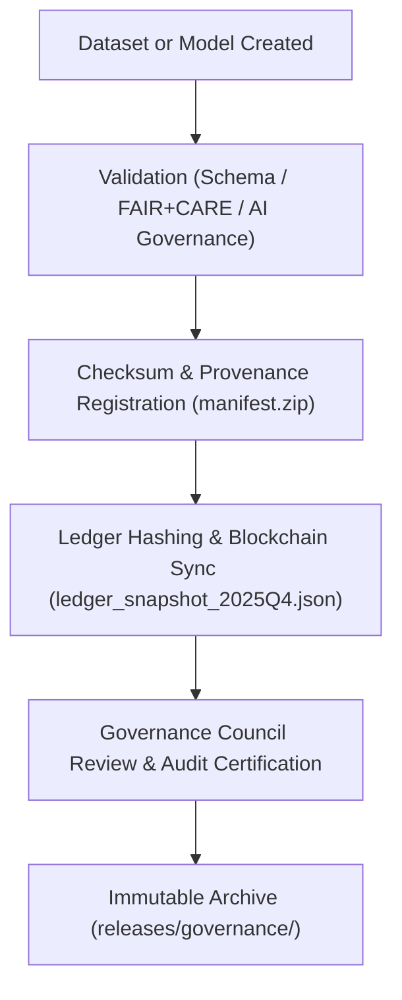
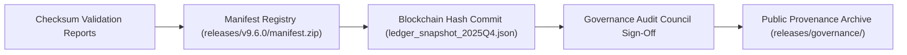

<div align="center">

# 🧾 Kansas Frontier Matrix — **Audit Governance & Provenance Verification Framework**
`docs/standards/governance/AUDIT-GOVERNANCE.md`

**Purpose:**  
Defines the **audit lifecycle, verification chain, and provenance synchronization standards** for the Kansas Frontier Matrix (KFM).  
This framework guarantees **traceability, reproducibility, and ethics compliance** through automated FAIR+CARE validation and blockchain-backed governance.

[](../../../docs/standards/faircare-validation.md)
[]()
[](../../../docs/architecture/README.md)
[](../../../LICENSE)

</div>

---

## 📚 Overview

The **Audit Governance Framework** defines how every dataset, process, and model within the Kansas Frontier Matrix is **validated, audited, and cryptographically verifiable**.  
It connects FAIR+CARE, ISO, and MCP-DL governance through an immutable audit trail integrated with blockchain provenance.

### Core Goals
- Implement a **continuous auditing process** for data, AI, and governance artifacts.  
- Maintain **checksum integrity and blockchain verification** across all releases.  
- Align with **FAIR+CARE, ISO 19115, ISO 50001, and ISO 42001** standards.  
- Enable **autonomous provenance validation** for reproducibility and accountability.  

---

## 🗂️ Audit Governance Components

```plaintext
docs/standards/governance/
├── AUDIT-GOVERNANCE.md                # This file — defines provenance and audit verification protocols
├── DATA-GOVERNANCE.md                 # Data governance charter and integrity principles
├── ETHICS-GOVERNANCE.md               # FAIR+CARE and ethics council framework
└── governance-diagram.md              # Visual governance pipeline and council structure
```

---

## ⚙️ Audit Lifecycle Overview



### Process Description
1. **Validation:** Datasets undergo schema and FAIR+CARE compliance checks.  
2. **Checksum & Provenance:** SHA-256 hashes generated and stored in manifest registry.  
3. **Ledger Sync:** Entries logged into blockchain-linked governance ledger.  
4. **Council Review:** Audit and ethics councils approve validation results.  
5. **Archival:** Certified audits stored permanently for public transparency.  

---

## 🧩 FAIR+CARE Audit Matrix

| Principle | Implementation |
|------------|----------------|
| **Findable** | Audit records indexed by unique ledger hash and manifest ID. |
| **Accessible** | Publicly accessible audit summaries under MIT license. |
| **Interoperable** | Built on FAIR, DCAT 3.0, ISO 19115, and MCP-DL v6.3 standards. |
| **Reusable** | Immutable audit chains support external validation and reproducibility. |
| **Collective Benefit** | Promotes ethical, transparent, and community-verified data governance. |
| **Authority to Control** | Governance Council certifies and signs audit results. |
| **Responsibility** | Validators maintain integrity and fairness throughout audit processes. |
| **Ethics** | Every audit reviewed for equitable access, sustainability, and inclusion. |

---

## ⚖️ Audit Validation Chain

| Stage | Audit Layer | Validator | Output | Frequency |
|--------|--------------|------------|----------|------------|
| **Data Validation** | Schema + FAIR+CARE | @kfm-data | `schema_validation_summary.json` | Continuous |
| **AI Validation** | Bias + Explainability | @kfm-ai | `ai_validation_report.json` | Quarterly |
| **Governance Validation** | Ledger Hash Consistency | @kfm-governance | `ledger_snapshot_*.json` | Quarterly |
| **Telemetry Validation** | Energy + Sustainability | @kfm-telemetry | `focus-telemetry.json` | Continuous |
| **Security Validation** | Blockchain + PGP Integrity | @kfm-security | `audit_integrity_report.json` | Continuous |

Governance outputs registered in:  
`releases/v9.6.0/governance/ledger_snapshot_2025Q4.json`

---

## 🔐 Blockchain & Provenance Synchronization



### Blockchain Governance Summary
- All audit files hashed using SHA-256 and stored immutably.  
- Provenance chain mirrored to distributed governance nodes quarterly.  
- Governance and ethics councils perform digital signature verification for every ledger update.  

---

## 🧠 ISO + MCP-DL Audit Alignment

| Standard | Domain | Compliance Role |
|-----------|---------|-----------------|
| **ISO 19115** | Metadata Provenance | Dataset lineage and schema traceability |
| **ISO 14064** | Carbon Governance | Emission verification via telemetry audits |
| **ISO 50001** | Energy Management | Sustainability and efficiency verification |
| **ISO 42001** | AI Governance | Explainability, fairness, and model validation |
| **MCP-DL v6.3** | Documentation Lifecycle | Continuous documentation audit and validation |

All standards enforced through automated workflows in `.github/workflows/`.

---

## 🧮 Governance Audit Deliverables

| Artifact | Description | Compliance Scope |
|-----------|-------------|------------------|
| `audit_integrity_report.json` | Blockchain and checksum integrity verification. | ISO 42001 + MCP-DL |
| `ledger_snapshot_2025Q4.json` | Quarterly immutable ledger of audit and certification events. | FAIR+CARE + Blockchain Governance |
| `faircare_audit_summary.json` | FAIR+CARE certification audit log. | FAIR+CARE + Ethics Governance |
| `checksum_registry.json` | File integrity and reproducibility summary. | ISO 19115 + SPDX |
| `governance_dashboard.md` | Public-facing audit summary and KPI overview. | FAIR+CARE + Transparency Standard |

---

## 🌱 Sustainability Audit Metrics

| Metric | Standard | Target | Verified By |
|---------|-----------|---------|--------------|
| Energy Use per Validation | ISO 50001 | ≤ 25 Wh | @kfm-telemetry |
| Carbon Offset Compliance | ISO 14064 | 100% | @kfm-sustainability |
| Blockchain Uptime | FAIR+CARE Governance | 99.9% | @kfm-security |
| Validation Audit Coverage | MCP-DL v6.3 | 100% | @kfm-validation |
| FAIR+CARE Audit Pass Rate | FAIR+CARE | 100% | @kfm-fair |

---

## 🧾 Internal Use Citation

```text
Kansas Frontier Matrix (2025). Audit Governance & Provenance Verification Framework (v9.6.0).
Defines the continuous audit lifecycle and immutable governance chain ensuring reproducible, ethical, and ISO-certified operations across all KFM data and AI workflows.
Integrates blockchain verification, FAIR+CARE validation, and autonomous MCP-DL governance.
```

---

## 🧾 Version Notes

| Version | Date | Notes |
|----------|------|--------|
| v9.6.0 | 2025-11-03 | Added blockchain provenance and sustainability audit chain integration. |
| v9.5.0 | 2025-11-02 | Enhanced checksum governance verification and AI ethics auditing. |
| v9.3.2 | 2025-10-28 | Established FAIR+CARE and ISO audit governance baseline. |

---

<div align="center">

**Kansas Frontier Matrix** · *Audit Integrity × FAIR+CARE Governance × Immutable Provenance*  
[🔗 Repository](https://github.com/bartytime4life/Kansas-Frontier-Matrix) • [🧭 Governance Hub](./README.md) • [⚖️ Governance Ledger](../../../docs/standards/governance/DATA-GOVERNANCE.md)

</div>
