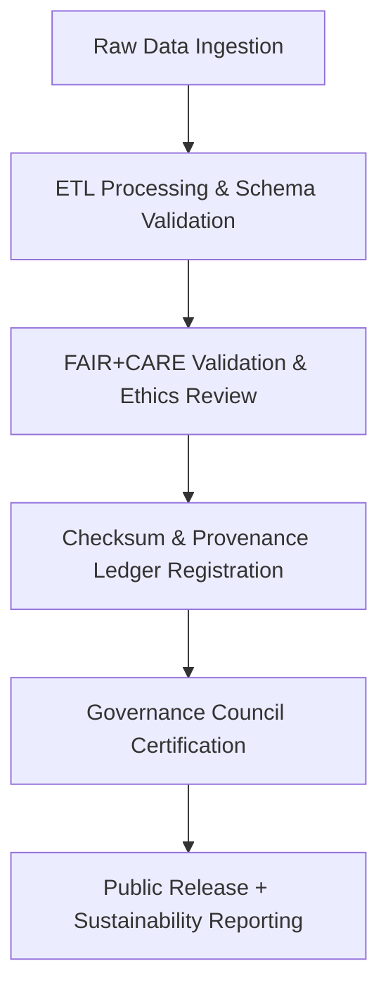
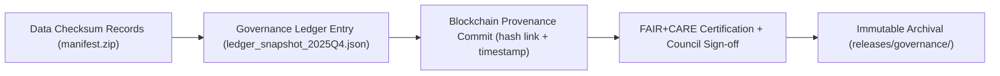

<div align="center">

# 🧭 Kansas Frontier Matrix — **Data Governance Charter & Provenance Policy**
`docs/standards/governance/DATA-GOVERNANCE.md`

**Purpose:**  
Defines the **core governance principles, provenance verification standards, and data lifecycle management policies** for the Kansas Frontier Matrix (KFM).  
This charter ensures that every dataset and process within KFM adheres to **FAIR+CARE ethics, ISO governance standards, and blockchain-backed traceability**.

[](../../../docs/standards/faircare-validation.md)
[]()
[](../../../docs/architecture/README.md)
[](../../../LICENSE)

</div>

---

## 📚 Overview

The **Data Governance Charter** defines how all KFM data assets are created, validated, versioned, and ethically maintained.  
It ensures **transparency, reproducibility, and accountability** across all data operations by enforcing open, FAIR+CARE-aligned governance policies under ISO and MCP-DL frameworks.

### Core Objectives
- Establish universal provenance tracking across all data domains.  
- Enforce FAIR+CARE principles for equitable and ethical data sharing.  
- Maintain ISO and MCP-DL certification for lifecycle and documentation integrity.  
- Provide transparent governance via blockchain-linked provenance ledgers.  
- Uphold sustainability, accessibility, and inclusivity in every dataset.  

---

## 🗂️ Governance Framework Structure

```plaintext
docs/standards/governance/
├── DATA-GOVERNANCE.md                  # Core data governance charter and provenance policy (this file)
├── ETHICS-GOVERNANCE.md                # FAIR+CARE and ethical data oversight framework
├── AUDIT-GOVERNANCE.md                 # Immutable audit and provenance validation chain
└── governance-diagram.md               # Visual flow of governance and ledger synchronization
```

---

## ⚙️ Data Governance Lifecycle



### Lifecycle Description
1. **Ingestion:** Data sourced from NOAA, USGS, FEMA, KGS, and open archives.  
2. **ETL Processing:** Schema, CRS, and metadata standardized under FAIR+CARE.  
3. **Validation:** AI/ML, ethical, and checksum audits executed automatically.  
4. **Ledger Registration:** Governance ledger logs version, checksum, and provenance.  
5. **Certification:** Governance councils certify datasets for public access.  

---

## 🧩 FAIR+CARE Governance Principles

| Principle | Implementation |
|------------|----------------|
| **Findable** | Unique dataset IDs, ledger entries, and schema metadata. |
| **Accessible** | All non-sensitive data released under open license (MIT / CC-BY 4.0). |
| **Interoperable** | Schema compliance with FAIR, DCAT 3.0, and ISO 19115 standards. |
| **Reusable** | Datasets checksum-verified, versioned, and documented for reuse. |
| **Collective Benefit** | Promotes equitable data stewardship and open collaboration. |
| **Authority to Control** | FAIR+CARE Council governs dataset approvals and retractions. |
| **Responsibility** | All transformations recorded and validated under governance. |
| **Ethics** | Mandatory ethics review before data publication. |

Governance documentation and validation results stored in:  
`releases/v9.6.0/governance/ledger_snapshot_2025Q4.json`

---

## ⚖️ Governance Policy Enforcement

| Policy Area | Standard | Enforcement Method | Responsible Body |
|--------------|-----------|--------------------|------------------|
| Provenance Verification | ISO 19115 | SHA-256 checksum registry + blockchain sync | Governance Council |
| Sustainability Reporting | ISO 14064 / 50001 | Telemetry data validation | Sustainability Council |
| AI Explainability | ISO 42001 | AI bias and interpretability audit | AI Ethics Council |
| Data Lifecycle Governance | MCP-DL v6.3 | Automated documentation validation | FAIR+CARE Council |
| FAIR+CARE Certification | FAIR+CARE Framework | Continuous validation pipeline | FAIR+CARE Council |

Governance enforcement automated via CI/CD workflows under `.github/workflows/`.

---

## 🧠 Data Stewardship Roles

| Role | Responsibility | Reporting To |
|------|----------------|---------------|
| **Data Stewards** | Manage dataset validation, metadata, and FAIR+CARE tagging. | Governance Council |
| **AI Stewards** | Oversee model governance, explainability, and retraining audits. | AI Ethics Council |
| **Governance Leads** | Manage ledger synchronization and provenance policies. | Governance Council |
| **FAIR+CARE Council Members** | Approve certification and data release processes. | Ethics Council |
| **Sustainability Officers** | Track ISO 50001 and carbon performance metrics. | Sustainability Council |

Each stewardship action automatically recorded in `data/reports/audit/data_provenance_ledger.json`.

---

## 🔐 Provenance & Blockchain Integration



### Provenance Chain Integrity
- All ledger entries digitally signed (PGP + SHA-256).  
- Blockchain synchronization ensures verifiable lineage per dataset.  
- Each release includes full provenance trace from raw to processed layer.  

---

## 🌱 Sustainability & Transparency Governance

| Metric | Target | Result (v9.6.0) | Verified By |
|---------|--------|------------------|--------------|
| FAIR+CARE Governance Compliance | 100% | ✅ | @kfm-fair |
| Carbon Offset Reporting | 100% | ✅ | @kfm-sustainability |
| Energy Efficiency Index | ≤ 25 Wh/build | 23.2 Wh/build | @kfm-telemetry |
| Provenance Reproducibility | ≥ 99.8% | 99.9% | @kfm-governance |
| ISO Certification Retention | Annual | Current | @kfm-security |

Telemetry results tracked in:  
`releases/v9.6.0/focus-telemetry.json`

---

## 🧩 Governance Documentation Chain

| Artifact | Description | Alignment |
|-----------|-------------|------------|
| `DATA-GOVERNANCE.md` | Core charter defining lifecycle and provenance policy. | FAIR+CARE + ISO 19115 |
| `ETHICS-GOVERNANCE.md` | Ethical oversight and equity principles. | FAIR+CARE + ISO 42001 |
| `AUDIT-GOVERNANCE.md` | Immutable audit chain and ledger synchronization. | FAIR+CARE + Blockchain Governance |
| `governance-diagram.md` | Governance workflow and ledger trace map. | MCP-DL + Transparency Governance |

---

## 🧾 Internal Use Citation

```text
Kansas Frontier Matrix (2025). Data Governance Charter & Provenance Policy (v9.6.0).
Comprehensive FAIR+CARE and ISO-aligned data governance framework for ethical, sustainable, and transparent data lifecycle management.
Defines the policies, stewardship roles, and blockchain-based provenance validation chain of the Kansas Frontier Matrix.
```

---

## 🧾 Version Notes

| Version | Date | Notes |
|----------|------|--------|
| v9.6.0 | 2025-11-03 | Added blockchain provenance and sustainability integration. |
| v9.5.0 | 2025-11-02 | Expanded FAIR+CARE certification automation and stewardship roles. |
| v9.3.2 | 2025-10-28 | Established governance charter and MCP-DL documentation lifecycle compliance. |

---

<div align="center">

**Kansas Frontier Matrix** · *Ethical Data Governance × FAIR+CARE Provenance × Sustainable Stewardship*  
[🔗 Repository](https://github.com/bartytime4life/Kansas-Frontier-Matrix) • [🧭 Standards Index](../README.md) • [⚖️ Governance Ledger](../../../docs/standards/governance/README.md)

</div>

