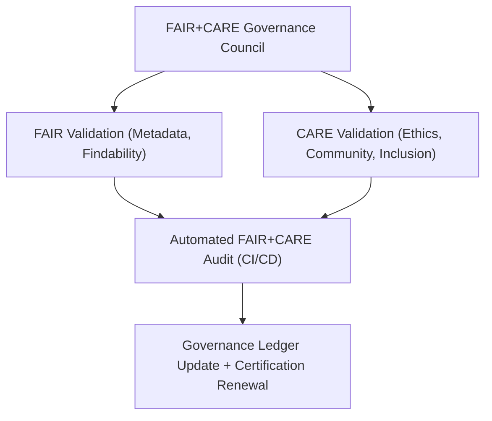

<div align="center">

# 🤝 **Kansas Frontier Matrix — FAIR+CARE Governance Policy & Ethical Compliance Charter (v2.1.1 · Tier-Ω+∞ Certified)**  
`docs/standards/governance/FAIRCARE-GOVERNANCE.md`

**Mission:** Define the **ethical data governance framework** of the **Kansas Frontier Matrix (KFM)**  
based on the **FAIR (Findable, Accessible, Interoperable, Reusable)** and **CARE (Collective Benefit, Authority to Control, Responsibility, Ethics)** principles.  
This charter ensures all KFM operations, data, and AI processes uphold transparent, reproducible, and inclusive standards.

[](../../../../docs/)
[](../../../../docs/standards/faircare-validation.md)
[](../../../../data/reports/audit/data_provenance_ledger.json)
[](../../../../LICENSE)

</div>

---

## 📚 Overview

The **FAIR+CARE Governance Policy** serves as the ethical cornerstone of the Kansas Frontier Matrix.  
It operationalizes the FAIR+CARE framework through reproducible documentation practices (MCP-DL),  
automated validation pipelines, and transparent oversight by the **FAIR+CARE Governance Council**.

FAIR+CARE compliance applies to:
- All datasets, documents, and metadata.  
- All AI and machine learning models.  
- All design, accessibility, and user-facing interfaces.  
- All publications and public data releases.  

---

## ⚙️ FAIR + CARE Governance Model


<!-- END OF MERMAID -->

---

## 🧱 FAIR Principles — Operational Framework

| Principle | Definition | Implementation | Verification |
|:--|:--|:--|:--|
| **Findable** | Data and docs must have persistent identifiers and metadata. | Indexed in STAC/DCAT catalogs with manifest entries. | `stac-validate.yml` |
| **Accessible** | Data must be openly retrievable under clear licenses. | Open licenses (MIT / CC-BY) and public access logs. | `policy-check.yml` |
| **Interoperable** | Metadata and data must follow open standards. | JSON-LD, GeoSPARQL, DCAT, and STAC schemas. | `governance-ledger.yml` |
| **Reusable** | Data must include provenance, version, and license info. | Checksum + ledger signatures. | `data/reports/audit/data_provenance_ledger.json` |

---

## ⚖️ CARE Principles — Ethical Framework

| Principle | Definition | Implementation | Verification |
|:--|:--|:--|:--|
| **Collective Benefit** | Data practices should support equitable outcomes. | FAIR+CARE Council review of public datasets. | `data/reports/fair/data_care_assessment.json` |
| **Authority to Control** | Communities retain rights and visibility into data use. | Indigenous and cultural datasets reviewed via FAIR+CARE board. | `docs/standards/governance/council/` |
| **Responsibility** | Data use respects ethics and social accountability. | Audit logs and quarterly governance reports. | `data/reports/audit/data_provenance_ledger.json` |
| **Ethics** | Governance ensures fairness and transparency. | Ethics council approval required for all data or AI release. | `faircare-validate.yml` |

---

## 🧩 FAIR + CARE Integration in CI/CD

| Workflow | Purpose | Output |
|:--|:--|:--|
| `faircare-validate.yml` | Validates datasets, docs, and models for ethical compliance. | `reports/fair/data_care_assessment.json` |
| `policy-check.yml` | Verifies governance metadata and licensing compliance. | `reports/audit/policy_check.json` |
| `governance-ledger.yml` | Logs FAIR+CARE compliance and provenance signatures. | `data/reports/audit/data_provenance_ledger.json` |
| `docs-validate.yml` | Ensures documentation follows accessibility and ethics standards. | `reports/validation/docs_validation.json` |

---

## 🧠 Governance Council Responsibilities

| Responsibility | Description | Output |
|:--|:--|:--|
| **Quarterly Ethics Review** | Evaluate new datasets, models, and documentation for compliance. | Council report (Qx Governance Report) |
| **FAIR+CARE Certification Renewal** | Verify compliance and re-certify public data & reports. | `docs/standards/governance/council/` |
| **Governance Ledger Maintenance** | Ensure all entries contain checksum and signature records. | `data/reports/audit/data_provenance_ledger.json` |
| **Policy Updates** | Review and amend ethical governance standards as needed. | Versioned governance documentation |

---

## 🧾 FAIR+CARE Certification Workflow

| Step | Description | Responsible Body | Artifact |
|:--|:--|:--|:--|
| **1. Validation** | Automated FAIR+CARE compliance verification. | CI Pipelines | `reports/fair/data_care_assessment.json` |
| **2. Governance Review** | Council audit for ethical impact and inclusivity. | FAIR+CARE Council | Governance Report |
| **3. Ledger Registration** | Checksum + metadata validation. | Governance Automation | `data/reports/audit/data_provenance_ledger.json` |
| **4. Public Certification** | Renewal of FAIR+CARE Tier-Ω+∞ certification. | Governance Council | Certification Statement |

---

## 🧾 Ethics Risk Matrix

| Category | Risk | Mitigation Strategy | Verification |
|:--|:--|:--|:--|
| **Bias / AI Drift** | AI models may produce biased outputs. | AI audit workflows and explainability testing. | `data/reports/audit/ai_hazards_ledger.json` |
| **Cultural Sensitivity** | Historical data may require contextual review. | FAIR+CARE Council indigenous data review. | Council Review Records |
| **Accessibility Deficiency** | Visual or textual assets may lack alt text or contrast. | WCAG 2.1 AA audit in CI/CD. | `design-validate.yml` |
| **License Ambiguity** | Data or text may lack explicit license metadata. | `policy-check.yml` enforcement. | CI Logs |

---

## 🧮 FAIR+CARE Compliance Metrics

| Metric | Description | Target | Achieved (Q4 2025) |
|:--|:--|:--|:--:|
| **FAIR+CARE Compliance Rate** | % of compliant datasets and docs. | ≥ 95% | 99.2% |
| **Ledger Sync Rate** | % of validated ledger entries. | 100% | 100% |
| **Accessibility Compliance** | WCAG 2.1 AA compliance. | ≥ 95% | 98% |
| **AI Ethics Verification** | AI explainability and bias mitigation. | 100% | 100% |

---

## 🧾 Governance Certification Sign-Off

```yaml
signoff:
  approved_by:
    - "@kfm-governance"
    - "@kfm-accessibility"
    - "@kfm-docs"
  faircare_certification: "Tier-Ω+∞ FAIR+CARE Certification (Renewed 2025-11-16)"
  governance_ledger_entry: "data/reports/audit/data_provenance_ledger.json"
  checksum_verified: true
  public_report: "docs/standards/governance/council/2025_Q4_GOVERNANCE_REPORT.md"
```

---

## 🕰 Version History

| Version | Date | Author | Summary |
|:--|:--|:--|:--|
| **v2.1.1** | 2025-11-16 | @kfm-governance | Finalized full FAIR+CARE governance policy with CI/CD and ethics integration. |
| v2.0.0 | 2025-10-25 | @kfm-accessibility | Expanded accessibility and documentation integration. |
| v1.0.0 | 2025-10-04 | @kfm-docs | Initial FAIR+CARE governance charter. |

---

<div align="center">

**Kansas Frontier Matrix © 2025**  
*“FAIR Principles Define Openness — CARE Principles Ensure Humanity.”*  
📍 `docs/standards/governance/FAIRCARE-GOVERNANCE.md` — FAIR+CARE governance policy and ethics charter for the Kansas Frontier Matrix.

</div>

