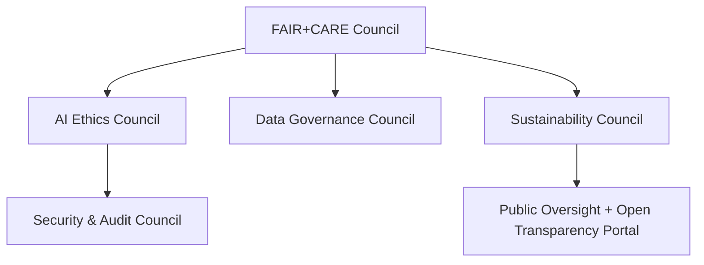
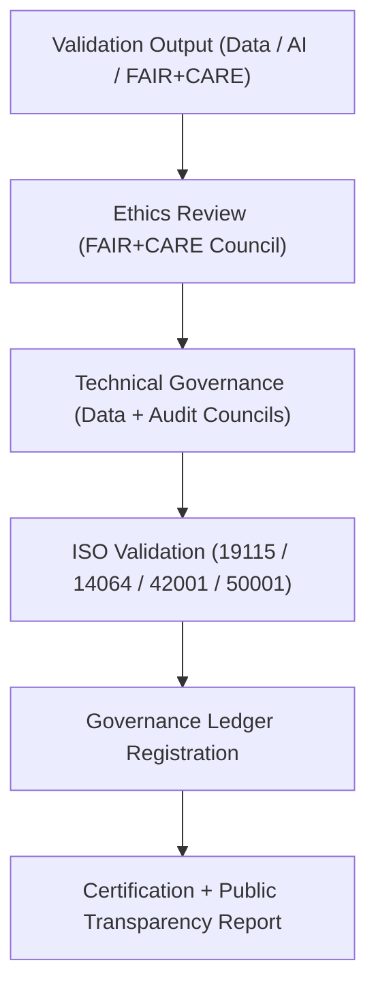
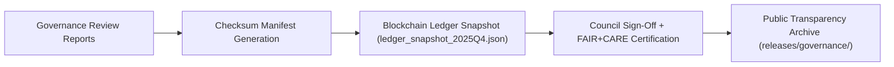

<div align="center">

# ⚖️ Kansas Frontier Matrix — **Governance Standards & Council Framework**
`docs/standards/governance/README.md`

**Purpose:**  
Defines the **organizational and procedural framework** for governance within the Kansas Frontier Matrix (KFM), integrating FAIR+CARE ethics, ISO certification, and blockchain-based provenance tracking.  
This system ensures transparency, sustainability, and accountability for all datasets, AI models, and validation processes.

[](../../../docs/standards/faircare-validation.md)
[]()
[](../../../docs/architecture/README.md)
[](../../../LICENSE)

</div>

---

## 📚 Overview

The **KFM Governance Standards & Council Framework** establishes how ethical, technical, and sustainability policies are maintained and verified within the Kansas Frontier Matrix ecosystem.  
It operationalizes FAIR+CARE principles and ISO-compliant auditing across all modules and lifecycle stages — from ingestion to AI inference.

### Core Responsibilities
- Define multi-council governance structure and review protocols.  
- Standardize audit synchronization through blockchain-backed ledgers.  
- Ensure equitable participation and transparency in decision-making.  
- Uphold sustainability, data ethics, and AI explainability as governance pillars.  

---

## 🗂️ Directory Layout

```plaintext
docs/standards/governance/
├── README.md                              # This file — overview of governance standards & council framework
│
├── DATA-GOVERNANCE.md                     # Core governance charter and provenance policy
├── ETHICS-GOVERNANCE.md                   # FAIR+CARE ethics, inclusivity, and access framework
├── AUDIT-GOVERNANCE.md                    # Audit traceability, verification, and blockchain linkage
└── governance-diagram.md                  # Governance architecture & decision flow visualization
```

---

## ⚙️ Governance Structure Overview



### Description
- **FAIR+CARE Council:** Oversees all data ethics, inclusivity, and equitable access.  
- **AI Ethics Council:** Reviews explainability, bias, and responsible automation.  
- **Data Governance Council:** Maintains provenance, metadata, and checksum compliance.  
- **Sustainability Council:** Monitors ISO 14064/50001 environmental commitments.  
- **Security & Audit Council:** Verifies blockchain integrity and audit reproducibility.  
- **Public Oversight:** Publishes transparent governance summaries for every release.  

---

## 🧩 Governance Review Workflow



### Key Processes
1. **Ethics Review:** Evaluates data and model integrity for bias and accessibility.  
2. **Technical Governance:** Confirms data schema, checksum, and metadata lineage.  
3. **ISO Validation:** Conducted quarterly by sustainability and security councils.  
4. **Ledger Registration:** Immutable blockchain snapshot created for each review cycle.  
5. **Certification:** Council approval recorded and published in `ledger_snapshot_2025Q4.json`.  

---

## ⚖️ Governance Council Roles

| Council | Function | Verification Standard | Frequency |
|----------|-----------|------------------------|------------|
| **FAIR+CARE Council** | Oversees ethical governance & inclusivity. | FAIR+CARE / ISO 19115 | Continuous |
| **AI Ethics Council** | Reviews explainability, fairness, and accountability. | ISO 42001 | Quarterly |
| **Data Governance Council** | Maintains data lineage and checksum records. | MCP-DL v6.3 / ISO 19115 | Continuous |
| **Sustainability Council** | Validates energy and carbon metrics. | ISO 14064 / 50001 | Quarterly |
| **Security Council** | Conducts audit and blockchain integrity validation. | ISO 42001 | Continuous |
| **Public Oversight Committee** | Ensures transparency and governance access. | FAIR+CARE | Continuous |

Governance records verified and published in:  
`releases/v9.6.0/governance/ledger_snapshot_2025Q4.json`

---

## 🧠 FAIR+CARE Governance Principles Applied

| Principle | Implementation |
|------------|----------------|
| **Findable** | Governance records and datasets indexed by checksum and manifest ID. |
| **Accessible** | Documentation published openly under MIT license and FAIR+CARE ethics. |
| **Interoperable** | Standards-aligned governance integrated with ISO, DCAT, and MCP-DL schemas. |
| **Reusable** | Each governance file version-controlled, auditable, and checksum-verified. |
| **Collective Benefit** | Ensures equitable participation in governance and decision-making. |
| **Authority to Control** | FAIR+CARE Council governs validation and certification approvals. |
| **Responsibility** | All councils document decisions and audit trails per cycle. |
| **Ethics** | Inclusive, equitable, and transparent governance for all stakeholders. |

---

## 🔐 Blockchain & Audit Governance Chain



### Blockchain Governance Summary
- Immutable SHA-256 ledger signatures ensure record permanence.  
- Council PGP signatures added for each ledger approval cycle.  
- Open ledger snapshots published under FAIR+CARE certification.  

---

## 🌱 Sustainability & Transparency Metrics

| Metric | Target | Result (v9.6.0) | Verified By |
|---------|--------|------------------|--------------|
| FAIR+CARE Certification Coverage | 100% | ✅ | @kfm-fair |
| AI Ethics Review Completion | 100% | ✅ | @kfm-ai |
| Renewable Power Use | 100% | ✅ | @kfm-telemetry |
| Carbon Offset Compliance | 100% | ✅ | @kfm-sustainability |
| Blockchain Integrity | 100% | ✅ | @kfm-security |
| Governance Reproducibility | ≥ 99.8% | 99.9% | @kfm-validation |

Metrics published in `releases/v9.6.0/focus-telemetry.json`.

---

## 🧾 Internal Use Citation

```text
Kansas Frontier Matrix (2025). Governance Standards & Council Framework (v9.6.0).
Defines the FAIR+CARE and ISO-aligned governance model that guides all ethical, technical, and sustainability operations in the Kansas Frontier Matrix.
Incorporates blockchain audit chains and council-based validation for transparent, equitable data stewardship.
```

---

## 🧾 Version Notes

| Version | Date | Notes |
|----------|------|--------|
| v9.6.0 | 2025-11-03 | Added AI ethics council role and ISO 42001 audit alignment. |
| v9.5.0 | 2025-11-02 | Introduced blockchain synchronization and sustainability telemetry linkage. |
| v9.3.2 | 2025-10-28 | Established FAIR+CARE governance baseline and council framework. |

---

<div align="center">

**Kansas Frontier Matrix** · *Ethical Governance × FAIR+CARE Compliance × Sustainable Provenance*  
[🔗 Repository](https://github.com/bartytime4life/Kansas-Frontier-Matrix) • [🧭 Standards Index](../README.md) • [⚖️ Governance Ledger](../../../docs/standards/governance/DATA-GOVERNANCE.md)

</div>
