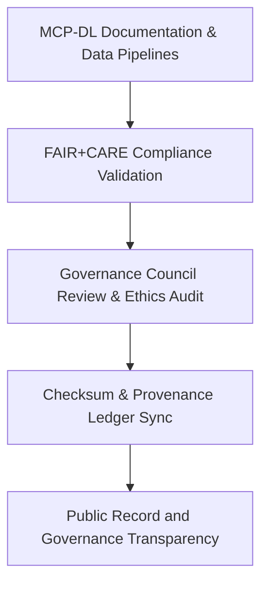

<div align="center">

# ⚖️ **Kansas Frontier Matrix — Governance Standards & Ethical Framework (v2.1.1 · Tier-Ω+∞ Certified)**  
`docs/standards/governance/README.md`

**Mission:** Define the **ethical, procedural, and technical governance standards** for the  
**Kansas Frontier Matrix (KFM)** — ensuring transparent, FAIR+CARE-aligned, and audit-verifiable decision-making  
across data, AI, design, and documentation domains.

[](../../../docs/)
[](../../../docs/standards/faircare-validation.md)
[](../../../data/reports/audit/data_provenance_ledger.json)
[](../../../LICENSE)

</div>

---

## 📚 Overview

The **Governance Standards** define the foundation of **accountability, provenance, and ethical decision-making**  
in the Kansas Frontier Matrix. This framework establishes how all systems — from ETL pipelines to AI models —  
must comply with the FAIR+CARE principles, documentation reproducibility (MCP-DL), and open governance verification.

These standards integrate:
- FAIR+CARE ethics and data responsibility  
- MCP-DL reproducibility documentation  
- SLSA provenance verification and SBOM compliance  
- Governance ledger traceability across CI/CD pipelines  

---

## 🗂️ Directory Layout

```bash
docs/standards/governance/
├── README.md                            # This file — governance standards overview
├── ROOT-GOVERNANCE.md                   # Primary governance charter and council framework
├── FAIRCARE-GOVERNANCE.md               # FAIR+CARE implementation and ethical review policies
├── SECURITY-GOVERNANCE.md               # Data, infrastructure, and access governance policy
└── council/                             # Governance council minutes and review outcomes
    ├── 2025_Q4_GOVERNANCE_REPORT.md
    ├── 2025_Q3_GOVERNANCE_REPORT.md
    └── README.md
```

---

## ⚙️ Governance Model


<!-- END OF MERMAID -->

---

## 🧱 Core Governance Domains

| Domain | Purpose | Governance Reference |
|:--|:--|:--|
| **Ethics & FAIR+CARE** | Ensures equitable, transparent data practices. | `FAIRCARE-GOVERNANCE.md` |
| **Security & Access Control** | Protects sensitive data and infrastructure. | `SECURITY-GOVERNANCE.md` |
| **AI & Automation** | Monitors bias, explainability, and drift. | `data/reports/audit/ai_hazards_ledger.json` |
| **Documentation & Provenance** | Maintains transparent records under MCP-DL. | `ROOT-GOVERNANCE.md` |
| **Council Oversight** | Reviews governance outcomes and publishes reports. | `council/` |

---

## 🧩 Governance Principles

| Principle | Description | Implementation |
|:--|:--|:--|
| **Transparency** | All decisions are logged, auditable, and versioned. | Governance Ledger |
| **Accountability** | Each artifact includes authorship and checksum metadata. | Policy Enforcement via CI |
| **Ethical Responsibility** | Human-centered design and AI validation policies enforced. | FAIR+CARE Council |
| **Traceability** | Immutable provenance records for all data and docs. | `data/reports/audit/data_provenance_ledger.json` |
| **Inclusivity** | FAIR+CARE promotes representation and equitable governance. | Governance Council Oversight |

---

## ⚖️ FAIR + CARE Integration

| FAIR Principle | CARE Principle | Governance Application |
|:--|:--|:--|
| **Findable** | **Collective Benefit** | Governance records publicly accessible via manifest. |
| **Accessible** | **Authority to Control** | Open documentation, yet respects data sovereignty. |
| **Interoperable** | **Responsibility** | Uses open formats (JSON-LD, STAC, DCAT). |
| **Reusable** | **Ethics** | Versioned decisions and ethical audit records. |

---

## 🧠 Governance Compliance Workflow

| Stage | Action | Responsible Body | Workflow |
|:--|:--|:--|:--|
| **1. Validation** | CI/CD pipelines run FAIR+CARE and metadata checks. | DevOps / Docs CI | `faircare-validate.yml` |
| **2. Ethics Review** | Governance Council reviews AI and data ethics logs. | FAIR+CARE Council | `data/reports/fair/` |
| **3. Ledger Registration** | Checksum + provenance recorded. | Governance Automation | `governance-ledger.yml` |
| **4. Publication** | Reports and governance updates released publicly. | @kfm-docs | `site.yml` |

---

## 🔍 Governance Validation Workflows

| Workflow | Description | Output |
|:--|:--|:--|
| `faircare-validate.yml` | Ensures datasets and decisions meet FAIR+CARE ethics standards. | `reports/fair/data_care_assessment.json` |
| `policy-check.yml` | Validates governance metadata and frontmatter. | `reports/audit/policy_check.json` |
| `governance-ledger.yml` | Records all governance events and checksums. | `data/reports/audit/data_provenance_ledger.json` |
| `docs-validate.yml` | Ensures accessibility and compliance of governance docs. | `reports/validation/docs_validation.json` |

---

## 🧾 Governance Roles & Responsibilities

| Role | Responsibility | Validation Scope |
|:--|:--|:--|
| **Governance Chair (@kfm-governance)** | Oversees compliance with ethical and procedural standards. | FAIR+CARE / Audit Reports |
| **Architecture Lead (@kfm-architecture)** | Maintains reproducibility and design governance. | MCP-DL / ADRs |
| **Security Lead (@kfm-security)** | Ensures integrity and access control. | ISO 27001 / SBOM |
| **Documentation Lead (@kfm-docs)** | Maintains transparency and consistency across docs. | Metadata / Policy Validation |
| **FAIR+CARE Council** | Ethical governance and inclusive decision-making. | Quarterly Governance Reviews |

---

## 🧾 Governance Artifacts & Provenance Links

| Artifact | Description | Path |
|:--|:--|:--|
| **Governance Ledger** | Main record of decisions and validation hashes. | `data/reports/audit/data_provenance_ledger.json` |
| **FAIR+CARE Validation Logs** | Ethical audit results and compliance scores. | `data/reports/fair/data_care_assessment.json` |
| **Security Audit Logs** | SBOM / SLSA provenance and CVE checks. | `reports/security/` |
| **Quarterly Council Reports** | Public summaries of governance actions. | `docs/standards/governance/council/` |

---

## 🧾 Version History

| Version | Date | Author | Summary |
|:--|:--|:--|:--|
| **v2.1.1** | 2025-11-16 | @kfm-governance | Added detailed governance model, council directory, and FAIR+CARE integration map. |
| v2.0.0 | 2025-10-25 | @kfm-architecture | Introduced security and council governance substructure. |
| v1.0.0 | 2025-10-04 | @kfm-docs | Initial governance standards documentation. |

---

<div align="center">

**Kansas Frontier Matrix © 2025**  
*“Governance is Provenance — Ethics is Continuity.”*  
📍 `docs/standards/governance/README.md` — Central governance and ethical framework documentation for the Kansas Frontier Matrix.

</div>

