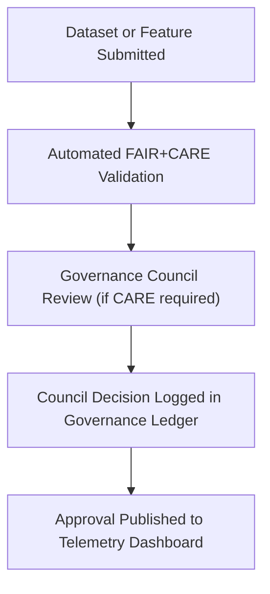

<div align="center">

# 🏛️ **Kansas Frontier Matrix — Governance & Ethical Oversight Framework**
`docs/standards/governance/README.md`

**Purpose:** Provide an overview of the ethical, procedural, and administrative governance systems that guide the Kansas Frontier Matrix (KFM).  
Governance ensures that all operations, datasets, and technologies align with **FAIR+CARE principles**, **Master Coder Protocol (MCP v6.3)**, and the KFM **Root Governance Charter**.

[](../../README.md)
[](../../../LICENSE)
[](../faircare.md)
[]()

</div>

---

## 📘 Overview

The **Kansas Frontier Matrix (KFM)** operates under a **documented governance system** designed to balance open science, ethical responsibility, and community inclusion.  
Governance functions as a **distributed accountability network**, combining automation (via CI/CD validation) with human oversight (via the FAIR+CARE Council).

This directory defines:
- The governance structure and councils
- Ethical review and approval workflows
- Integration with automated telemetry and audit systems
- Roles, responsibilities, and review cadence

---

## 🗂️ Directory Layout

```
docs/standards/governance/
├── README.md                 # This index file
└── ROOT-GOVERNANCE.md        # The complete governance charter (authoritative version)
```

---

## ⚖️ Governance Structure Overview

KFM’s governance model combines **technical automation** and **human ethical review** to maintain transparent and reproducible data operations.

| Body | Function | Composition | Frequency |
|------|-----------|-------------|------------|
| **FAIR+CARE Council** | Oversees ethical, cultural, and Indigenous data governance. | 7 members (2 Indigenous reps, 2 data stewards, 3 technical leads) | Quarterly |
| **Technical Standards Committee** | Manages MCP, data schema, and validation workflows. | 5 developers, 1 auditor | Monthly |
| **AI Governance Subcommittee** | Reviews AI model bias, transparency, and ethical risk. | 3 AI engineers, 2 ethicists | Biannual |
| **Open Science Board** | Ensures licensing, accessibility, and reproducibility. | 4 data curators, 2 accessibility advisors | Quarterly |

Each committee’s responsibilities are defined in [`ROOT-GOVERNANCE.md`](ROOT-GOVERNANCE.md).

---

## 🧩 Roles & Responsibilities

| Role | Responsibility | Reports To |
|------|----------------|-------------|
| **Governance Chair** | Oversees FAIR+CARE Council and signs off on ethical approvals. | FAIR+CARE Council |
| **Technical Maintainer** | Implements validation workflows and schema updates. | Technical Standards Committee |
| **AI Steward** | Ensures responsible model training and explainability. | AI Governance Subcommittee |
| **Data Curator** | Reviews dataset metadata for completeness and provenance. | Open Science Board |
| **Accessibility Auditor** | Evaluates documentation and UI compliance with WCAG 2.1 AA. | Open Science Board |

---

## 🧠 Ethical Governance Workflow

### End-to-End Process



### Workflow Outputs
- FAIR+CARE validation: `reports/fair/faircare_summary.json`
- Governance review: `reports/audit/governance-ledger.json`
- Telemetry record: `releases/v9.7.0/focus-telemetry.json`

---

## 🧮 Decision Types & Status Codes

| Status | Definition | Action |
|---------|-------------|--------|
| ✅ **Approved** | Fully compliant with FAIR+CARE and MCP requirements. | Dataset published and visible in dashboards. |
| ⚙️ **Approved with Conditions** | Requires updates (license, provenance, or CARE clarification). | Dataset temporarily flagged. |
| 🕓 **Pending Review** | Awaiting Council decision. | Auto-reminder sent to reviewers. |
| ❌ **Rejected** | Fails ethical or technical compliance checks. | Dataset withheld from public release. |

**Status changes** are recorded in `reports/audit/governance-ledger.json`.

---

## 🧾 Governance Review Template Integration

All governance actions are tracked through a structured issue form:
```
.github/ISSUE_TEMPLATE/governance_form.yml
```

**Form Includes:**
- Reviewer identity and affiliation  
- Dataset references (STAC/DCAT ID)  
- CARE evaluation notes  
- Decision outcome and timestamp  
- Telemetry integration reference  

---

## 🧩 Automation & Audit Integration

| System | Function | Output |
|---------|-----------|---------|
| **CI/CD Pipelines** | Automatically validate and tag new datasets or models. | `reports/self-validation/**` |
| **Governance Ledger** | Immutable record of decisions and ethical reviews. | `reports/audit/governance-ledger.json` |
| **Telemetry Dashboard** | Real-time visualization of governance metrics. | `docs/reports/telemetry/governance_scorecard.json` |
| **AI Governance Module** | Evaluates model explainability and bias metrics. | `reports/audit/ai_models.json` |

---

## ⚖️ FAIR+CARE in Governance

| Principle | Implementation | Governance Reference |
|------------|----------------|----------------------|
| **Findable** | Governance decisions indexed by dataset ID and version. | Governance Ledger |
| **Accessible** | Public governance summaries available via dashboard. | Telemetry JSON |
| **Interoperable** | JSON-LD schema aligns with PROV-O and DCAT. | Release Manifests |
| **Reusable** | All reviews archived per release. | Manifest + Ledger |
| **CARE** | Indigenous partners included in all cultural data reviews. | FAIR+CARE Council |

---

## 🧮 Quarterly Governance Audit

Every quarter, a governance audit is executed to assess:
- Dataset licensing coverage  
- CARE compliance status  
- Pending review queue  
- Governance ledger integrity  

**Outputs:**
```
reports/audit/governance-ledger.json
docs/reports/telemetry/governance_scorecard.json
```

**Governance Audit Example:**
```json
{
  "event": "quarterly_audit",
  "datasets_reviewed": 243,
  "approvals": 238,
  "pending": 3,
  "rejections": 2,
  "timestamp": "2025-11-05T20:15:00Z"
}
```

---

## 🧠 Governance Metrics Dashboard

Metrics visualized in Governance Dashboard (`web/src/components/DashboardView/`):

| Metric | Description | Source |
|---------|-------------|--------|
| **Compliance Rate (%)** | Percentage of datasets passing FAIR+CARE validation. | `governance_scorecard.json` |
| **CARE Review Volume** | Count of Indigenous or cultural dataset reviews. | `governance-ledger.json` |
| **Governance Turnaround Time** | Average duration between submission and decision. | CI/CD Telemetry |
| **Audit Log Integrity** | Number of validated governance ledger entries. | Ledger checksum reports |

---

## 🧾 Governance Policy Links

| Document | Description |
|-----------|-------------|
| [`ROOT-GOVERNANCE.md`](ROOT-GOVERNANCE.md) | Authoritative governance charter and bylaws. |
| [`docs/standards/faircare.md`](../faircare.md) | FAIR+CARE governance principles. |
| [`docs/standards/licensing.md`](../licensing.md) | Licensing and IP governance. |
| [`docs/reports/telemetry/governance_scorecard.json`](../../reports/telemetry/README.md) | Live governance metrics. |

---

## 🕰️ Version History

| Version | Date | Author | Summary |
|----------|------|---------|----------|
| v9.7.0 | 2025-11-05 | A. Barta | Added complete governance framework index linking to FAIR+CARE Council and automated audit systems. |
| v9.5.0 | 2025-10-20 | A. Barta | Expanded council roles and telemetry linkage. |
| v9.0.0 | 2025-06-01 | KFM Core Team | Created governance documentation foundation. |

---

<div align="center">

**© 2025 Kansas Frontier Matrix — CC-BY 4.0**  
Governed under **Master Coder Protocol v6.3** · FAIR+CARE Certified · Diamond⁹ Ω / Crown∞Ω Ultimate Certified  
[Back to Standards Index](../README.md) · [Root Governance Charter](ROOT-GOVERNANCE.md)

</div>
