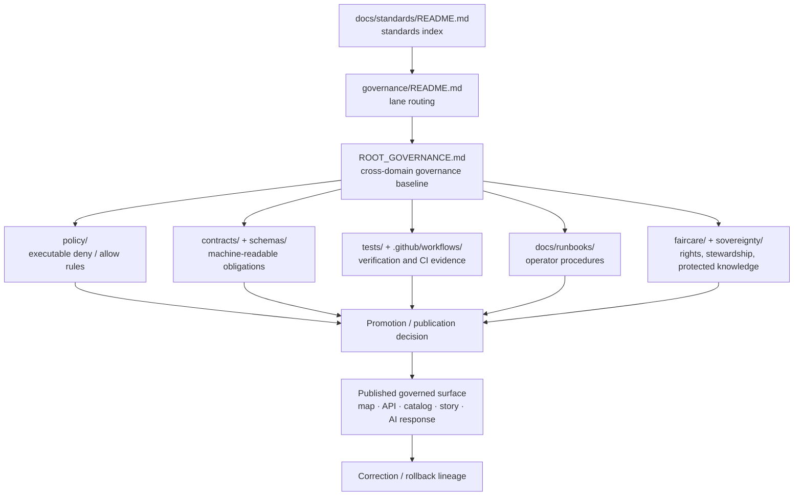

<!-- [KFM_META_BLOCK_V2]
doc_id: kfm://doc/NEEDS_VERIFICATION__docs_standards_governance_readme
title: Governance Standards
type: standard
version: v1
status: draft
owners: @bartytime4life
created: NEEDS_VERIFICATION__YYYY-MM-DD
updated: 2026-04-30
policy_label: NEEDS_VERIFICATION
related: [../README.md, ./ROOT_GOVERNANCE.md, ../faircare/README.md, ../faircare/FAIRCARE-GUIDE.md, ../sovereignty/README.md, ../sovereignty/INDIGENOUS-DATA-PROTECTION.md, ../KFM_MARKDOWN_WORK_PROTOCOL.md, ../../README.md, ../../runbooks/README.md, ../../../contracts/README.md, ../../../schemas/README.md, ../../../policy/README.md, ../../../tests/README.md, ../../../.github/workflows/README.md]
tags: [kfm, standards, governance, documentation, review, promotion, policy]
notes: [Lane-specific doc_id, created date, and policy label need verification in the mounted repository. Owner is inherited from surfaced /docs/ ownership evidence and should be rechecked for this lane. Surfaced standards-index evidence reports governance/README.md and ROOT_GOVERNANCE.md as visible standards-lane surfaces; active-checkout parity still needs verification.]
[/KFM_META_BLOCK_V2] -->

<a id="top"></a>

# Governance Standards

Lane index for cross-domain KFM governance standards that keep claims evidence-bound, reviewable, publishable, correctable, and safe to expose.

> [!IMPORTANT]
> **Status:** `experimental` · **Doc status:** `draft`  
> **Owners:** `@bartytime4life` *(surfaced `/docs/` ownership signal; lane-specific ownership still **NEEDS VERIFICATION**)*  
> **Path:** `docs/standards/governance/README.md`  
> **Repo fit:** child lane of [`../README.md`](../README.md); primary downstream standard [`./ROOT_GOVERNANCE.md`](./ROOT_GOVERNANCE.md); adjacent care/sensitivity standards in [`../faircare/`](../faircare/README.md) and [`../sovereignty/`](../sovereignty/README.md).  
> **Truth posture:** source-grounded lane index; active checkout, workflow enforcement, branch protections, and platform settings remain **NEEDS VERIFICATION**.


**Quick jumps:** [Scope](#scope) · [Repo fit](#repo-fit) · [Accepted inputs](#accepted-inputs) · [Exclusions](#exclusions) · [Directory tree](#directory-tree) · [Quickstart](#quickstart) · [Usage](#usage) · [Diagram](#diagram) · [Operating tables](#operating-tables) · [Task list](#task-list--definition-of-done) · [FAQ](#faq) · [Appendix](#appendix)

---

## Scope

`docs/standards/governance/` is the standards-lane home for KFM’s **cross-domain governance baseline**.

This lane answers:

> What governance rule must remain true across domains, interfaces, releases, reviews, corrections, and public-facing claims?

Use this README as the **lane index and routing boundary**. Put substantive cross-domain governance rules in [`ROOT_GOVERNANCE.md`](./ROOT_GOVERNANCE.md). Do not let this README become a second governance charter.

KFM governance centers on the **inspectable claim**: a claim whose evidence, source role, spatial and temporal scope, policy posture, review state, release state, and correction lineage can be reconstructed. Rendered maps, tiles, dashboards, summaries, AI answers, and story surfaces are downstream carriers of governed evidence; they are not sovereign truth.

[Back to top](#top)

---

## Repo fit

| Item | Value |
|---|---|
| Path | [`docs/standards/governance/README.md`](./README.md) |
| Path role | Directory README, lane index, scope boundary, and routing guide |
| Parent standards index | [`../README.md`](../README.md) |
| Primary downstream standard | [`./ROOT_GOVERNANCE.md`](./ROOT_GOVERNANCE.md) |
| Adjacent standards lanes | [`../faircare/README.md`](../faircare/README.md) · [`../sovereignty/README.md`](../sovereignty/README.md) · [`../stac/README.md`](../stac/README.md) |
| Adjacent normative guides | [`../faircare/FAIRCARE-GUIDE.md`](../faircare/FAIRCARE-GUIDE.md) · [`../sovereignty/INDIGENOUS-DATA-PROTECTION.md`](../sovereignty/INDIGENOUS-DATA-PROTECTION.md) · [`../KFM_MARKDOWN_WORK_PROTOCOL.md`](../KFM_MARKDOWN_WORK_PROTOCOL.md) |
| Machine / enforcement neighbors | [`../../../contracts/README.md`](../../../contracts/README.md) · [`../../../schemas/README.md`](../../../schemas/README.md) · [`../../../policy/README.md`](../../../policy/README.md) · [`../../../tests/README.md`](../../../tests/README.md) · [`../../../.github/workflows/README.md`](../../../.github/workflows/README.md) |
| Procedure neighbor | [`../../runbooks/README.md`](../../runbooks/README.md) |
| Evidence boundary | Surfaced standards-index evidence reports this lane and `ROOT_GOVERNANCE.md`; local mounted-checkout parity remains **NEEDS VERIFICATION** |

> [!NOTE]
> The standards lane should stay readable and compact. If a rule becomes executable, testable, or release-blocking, it needs a companion in `policy/`, `contracts/`, `schemas/`, `tests/`, `.github/workflows/`, or release/proof artifacts as appropriate.

[Back to top](#top)

---

## Accepted inputs

Place material here only when it governs **multiple KFM surfaces** and belongs in the standards layer rather than a domain lane, policy bundle, runbook, or generated report.

| Candidate material | Belongs here? | Best home | Notes |
|---|---:|---|---|
| Directory routing for the governance standards lane | Yes | [`README.md`](./README.md) | Keep this file focused on lane boundaries, navigation, accepted inputs, exclusions, and review checks. |
| Cross-domain governance law | Yes | [`ROOT_GOVERNANCE.md`](./ROOT_GOVERNANCE.md) | Use for stable rules about truth posture, evidence posture, publication posture, review posture, and correction posture. |
| Definitions of governance-facing terms | Yes | [`ROOT_GOVERNANCE.md`](./ROOT_GOVERNANCE.md) | Define terms such as `EvidenceBundle`, `PromotionDecision`, `ReleaseManifest`, `ReviewRecord`, and `CorrectionNotice` only when they are cross-domain. |
| Standards-layer change to source authority or truth labels | Yes | [`ROOT_GOVERNANCE.md`](./ROOT_GOVERNANCE.md) + affected neighbors | Update adjacent contracts, schemas, policy, or tests if the rule is machine-facing. |
| README-level lane placement guidance | Yes | [`README.md`](./README.md) | Use this file to stop duplicate authority and misplaced governance content. |
| Governance-related Markdown structure rules | Maybe | [`../KFM_MARKDOWN_WORK_PROTOCOL.md`](../KFM_MARKDOWN_WORK_PROTOCOL.md) | This README can point to the protocol; it should not duplicate it. |
| FAIR+CARE handling rules | No, unless cross-referenced | [`../faircare/FAIRCARE-GUIDE.md`](../faircare/FAIRCARE-GUIDE.md) | Link from governance when publication or reuse rules depend on FAIR+CARE. |
| Indigenous or community-sensitive data protection rules | No, unless cross-referenced | [`../sovereignty/INDIGENOUS-DATA-PROTECTION.md`](../sovereignty/INDIGENOUS-DATA-PROTECTION.md) | Link from governance when release, redaction, or access rules depend on protected-knowledge posture. |

[Back to top](#top)

---

## Exclusions

Do **not** put these here unless the change is only a short routing note.

| Does not belong here | Put it here instead | Why |
|---|---|---|
| Executable policy rules, deny logic, or Rego bundles | [`../../../policy/README.md`](../../../policy/README.md) | Governance prose must not pretend to enforce runtime policy. |
| JSON Schema, OpenAPI fragments, runtime envelopes, or machine contracts | [`../../../schemas/README.md`](../../../schemas/README.md) or [`../../../contracts/README.md`](../../../contracts/README.md) | Machine-readable contracts need versioned schema and fixture discipline. |
| CI workflow YAML, branch checks, or generated reviewer artifacts | [`../../../.github/workflows/README.md`](../../../.github/workflows/README.md), `tools/ci/`, or `docs/reports/` | Workflow claims require executable and platform verification. |
| Domain-specific rules for hydrology, habitat, archaeology, transport, people, land, hazards, soils, air, or geology | `docs/domains/<lane>/` *(path **NEEDS VERIFICATION**)* | Domain burden belongs with domain stewards and lane-specific evidence. |
| Step-by-step operator procedure | [`../../runbooks/README.md`](../../runbooks/README.md) | Runbooks govern action sequences, rollback steps, and operator handoffs. |
| Source descriptors, source-rights records, or intake manifests | `data/registry/`, `contracts/source/`, or a verified source-registry home | Source records must be inspectable and machine-checkable where possible. |
| STAC, DCAT, or PROV profile rules | [`../KFM_STAC_PROFILE.md`](../KFM_STAC_PROFILE.md), [`../KFM_DCAT_PROFILE.md`](../KFM_DCAT_PROFILE.md), [`../KFM_PROV_PROFILE.md`](../KFM_PROV_PROFILE.md) | Catalog and provenance profiles already have dedicated standards surfaces. |
| Sensitive data, raw evidence, or unpublished candidate material | KFM lifecycle storage: `RAW -> WORK/QUARANTINE -> PROCESSED -> CATALOG/TRIPLET -> PUBLISHED` | Standards documents describe the boundary; they do not store evidence. |

[Back to top](#top)

---

## Directory tree

Current lane inventory is bounded by surfaced standards-index evidence and must be rechecked in the mounted repository before stronger claims are made.

```text
docs/standards/governance/
├── README.md              # lane index, scope boundary, routing guide
└── ROOT_GOVERNANCE.md     # cross-domain governance baseline
```

Possible future companions should not be added casually. If the repository later introduces a governance change ledger, authority ladder, review-gate standard, or governance report index, update this README, the parent standards index, and any affected contracts/policy/test surfaces in the same reviewed change.

[Back to top](#top)

---

## Quickstart

Use these commands from the repository root after a real checkout is mounted.

```bash
# Confirm the lane exists.
test -f docs/standards/governance/README.md
test -f docs/standards/governance/ROOT_GOVERNANCE.md

# Inspect the governance standards lane without assuming hidden files.
find docs/standards/governance -maxdepth 2 -type f | sort

# Check that the standards parent still routes here.
grep -RIn "standards/governance\|ROOT_GOVERNANCE" docs/standards/README.md docs/standards/governance 2>/dev/null

# Check for KFM metadata blocks in governance-facing Markdown.
grep -RIn "KFM_META_BLOCK_V2" docs/standards/governance docs/standards/faircare docs/standards/sovereignty 2>/dev/null
```

> [!WARNING]
> Do not treat these file checks as proof of branch protection, required checks, policy execution, release approval, or deployed behavior. Platform state and runtime state require separate verification.

[Back to top](#top)

---

## Usage

### For contributors

1. Start at this README when deciding whether a governance-facing change belongs under `docs/standards/governance/`.
2. Put cross-domain governance rules in [`ROOT_GOVERNANCE.md`](./ROOT_GOVERNANCE.md), not in this README.
3. If the rule changes machine behavior, update the relevant `contracts/`, `schemas/`, `policy/`, `tests/`, and workflow surfaces or mark them **NEEDS VERIFICATION**.
4. If the rule affects publication, sensitivity, rights, sovereignty, or FAIR+CARE posture, cross-link the adjacent standards instead of copying their text.
5. Keep evidence labels visible. Do not convert `PROPOSED` or `UNKNOWN` into authoritative language for polish.

### For reviewers

Use this lane to answer three questions:

| Review question | Expected answer |
|---|---|
| Is this a standards-layer governance rule or a procedure/policy/schema/test? | Standards-layer rules belong here; executable and procedural material needs its own surface. |
| Does the change weaken the KFM trust membrane? | It must not bypass EvidenceBundle resolution, policy checks, review state, promotion gates, or correction lineage. |
| Are implementation claims backed by direct evidence? | If not, keep them labeled **PROPOSED**, **UNKNOWN**, or **NEEDS VERIFICATION**. |

### For maintainers

A governance-lane change should be small, reversible, and easy to audit. When a change affects accepted inputs, exclusions, or routing, update the parent [`../README.md`](../README.md). When a change affects rules, update [`ROOT_GOVERNANCE.md`](./ROOT_GOVERNANCE.md) and the relevant machine or policy companions.

[Back to top](#top)

---

## Diagram


```mermaid
flowchart TD
  A["docs/standards/README.md<br/>standards index"] --> B["governance/README.md<br/>lane routing"]
  B --> C["ROOT_GOVERNANCE.md<br/>cross-domain governance baseline"]

  C --> D["policy/<br/>executable deny / allow rules"]
  C --> E["contracts/ + schemas/<br/>machine-readable obligations"]
  C --> F["tests/ + .github/workflows/<br/>verification and CI evidence"]
  C --> G["docs/runbooks/<br/>operator procedures"]
  C --> H["faircare/ + sovereignty/<br/>rights, stewardship, protected knowledge"]

  D --> I["Promotion / publication decision"]
  E --> I
  F --> I
  G --> I
  H --> I

  I --> J["Published governed surface<br/>map · API · catalog · story · AI response"]
  J --> K["Correction / rollback lineage"]
```

The governance standard can describe the rule. It does not become enforcement until the rule is backed by policy, contract, test, workflow, review, release, and proof surfaces appropriate to its consequence.

[Back to top](#top)

---

## Operating tables

### Governance surface map

| Surface | Role | Governance posture |
|---|---|---|
| [`README.md`](./README.md) | Lane index and routing boundary | Should stay compact, navigable, and placement-focused. |
| [`ROOT_GOVERNANCE.md`](./ROOT_GOVERNANCE.md) | Cross-domain governance baseline | Should hold stable standards-layer governance rules. |
| [`../faircare/FAIRCARE-GUIDE.md`](../faircare/FAIRCARE-GUIDE.md) | FAIR+CARE handling and reuse guidance | Governance links here when publication or reuse depends on stewardship. |
| [`../sovereignty/INDIGENOUS-DATA-PROTECTION.md`](../sovereignty/INDIGENOUS-DATA-PROTECTION.md) | Indigenous/community-sensitive data protection | Governance links here when release, redaction, or access depends on protected-knowledge posture. |
| [`../../../policy/README.md`](../../../policy/README.md) | Policy-as-code and policy documentation | Required when governance needs executable allow/deny behavior. |
| [`../../../contracts/README.md`](../../../contracts/README.md) / [`../../../schemas/README.md`](../../../schemas/README.md) | Contract and schema homes | Required when governance introduces machine-verifiable object obligations. |
| [`../../../tests/README.md`](../../../tests/README.md) | Verification surface | Required when governance claims need fixtures, validators, or proof tests. |
| [`../../../.github/workflows/README.md`](../../../.github/workflows/README.md) | Workflow documentation | Required when governance claims CI enforcement or generated reviewer artifacts. |

### Truth-label discipline

| Label | Use in this lane |
|---|---|
| **CONFIRMED** | Verified from mounted repo files, tests, generated artifacts, logs, source registry entries, or directly inspected authoritative docs. |
| **INFERRED** | Reasonable conclusion from project doctrine or adjacent files, but not directly proven in the current evidence layer. |
| **PROPOSED** | Recommended design, file, policy, workflow, or routing change not yet verified as implemented. |
| **UNKNOWN** | Not knowable from available evidence. Do not smooth over it. |
| **NEEDS VERIFICATION** | Checkable item that must be resolved before stronger claims, release, enforcement, or publication. |

### Put-it-here test

| Change | Best destination |
|---|---|
| “All public claims must resolve to an EvidenceBundle.” | [`ROOT_GOVERNANCE.md`](./ROOT_GOVERNANCE.md) plus contract/test companions if machine-facing |
| “The hydrology API must return a finite runtime response envelope.” | Domain/API contract surfaces, not this README |
| “The governance lane should link to a new publication review rule.” | This README if routing-only; [`ROOT_GOVERNANCE.md`](./ROOT_GOVERNANCE.md) if normative |
| “Exact archaeological locations must fail closed.” | Archaeology domain policy + sovereignty/protected-knowledge standards; governance may link |
| “A Rego rule denies unknown rights.” | [`../../../policy/README.md`](../../../policy/README.md) and policy tests |
| “A derived report summarizes governance blind spots.” | `docs/reports/` or `tools/ci/`, with this README linking only if stable and reviewed |
| “README metadata block requirements change.” | [`../KFM_MARKDOWN_WORK_PROTOCOL.md`](../KFM_MARKDOWN_WORK_PROTOCOL.md) |

[Back to top](#top)

---

## Task list / definition of done

This README is ready to merge only when the active checkout can support the following checks.

- [ ] `doc_id`, `created`, `updated`, `owners`, and `policy_label` are verified or explicitly left as review placeholders.
- [ ] The relative links in this README resolve from `docs/standards/governance/`.
- [ ] The parent standards index routes governance-lane changes here.
- [ ] [`ROOT_GOVERNANCE.md`](./ROOT_GOVERNANCE.md) remains the cross-domain rule surface and is not duplicated by this README.
- [ ] Any governance rule with executable consequences has a companion in `policy/`, `contracts/`, `schemas/`, `tests/`, workflows, or release/proof artifacts.
- [ ] Any governance-significant change is captured in the repo’s active change-ledger or ADR mechanism if that mechanism exists; otherwise the gap is marked **NEEDS VERIFICATION**.
- [ ] No branch-protection, workflow-enforcement, deployment, signing, or publication-readiness claim is made without direct evidence.
- [ ] Sensitive-location, rights, sovereignty, living-person, DNA, critical-infrastructure, and archaeological-location concerns fail closed or route to the proper adjacent standard.

[Back to top](#top)

---

## FAQ

### Is this README the governance charter?

No. This README is the lane index. The cross-domain governance baseline belongs in [`ROOT_GOVERNANCE.md`](./ROOT_GOVERNANCE.md).

### Can a governance standard replace policy-as-code?

No. Governance prose can define the obligation; executable policy and tests must live in the appropriate policy, contract, schema, fixture, validator, workflow, or release-proof surface.

### Where do FAIR+CARE and sovereignty rules belong?

Use [`../faircare/FAIRCARE-GUIDE.md`](../faircare/FAIRCARE-GUIDE.md) for FAIR+CARE guidance and [`../sovereignty/INDIGENOUS-DATA-PROTECTION.md`](../sovereignty/INDIGENOUS-DATA-PROTECTION.md) for Indigenous/community-sensitive handling rules. Governance may cross-link them, but should not duplicate their full standards text.

### Can Focus Mode or another AI surface summarize governance?

Only if it stays evidence-subordinate. Generated language may interpret released, policy-safe evidence; it must not replace EvidenceBundle resolution, policy checks, review state, or the governance standard itself.

### Can this lane claim that a gate is enforced?

Only with direct evidence from the active repository and platform state: checked-in workflow, required status checks or equivalent platform export, policy/test execution, and generated artifacts. Otherwise keep the claim **PROPOSED** or **NEEDS VERIFICATION**.

[Back to top](#top)

---

## Appendix

<details>
<summary>Open verification backlog</summary>

| Item | Why it matters | Current label |
|---|---|---|
| Confirm active-checkout inventory for `docs/standards/governance/` | Prevents stale public-main or surfaced-doc assumptions from becoming current repo claims | **NEEDS VERIFICATION** |
| Confirm lane-specific CODEOWNERS coverage | Owner badges and review routing should reflect actual rules | **NEEDS VERIFICATION** |
| Confirm `ROOT_GOVERNANCE.md` anchors and heading stability | Prevents broken deep links from adjacent docs | **NEEDS VERIFICATION** |
| Confirm whether a governance change ledger exists | Meaningful governance changes should be auditable if the repo has adopted the ledger pattern | **NEEDS VERIFICATION** |
| Confirm whether governance CI reports exist under `docs/reports/` or `tools/ci/output/` | Derived reports should not be cited as current if they are only proposed | **NEEDS VERIFICATION** |
| Confirm schema-home decision for governance-facing object families | Avoids `contracts/` versus `schemas/` authority drift | **NEEDS VERIFICATION** |
| Confirm platform enforcement separately from repo files | Branch protection, required checks, environment approvals, and deployment reviewers are not proven by Markdown | **NEEDS VERIFICATION** |

</details>

<details>
<summary>Review checklist for future edits</summary>

Before changing this lane, answer:

1. Is the change lane routing, cross-domain governance law, executable policy, a schema/contract, a test, a runbook, or a generated report?
2. Does the change affect public release, sensitivity, rights, sovereignty, or correction posture?
3. Does the change need an ADR, change ledger entry, policy update, test fixture, or generated proof artifact?
4. Are all implementation claims backed by direct repo/platform/runtime evidence?
5. Are all unresolved claims labeled with the narrowest truthful label?

</details>

[Back to top](#top)
