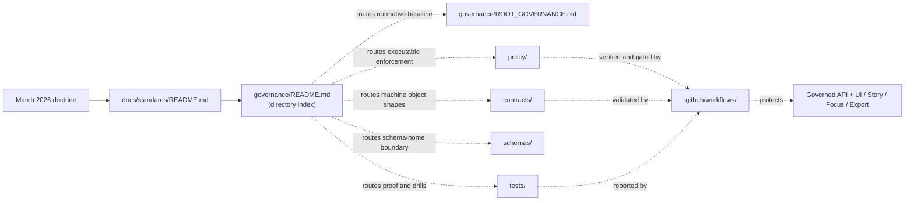

<!-- [KFM_META_BLOCK_V2]
doc_id: kfm://doc/<uuid-ON-COMMIT>
title: Governance Standards
type: standard
version: v1
status: draft
owners: @bartytime4life
created: <YYYY-MM-DD-ON-COMMIT>
updated: <YYYY-MM-DD-ON-COMMIT>
policy_label: <NEEDS-VERIFICATION>
related: [../README.md, ./ROOT_GOVERNANCE.md, ../../../policy/README.md, ../../../contracts/README.md, ../../../schemas/README.md, ../../../tests/README.md, ../../../.github/workflows/README.md]
tags: [kfm, standards, governance]
notes: [Requested path was not directly verified on public main; current standards routing points to ./ROOT_GOVERNANCE.md, which remains scaffold-only.]
[/KFM_META_BLOCK_V2] -->

# Governance Standards

_Directory README for cross-cutting KFM governance rules, review triggers, and the route-out from standards prose to executable policy, contracts, verification, and workflow gates._

> **Status:** `experimental`  
> **Doc status:** `draft`  
> **Owners:** `@bartytime4life` *(current `/docs/` CODEOWNERS owner; no narrower `docs/standards/governance/` owner was directly verified)*  
>        
> **Quick jump:** [Scope](#scope) · [Repo fit](#repo-fit) · [Current verified snapshot](#current-verified-snapshot) · [Accepted inputs](#accepted-inputs) · [Exclusions](#exclusions) · [Directory tree](#directory-tree) · [Quickstart](#quickstart) · [Usage](#usage) · [Governance lens](#governance-lens) · [Diagram](#diagram) · [Governance map](#governance-map) · [Task list](#task-list--definition-of-done) · [FAQ](#faq) · [Appendix](#appendix)

> [!IMPORTANT]
> This README is **PROPOSED** as a new directory index. The current public `main` surfaces directly verified for the governance lane show `docs/standards/governance/ROOT_GOVERNANCE.md` present and scaffold-only, while `docs/standards/README.md` currently routes governance readers to that file.
>
> If this README is adopted, make the authority split explicit:
> 1. `README.md` = directory index, routing, scope, exclusions, and review triggers.
> 2. `ROOT_GOVERNANCE.md` = normative governance baseline for the lane.
>
> If the project prefers a single governance file, move the substantive sections below into `ROOT_GOVERNANCE.md` and update `docs/standards/README.md` instead of maintaining two overlapping sources.

> [!NOTE]
> In KFM, governance is not a soft-process appendix. It is the cross-cutting rule layer that shapes publication, review, rights and sensitivity handling, runtime outcomes, correction visibility, and the boundary between authoritative truth and derived convenience layers.

## Scope

`docs/standards/governance/` should hold human-readable governance standards that multiple KFM lanes depend on.

Use this README for:
- orienting contributors to the governance sub-lane
- distinguishing index/routing guidance from the actual normative baseline
- pointing governance-affecting changes to the correct adjacent surfaces
- keeping review triggers explicit for public, sensitive, corrective, or AI-mediated outputs

Do not use it for:
- executable policy bundles or rule code
- API contracts or JSON Schema objects
- test fixtures or workflow YAML
- domain-specific runbooks, incident logs, or one-off decision records

[Back to top](#governance-standards)

## Repo fit

| Item | Value |
|---|---|
| Path | `docs/standards/governance/README.md` |
| Path status | **PROPOSED** new surface; not directly verified on public `main` |
| Current routed governance file | [`./ROOT_GOVERNANCE.md`](./ROOT_GOVERNANCE.md) |
| Role | Directory README for governance standards, review routing, and neighbor-surface boundaries |
| Upstream | [`../README.md`](../README.md) · [`../../../README.md`](../../../README.md) |
| Downstream | [`./ROOT_GOVERNANCE.md`](./ROOT_GOVERNANCE.md) |
| Adjacent governed areas | [`../../../policy/README.md`](../../../policy/README.md) · [`../../../contracts/README.md`](../../../contracts/README.md) · [`../../../schemas/README.md`](../../../schemas/README.md) · [`../../../tests/README.md`](../../../tests/README.md) · [`../../../.github/workflows/README.md`](../../../.github/workflows/README.md) |
| Why it exists | To prevent governance prose, executable policy, contracts, tests, and workflow gates from blurring into one another |

## Current verified snapshot

| Surface | Current public `main` state | What that means here |
|---|---|---|
| [`../README.md`](../README.md) | Present, substantive | The standards index already exists and currently routes governance readers to `./ROOT_GOVERNANCE.md`. |
| [`./ROOT_GOVERNANCE.md`](./ROOT_GOVERNANCE.md) | Present, scaffold-only | Governance routing is real, but the downstream baseline is still minimal. |
| `./README.md` | Not directly verified | This draft would add a new directory index and must not silently duplicate `ROOT_GOVERNANCE.md`. |
| [`../../../policy/README.md`](../../../policy/README.md) | Present, substantive | The executable policy lane already carries deny-by-default, result grammar, and runtime trust framing. |
| [`../../../contracts/README.md`](../../../contracts/README.md) | Present, substantive | Governance-facing trust objects belong there when they are machine-readable contracts. |
| [`../../../schemas/README.md`](../../../schemas/README.md) | Present, substantive | Schema-home authority is still intentionally visible as unresolved. |
| [`../../../tests/README.md`](../../../tests/README.md) | Present, substantive | Governance claims should be backed by proof objects, negative-path coverage, and drills. |
| [`../../../.github/workflows/README.md`](../../../.github/workflows/README.md) | Present, README-only for the workflows directory | Workflow YAML gates should be described cautiously until checked in and verified. |
| [`../../../.github/CODEOWNERS`](../../../.github/CODEOWNERS) | Present | `/docs/` currently routes to `@bartytime4life`; narrower governance-lane ownership is still unverified. |

> [!CAUTION]
> The strongest current-branch evidence does **not** support claiming that governance automation, rule bundles, fixture inventories, or workflow YAML gates are already live in this lane. Keep those claims marked `PROPOSED`, `UNKNOWN`, or `NEEDS VERIFICATION` until branch inspection proves them.

## Accepted inputs

Place a document in this lane when it defines a governance rule that multiple KFM surfaces must interpret the same way.

| Accepted input | Why it belongs here |
|---|---|
| Governance baseline docs | Cross-cutting rules for review, publication, correction, and trust-state handling |
| Review-trigger matrices | Shared guidance on when steward, governance, product, security, or ops review is required |
| Role / responsibility notes | Human-readable clarification of actor boundaries that multiple lanes depend on |
| Publication-class references | Shared prose about public-safe, generalized, restricted, withheld, or steward-reviewed handling |
| Correction and supersession guidance | Cross-domain rules for withdrawal, supersession, rollback, and visible narrowing of trust state |
| Governance-to-implementation routing notes | Documents that say which parts of a governance rule belong in `policy/`, `contracts/`, `tests/`, or workflows |

## Exclusions

This lane should stay human-readable and cross-cutting.

| Does **not** belong here | Put it here instead | Why |
|---|---|---|
| Rego / OPA / bundle code | [`../../../policy/`](../../../policy/) | Executable enforcement is adjacent to governance, not the same artifact |
| JSON Schema, OpenAPI, or machine contract definitions | [`../../../contracts/`](../../../contracts/) and [`../../../schemas/`](../../../schemas/) | Governance rules should point to machine objects, not duplicate them |
| Fixtures, drills, or negative-path test packs | [`../../../tests/`](../../../tests/) | Proof belongs in verification surfaces |
| Workflow YAML | [`../../../.github/workflows/`](../../../.github/workflows/) | Automation must stay reviewable in its own lane |
| Domain-specific runbooks or source-specific exceptions | Domain docs / runbooks | Governance standards should not become operational miscellany |
| One-off decision logs, incident notes, or ad hoc review records | The verified review / ops / report surface | This lane is for reusable standards, not event history |

> [!NOTE]
> A practical rule: if a file mainly answers “what is the shared governance rule?”, it likely belongs here. If it mainly answers “how does one package, enforce, or test that rule?”, it likely belongs elsewhere.

## Directory tree

### Current verified snapshot

```text
docs/standards/governance/
└── ROOT_GOVERNANCE.md
```

### Draft growth shape if this README is adopted

```text
docs/standards/governance/
├── README.md
└── ROOT_GOVERNANCE.md
```

> [!WARNING]
> Do not let both files become parallel normative authorities. Either keep this README strictly as the directory index or collapse the lane back to a single-file baseline.

[Back to top](#governance-standards)

## Quickstart

Use the smallest inspection loop that can tell you whether your change belongs in governance prose, executable policy, machine contracts, tests, or workflow gates.

```bash
# 1) Inspect the governance lane
find docs/standards/governance -maxdepth 2 -type f | sort

# 2) Read the parent standards index and the current governance scaffold
sed -n '1,260p' docs/standards/README.md
sed -n '1,120p' docs/standards/governance/ROOT_GOVERNANCE.md

# 3) Cross-check adjacent executable and review surfaces
sed -n '1,260p' policy/README.md
sed -n '1,260p' contracts/README.md
sed -n '1,260p' schemas/README.md
sed -n '1,260p' tests/README.md
sed -n '1,260p' .github/workflows/README.md

# 4) Confirm ownership
sed -n '1,200p' .github/CODEOWNERS
grep -nE '^/docs/' .github/CODEOWNERS || true
```

### Minimal review order

1. Read [`../README.md`](../README.md) first.
2. Decide whether the change is an index/routing change or a normative baseline change.
3. If the rule must become executable, route follow-on work to [`../../../policy/`](../../../policy/), [`../../../contracts/`](../../../contracts/), [`../../../schemas/`](../../../schemas/), [`../../../tests/`](../../../tests/), or [`../../../.github/workflows/`](../../../.github/workflows/).
4. Update the parent standards index if this README becomes a real surface on the target branch.
5. Keep public-branch reality explicit; do not backfill imagined implementation depth.

## Usage

### For maintainers

Use this README to keep the governance sub-lane legible. It should explain what the governance directory is for, how it relates to the standards index, and where enforcement or proof belongs when governance becomes executable.

### For policy authors

Link governance prose to executable policy, but do not duplicate rule bodies here. If a governance rule needs stable outcomes, reasons, obligations, or review routing, implement and test those in the policy and verification lanes.

### For domain stewards

Reference governance standards from domain docs instead of copying them into local READMEs. Local adaptations should be explicit extensions, not silent forks.

### For UI, Story, and Focus contributors

Start here when a change affects public claims, review visibility, evidence inspection, sensitive data handling, correction state, or AI-mediated outputs. Governance review should happen before those changes are treated as mere UX polish.

## Governance lens

The governance lane should keep these KFM-wide expectations visible even when the implementation details live elsewhere.

| Governance principle | Why it matters |
|---|---|
| Governed truth path | Trust state changes through explicit transitions, not silent file movement or undocumented automation |
| Trust membrane | Public and standard client paths read through governed APIs and evidence resolution, not direct store access |
| Authoritative vs derived split | Tiles, search, summaries, exports, graphs, scenes, and AI outputs must stay subordinate to promoted scope |
| Cite-or-abstain / fail-closed | `ABSTAIN`, `DENY`, `ERROR`, stale-visible, generalized, withdrawn, and superseded states are governance outcomes, not afterthoughts |
| Rights and sensitivity handling | Exact-location, oral-history, archaeology, biodiversity, and similar lanes require explicit visibility controls and review triggers |
| Correction visibility | Withdrawal, supersession, rollback, and narrowing of trust state must remain inspectable at public and steward surfaces |

## Diagram


```mermaid
flowchart LR
    A["March 2026 doctrine"] --> B["docs/standards/README.md"]
    B --> C["governance/README.md<br>(directory index)"]
    C -. "routes normative baseline" .-> D["governance/ROOT_GOVERNANCE.md"]
    C -. "routes executable enforcement" .-> E["policy/"]
    C -. "routes machine object shapes" .-> F["contracts/"]
    C -. "routes schema-home boundary" .-> G["schemas/"]
    C -. "routes proof and drills" .-> H["tests/"]
    E -. "verified and gated by" .-> I[".github/workflows/"]
    F -. "validated by" .-> I
    H -. "reported by" .-> I
    I -. "protects" .-> J["Governed API + UI / Story / Focus / Export"]
```

## Governance map

| Surface | Primary responsibility | Put guidance here when... | Not the place for |
|---|---|---|---|
| `docs/standards/governance/README.md` | Directory index, scope boundary, neighbor routing, review triggers | The question is where governance rules live or which governed surface must change next | Executable rules or machine contracts |
| `docs/standards/governance/ROOT_GOVERNANCE.md` | Normative governance baseline for the standards lane | The rule itself needs human-readable standardization | Parallel copies of policy bundles or tests |
| `policy/` | Executable decision logic, bundles, fixtures, result grammar | A governance rule must be enforced or evaluated mechanically | Narrative restatement of the standard as if that were enforcement |
| `contracts/` | Machine-readable trust objects and envelopes | Governance changes require typed fields or stable object shapes | Free-form prose about review practice |
| `schemas/` | Schema-home boundary while authority is still explicit and unresolved | The change affects schema placement, not just meaning | Duplicated governance prose |
| `tests/` | Proof, drills, negative-path coverage, release/correction checks | The rule must be demonstrated, not just stated | Untested governance claims |
| `.github/workflows/` | Merge, promotion, release, and post-deploy automation | The rule becomes a gate or required check | The only copy of the governance rule |

### Common review triggers

| Change | Minimum follow-on check |
|---|---|
| New public claim surface, export, or summary path | Recheck governance prose, policy result grammar, contract fields, and negative-path tests |
| New rights / sensitivity / generalization rule | Update governance baseline, policy bundles, and proof coverage together |
| New reviewer role or steward-only path | Update ownership / review routing and verify no self-approval drift |
| Change to correction, supersession, or withdrawal behavior | Update governance prose, contracts, tests, and workflow documentation together |
| AI-mediated, Story, or Focus behavior change | Recheck cite-or-abstain, evidence visibility, and calm failure behavior before merge |

## Task list & definition of done

### Adoption tasks

- [ ] Decide whether `docs/standards/governance/` will stay single-file (`ROOT_GOVERNANCE.md`) or become dual-surface (`README.md` + `ROOT_GOVERNANCE.md`).
- [ ] If this README is added, update [`../README.md`](../README.md) so the governance lane no longer routes only to `ROOT_GOVERNANCE.md`.
- [ ] Keep `ROOT_GOVERNANCE.md` as the normative baseline, or explicitly merge its role into this README—never both silently.
- [ ] Replace reviewable placeholders in the KFM meta block before merge.

### Definition of done

A governance lane README is ready when all of the following are true:

- [ ] The file’s role is explicit: **directory index** versus **normative baseline**.
- [ ] Scope and exclusions keep governance prose from turning into policy code, contracts, tests, or workflow YAML.
- [ ] Relative links resolve to the standards index, governance baseline, and adjacent executable surfaces.
- [ ] Current public-branch reality is stated honestly, including scaffold-only or unverified status where it still applies.
- [ ] Review triggers are visible for sensitive, public, corrective, or AI-mediated changes.
- [ ] The file does not silently override stronger doctrine or duplicate a neighboring authoritative surface.
- [ ] Any claim about enforcement, automation, or ownership that is not directly branch-verified remains marked `PROPOSED`, `UNKNOWN`, or `NEEDS VERIFICATION`.

[Back to top](#governance-standards)

## FAQ

### Does this README replace `ROOT_GOVERNANCE.md`?

No. This draft assumes `ROOT_GOVERNANCE.md` remains the governance baseline unless maintainers explicitly collapse the lane back to one file.

### Should executable governance logic live here?

No. Executable enforcement belongs in [`../../../policy/`](../../../policy/). This README should explain the rule surface and route contributors to the right machine-checkable lane.

### When should I edit this README instead of `ROOT_GOVERNANCE.md`?

Edit this README when the change affects directory role, routing, exclusions, or neighbor-surface boundaries. Edit `ROOT_GOVERNANCE.md` when the governance rule itself needs to change.

### What if the project wants only one governance file?

Move the normative sections into `ROOT_GOVERNANCE.md`, update [`../README.md`](../README.md) so it points there, and drop this README rather than maintaining two overlapping authorities.

## Appendix

<details>
<summary>Evidence basis and open verification items</summary>

### Directly verified public-branch surfaces

- `docs/standards/README.md`
- `docs/standards/governance/ROOT_GOVERNANCE.md`
- `policy/README.md`
- `contracts/README.md`
- `schemas/README.md`
- `tests/README.md`
- `.github/workflows/README.md`
- `.github/CODEOWNERS`
- `.github/PULL_REQUEST_TEMPLATE.md`

### Doctrine anchors used to keep terminology stable

- KFM master / canonical / expanded working manuals
- KFM unified geospatial and MapLibre UI manuals
- KFM components and repo-grounded research syntheses

### Still open before commit

- Whether the target branch should add `docs/standards/governance/README.md` at all
- Whether `ROOT_GOVERNANCE.md` remains the normative baseline or should be replaced
- Narrower ownership than the current `/docs/` CODEOWNERS rule
- Any mounted-checkout descendants, workflow YAML, policy bundles, fixtures, or tests not visible on public `main`

</details>
