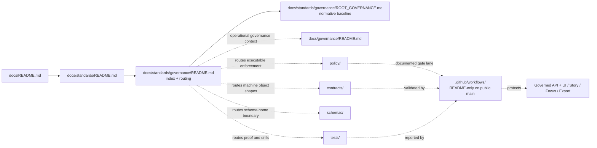

<!-- [KFM_META_BLOCK_V2]
doc_id: kfm://doc/<uuid-ON-COMMIT>
title: Governance Standards
type: standard
version: v1
status: draft
owners: @bartytime4life
created: <YYYY-MM-DD-ON-COMMIT>
updated: <YYYY-MM-DD-ON-COMMIT>
policy_label: <NEEDS-VERIFICATION>
related: [../README.md, ./ROOT_GOVERNANCE.md, ../../governance/README.md, ../../../policy/README.md, ../../../contracts/README.md, ../../../schemas/README.md, ../../../tests/README.md, ../../../.github/workflows/README.md]
tags: [kfm, standards, governance]
notes: [Public-main path verified; replace doc_id/created/updated/policy_label placeholders on commit; parent standards index still foregrounds ./ROOT_GOVERNANCE.md.]
[/KFM_META_BLOCK_V2] -->

# Governance Standards

_Directory README for cross-cutting KFM governance rules, review triggers, and the route-out from standards prose to executable policy, contracts, verification, and workflow gates._

> **Status:** `experimental`  
> **Doc status:** `draft`  
> **Owners:** `@bartytime4life` *(current public `/docs/` CODEOWNERS owner; no narrower `docs/standards/governance/` rule was directly verified on public `main`)*  
>         
> **Repo fit:** `docs/standards/governance/README.md` · upstream [`../README.md`](../README.md) / [`../../../README.md`](../../../README.md) · normative companion [`./ROOT_GOVERNANCE.md`](./ROOT_GOVERNANCE.md) · operational governance companion [`../../governance/README.md`](../../governance/README.md)  
> **Quick jump:** [Scope](#scope) · [Repo fit](#repo-fit) · [Current public governance standards surface](#current-public-governance-standards-surface) · [Accepted inputs](#accepted-inputs) · [Exclusions](#exclusions) · [Directory tree](#directory-tree) · [Quickstart](#quickstart) · [Usage](#usage) · [Diagram](#diagram) · [Governance map](#governance-map) · [Task list / definition of done](#task-list--definition-of-done) · [FAQ](#faq) · [Appendix](#appendix)

> [!IMPORTANT]
> This README is a **CONFIRMED checked-in public-branch surface**, not a merely proposed future file.
>
> The authority split should stay explicit:
> 1. `README.md` = directory index, routing, lane boundary, and review-trigger surface.
> 2. `ROOT_GOVERNANCE.md` = normative governance baseline for the standards lane.
>
> The current checked-in text should be revised **in place**, not replaced by a second parallel index.

> [!NOTE]
> In KFM, governance is not a soft-process appendix. It is the cross-cutting rule layer that shapes publication, review, rights and sensitivity handling, runtime outcomes, correction visibility, and the boundary between authoritative truth and derived convenience layers.

## Scope

`docs/standards/governance/` is the standards-lane home for human-readable governance rules that multiple KFM surfaces must interpret the same way.

Use this README for:
- orienting contributors to the governance sub-lane
- distinguishing index/routing guidance from the actual normative baseline
- pointing governance-affecting changes to the correct adjacent surfaces
- keeping review triggers explicit for public, sensitive, corrective, or AI-mediated outputs

Do not use it for:
- executable policy bundles or rule code
- API contracts or JSON Schema objects
- test fixtures or workflow YAML
- domain-specific runbooks, incident logs, or one-off decision records

[Back to top](#governance-standards)

## Repo fit

| Item | Value |
|---|---|
| Path | `docs/standards/governance/README.md` |
| Path status | **CONFIRMED** on public `main`; exact working-branch parity remains **NEEDS VERIFICATION** |
| Role | Directory README for governance standards, routing, lane boundaries, and review-trigger guidance |
| Upstream | [`../README.md`](../README.md) · [`../../../README.md`](../../../README.md) |
| Normative companion | [`./ROOT_GOVERNANCE.md`](./ROOT_GOVERNANCE.md) |
| Operational governance companion | [`../../governance/README.md`](../../governance/README.md) |
| Adjacent executable / proof surfaces | [`../../../policy/README.md`](../../../policy/README.md) · [`../../../contracts/README.md`](../../../contracts/README.md) · [`../../../schemas/README.md`](../../../schemas/README.md) · [`../../../tests/README.md`](../../../tests/README.md) · [`../../../.github/workflows/README.md`](../../../.github/workflows/README.md) |
| Ownership signal | Current public `/.github/CODEOWNERS` routes `/docs/` to `@bartytime4life`; no narrower governance-lane owner was directly verified |
| Why it exists | To keep governance prose, operational governance navigation, executable policy, machine contracts, proof objects, and automation gates from blurring into one another |

## Current public governance standards surface

The governance standards lane is real on current public `main`, but its checked-in README text still contains stale path-state language that should be corrected rather than copied forward.

| Surface | Current public `main` state | Why it matters here |
|---|---|---|
| [`./README.md`](./README.md) | Present, substantive draft directory README | This file already exists and should be revised in place. |
| [`./ROOT_GOVERNANCE.md`](./ROOT_GOVERNANCE.md) | Present, substantive draft standard | This is the normative governance baseline for the standards lane, not a mere scaffold. |
| [`../README.md`](../README.md) | Present, substantive standards index | The parent index still foregrounds `governance/ROOT_GOVERNANCE.md` in its downstream routing and should be updated if it is meant to advertise this README explicitly. |
| [`../../governance/README.md`](../../governance/README.md) | Present, substantive directory contract | This is the broader governance directory companion for ethics, sovereignty, consent, and operational routing. |
| [`../../../policy/README.md`](../../../policy/README.md) | Present, substantive | Executable governance belongs there once a rule must be enforced mechanically. |
| [`../../../contracts/README.md`](../../../contracts/README.md) | Present, substantive | Governance-facing trust objects, envelopes, and typed machine contracts belong there. |
| [`../../../schemas/README.md`](../../../schemas/README.md) | Present, substantive parent boundary | Schema-home authority is intentionally still visible as unresolved. |
| [`../../../tests/README.md`](../../../tests/README.md) | Present, substantive | Governance claims should be backed by proof objects, negative-path coverage, and drills. |
| [`../../../.github/workflows/README.md`](../../../.github/workflows/README.md) | Present, README-only lane | Public `main` still does not prove checked-in workflow YAML in that directory. |
| [`../../../.github/CODEOWNERS`](../../../.github/CODEOWNERS) | Present | Public ownership currently routes `/docs/` to `@bartytime4life`; narrower governance-specific ownership is still unverified. |

> [!CAUTION]
> Current public-branch evidence supports path inventory and README-level lane boundaries. It does **not** support stronger claims that governance automation, workflow gates, policy bundles, fixtures, or proof packs are already live for this lane.

## Accepted inputs

Place a document in this lane when it defines a governance rule that multiple KFM surfaces must interpret the same way.

| Accepted input | Why it belongs here |
|---|---|
| Governance baseline docs | Cross-cutting rules for review, publication, correction, and trust-state handling |
| Review-trigger matrices | Shared guidance on when steward, governance, product, security, or ops review is required |
| Role / responsibility notes | Human-readable clarification of actor boundaries that multiple lanes depend on |
| Publication-class references | Shared prose about public-safe, generalized, restricted, withheld, or steward-reviewed handling |
| Correction and supersession guidance | Cross-domain rules for withdrawal, supersession, rollback, and visible narrowing of trust state |
| Governance-to-implementation routing notes | Documents that say which parts of a governance rule belong in `policy/`, `contracts/`, `schemas/`, `tests/`, or workflows |

## Exclusions

This lane should stay human-readable and cross-cutting.

| Does **not** belong here | Put it here instead | Why |
|---|---|---|
| Rego / OPA / bundle code | [`../../../policy/`](../../../policy/) | Executable enforcement is adjacent to governance, not the same artifact |
| JSON Schema, OpenAPI, or machine contract definitions | [`../../../contracts/`](../../../contracts/) and [`../../../schemas/`](../../../schemas/) | Governance rules should point to machine objects, not duplicate them |
| Fixtures, drills, or negative-path test packs | [`../../../tests/`](../../../tests/) | Proof belongs in verification surfaces |
| Workflow YAML | [`../../../.github/workflows/`](../../../.github/workflows/) | Automation must stay reviewable in its own lane |
| Operational governance directory routing for ethics / sovereignty / consent | [`../../governance/`](../../governance/) | Broader governance navigation belongs in the operational governance lane |
| Domain-specific runbooks or source-specific exceptions | Domain docs / runbooks | Governance standards should not become operational miscellany |
| One-off decision logs, incident notes, or ad hoc review records | The verified review / ops / report surface | This lane is for reusable standards, not event history |

> [!NOTE]
> A practical rule: if a file mainly answers **“what is the shared governance rule?”**, it likely belongs here. If it mainly answers **“how is that rule packaged, enforced, or tested?”**, it likely belongs elsewhere.

## Directory tree

The tree below reflects the files directly verified in this directory on current public `main`.

```text
docs/standards/governance/
├── README.md
└── ROOT_GOVERNANCE.md
```

### Working authority split

| File | Working role |
|---|---|
| [`README.md`](./README.md) | Directory index, routing surface, lane boundary, and review-trigger guidance |
| [`ROOT_GOVERNANCE.md`](./ROOT_GOVERNANCE.md) | Root governance standard for the standards lane |

> [!WARNING]
> Do not let both files become parallel normative authorities. Keep this README as the index/routing surface unless maintainers intentionally collapse the lane back to a single-file model.

[Back to top](#governance-standards)

## Quickstart

Use the smallest inspection loop that can tell you whether your change belongs in governance prose, operational governance docs, executable policy, machine contracts, tests, or workflow gates.

```bash
# 1) Inspect the governance standards lane
find docs/standards/governance -maxdepth 2 -type f | sort

# 2) Read the standards index, this README, and the normative baseline
sed -n '1,260p' docs/standards/README.md
sed -n '1,260p' docs/standards/governance/README.md
sed -n '1,220p' docs/standards/governance/ROOT_GOVERNANCE.md

# 3) Cross-check the broader governance directory and adjacent machine surfaces
sed -n '1,240p' docs/governance/README.md
sed -n '1,260p' policy/README.md
sed -n '1,260p' contracts/README.md
sed -n '1,260p' schemas/README.md
sed -n '1,260p' tests/README.md
sed -n '1,260p' .github/workflows/README.md

# 4) Confirm ownership and reviewer expectations
sed -n '1,200p' .github/CODEOWNERS
sed -n '1,220p' .github/PULL_REQUEST_TEMPLATE.md
grep -nE '^/docs/' .github/CODEOWNERS || true
```

### Minimal review order

1. Read [`../README.md`](../README.md) first to understand the standards lane boundary.
2. Read this README when the question is lane role, routing, or review-trigger placement.
3. Read [`./ROOT_GOVERNANCE.md`](./ROOT_GOVERNANCE.md) when the governance rule itself needs to change.
4. Read [`../../governance/README.md`](../../governance/README.md) when the change also affects ethics, sovereignty, consent, or broader governance routing.
5. If the rule must become executable, route follow-on work to [`../../../policy/`](../../../policy/), [`../../../contracts/`](../../../contracts/), [`../../../schemas/`](../../../schemas/), [`../../../tests/`](../../../tests/), or [`../../../.github/workflows/`](../../../.github/workflows/).
6. Update [`../README.md`](../README.md) whenever the governance lane’s routing or maturity snapshot changes.

## Usage

### For maintainers

Use this README to keep the governance standards sub-lane legible. It should explain what the directory is for, how it relates to the standards index, and where a governance-significant change must travel next.

### For policy authors

Link governance prose to executable policy, but do not duplicate rule bodies here. If a governance rule needs stable outcomes, reasons, obligations, or review routing, implement and test those in the policy and verification lanes.

### For docs / governance editors

Use this file to keep the split explicit between standards-lane governance and the broader [`docs/governance/`](../../governance/) directory. The former is the standards-layer rule surface; the latter is the wider governance directory for ethics, sovereignty, consent, and operational navigation.

### For domain stewards

Reference governance standards from domain docs instead of copying them into local READMEs. Local adaptations should be explicit extensions, not silent forks.

### For UI, Story, and Focus contributors

Start here when a change affects public claims, review visibility, evidence inspection, sensitive data handling, correction state, or AI-mediated outputs. Governance review should happen before those changes are treated as mere UX polish.

## Diagram


```mermaid
flowchart LR
    A["docs/README.md"] --> B["docs/standards/README.md"]
    B --> C["docs/standards/governance/README.md<br>index + routing"]
    C --> D["docs/standards/governance/ROOT_GOVERNANCE.md<br>normative baseline"]
    C -. "operational governance context" .-> E["docs/governance/README.md"]
    C -. "routes executable enforcement" .-> F["policy/"]
    C -. "routes machine object shapes" .-> G["contracts/"]
    C -. "routes schema-home boundary" .-> H["schemas/"]
    C -. "routes proof and drills" .-> I["tests/"]
    F -. "documented gate lane" .-> J[".github/workflows/<br>README-only on public main"]
    G -. "validated by" .-> J
    I -. "reported by" .-> J
    J -. "protects" .-> K["Governed API + UI / Story / Focus / Export"]
```

## Governance map

| Surface | Primary responsibility | Put guidance here when... | Not the place for |
|---|---|---|---|
| [`../README.md`](../README.md) | Standards-lane index | The question is which standards file owns the rule | Detailed governance law |
| [`./README.md`](./README.md) | Governance standards lane index, routing, and review triggers | The question is where governance rules live or which governed surface must change next | Executable rules or machine contracts |
| [`./ROOT_GOVERNANCE.md`](./ROOT_GOVERNANCE.md) | Normative governance baseline for the standards lane | The governance rule itself needs human-readable standardization | Parallel copies of policy bundles or tests |
| [`../../governance/README.md`](../../governance/README.md) | Broader governance directory contract | The change also affects ethics, sovereignty, consent, or governance-wide navigation | Replacing the standards-lane governance baseline |
| [`../../../policy/`](../../../policy/) | Executable decision logic, bundles, fixtures, result grammar | A governance rule must be enforced or evaluated mechanically | Narrative restatement of the standard as if that were enforcement |
| [`../../../contracts/`](../../../contracts/) | Machine-readable trust objects and envelopes | Governance changes require typed fields or stable object shapes | Free-form prose about review practice |
| [`../../../schemas/`](../../../schemas/) | Schema-home boundary while authority is still explicit and unresolved | The change affects schema placement, not just meaning | Duplicated governance prose |
| [`../../../tests/`](../../../tests/) | Proof, drills, negative-path coverage, release/correction checks | The rule must be demonstrated, not just stated | Untested governance claims |
| [`../../../.github/workflows/`](../../../.github/workflows/) | Merge, promotion, release, and post-deploy automation | The rule becomes a gate or required check | The only copy of the governance rule |

### Common review triggers

| Change | Minimum follow-on check |
|---|---|
| New public claim surface, export, or summary path | Recheck governance prose, policy result grammar, contract fields, and negative-path tests |
| New rights / sensitivity / generalization rule | Update governance baseline, policy bundles, and proof coverage together |
| New reviewer role or steward-only path | Update ownership / review routing and verify no self-approval drift |
| Change to correction, supersession, or withdrawal behavior | Update governance prose, contracts, tests, and workflow documentation together |
| AI-mediated, Story, or Focus behavior change | Recheck cite-or-abstain, evidence visibility, calm failure behavior, and negative-path handling before merge |
| Change that spans standards governance and operational governance | Update both [`./ROOT_GOVERNANCE.md`](./ROOT_GOVERNANCE.md) and [`../../governance/README.md`](../../governance/README.md) only where each surface truly owns the change |

## Task list / definition of done

### Adoption tasks

- [ ] Update [`../README.md`](../README.md) so the governance lane explicitly routes to both this README and [`./ROOT_GOVERNANCE.md`](./ROOT_GOVERNANCE.md), rather than foregrounding only the latter.
- [ ] Keep the README-vs-ROOT authority split explicit in both files.
- [ ] Replace reviewable placeholders in the KFM meta block before merge.
- [ ] Re-verify the working branch for narrower ownership, extra descendants, or additional companion docs before final commit.
- [ ] Keep any workflow, policy, contract, or proof claims marked `PROPOSED`, `UNKNOWN`, or `NEEDS VERIFICATION` until branch-level evidence proves them.

### Definition of done

A governance lane README is ready when all of the following are true:

- [ ] The file’s role is explicit: **directory index** versus **normative baseline**.
- [ ] Scope and exclusions keep governance prose from turning into policy code, contracts, tests, or workflow YAML.
- [ ] Relative links resolve to the standards index, governance baseline, broader governance companion, and adjacent executable surfaces.
- [ ] Current public-branch reality is stated honestly, including README-only or unverified status where it still applies.
- [ ] Review triggers are visible for sensitive, public, corrective, or AI-mediated changes.
- [ ] The file does not silently override stronger doctrine or duplicate a neighboring authoritative surface.
- [ ] Any claim about enforcement, automation, platform settings, or ownership that is not directly branch-verified remains marked `PROPOSED`, `UNKNOWN`, or `NEEDS VERIFICATION`.

[Back to top](#governance-standards)

## FAQ

### Does this README replace `ROOT_GOVERNANCE.md`?

No. This README is the lane index and routing surface. [`ROOT_GOVERNANCE.md`](./ROOT_GOVERNANCE.md) remains the normative governance baseline unless maintainers intentionally collapse the lane back to one file.

### Why do both `docs/standards/governance/` and `docs/governance/` exist?

They serve different roles. `docs/standards/governance/` is the standards-lane governance surface for shared cross-domain rules. [`docs/governance/`](../../governance/) is the broader governance directory for ethics, sovereignty, consent, and operational governance navigation.

### Should executable governance logic live here?

No. Executable enforcement belongs in [`../../../policy/`](../../../policy/). This README should explain the rule surface and route contributors to the right machine-checkable lane.

### Does this README prove workflow enforcement is live?

No. Current public `main` confirms the workflows documentation lane, but not checked-in workflow YAML in `/.github/workflows/`. Treat merge-gate, ruleset, approval, and platform wiring claims as **NEEDS VERIFICATION** unless the active branch proves them.

### When should I edit this README instead of `ROOT_GOVERNANCE.md`?

Edit this README when the change affects directory role, routing, exclusions, or neighbor-surface boundaries. Edit [`ROOT_GOVERNANCE.md`](./ROOT_GOVERNANCE.md) when the governance rule itself needs to change.

## Appendix

<details>
<summary>Evidence basis and open verification items</summary>

### Directly verified public-branch surfaces

- `docs/standards/README.md`
- `docs/standards/governance/README.md`
- `docs/standards/governance/ROOT_GOVERNANCE.md`
- `docs/governance/README.md`
- `policy/README.md`
- `contracts/README.md`
- `schemas/README.md`
- `tests/README.md`
- `.github/workflows/README.md`
- `.github/CODEOWNERS`
- `.github/PULL_REQUEST_TEMPLATE.md`

### Doctrine anchors used to keep terminology stable

- KFM repo-root README
- KFM canonical master reference manual
- KFM unified geospatial architecture successor edition
- KFM MapLibre UI architecture and governed interaction design
- KFM components / idea-atlas continuity syntheses

### Still open before commit

- Exact `doc_id`, `created`, `updated`, and `policy_label` values for the meta block
- Narrower ownership than the current public `/docs/` CODEOWNERS rule
- Exact working-branch parity with current public `main`
- Any active workflow YAML, policy bundles, fixtures, or proof packs beyond the checked-in README surfaces
- Whether the parent standards index should explicitly advertise this README as a primary downstream governance surface

</details>
