<div align="center">

# 🏛️ **Kansas Frontier Matrix — Governance & Ethical Oversight Framework**  
`docs/standards/governance/README.md`

**Purpose:**  
Provide an overview of the ethical, procedural, and administrative governance systems that guide the Kansas Frontier Matrix (KFM).  
Governance ensures that all operations, datasets, and technologies align with **FAIR+CARE principles**, **Master Coder Protocol (MCP v6.3)**, and the KFM **Root Governance Charter**.

[](../../README.md)
[](../../../LICENSE)
[](../faircare.md)
[]()

</div>

---

## 📘 Overview

The **Kansas Frontier Matrix (KFM)** operates under a **documented governance system** designed to balance open science, ethical responsibility, and community inclusion.  
Governance functions as a **distributed accountability network**, combining automation (CI/CD validation, telemetry) with human oversight (the FAIR+CARE Council and associated committees).

This directory defines:

- Governance structure and councils  
- Ethical review and approval workflows  
- Integration with automated telemetry and audit systems  
- Roles, responsibilities, and review cadence  

Root charter: [`ROOT-GOVERNANCE.md`](ROOT-GOVERNANCE.md)

---

## 🗂️ Directory Layout

```plaintext
docs/standards/governance/
├── README.md                 # This index file
└── ROOT-GOVERNANCE.md        # The complete governance charter (authoritative)
```

---

## ⚖️ Governance Structure Overview

KFM’s governance model combines **technical automation** and **human ethical review** to maintain transparent and reproducible data operations.

| Body | Function | Composition | Frequency |
|---|---|---|---|
| **FAIR+CARE Council** | Oversees ethical, cultural, and Indigenous data governance. | 7 members (2 Indigenous reps, 2 data stewards, 3 technical leads) | Quarterly |
| **Technical Standards Committee** | Manages MCP rules, schemas, and validation workflows. | 5 developers, 1 auditor | Monthly |
| **AI Governance Subcommittee** | Reviews AI bias, transparency, and ethical risk. | 3 AI engineers, 2 ethicists | Biannual |
| **Open Science Board** | Ensures licensing, accessibility, and reproducibility. | 4 data curators, 2 accessibility advisors | Quarterly |

Detailed responsibilities and voting procedures are codified in [`ROOT-GOVERNANCE.md`](ROOT-GOVERNANCE.md).

---

## 🧩 Roles & Responsibilities

| Role | Responsibility | Reports To |
|---|---|---|
| **Governance Chair** | Coordinates FAIR+CARE Council; signs off on ethical approvals. | FAIR+CARE Council |
| **Technical Maintainer** | Implements validation workflows, schemas, and telemetry integrations. | Technical Standards Committee |
| **AI Steward** | Oversees responsible AI training, evaluation, and explainability. | AI Governance Subcommittee |
| **Data Curator** | Reviews dataset metadata for completeness, provenance, and CARE tags. | Open Science Board |
| **Accessibility Auditor** | Evaluates UI and docs against WCAG 2.1 AA standards. | Open Science Board |

---

## 🧠 Ethical Governance Workflow

### High-Level Process

```mermaid
flowchart TD
  A["Dataset or Feature Submitted"] --> B["Automated FAIR+CARE Validation"]
  B --> C{"CARE Review Required?"}
  C -->|No| D["Auto-Approve → Catalog & Telemetry"]
  C -->|Yes| E["Governance Council Review"]
  E --> F["Council Decision Logged in Governance Ledger"]
  F --> G["Release Gate / Remediation"]
  D --> G
```



### Primary Outputs

- FAIR+CARE validation reports → `reports/fair/faircare_summary.json`  
- Governance decisions → `reports/audit/governance-ledger.json`  
- Telemetry events → `releases/v10.2.0/focus-telemetry.json`

---

## 🧮 Decision Types & Status Codes

| Status | Definition | Action |
|---|---|---|
| ✅ **Approved** | Fully compliant with FAIR+CARE and MCP requirements. | Dataset/model may be published and indexed. |
| ⚙️ **Approved with Conditions** | Minor issues; corrective actions required. | Asset flagged; follow-up tracked in ledger. |
| 🕓 **Pending Review** | Awaiting Council or committee decision. | Auto-reminder and escalation rules apply. |
| ❌ **Rejected** | Fails ethical or technical compliance checks. | Asset withheld from public release; requires remediation. |

Status changes are logged in `reports/audit/governance-ledger.json` with timestamps and reviewer IDs.

---

## 🧾 Governance Review Template Integration

All governance actions should be initiated via structured issue forms:

```plaintext
.github/ISSUE_TEMPLATE/governance_form.yml
```

**Form Content Includes:**

- Requesting party and affiliation  
- Dataset/model references (STAC/DCAT ID, contract ID)  
- CARE evaluation and community context  
- Proposed use-case and risk assessment  
- Decision outcome, timestamp, and reviewer signatures  

This form feeds into Council review workflows and ledger entries.

---

## 🧩 Automation & Audit Integration

| System | Function | Primary Output |
|---|---|---|
| **CI/CD Pipelines** | Validate and tag new datasets or models (FAIR+CARE + contracts). | `reports/self-validation/**` |
| **Governance Ledger** | Immutable record of decisions and ethics reviews. | `reports/audit/governance-ledger.json` |
| **Telemetry Dashboard** | Real-time visualization of governance and compliance metrics. | `docs/reports/telemetry/governance_scorecard.json` |
| **AI Governance Module** | Evaluates explainability, drift, and bias metrics for models. | `reports/audit/ai_models.json` |

Automation and human review operate together to maintain a verifiable governance chain.

---

## ⚖️ FAIR+CARE in Governance

| Principle | Governance Implementation | Reference |
|---|---|---|
| **Findable** | Governance decisions indexed by dataset/model ID and version. | Governance Ledger |
| **Accessible** | Summaries and dashboards publicly available where appropriate. | Telemetry Scorecards |
| **Interoperable** | Governance data uses JSON-LD and PROV-O / DCAT-compatible schemas. | Release manifests |
| **Reusable** | Reviews archived per release; decisions link to assets via IDs. | Ledger + manifests |
| **CARE** | Indigenous and community partners are part of review for cultural data; CARE tags used to gate release. | FAIR+CARE Council |

See also: [`faircare.md`](../faircare.md)

---

## 🧮 Quarterly Governance Audit

Each quarter, a governance audit is conducted to assess:

- Dataset licensing & contract coverage  
- CARE status distribution (`approved`, `revision`, `restricted`)  
- Pending review backlog and turnaround time  
- Governance ledger & telemetry integrity

**Outputs**

```plaintext
reports/audit/governance-ledger.json
docs/reports/telemetry/governance_scorecard.json
```

**Example Audit Summary**

```json
{
  "event": "quarterly_audit",
  "datasets_reviewed": 243,
  "approvals": 238,
  "pending": 3,
  "rejections": 2,
  "timestamp": "2025-11-05T20:15:00Z"
}
```

---

## 📊 Governance Metrics Dashboard

Metrics visualized in Governance Dashboard (e.g., `web/src/components/DashboardView/`):

| Metric | Description | Source |
|---|---|---|
| **Compliance Rate (%)** | Percent of assets passing FAIR+CARE + contract checks. | `governance_scorecard.json` |
| **CARE Review Volume** | Number of datasets/models flagged for CARE review. | `governance-ledger.json` |
| **Review Turnaround Time** | Average time from submission to decision. | CI telemetry |
| **Audit Log Integrity** | Number of ledger entries with valid checksums. | Ledger + checksums |

Dashboards consume `focus-telemetry.json` for aggregate trends.

---

## 🧾 Governance Policy Links

| Document | Description |
|---|---|
| [`ROOT-GOVERNANCE.md`](ROOT-GOVERNANCE.md) | Authoritative governance charter and bylaws. |
| [`../faircare.md`](../faircare.md) | FAIR+CARE governance principles. |
| [`../licensing.md`](../licensing.md) | Licensing and IP governance. |
| [`../telemetry_standards.md`](../telemetry_standards.md) | Telemetry governance and sustainability metrics. |

---

## 🕰️ Version History

| Version | Date | Author | Summary |
|---|---|---|---|
| v10.2.2 | 2025-11-12 | A. Barta | Updated release/telemetry refs to v10.2.0; clarified Council workflow, CARE integration, and dashboard sources. |
| v9.7.0 | 2025-11-05 | A. Barta | Added complete governance framework index linking to FAIR+CARE Council and automated audit systems. |
| v9.5.0 | 2025-10-20 | A. Barta | Expanded council roles, quorum, and telemetry linkage. |
| v9.0.0 | 2025-06-01 | KFM Core Team | Created governance documentation foundation. |

---

<div align="center">

**© 2025 Kansas Frontier Matrix — CC-BY 4.0**  
Governed under **Master Coder Protocol v6.3** · FAIR+CARE Certified · Diamond⁹ Ω / Crown∞Ω Ultimate Certified  
[Back to Standards Index](../README.md) · [Root Governance Charter](ROOT-GOVERNANCE.md)

</div>