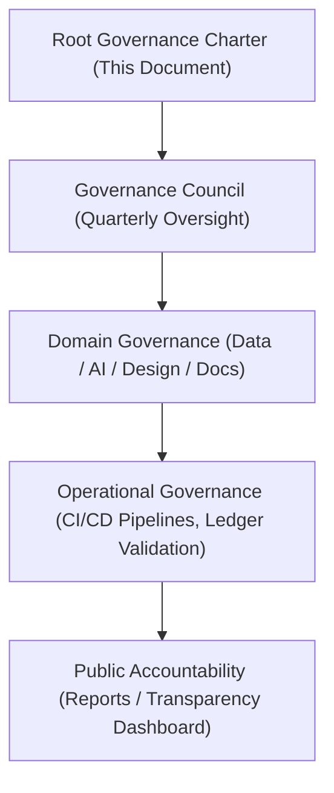

# 🏛️ **Kansas Frontier Matrix — Root Governance Charter & Ethical Oversight Framework (v2.1.1 · Tier-Ω+∞ Certified)**  
`docs/standards/governance/ROOT-GOVERNANCE.md`

**Mission:** Establish the **governance foundation, ethical oversight framework, and procedural hierarchy**  
for all systems, data, and design activities within the **Kansas Frontier Matrix (KFM)** ecosystem —  
ensuring transparency, reproducibility, and FAIR+CARE-aligned stewardship.

---

## 📚 Overview

The **Root Governance Charter** is the primary legal and procedural document defining how **KFM governance** operates.  
It outlines the responsibilities of the **FAIR+CARE Governance Council**, data ethics policies,  
provenance tracking standards, and the integration of governance within CI/CD pipelines.

The Root Governance Framework ensures that all organizational and technical decisions:
- Are **reproducible and auditable** via the governance ledger.  
- Uphold **FAIR+CARE** ethical data and AI principles.  
- Maintain alignment with **MCP-DL v6.4.3** and ISO governance standards.  
- Protect the interests of communities and data contributors through **open ethics review**.  

---

## ⚙️ Governance Hierarchy

<!-- END OF MERMAID -->

---

## 🧱 Governance Structure

| Level | Governance Scope | Maintained By | Validation Workflow |
|:--|:--|:--|:--|
| **Root Governance** | Defines universal governance policies and ethical frameworks. | @kfm-governance | `policy-check.yml` |
| **Council Oversight** | Conducts quarterly FAIR+CARE ethics reviews. | FAIR+CARE Governance Council | `faircare-validate.yml` |
| **Domain Governance** | Data, AI, and documentation-level policies. | @kfm-architecture / @kfm-data / @kfm-docs | `governance-ledger.yml` |
| **Operational Governance** | Continuous compliance via CI/CD workflows. | @kfm-security / @kfm-devops | `slsa.yml` / `sbom.yml` |
| **Public Accountability** | Reporting, transparency, and audit publishing. | @kfm-docs | `site.yml` |

---

## ⚖️ Core Governance Principles

| Principle | Description | Implementation Example |
|:--|:--|:--|
| **Transparency** | All decisions, policies, and audits are public and versioned. | Governance reports in `docs/standards/governance/council/` |
| **Accountability** | Each decision includes author, reviewer, checksum, and validation record. | Governance ledger entries |
| **Ethical Responsibility** | FAIR+CARE principles embedded into all workflows. | `faircare-validate.yml` |
| **Traceability** | Immutable provenance through checksum and ledger linkage. | `data/reports/audit/data_provenance_ledger.json` |
| **Inclusivity** | Representation from all stakeholders, including cultural partners. | FAIR+CARE Council participation |

---

## 🧩 Governance Integration in CI/CD

| Stage | CI/CD Workflow | Purpose | Validation Artifact |
|:--|:--|:--|:--|
| **1. Validation** | `policy-check.yml` | Ensures metadata and license accuracy. | `reports/audit/policy_check.json` |
| **2. FAIR+CARE Audit** | `faircare-validate.yml` | Evaluates ethical and accessibility standards. | `reports/fair/data_care_assessment.json` |
| **3. Provenance Logging** | `governance-ledger.yml` | Records checksum, author, and timestamp. | `data/reports/audit/data_provenance_ledger.json` |
| **4. Publication** | `site.yml` | Deploys public governance artifacts. | GitHub Pages Dashboard |

---

## 🧠 FAIR + CARE Framework Alignment

| FAIR Principle | CARE Principle | Governance Application |
|:--|:--|:--|
| **Findable** | **Collective Benefit** | All governance documents are indexed and discoverable via manifest. |
| **Accessible** | **Authority to Control** | Governance docs open for review; council oversight ensures consent. |
| **Interoperable** | **Responsibility** | YAML/JSON schemas standardize metadata for interoperability. |
| **Reusable** | **Ethics** | Documents versioned and reusable across governance cycles. |

---

## 🔍 Governance Council Charter

The **FAIR+CARE Governance Council**:
- Conducts quarterly ethical reviews and governance audits.  
- Validates documentation under MCP-DL reproducibility standards.  
- Oversees AI transparency, accessibility, and cultural data governance.  
- Issues official governance reports with checksums and public sign-off.

Council reports are published in:  
`docs/standards/governance/council/`

---

## 🧾 Governance Validation Artifacts

| Artifact | Purpose | Path |
|:--|:--|:--|
| **Governance Ledger** | Primary audit ledger for all governance events. | `data/reports/audit/data_provenance_ledger.json` |
| **FAIR+CARE Validation Logs** | Tracks ethical and inclusivity compliance. | `data/reports/fair/data_care_assessment.json` |
| **Security Ledger** | Stores provenance attestations and SBOMs. | `reports/security/` |
| **Council Reports** | Quarterly governance outcomes and ethics reviews. | `docs/standards/governance/council/` |

---

## 🧮 Governance Review Process

| Phase | Activity | Validation Method | Output |
|:--|:--|:--|:--|
| **Drafting** | Governance documentation updated by maintainers. | Manual review | Updated Markdown / YAML |
| **Validation** | Metadata and ethics validation through CI workflows. | Automated | CI logs |
| **Ledger Sync** | Checksum verification and entry registration. | `governance-ledger.yml` | Audit entry |
| **Publication** | Reports deployed for public review. | `site.yml` | GitHub Pages |

---

## 🕰 Governance Reporting Schedule

| Quarter | Focus Area | Deliverable | Oversight Body |
|:--|:--|:--|:--|
| **Q1** | Data Ethics & FAIR+CARE Review | Governance Report | FAIR+CARE Council |
| **Q2** | Security & Provenance Audit | Security Governance Report | @kfm-security |
| **Q3** | Documentation & Metadata Review | Docs Audit Report | @kfm-docs |
| **Q4** | Annual Governance Summary | Root Council Report | @kfm-governance |

---

## 🧾 Version History

| Version | Date | Author | Summary |
|:--|:--|:--|:--|
| **v2.1.1** | 2025-11-16 | @kfm-governance | Updated with governance hierarchy, FAIR+CARE alignment, and CI integration. |
| v2.0.0 | 2025-10-25 | @kfm-architecture | Added operational governance and council review scope. |
| v1.0.0 | 2025-10-04 | @kfm-docs | Established Root Governance Charter and ethical oversight structure. |

---

**Kansas Frontier Matrix © 2025**  
*“Governance is Integrity — FAIR+CARE is its Foundation.”*  
📍 `docs/standards/governance/ROOT-GOVERNANCE.md` — Root governance and ethical oversight charter for the Kansas Frontier Matrix.

