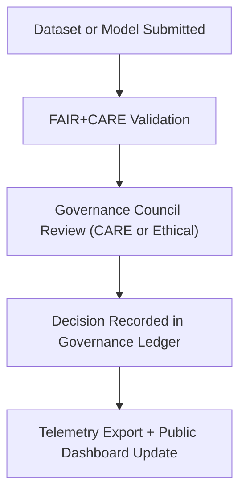

<div align="center">

# 🏛️ **Kansas Frontier Matrix — Root Governance Charter**
`docs/standards/governance/ROOT-GOVERNANCE.md`

**Purpose:** Establish the foundational ethical, procedural, and operational governance charter of the Kansas Frontier Matrix (KFM).  
Defines the **FAIR+CARE Council**, its authority, duties, decision-making processes, and alignment with **Master Coder Protocol (MCP v6.3)** and international open-data governance standards.

[](../../README.md)
[](../../../LICENSE)
[](../faircare.md)
[]()

</div>

---

## 📘 Overview

This **Root Governance Charter** defines how decisions, validations, and ethical reviews are executed within the Kansas Frontier Matrix (KFM).  
It ensures that all project activities — from data ingestion to AI model deployment — uphold **FAIR (Findable, Accessible, Interoperable, Reusable)** and **CARE (Collective Benefit, Authority to Control, Responsibility, Ethics)** principles.

The charter represents the highest level of organizational and ethical oversight for the KFM initiative and supersedes all subordinate governance documents.

---

## ⚙️ Governance Purpose & Scope

### Objectives
1. Maintain **ethical integrity** in data and AI governance.  
2. Ensure **technical compliance** with international data standards (FAIR, STAC, DCAT).  
3. Protect **Indigenous sovereignty** and cultural knowledge.  
4. Guarantee **reproducibility and open access** for all published outputs.  
5. Foster **sustainability and accountability** in project stewardship.

### Scope
- Applies to all datasets, documentation, workflows, and software within KFM.
- Enforced across all branches of development, CI/CD pipelines, and public releases.
- Reviewed annually by the FAIR+CARE Council and published publicly.

---

## 🧩 Organizational Structure

### FAIR+CARE Council (Governing Body)

| Role | Responsibilities | Appointment |
|------|------------------|--------------|
| **Council Chair** | Oversees governance policy and ethics review. | Elected annually by council vote. |
| **Technical Standards Lead** | Ensures alignment with MCP, FAIR, and STAC/DCAT specifications. | Appointed by Council. |
| **Indigenous Data Steward** | Protects cultural heritage and ensures CARE compliance. | Appointed by partner organizations. |
| **Open Science Director** | Promotes transparency, licensing, and reproducibility. | Appointed by the Open Science Board. |
| **AI Ethics Lead** | Oversees model governance, explainability, and fairness. | Appointed by Council. |
| **Accessibility Auditor** | Validates documentation and web accessibility (WCAG 2.1 AA). | Appointed by Council. |
| **Community Liaison** | Represents stakeholder input and public engagement. | Nominated by regional partners. |

**Quorum Requirement:**  
Minimum of 5 members (including 1 Indigenous representative) must be present for any binding vote.

---

## ⚖️ Governance Responsibilities

| Domain | Responsibility | Deliverable |
|---------|----------------|--------------|
| **Data Governance** | Ensure all datasets comply with FAIR+CARE and open license policies. | Quarterly FAIR+CARE Audit Report |
| **Ethical Review** | Review cultural and Indigenous data submissions. | CARE Compliance Statement |
| **AI Governance** | Audit machine learning models for transparency and bias. | AI Model Audit Report |
| **Technical Validation** | Maintain continuous validation pipelines. | STAC/DCAT Validation Report |
| **Public Communication** | Publish audit results and governance changes. | Governance Transparency Bulletin |

All deliverables are stored under:
```
reports/audit/
```

---

## 🧮 Decision-Making Process

### Voting Policy
- Each Council member holds one vote.
- Simple majority required for most decisions.
- Supermajority (⅔) required for amendments to governance charter or ethics code.

### Voting Methods
| Type | Definition | Execution |
|------|-------------|------------|
| **Direct Vote** | Real-time meeting vote by quorum. | Recorded in Governance Ledger. |
| **Asynchronous Vote** | Written approval via GitHub Pull Request review. | Logged in `governance-ledger.json`. |
| **Emergency Decision** | Chair may act unilaterally in urgent ethical or legal matters. | Must be ratified post-action by Council vote. |

---

## 🧾 Governance Documentation Chain



| Governance Record | Description | File Location |
|-------------------|-------------|----------------|
| **Governance Ledger** | Immutable log of all council decisions. | `reports/audit/governance-ledger.json` |
| **AI Models Ledger** | Approved and validated AI/ML models. | `reports/audit/ai_models.json` |
| **Experiment Ledger** | Validated research and reproducibility reports. | `reports/audit/experiments-ledger.json` |
| **Release Manifest Log** | Checksums and provenance of releases. | `reports/audit/release-manifest-log.json` |

---

## 🧠 Ethical Data Handling Principles

1. **Transparency:** All governance decisions and audits are publicly logged.  
2. **Consent:** No data or cultural information is published without explicit authorization from data owners.  
3. **Reciprocity:** Data must generate shared benefit for all contributing communities.  
4. **Accountability:** Governance actions are traceable and time-stamped.  
5. **Respect:** All data must be handled in accordance with CARE principles and cultural sensitivity.

---

## 🧩 Amendment Procedures

| Amendment Type | Approval Threshold | Documentation |
|----------------|--------------------|----------------|
| **Minor (Procedural)** | Majority (≥51%) | Logged in Governance Ledger |
| **Major (Ethical or Policy)** | Supermajority (≥67%) | Added to new version of ROOT-GOVERNANCE.md |
| **Emergency Amendment** | Chair authority, ratified by next meeting | Temporary Addendum |

All amendments must include:
- Version update in this document’s YAML header.  
- Entry in `reports/audit/release-manifest-log.json`.  
- Telemetry update in `releases/v9.7.0/focus-telemetry.json`.

---

## 🧮 Governance Review Cycle

| Review Type | Frequency | Output | Location |
|--------------|------------|---------|-----------|
| **FAIR+CARE Audit** | Quarterly | `faircare_summary.json` | `reports/fair/` |
| **Ethical Review** | Continuous | `governance-ledger.json` | `reports/audit/` |
| **AI Governance Review** | Biannual | `ai_models.json` | `reports/audit/` |
| **Public Governance Summary** | Annual | `governance_scorecard.json` | `docs/reports/telemetry/` |

---

## 🧾 Governance Ledger Example

```json
{
  "event": "ethical_review",
  "dataset_id": "ks_treaties_1854",
  "decision": "approved",
  "reviewer": "FAIR+CARE Council",
  "notes": "Dataset reviewed and cleared for Indigenous data sensitivity.",
  "timestamp": "2025-11-05T18:45:00Z",
  "telemetry_ref": "releases/v9.7.0/focus-telemetry.json"
}
```

---

## ⚙️ Governance Automation Integration

All governance actions are automatically linked to CI/CD workflows and telemetry.

| Workflow | Purpose | Output |
|-----------|----------|---------|
| `faircare-validate.yml` | Automated FAIR+CARE compliance check. | `reports/fair/faircare_summary.json` |
| `docs-lint.yml` | Governance documentation structure validation. | `reports/self-validation/docs/lint_summary.json` |
| `telemetry-export.yml` | Governance dashboard synchronization. | `releases/v9.7.0/focus-telemetry.json` |
| `build-and-deploy.yml` | Releases new approved governance documents. | `releases/v*/manifest.zip` |

---

## 🧭 Termination or Transfer of Authority

Should the FAIR+CARE Council cease operations:
- The **Root Governance Charter** remains in effect.
- Authority transfers to the **Open Science Board**.
- Council records and ledgers remain permanently accessible.
- Final sign-off is logged in `reports/audit/governance-ledger.json`.

---

## 🕰️ Version History

| Version | Date | Author | Summary |
|----------|------|---------|----------|
| v9.7.0 | 2025-11-05 | A. Barta | Established full governance charter with decision-making procedures, roles, and audit integration. |
| v9.5.0 | 2025-10-20 | A. Barta | Added amendment and AI governance procedures. |
| v9.0.0 | 2025-06-01 | KFM Core Team | Created baseline FAIR+CARE Council charter. |

---

<div align="center">

**© 2025 Kansas Frontier Matrix — CC-BY 4.0**  
This charter is binding under **Master Coder Protocol v6.3** and **FAIR+CARE Governance Certification**.  
[Back to Governance Index](README.md) · [Standards Index](../README.md)

</div>
