<div align="center">

# 🏛️ **Kansas Frontier Matrix — Root Governance Charter**  
`docs/standards/governance/ROOT-GOVERNANCE.md`

**Purpose:** Establish the foundational ethical, procedural, and operational governance charter of the Kansas Frontier Matrix (KFM).  
Defines the **FAIR+CARE Council**, its authority, duties, decision-making processes, and alignment with **Master Coder Protocol (MCP v6.3)** and international open-data governance standards.

[](../../README.md)
[](../../../LICENSE)
[](../faircare.md)
[]()

</div>

---

## 📘 Overview

This **Root Governance Charter** defines how decisions, validations, and ethical reviews are executed within the Kansas Frontier Matrix (KFM).  
It ensures that all project activities — from data ingestion to AI model deployment — uphold **FAIR (Findable, Accessible, Interoperable, Reusable)** and **CARE (Collective Benefit, Authority to Control, Responsibility, Ethics)** principles.

The charter represents the **highest level of organizational and ethical oversight** for the KFM initiative and supersedes all subordinate governance documents.

---

## ⚙️ Governance Purpose & Scope

### Objectives

1. Maintain **ethical integrity** in data and AI governance.  
2. Ensure **technical compliance** with international data standards (FAIR, STAC, DCAT, ISO 19115).  
3. Protect **Indigenous sovereignty**, community rights, and cultural knowledge.  
4. Guarantee **reproducibility and open access** for all published outputs.  
5. Foster **sustainability and accountability** in project stewardship (aligned with ISO 50001 / 14064).

### Scope

- Applies to all datasets, documentation, workflows, and software within KFM.  
- Enforced across all branches of development, CI/CD pipelines, and public releases.  
- Reviewed **annually** by the FAIR+CARE Council and published publicly.

---

## 🧩 Organizational Structure

### FAIR+CARE Council (Governing Body)

| Role | Responsibilities | Appointment |
|---|---|---|
| **Council Chair** | Oversees governance policy and ethics review; convenes Council meetings. | Elected annually by council vote. |
| **Technical Standards Lead** | Ensures alignment with MCP, FAIR, STAC/DCAT, and schema standards. | Appointed by Council. |
| **Indigenous Data Steward** | Protects cultural heritage and CARE compliance; advocates for Indigenous data sovereignty. | Appointed by partner organizations or tribal entities. |
| **Open Science Director** | Promotes transparency, licensing, accessibility, and reproducibility. | Appointed by the Open Science Board. |
| **AI Ethics Lead** | Oversees AI model governance, explainability, and fairness. | Appointed by Council. |
| **Accessibility Auditor** | Validates UI and docs compliance with WCAG 2.1 AA. | Appointed by Council. |
| **Community Liaison** | Represents stakeholder input and public/community engagement. | Nominated by regional partners. |

**Quorum Requirement:**  
A minimum of **5 members**, including **at least 1 Indigenous representative**, must be present for any binding vote.

---

## ⚖️ Governance Responsibilities

| Domain | Responsibility | Deliverable |
|---|---|---|
| **Data Governance** | Ensure all datasets comply with FAIR+CARE and open license policies. | Quarterly FAIR+CARE Audit Report |
| **Ethical Review** | Review cultural, Indigenous, and sensitive data submissions. | CARE Compliance Statement |
| **AI Governance** | Audit ML models for transparency, bias, and responsible use. | AI Model Audit Report |
| **Technical Validation** | Maintain continuous validation pipelines (STAC/DCAT, contracts). | STAC/DCAT Validation Report |
| **Public Communication** | Publish audit results, decisions, and governance changes. | Governance Transparency Bulletin |

All deliverables are stored under:

```plaintext
reports/audit/
```

---

## 🧮 Decision-Making Process

### Voting Policy

- Each Council member holds one vote.  
- **Simple majority** (> 50%) required for routine governance decisions.  
- **Supermajority** (≥ ⅔) required for amendments to this charter, ethics code, or major policy shifts.

### Voting Methods

| Type | Definition | Execution |
|---|---|---|
| **Direct Vote** | Real-time vote during a convened Council meeting. | Recorded in Governance Ledger. |
| **Asynchronous Vote** | Written approval via GitHub PR reviews or signed statements. | Logged in `governance-ledger.json`. |
| **Emergency Decision** | Chair may act unilaterally for urgent ethical/legal matters. | Action must be ratified by Council at the next meeting. |

---

## 🧾 Governance Documentation Chain

```mermaid
flowchart TD
  A["Dataset or Model Submitted"] --> B["FAIR+CARE Validation (CI/CD)"]
  B --> C{"CARE / Ethics Triggered?"}
  C -->|No| D["Auto-Approve → Catalog & Telemetry"]
  C -->|Yes| E["Council Review & Deliberation"]
  E --> F["Decision Recorded in Governance Ledger"]
  F --> G["Release Gate / Remediation & Telemetry Update"]
  D --> G
```



| Governance Record | Description | File Location |
|---|---|---|
| **Governance Ledger** | Immutable log of all council decisions. | `reports/audit/governance-ledger.json` |
| **AI Models Ledger** | Record of approved and audited AI/ML models. | `reports/audit/ai_models.json` |
| **Experiment Ledger** | Validated research and reproducibility reports. | `reports/audit/experiments-ledger.json` |
| **Release Manifest Log** | Checksums and provenance of each release. | `reports/audit/release-manifest-log.json` |

---

## 🧠 Ethical Data Handling Principles

1. **Transparency** — All governance decisions and audits are logged with reasons, timestamps, and responsible parties.  
2. **Consent** — No data or cultural information is published without explicit permission or legal basis from data owners or communities.  
3. **Reciprocity** — Data must generate shared benefit for contributing communities (education, access, decision-support).  
4. **Accountability** — Governance actions are traceable; Council members are accountable to the charter and public.  
5. **Respect** — Data from Indigenous or vulnerable communities receives additional CARE review and may be restricted.  

These principles must be reflected in data contracts, CARE fields, and council decisions.

---

## 🧩 Amendment Procedures

| Amendment Type | Approval Threshold | Documentation |
|---|---|---|
| **Minor (Procedural)** | Simple majority (≥ 51%). | Logged in Governance Ledger and summarized in transparency reports. |
| **Major (Ethical or Policy)** | Supermajority (≥ 67%). | New version of `ROOT-GOVERNANCE.md` created and referenced in manifest. |
| **Emergency Amendment** | Chair authority; subject to later ratification. | Temporary addendum noted in ledger and reviewed at next quorum meeting. |

All amendments must include:

- A **version bump** in this document’s YAML header.  
- An entry in `reports/audit/release-manifest-log.json`.  
- A corresponding telemetry event in `releases/v10.2.0/focus-telemetry.json`.

---

## 🧮 Governance Review Cycle

| Review Type | Frequency | Output | Location |
|---|---|---|---|
| **FAIR+CARE Audit** | Quarterly | `faircare_summary.json` | `reports/fair/` |
| **Ethical Review** | Continuous | `governance-ledger.json` | `reports/audit/` |
| **AI Governance Review** | Biannual or post-major model release | `ai_models.json` | `reports/audit/` |
| **Public Governance Summary** | Annual | `governance_scorecard.json` | `docs/reports/telemetry/` |

---

## 🧾 Governance Ledger Example

```json
{
  "event": "ethical_review",
  "dataset_id": "ks_treaties_1854",
  "decision": "approved",
  "reviewer": "FAIR+CARE Council",
  "notes": "Dataset reviewed and cleared for Indigenous data sensitivity with agreed contextual notes.",
  "timestamp": "2025-11-12T18:45:00Z",
  "telemetry_ref": "releases/v10.2.0/focus-telemetry.json"
}
```

---

## ⚙️ Governance Automation Integration

Governance actions are tightly coupled with CI/CD workflows and telemetry.

| Workflow | Purpose | Output |
|---|---|---|
| `faircare-validate.yml` | Automated FAIR+CARE & contract compliance check. | `reports/fair/faircare_summary.json` |
| `docs-lint.yml` | Validates governance docs structure + metadata. | `reports/self-validation/docs/lint_summary.json` |
| `stac-validate.yml` | Ensures catalogs reference correct governance metadata. | `reports/self-validation/stac_validation.json` |
| `telemetry-export.yml` | Synchronizes governance metrics to dashboards. | `releases/v10.2.0/focus-telemetry.json` |
| `build-and-deploy.yml` | Publishes updated governance docs with each release. | `releases/v*/manifest.zip` |

---

## 🧭 Termination or Transfer of Authority

If the FAIR+CARE Council ceases to operate:

1. This **Root Governance Charter** remains in effect until superseded.  
2. Authority temporarily transfers to the **Open Science Board**, which must:

   - Maintain the Governance Ledger.  
   - Convene a reconstitution process for the Council.  

3. All existing records and ledgers remain permanently accessible.  
4. The transfer of authority is recorded in `reports/audit/governance-ledger.json`.

---

## 🕰️ Version History

| Version | Date | Author | Summary |
|---|---|---|---|
| v10.2.2 | 2025-11-12 | A. Barta | Updated release/telemetry paths to v10.2.0; clarified governance automation and Council quorum requirements; added explicit amendment → telemetry linkage. |
| v9.7.0 | 2025-11-05 | A. Barta | Established full governance charter with decision-making procedures, roles, and audit integration. |
| v9.5.0 | 2025-10-20 | A. Barta | Added amendment and AI governance procedures. |
| v9.0.0 | 2025-06-01 | KFM Core Team | Created baseline FAIR+CARE Council charter. |

---

<div align="center">

**© 2025 Kansas Frontier Matrix — CC-BY 4.0**  
This charter is binding under **Master Coder Protocol v6.3** and **FAIR+CARE Governance Certification** · Diamond⁹ Ω / Crown∞Ω Ultimate Certified  
[Back to Governance Index](README.md) · [Standards Index](../README.md)

</div>