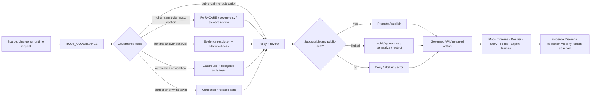

<!-- [KFM_META_BLOCK_V2]
doc_id: kfm://doc/TODO-VERIFY-doc-id
title: ROOT_GOVERNANCE
type: standard
version: v1
status: draft
owners: @bartytime4life
created: TODO-VERIFY-created-date
updated: 2026-04-30
policy_label: public
related: [docs/standards/governance/README.md, docs/standards/README.md, docs/governance/README.md, policy/README.md, contracts/README.md, schemas/README.md, tests/README.md, .github/README.md, .github/workflows/README.md]
tags: [kfm, governance, standards, evidence, publication, correction]
notes: [doc_id and created date need repository metadata verification; updated reflects current drafting date; narrower governance-only ownership remains NEEDS VERIFICATION]
[/KFM_META_BLOCK_V2] -->

# ROOT_GOVERNANCE

Core governance law and review-trigger standard for KFM trust-state transitions, publication limits, runtime boundaries, and correction behavior.

> **Status:** `draft standard`  
> **Owners:** `@bartytime4life` *(current `/docs/` ownership signal; narrower file-level governance ownership still needs verification)*  
> **Path:** `docs/standards/governance/ROOT_GOVERNANCE.md`  
> **Truth posture:** `CONFIRMED` doctrine and public-main placement · `PROPOSED` standard wording · `UNKNOWN` active enforcement depth  
>
> 
> 
> 
> 
> 
>
> **Quick jumps:** [Scope](#scope) · [Repo fit](#repo-fit) · [Inputs](#accepted-inputs) · [Exclusions](#exclusions) · [Truth posture](#truth-posture-and-authority-order) · [Root laws](#root-governance-laws) · [Review triggers](#review-triggers-and-escalation) · [Outcomes](#allowed-outcomes) · [Decision flow](#decision-flow) · [Surfaces](#trust-visible-surface-responsibilities) · [Change bundle](#governance-significant-change-bundle) · [Handoffs](#handoff-rules) · [Verification](#verification-and-merge-checklist) · [Open items](#open-verification-items) · [Glossary](#glossary)

> [!IMPORTANT]
> This file states human-readable governance law. It does **not** replace executable policy in `policy/`, machine-readable object definitions in `contracts/` or `schemas/`, proof and fixture work in `tests/`, workflow orchestration in `.github/`, or operator procedures in runbooks.

> [!WARNING]
> Treat implementation-shaped language here as doctrine, review guidance, or change-control law unless direct branch evidence proves more. Do **not** read this standard as proof that a route, validator, policy bundle, workflow gate, schema body, Evidence Drawer payload, or runtime envelope already exists.

| At a glance | Working rule |
|---|---|
| Truth path | `SOURCE EDGE → RAW → WORK / QUARANTINE → PROCESSED → CATALOG / TRIPLET → PUBLISHED` |
| Trust membrane | Public and ordinary clients stay behind governed interfaces |
| Evidence route | `EvidenceRef → EvidenceBundle` resolution before consequential outward claims |
| Runtime family | `ANSWER` · `ABSTAIN` · `DENY` · `ERROR` |
| Publication rule | Promotion and publication are governed state transitions, not file moves |
| Derived-layer rule | Tiles, graphs, search, caches, summaries, scenes, and model outputs are downstream carriers |
| Correction rule | Supersession, withdrawal, narrowing, and replacement preserve visible lineage |

---

## Scope

This standard defines the minimum root governance law for Kansas Frontier Matrix across domains, products, delivery layers, publication flows, and runtime behavior.

Use it when a change could alter:

- a public claim or trust-bearing surface
- publication, promotion, review, correction, or release state
- rights, sensitivity, precision, or exact-location exposure
- Focus Mode, runtime outcomes, citation behavior, or evidence visibility
- approval boundaries, stewardship paths, or separation of duty
- the line between authoritative truth and derived convenience layers
- export behavior, story/dossier interpretation, or public-safe rendering
- documentation that other policy, schema, contract, test, or workflow surfaces depend on

This file is intentionally narrower than the full architecture corpus and broader than any one subsystem. It sits above executable policy and tests as root law, but below the complete KFM doctrinal corpus.

> [!CAUTION]
> Governance gets weaker when uncertainty is polished away. If a claim is not branch-verified, keep `UNKNOWN` or `NEEDS VERIFICATION` visible.

[Back to top](#root_governance)

---

## Repo fit

| Item | Value |
|---|---|
| Path | `docs/standards/governance/ROOT_GOVERNANCE.md` |
| Document role | Root governance standard for cross-cutting trust, publication, correction, runtime, and review law |
| Standards-lane index | [`./README.md`](./README.md) |
| Parent standards index | [`../README.md`](../README.md) |
| Root repository context | [`../../../README.md`](../../../README.md) |
| Operational governance companion | [`../../governance/README.md`](../../governance/README.md) |
| Executable policy companion | [`../../../policy/README.md`](../../../policy/README.md) |
| Contract companion | [`../../../contracts/README.md`](../../../contracts/README.md) |
| Schema companion | [`../../../schemas/README.md`](../../../schemas/README.md) |
| Verification companion | [`../../../tests/README.md`](../../../tests/README.md) |
| GitHub gatehouse companion | [`../../../.github/README.md`](../../../.github/README.md) |
| Workflow documentation companion | [`../../../.github/workflows/README.md`](../../../.github/workflows/README.md) |
| Review routing companion | [`../../../.github/CODEOWNERS`](../../../.github/CODEOWNERS) |

### Current public-main snapshot

| Surface | Current posture | Governance consequence |
|---|---:|---|
| `docs/standards/governance/README.md` | `CONFIRMED` directory README surface | Keep it as the index, routing, and lane-boundary document. |
| `docs/standards/governance/ROOT_GOVERNANCE.md` | `CONFIRMED` target standard surface | Keep it as the normative baseline for this standards sub-lane. |
| `docs/standards/governance/ROOT-GOVERNANCE.md` | `NEEDS VERIFICATION` alias / placeholder status | Do not maintain two parallel root governance authorities. Decide whether to redirect, deprecate, or remove. |
| `docs/governance/README.md` | `CONFIRMED` broader governance companion | Use for ethics, sovereignty, consent, and operational governance routing. |
| `policy/README.md` | `CONFIRMED` policy lane surface | Executable governance belongs there once rules require mechanical enforcement. |
| `contracts/README.md` and `schemas/README.md` | `CONFIRMED` adjacent machine-object surfaces | Do not duplicate object definitions in this prose standard. |
| `tests/README.md` | `CONFIRMED` proof / fixture lane surface | Governance claims should be backed by negative-path tests and drills where applicable. |
| `.github/README.md` and `.github/workflows/README.md` | `CONFIRMED` gatehouse documentation surfaces | GitHub automation may coordinate checks; it does not own governance truth. |

> [!NOTE]
> Public-main file presence confirms path inventory and checked-in documentation surfaces. It does **not** prove branch protection, required checks, workflow execution, platform settings, policy bundle activation, or runtime enforcement.

[Back to top](#root_governance)

---

## Accepted inputs

Place material in this file only when it defines root governance law that multiple KFM surfaces must interpret consistently.

| Accepted input | Why it belongs here |
|---|---|
| Non-negotiable trust rules | Keeps the truth path, trust membrane, publication posture, and correction law stable. |
| Review-trigger rules | Makes governance-significant changes visible before they become UI, runtime, or release behavior. |
| Outcome vocabulary | Preserves explicit `ANSWER`, `ABSTAIN`, `DENY`, `ERROR`, `hold`, `quarantine`, `generalize`, `restrict`, `withdraw`, and `supersede` states. |
| Separation-of-duty expectations | Prevents policy-significant proposal, approval, and release from collapsing into one unreviewed path. |
| Cross-surface obligations | Keeps map, story, dossier, Evidence Drawer, Focus, export, and review surfaces aligned. |
| Governance-to-implementation routing | Clarifies whether follow-on work belongs in `policy/`, `contracts/`, `schemas/`, `tests/`, workflows, or runbooks. |
| Correction and rollback standards | Preserves visible lineage when outward trust state changes. |

[Back to top](#root_governance)

---

## Exclusions

This file should not become a dumping ground for implementation detail, local exceptions, or unverified enforcement claims.

| Does not belong here | Use instead | Why |
|---|---|---|
| Rego / OPA / policy bundle code | [`../../../policy/`](../../../policy/) | Workflows may run policy checks; this file does not define executable policy semantics. |
| JSON Schema, OpenAPI, DTOs, or field-by-field contracts | [`../../../contracts/`](../../../contracts/) and [`../../../schemas/`](../../../schemas/) | Prevents contract and schema drift. |
| Fixtures, drills, golden objects, or negative-path proof packs | [`../../../tests/`](../../../tests/) | Proof belongs in verification surfaces. |
| Workflow YAML | [`../../../.github/workflows/`](../../../.github/workflows/) | Automation must remain reviewable in its own lane. |
| Incident notes, one-off decision logs, or operational run steps | Runbooks, review records, or release/correction surfaces | Root law should not become event history. |
| Domain-specific source exceptions | Domain docs and source registry records | Root law should be inherited, not forked per lane. |
| Secrets, credentials, endpoints, or sensitive coordinates | Restricted security/steward process | Prevents accidental public exposure. |
| Claims that a gate is active without evidence | Verification backlog or platform-state documentation | Checked-in prose is not enforcement proof. |

> [!TIP]
> A practical placement test: if the document mainly answers “what is the shared governance rule?”, it belongs here. If it mainly answers “how is that rule enforced, tested, operated, or packaged?”, route it elsewhere.

[Back to top](#root_governance)

---

## Truth posture and authority order

### Truth labels

| Label | Meaning in this file | Must not be mistaken for |
|---|---|---|
| `CONFIRMED` | Directly supported by current public repo evidence, current-session evidence, or stable KFM doctrine | Proof of hidden code, hidden workflows, runtime behavior, or platform settings |
| `INFERRED` | Conservatively implied by repeated doctrine and adjacent documentation | Confirmed implementation |
| `PROPOSED` | Repo-ready realization guidance consistent with KFM doctrine and repo layout | Something already deployed |
| `UNKNOWN` | Not verified strongly enough in the current session | A gap to hide with confident prose |
| `NEEDS VERIFICATION` | Specific owner, path, rule, workflow, runtime, or platform detail needs direct checking | A reason to avoid useful drafting |
| `CONFLICTED` | Evidence or placement implies competing authorities | A conflict to smooth away silently |

### Authority order

| Priority | Source class | How this file should use it |
|---:|---|---|
| 1 | Replacement-grade KFM master doctrine and canonical reference material | Anchor root law, truth posture, trust membrane, fail-closed behavior, and contradiction handling. |
| 2 | Supporting March–April 2026 synthesis overlays and operating manuals | Deepen object families, evidence resolution, runtime outcomes, Evidence Drawer / Focus obligations, MapLibre and Cesium boundaries, and correction seams. |
| 3 | Current public repo evidence on `main` | Confirm file placement, adjacent surfaces, current navigation, and checked-in README boundaries. |
| 4 | Current working-branch evidence | Override public-main packaging claims when a mounted checkout proves a different branch-local fact. |
| 5 | Official external rechecks | Use only for version-sensitive standards or external boundary facts; do not silently rewrite KFM doctrine. |
| 6 | Exploratory notes and New Ideas packets | Treat as intake pressure until promoted through source descriptors, schemas, tests, policy, and review. |

If direct branch evidence conflicts with inferred packaging in this file, keep the doctrine and downgrade the packaging claim until branch-local evidence is re-verified.

[Back to top](#root_governance)

---

## Root governance laws

These laws are the minimum standard inherited by every KFM lane and trust-bearing surface.

| # | Law | What it means in practice | Default if violated |
|---:|---|---|---|
| 1 | **Governance follows the truth path** | Material moves through governed states: `SOURCE EDGE → RAW → WORK / QUARANTINE → PROCESSED → CATALOG / TRIPLET → PUBLISHED`. | Hold, quarantine, or block promotion. |
| 2 | **Admissibility before visibility** | A source is not trusted merely because it exists, can be fetched, or looks useful. Identity, support, time semantics, method, validation, provenance, rights, sensitivity, and review posture matter first. | Quarantine, restrict, or reject. |
| 3 | **No bypass of the trust membrane** | Public and ordinary clients must not route directly to canonical stores, raw/work/quarantine data, unpublished candidates, model runtimes, vector indexes, or unreviewed projections. | Reject the path until the bypass is removed. |
| 4 | **Evidence stays one hop away** | Consequential claims must retain point-of-use drill-through to admissible support. | Deny, abstain, or revert to draft/review state. |
| 5 | **`EvidenceRef` resolves to `EvidenceBundle`** | Trust-bearing answers, exports, stories, detail views, and Evidence Drawer surfaces must resolve to governed evidence with rights, sensitivity, transform, and audit context. | Abstain, deny, error, or withhold the surface. |
| 6 | **Derived layers are not authoritative by default** | Graphs, search indexes, vector tiles, map portrayals, caches, summaries, scenes, rankings, and model-assisted outputs remain downstream carriers unless explicitly promoted. | Relabel, narrow, rebuild, or block outward use. |
| 7 | **Promotion changes trust state** | Promotion is not a quiet file move. It requires review context, policy state, proof objects, release references, and rollback/correction posture appropriate to consequence. | Block promotion or downgrade to candidate state. |
| 8 | **Runtime outcomes stay finite and fail closed** | Runtime claim-bearing surfaces emit `ANSWER`, `ABSTAIN`, `DENY`, or `ERROR`; unsupported fluent language is not a valid result. | Prefer abstention, denial, or visible error over overclaiming. |
| 9 | **Correction preserves lineage** | Supersession, narrowing, withdrawal, replacement, and generalization should preserve visible lineage instead of erasing prior outward state. | Publish correction state, rollback, or withdraw visibly. |
| 10 | **Documentation is part of governance** | Behavior-significant governance changes should move with adjacent docs, policy surfaces, contracts, schemas, fixtures, tests, and runbooks. | Treat doc-only changes as incomplete unless drift is explicitly justified. |
| 11 | **Separation of duty matters** | Publication rights, sensitivity posture, outward trust state, and correction visibility should not be proposed, approved, and released in one invisible stream. | Escalate review or split responsibilities. |
| 12 | **3D, AI, and rich rendering carry extra burden** | MapLibre, Cesium, AI, exports, stories, and scenes are downstream carriers. Visual richness never outranks evidence, policy, review, release, or correction state. | Require burden review, relabel as derived, or deny. |

[Back to top](#root_governance)

---

## Root invariants and practical consequences

| Invariant | Practical consequence |
|---|---|
| Canonical truth path | Source material moves through staged, reviewable trust states before publication. |
| Trust membrane | Public, third-party, and ordinary UI surfaces read through governed interfaces only. |
| Authoritative vs derived separation | Delivery convenience layers do not quietly become sovereign truth. |
| Map-first, time-aware operation | Place and time remain coequal operating dimensions. |
| Evidence-bounded runtime behavior | Focus-like synthesis remains subordinate to evidence, citation checks, policy, and review. |
| Visible correction | Public trust surfaces preserve supersession, narrowing, withdrawal, and replacement cues. |
| Fail-closed default | Unknown rights, unresolved evidence, stale projections, or sensitivity conflicts do not pass silently. |
| Governance-coupled release | Release state, evidence linkage, proof posture, and correction linkage remain attached downstream. |

[Back to top](#root_governance)

---

## Review triggers and escalation

Use this matrix when deciding whether a change needs explicit governance review.

| Trigger class | Why governance applies | Also inspect | Typical outcome set |
|---|---|---|---|
| Public claim or public interpretation change | Changes what users may treat as supported truth | Evidence links, release state, correction path | `publish` · `hold` · `generalize` · `deny` |
| Promotion, publication, withdrawal, or supersession | Changes trust state, not just storage state | Release artifacts, review notes, rollback / correction path | `promote` · `publish` · `withdraw` · `supersede` |
| Rights, sensitivity, or exact-location exposure | May change what can safely be shown or redistributed | Policy, FAIR+CARE, sovereignty, ethics, source terms | `generalize` · `restrict` · `hold` · `deny` |
| Runtime answer behavior | Changes claim-bearing behavior at point of use | Focus envelope, EvidenceBundle closure, citation checks, negative-path tests | `ANSWER` · `ABSTAIN` · `DENY` · `ERROR` |
| Derived layer appears authoritative | Blurs authoritative vs derived separation | Evidence Drawer behavior, release linkage, stale-state labels | `narrow` · `relabel` · `hold` |
| Reviewer or approval boundary change | Changes who can approve or release policy-significant state | `CODEOWNERS`, review path, separation-of-duty expectations | `approve` · `escalate` · `deny` |
| Export behavior change | Changes what leaves the governed shell and which trust cues remain attached | Export preview, manifest/proof expectations, correction linkage | `publish` · `restrict` · `generalize` · `deny` |
| Story, dossier, classroom, or civic surface change | Can change interpretation, audience burden, or public consequence | Narrative provenance, dates, perspective labels, correction visibility | `publish` · `revise` · `hold` |
| Domain-lane expansion | New lane inherits root rules and adds lane-specific burden | Source descriptors, rights posture, time/support semantics | `admit` · `stage` · `hold` |
| Workflow or automation change | Can mutate trust state, publish artifacts, access secrets, or hide failure | Workflow permissions, artifacts, delegated tools, branch settings | `approve` · `dry-run` · `deny` · `error` |
| Security or local-exposure change | May expose endpoints, secrets, private surfaces, or trusted-party access | Security policy, reverse proxy/VPN posture, secrets, logs | `restrict` · `deny` · `escalate` |

> [!TIP]
> When unsure, treat the change as governance-significant until evidence proves otherwise.

[Back to top](#root_governance)

---

## Allowed outcomes

KFM should prefer explicit governed outcomes over vague success language.

| Outcome | Meaning | Typical use |
|---|---|---|
| `promote` | Candidate material becomes release-bearing | Reviewed dataset, version, artifact, or public-safe layer moves forward |
| `publish` | Public-safe outward state is allowed | Map layer, story node, export, dossier, or answer is approved for release scope |
| `hold` | Work is not publishable yet but not rejected outright | Missing proof, incomplete review, unresolved dependency |
| `quarantine` | Material is staged away from normal promotion flow | Validation failure, source anomaly, suspected rights or sensitivity issue |
| `generalize` | Public-safe version must reduce precision, detail, or identifiability | Exact location, archaeology, biodiversity, cultural, infrastructure, or privacy risk |
| `restrict` | Visibility narrows to stewards or authorized roles | Rights, sensitivity, review, or source constraints |
| `deny` | Requested action is not allowed | Policy violation, unsupported publication path, forbidden surface |
| `abstain` | System refuses to answer because evidence is insufficient | Runtime evidence gap, citation failure, unresolved scope |
| `error` | Technical failure prevented a safe result | Resolver failure, schema failure, stale-state mismatch, system fault |
| `withdraw` | Previously outward state is pulled back visibly | Exposure issue, invalid release, rights change |
| `supersede` | A newer governed state replaces an older one with lineage intact | Correction, improved release, narrowed interpretation |

### Runtime family

Runtime claim-bearing surfaces should stay within the finite family:

```text
ANSWER / ABSTAIN / DENY / ERROR
```

Publication and review workflows may use the broader governance vocabulary above.

[Back to top](#root_governance)

---

## Decision flow



[Back to top](#root_governance)

---

## Trust-visible surface responsibilities

Every consequential surface should keep trust cues visible at point of use.

| Surface | Must keep visible | Governance burden |
|---|---|---|
| Map / Explorer | Time scope, freshness, release context, route to evidence | Must not imply a derived portrayal is authoritative without evidence drill-through. |
| Timeline | Event grain, as-of basis, stale-state cues, comparison basis | Must not flatten time ambiguity into a single apparent “now.” |
| Dossier | Identity, dependencies, service/hazard context, evidence links, correction state | Must behave like a durable object, not an untracked modal. |
| Story | Evidence-linked excerpts, dates, perspective labels, review/correction state | Narrative clarity must not sever provenance. |
| Evidence Drawer | Bundle members, quote/context snippets, transforms, release state, preview limits | Mandatory trust object for consequential claims. |
| Focus Mode | Scoped retrieval, citation check, audit reference, finite result family | No uncited answer path; no policy bypass. |
| Compare | Basis for side A / side B, time basis, uncertainty cues | Must preserve asymmetry instead of forcing false equivalence. |
| Export | Release scope, evidence linkage, preview policy, correction linkage | Export must not quietly drop trust cues. |
| Review / Stewardship | Diff, gates, policy labels, review notes, receipts | No hidden approvals; review state stays legible. |
| Controlled 3D / scene | Scene scope, vertical/time basis, evidence/correction parity | 3D is conditional and burden-bearing, never an automatic authority upgrade. |

[Back to top](#root_governance)

---

## Governance-significant change bundle

A governance-significant change is not done until the related trust surfaces move together.

### Minimum bundle

- [ ] Change class is named.
- [ ] Affected audience and affected surfaces are named.
- [ ] Truth labels are assigned to material claims.
- [ ] Allowed outcome set is chosen before implementation.
- [ ] Evidence, source, and release references are named or explicitly unavailable.
- [ ] Rights, sensitivity, precision, and public-safe posture are reviewed.
- [ ] Documentation changes are included or explicitly declared unnecessary.
- [ ] Policy implications are updated or explicitly declared unchanged.
- [ ] Contract/schema implications are updated or explicitly declared unchanged.
- [ ] Fixture/test implications are updated or explicitly declared unchanged.
- [ ] Rollback, withdrawal, or correction path is named.
- [ ] Ownership and approval boundary are rechecked.
- [ ] Unknowns remain visible instead of being smoothed away.

### Definition of done

A governance-sensitive change is ready only when:

1. the trust state it changes is explicit,
2. the outward consequence is reviewable,
3. the negative path is acceptable,
4. correction remains possible without erasing lineage, and
5. adjacent executable surfaces are not left drifting from this standard.

[Back to top](#root_governance)

---

## Handoff rules

### To `policy/`

Use [`../../../policy/`](../../../policy/) when the question is:

- what result should be emitted
- what reasons and obligations should be recorded
- whether a request is allowed, held, restricted, generalized, denied, or withdrawn
- how rights, sensitivity, precision, source terms, review state, or public-safe status should gate release

### To `contracts/` and `schemas/`

Use [`../../../contracts/`](../../../contracts/) and [`../../../schemas/`](../../../schemas/) when the question is:

- what object shape must exist
- what fields are required
- what versioned machine-readable objects must validate
- what runtime, release, correction, or EvidenceBundle envelope is expected
- how source descriptors, decision envelopes, receipts, proof packs, and manifests should be represented

### To `tests/` and workflows

Use [`../../../tests/`](../../../tests/) and [`../../../.github/workflows/`](../../../.github/workflows/) when the question is:

- how fail-closed behavior is proven
- how invalid fixtures are rejected
- how merge, release, or promotion is blocked
- how negative paths remain exercised
- how validation artifacts, reports, receipts, or proof dry-runs are emitted

### To `.github/`

Use [`../../../.github/`](../../../.github/) when the question is:

- how PRs collect truth labels, evidence links, policy impact, and rollback notes
- how workflows coordinate repo checks
- how CODEOWNERS routes review
- how GitHub-specific automation delegates to reusable tools, tests, policy, contracts, schemas, and release surfaces

### To runbooks

Use runbooks when the question is:

- how a correction drill is executed
- how rollback, withdrawal, or restore is performed
- how incident communication works in practice
- how an operator validates a release-adjacent repair

[Back to top](#root_governance)

---

## Verification and merge checklist

Before merging a revision to this file, verify as much of the following as the working branch exposes.

### File and link checks

```bash
# Run from repository root.
find docs/standards/governance -maxdepth 2 -type f | sort

sed -n '1,260p' docs/standards/README.md
sed -n '1,260p' docs/standards/governance/README.md
sed -n '1,260p' docs/standards/governance/ROOT_GOVERNANCE.md

sed -n '1,240p' docs/governance/README.md
sed -n '1,260p' policy/README.md
sed -n '1,260p' contracts/README.md
sed -n '1,260p' schemas/README.md
sed -n '1,260p' tests/README.md
sed -n '1,260p' .github/README.md
sed -n '1,260p' .github/workflows/README.md
```

### Ownership and review checks

```bash
sed -n '1,220p' .github/CODEOWNERS
sed -n '1,260p' .github/PULL_REQUEST_TEMPLATE.md
grep -nE 'docs/|docs/standards|docs/standards/governance|policy/|contracts/|schemas/|tests/' .github/CODEOWNERS || true
```

### Governance merge checklist

- [ ] `KFM_META_BLOCK_V2` fields are either verified or clearly marked `TODO-VERIFY`.
- [ ] Relative links resolve from `docs/standards/governance/`.
- [ ] `ROOT-GOVERNANCE.md` alias/placeholder status is resolved or explicitly tracked.
- [ ] The document does not claim active enforcement without branch/runtime/platform evidence.
- [ ] The root truth path still includes `WORK / QUARANTINE`.
- [ ] Public clients still route through governed interfaces, not raw/canonical stores.
- [ ] `EvidenceRef → EvidenceBundle` remains a non-negotiable trust rule.
- [ ] Runtime outcome family remains finite.
- [ ] Correction, withdrawal, supersession, and rollback stay visible.
- [ ] Adjacent policy, contract, schema, test, workflow, and runbook surfaces are updated or declared unchanged.
- [ ] Open verification items are not silently removed.

[Back to top](#root_governance)

---

## Open verification items

| Item | Why it still matters | Close with |
|---|---|---|
| Exact `doc_id` UUID | Required by KFM meta block; not verified from current evidence | Repo registry, document registry, or steward decision |
| File `created` date | Public page inspection did not establish trustworthy creation date for this exact document | Git history or document registry |
| Narrower ownership than `/docs/` | Current evidence supports broad docs ownership, not a stricter governance-only owner | CODEOWNERS update or owner registry |
| Working-branch parity | Public `main` was inspected; local branch/worktree parity still needs verification | Mounted checkout and branch scan |
| `ROOT-GOVERNANCE.md` status | Hyphenated sibling may be alias, placeholder, or drift artifact | Decide redirect, removal, or deprecation |
| Active workflow YAML / required checks | Repo docs may describe workflow intent without proving active enforcement | Workflow inventory and platform settings evidence |
| Executable policy bundle inventory | Policy doctrine may exist without runnable bundles/tests | Policy files, tests, and CI output |
| Authoritative schema-home decision | `contracts/` vs `schemas/` authority must remain explicit | ADR or schema-home registry |
| Evidence Drawer / Focus runtime proof | Doctrine is strong; runtime proof requires actual payloads/tests | Fixtures, envelopes, resolver tests, and UI payload checks |
| Branch protection / code-owner enforcement | Checked-in `CODEOWNERS` does not prove enforcement | GitHub settings evidence |

> [!CAUTION]
> Do not close these items by assumption. Close them with direct repo, workflow, schema, policy, platform, or runtime evidence.

[Back to top](#root_governance)

---

## Merge guidance for maintainers

A strong merge of this file should leave KFM clearer than before.

Prefer outcomes where:

- this file becomes the stable human-readable governance root for `docs/standards/governance/`
- adjacent surfaces link to it consistently
- policy and contract owners can point back here without using it as a substitute for executable rules
- future contributors can tell which governance questions belong here and which belong elsewhere
- uncertainty remains reviewable instead of being hidden by polished prose

Avoid outcomes where:

- this file claims enforcement that only tests, policy bundles, workflows, or runtime traces could prove
- it duplicates `policy/README.md`, `contracts/README.md`, `schemas/README.md`, or `tests/README.md`
- it drifts into domain-specific governance that should live in lane docs
- it sounds more certain than current evidence supports
- both `ROOT_GOVERNANCE.md` and `ROOT-GOVERNANCE.md` become competing authorities

[Back to top](#root_governance)

---

## Glossary

<details>
<summary>Open glossary</summary>

| Term | Working meaning in this file |
|---|---|
| **Truth path** | The staged path from source edge through publication. |
| **Trust membrane** | The governed boundary preventing normal public or ordinary UI surfaces from bypassing policy and evidence resolution. |
| **Authoritative** | A governed record or state that may anchor outward claims after review and release conditions are satisfied. |
| **Derived** | Rebuildable delivery, retrieval, or interpretation material such as tiles, graphs, search indexes, summaries, scenes, caches, rankings, or model outputs. |
| **Public-safe** | Safe for the intended audience after rights, sensitivity, precision, source terms, review, and release checks. |
| **EvidenceRef** | A stable reference that points toward evidence but is not itself the full evidence package. |
| **EvidenceBundle** | A request-time support package for a claim, feature, export, story, or answer, including evidence members, transforms, rights/sensitivity state, and audit linkage. |
| **DecisionEnvelope** | A machine-readable policy result object containing subject, action, result, reason codes, obligation codes, policy basis, and audit linkage. |
| **RuntimeResponseEnvelope** | A machine-readable runtime result that preserves finite outcomes, citation status, policy status, and audit context. |
| **CorrectionNotice** | A lineage-preserving object that records supersession, withdrawal, narrowing, replacement, or correction of outward state. |
| **Promotion** | A governed state transition that changes trust posture, not a casual file move. |
| **Quarantine** | A governed holding state for materials with validation, source, rights, sensitivity, or integrity concerns. |
| **Generalization** | Reduction of public precision, detail, or identifiability to satisfy safety, rights, sensitivity, or stewardship obligations. |
| **Focus Mode** | A bounded AI-assisted interpretive surface that must remain evidence-subordinate and finite-outcome disciplined. |
| **Evidence Drawer** | The point-of-use trust object that keeps claims inspectable. |

</details>

[Back to top](#root_governance)
