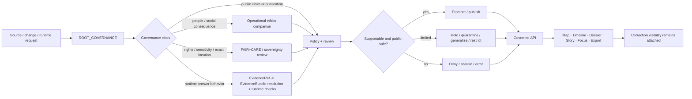

<!-- [KFM_META_BLOCK_V2]
doc_id: kfm://doc/<TODO-VERIFY-UUID>
title: ROOT_GOVERNANCE
type: standard
version: v1
status: draft
owners: @bartytime4life
created: <TODO-VERIFY>
updated: <TODO-VERIFY>
policy_label: public
related: [docs/standards/README.md, docs/governance/README.md, docs/governance/ROOT_GOVERNANCE.md, policy/README.md, contracts/README.md, schemas/README.md, tests/README.md, .github/README.md, .github/PULL_REQUEST_TEMPLATE.md, CONTRIBUTING.md, SECURITY.md, docs/standards/faircare/FAIRCARE-GUIDE.md, docs/standards/sovereignty/INDIGENOUS-DATA-PROTECTION.md]
tags: [kfm, governance, standards, trust, publication, review]
notes: [UUID and file-history dates need verification before merge, broad /docs/ ownership is confirmed on current public main, companion governance and standards surfaces should stay aligned without hiding uncertainty]
[/KFM_META_BLOCK_V2] -->

# ROOT_GOVERNANCE

Core governance law and review-trigger standard for KFM truth-state transitions, publication limits, runtime boundaries, and correction behavior.

> **Status:** `draft`  
> **Owners:** `@bartytime4life` *(current `/docs/` owner on public `main`; narrower file ownership still needs verification)*  
> **Path:** `docs/standards/governance/ROOT_GOVERNANCE.md`  
>       
> **Quick jumps:** [Scope](#scope) · [Authority order](#authority-order-for-this-standard) · [Repo fit](#repo-fit) · [Accepted inputs](#accepted-inputs) · [Exclusions](#exclusions) · [Root rules](#root-rules) · [Objects](#governance-objects-and-what-they-protect) · [Review triggers](#review-triggers) · [Allowed outcomes](#allowed-outcomes) · [Decision flow](#decision-flow) · [Surface responsibilities](#surface-responsibilities) · [Change bundle](#governance-significant-change-bundle) · [Quickstart](#quickstart-for-maintainers) · [Open verification items](#open-verification-items)

> [!IMPORTANT]
> This file is the **standards-layer** cross-domain governance law in `docs/standards/`. It does **not** replace the executable policy layer in `policy/`, the machine-readable contract and schema surfaces in `contracts/` and `schemas/`, the proof surfaces in `tests/`, the gatehouse routing surfaces in `.github/`, or the operator procedures in runbooks. KFM governance stays trustworthy only when these surfaces move together.

> [!WARNING]
> Treat every implementation-shaped statement in this file as doctrine, review guidance, or change-control law unless direct branch-local code, schemas, fixtures, workflows, manifests, or runtime evidence prove more. Do not read this standard as proof that a given route, validator, policy bundle, UI payload, or required check already exists.

> [!NOTE]
> Public `main` now exposes **two** root-governance-shaped docs: this standards-layer file and `docs/governance/ROOT_GOVERNANCE.md`. Keep them aligned, but do not collapse their roles. This file is the cross-cutting standards surface; the governance-directory file carries governance-lane routing and adjacent operational framing.

---

## Scope

This standard defines the **minimum root governance law** for Kansas Frontier Matrix across domains, products, delivery layers, and runtime behaviors.

It governs:

- how KFM treats publication, promotion, correction, and withdrawal as trust-bearing state changes
- which changes are governance-significant enough to require explicit review
- which outcomes are allowed when support, rights, sensitivity, or release conditions are incomplete
- what public and steward-facing surfaces must keep visible at point of use
- how this human-readable standard hands off to policy, contracts, schemas, tests, workflows, and runbooks

It does **not** define:

- machine-readable policy bundles
- JSON Schema field-by-field contracts
- test harness implementation
- workflow YAML details
- deployment topology
- domain-specific publication logic beyond the root rules every lane must inherit

---

## Authority order for this standard

| Priority | Evidence class | How to read it here |
|---|---|---|
| 1 | KFM doctrinal manuals and replacement-grade architecture material | Anchor non-negotiable governance law, trust posture, fail-closed behavior, and publication/correction doctrine |
| 2 | Current public repo evidence on `main` | Confirm file roles, neighbor surfaces, ownership signals, and visible gaps without overstating platform enforcement |
| 3 | Companion governance, standards, policy, contract, and test READMEs | Clarify where this standard should hand work off and which trust-bearing object families already have named homes |
| 4 | Public platform signal such as Actions history | Useful historical context, but **not** a substitute for checked-in inventory or platform-setting proof |
| 5 | Official external documentation | Only for version-sensitive facts when needed; never allowed to silently override KFM doctrine |

> [!TIP]
> When doctrine and current public repo shape point in different directions, keep the doctrine and downgrade the packaging or implementation claim until direct branch evidence closes the gap.

---

## Repo fit

| Item | Value |
|---|---|
| Path | `docs/standards/governance/ROOT_GOVERNANCE.md` |
| Document role | Standards-layer root governance law for cross-cutting trust, publication, correction, and review behavior |
| Upstream context | [`../README.md`](../README.md), [`../../../README.md`](../../../README.md) |
| Standards index | [`../README.md`](../README.md) |
| Governance companions | [`../../governance/README.md`](../../governance/README.md), [`../../governance/ROOT_GOVERNANCE.md`](../../governance/ROOT_GOVERNANCE.md) |
| Machine-readable companions | [`../../../policy/README.md`](../../../policy/README.md), [`../../../contracts/README.md`](../../../contracts/README.md), [`../../../schemas/README.md`](../../../schemas/README.md) |
| Enforcement companions | [`../../../tests/README.md`](../../../tests/README.md), [`../../../.github/README.md`](../../../.github/README.md), [`../../../.github/PULL_REQUEST_TEMPLATE.md`](../../../.github/PULL_REQUEST_TEMPLATE.md) |
| Related standards | [`../faircare/FAIRCARE-GUIDE.md`](../faircare/FAIRCARE-GUIDE.md), [`../sovereignty/INDIGENOUS-DATA-PROTECTION.md`](../sovereignty/INDIGENOUS-DATA-PROTECTION.md) |
| Process neighbors | [`../../../CONTRIBUTING.md`](../../../CONTRIBUTING.md), [`../../../SECURITY.md`](../../../SECURITY.md) |

### Current verified snapshot

| Check | Status | Notes |
|---|---:|---|
| File exists in public `main` | ✅ | Present at the expected standards path |
| Current file substance | ✅ | Public `main` already shows a substantive draft; this revision is an in-place strengthening rather than a first-fill |
| Standards index routes here | ✅ | `docs/standards/README.md` lists this file as a downstream governance surface |
| Governance-directory sibling exists | ✅ | `docs/governance/ROOT_GOVERNANCE.md` is also present on public `main`; roles should stay aligned without silent duplication |
| `/docs/` ownership signal exists | ✅ | Current `CODEOWNERS` assigns `/docs/` to `@bartytime4life` |
| FAIR+CARE companion depth | ⚠️ | `docs/standards/faircare/FAIRCARE-GUIDE.md` remains scaffold-only on public `main` |
| Active workflow enforcement for this standard | ? | Needs direct verification from checked-in workflow YAML, required checks, or platform settings |
| Narrower per-file ownership | ? | Not separately verified |
| Mounted-checkout parity | ? | Public `main` was inspected; local branch/worktree parity still needs verification |

---

## Accepted inputs

This file accepts governance-facing material such as:

- non-negotiable trust and publication rules
- review triggers and escalation conditions
- allowed negative outcomes and their visibility rules
- separation-of-duty expectations for promotion, denial, and correction
- cross-domain governance objects and the trust they protect
- cross-links to adjacent ethics, sovereignty, policy, contract, test, security, and gatehouse surfaces

## Exclusions

This file should not become:

- the home of detailed Rego or policy-rule bodies
- an OpenAPI, JSON Schema, or DTO catalog
- a domain-specific publication manual for one lane
- a release note, incident log, or operations timeline
- a substitute for `SECURITY.md`, `CONTRIBUTING.md`, `.github/` review surfaces, or runbook material
- a place to hide unverified workflow names, settings, or enforcement claims

| If you need to document… | Put it in… |
|---|---|
| policy decision logic, reason codes, obligation codes | [`../../../policy/`](../../../policy/) |
| machine-readable trust objects | [`../../../contracts/`](../../../contracts/) and related schema homes |
| proof burdens, fixtures, rollback drills, negative-path coverage | [`../../../tests/`](../../../tests/) |
| disclosure or coordinated security handling | [`../../../SECURITY.md`](../../../SECURITY.md) |
| contributor process and PR expectations | [`../../../CONTRIBUTING.md`](../../../CONTRIBUTING.md), [`../../../.github/PULL_REQUEST_TEMPLATE.md`](../../../.github/PULL_REQUEST_TEMPLATE.md) |
| lane-specific stewardship or publication burdens | lane docs, governance companions, and release-time proof objects |

---

## Truth posture used in this standard

| Label | Use here | Must **not** be mistaken for |
|---|---|---|
| **CONFIRMED** | Directly supported by current repo-facing evidence or stable KFM doctrine already reflected in adjacent repo docs | Proof of hidden code, hidden workflows, or mounted runtime behavior |
| **INFERRED** | Conservative structural completion where KFM doctrine strongly implies a seam must exist | Confirmed implementation |
| **PROPOSED** | Recommended standard wording, structure, or change discipline that fits current KFM doctrine and repo layout | Something already deployed |
| **UNKNOWN** | Not verified strongly enough in the current session to claim as current repo fact | A gap to smooth away with confident prose |
| **NEEDS VERIFICATION** | Review item that should be checked before merge or before treating a behavior as live | A blocker on useful drafting |

> [!NOTE]
> KFM governance is weakened when uncertainty gets polished away. Keep unresolved items visible until direct evidence closes them.

---

## Root rules

These rules are the root of governance for this standards surface.

### 1. Governance follows the truth path

KFM treats the path below as load-bearing:

```text
Source edge -> RAW -> WORK / QUARANTINE -> PROCESSED -> CATALOG / TRIPLET -> PUBLISHED
```

Governance applies at every state change, not only at public release time.

### 2. Publication is a governed event

A public-facing value, map layer, dossier, story claim, export, or runtime answer is not “good enough” merely because a query succeeded. Publication requires rights, sensitivity, provenance, release state, and review posture to remain valid together.

### 3. No bypass of the trust membrane

Normal public and steward-facing surfaces must not bypass governed APIs, evidence resolution, or policy evaluation to reach truth-bearing internals directly.

### 4. Derived layers are not authoritative by default

Graphs, search indexes, vector tiles, map portrayals, caches, summaries, scenes, rankings, and model-assisted outputs remain **derived** unless explicitly promoted under governance.

### 5. Consequential claims must resolve evidence explicitly

Where a claim, answer, export, or surface outcome is consequential, KFM should preserve a visible `EvidenceRef -> EvidenceBundle` route so the user or reviewer can inspect what support actually exists.

### 6. Promotion changes trust state

Promotion is not a quiet file move. It is a governed state change that should be accompanied by the relevant artifacts, review context, and correction path.

### 7. Runtime outcomes stay finite and fail closed

When support is incomplete or policy conditions fail, KFM should prefer visible constrained outcomes over persuasive overreach.

Minimum runtime family:

- `ANSWER`
- `ABSTAIN`
- `DENY`
- `ERROR`

### 8. Correction preserves lineage

Supersession, narrowing, withdrawal, replacement, and generalization should preserve visible lineage instead of erasing prior public state.

### 9. Separation of duty matters for policy-significant change

Changes that alter publication rights, sensitivity posture, outward trust state, or correction visibility should not collapse proposal, approval, and release into one invisible action stream.

### 10. Documentation is part of governance

Behavior-significant governance changes should move with adjacent docs, policy surfaces, contracts, fixtures, tests, and runbooks. A doc-only governance change that leaves executable surfaces drifting is incomplete.

---

## Root invariants and their practical consequence

| Invariant | Practical consequence |
|---|---|
| Canonical truth path | Source material moves through staged, reviewable trust states before publication |
| Trust membrane | Public or external surfaces read through governed APIs only |
| Authoritative vs derived separation | Delivery convenience layers do not quietly become sovereign truth |
| Map-first, time-aware operation | Place and time remain coequal operating dimensions |
| `EvidenceRef -> EvidenceBundle` resolution | Consequential claims remain inspectable at point of use rather than collapsing into opaque surface smoothness |
| Evidence-bounded runtime behavior | Focus-like synthesis remains subordinate to evidence and policy |
| Visible correction | Public trust surfaces preserve supersession, narrowing, withdrawal, and replacement cues |
| Fail-closed default | Unknown rights, unresolved evidence, stale projections, or sensitivity conflicts do not pass silently |
| Governance-coupled release | Release state, evidence linkage, and correction linkage remain attached downstream |

---

## Governance objects and what they protect

| Object family | Minimum purpose | What it protects |
|---|---|---|
| `SourceDescriptor` | Declares what a source is, who stewards it, how it may be used, and what freshness/rights posture applies | source admission discipline |
| `IngestReceipt` | Proves that a fetch and landing event occurred | acquisition integrity and landing visibility |
| `ValidationReport` | Records what passed, failed, or quarantined during intake or canonical work | fail-closed routing and validation visibility |
| `DatasetVersion` | Carries an authoritative candidate or promoted subject set | deterministic identity, support basis, and time semantics |
| `CatalogClosure` | Publishes outward metadata closure and lineage linkage | discoverability, identifier coherence, and release linkage |
| `DecisionEnvelope` | Makes a policy result machine-readable | reviewable allow / deny / generalize / restrict / hold behavior |
| `ReviewRecord` | Captures human approval, denial, escalation, or note | separation of duty and no-hidden-approval behavior |
| `ReleaseManifest` / `ReleaseProofPack` | Binds outward release to proof, rollback, and correction posture | publication integrity and reversible release |
| `EvidenceBundle` | Keeps support inspectable at point of use | visible evidence, rights, sensitivity, and lineage context |
| `RuntimeResponseEnvelope` | Carries trust-bearing runtime outcomes | finite runtime behavior and audit linkage |
| `CorrectionNotice` | Records supersession, withdrawal, narrowing, or replacement | visible correction lineage |

---

## What this file governs — and what it delegates

| Surface | This standard owns | This standard does **not** replace |
|---|---|---|
| `docs/standards/governance/ROOT_GOVERNANCE.md` | Root governance law, review triggers, allowed outcomes, cross-cutting obligations | Policy code, schemas, tests, workflow YAML |
| `docs/governance/ROOT_GOVERNANCE.md` | Governance-directory operational framing, adjacent governance routing, and local governance-lane consequences | The standards-layer law surface above |
| `policy/` | Executable policy posture, reasons, obligations, decision behavior | Human-readable root law |
| `contracts/` + `schemas/` | Machine-readable object definitions and validation shapes | Governance interpretation by itself |
| `tests/` + workflows | Evidence that rules are enforced and fail closed | The rules themselves |
| `docs/governance/` | Operational governance navigation and review-facing docs | Standards-layer root governance doctrine |
| `docs/runbooks/` | Incident, rollback, correction, restore, and operator procedures | Root governance law |
| Surface-specific docs | Local consequences for a feature, lane, or interface | Cross-domain root governance |

---

## Review triggers

Use this matrix when deciding whether a change must pass through explicit governance review.

| Trigger class | Why governance applies | Also inspect | Typical outcome set |
|---|---|---|---|
| Public claim or public-facing interpretation change | It changes what users may treat as supported truth | Evidence links, release state, correction path | publish · hold · generalize · deny |
| Promotion, publication, withdrawal, or supersession change | It changes trust state, not just storage state | Release artifacts, review notes, rollback/correction path | promote · publish · withdraw · supersede |
| Rights, sensitivity, or exact-location exposure change | It may change what can safely be shown or redistributed | Policy layer, sovereignty / FAIR+CARE / ethics companion docs | generalize · restrict · hold · deny |
| Runtime answer behavior change | It changes claim-bearing behavior at point of use | Focus envelope, evidence drill-through, negative-path tests | answer · abstain · deny · error |
| Derived layer begins to look authoritative | It risks blurring authoritative vs derived separation | Evidence Drawer behavior, release linkage, surface state | narrow · relabel · hold |
| Reviewer / approval boundary change | It changes who can approve or release policy-significant state | CODEOWNERS, review path, separation-of-duty expectations | approve · escalate · deny |
| Export behavior change | It changes what leaves the governed shell and what trust cues remain attached | Export preview, manifest/proof expectations, correction linkage | publish · restrict · generalize · deny |
| Story / dossier / teaching surface change | It can change interpretation, context, or audience burden | Narrative provenance, dates, perspective labels, correction visibility | publish · revise · hold |
| Domain-lane expansion | A new lane inherits root rules but adds lane-specific burden | Source descriptors, rights posture, support/time semantics | admit · stage · hold |
| Trust-membrane bypass risk | It introduces a convenience path around governed interfaces or review | Security posture, API boundary, runtime audit impact | reject · redesign · deny |

> [!TIP]
> If you are unsure whether governance applies, treat the change as governance-significant until proven otherwise.

---

## Allowed outcomes

KFM should prefer explicit governed outcomes over vague success language.

| Outcome | Meaning | Typical use |
|---|---|---|
| `promote` | Candidate material becomes release-bearing | Reviewed dataset/version or outward artifact is ready to move forward |
| `publish` | Public-safe outward state is allowed | Public-facing surface, export, or story node is approved for release scope |
| `hold` | Work is not publishable yet, but not rejected outright | Missing proof, incomplete review, unresolved dependencies |
| `quarantine` | Material is staged away from normal promotion flow | Validation failure, source anomaly, suspected sensitivity or rights issue |
| `generalize` | The public-safe version must reduce precision or detail | Exact location, culturally sensitive material, biodiversity or archaeology exposure |
| `restrict` | Visibility narrows to stewards or authorized roles | Rights, sensitivity, or review constraints |
| `deny` | Requested action is not allowed | Policy violation, unsupported publication path, forbidden surface |
| `abstain` | System refuses to answer as evidence is insufficient | Runtime evidence gap, citation failure, unresolved scope |
| `error` | Technical failure prevented a safe result | Resolver failure, schema failure, stale-state mismatch, system fault |
| `withdraw` | Previously outward state is pulled back visibly | Exposure issue, invalid release, rights change |
| `supersede` | A newer governed state replaces an older one with lineage intact | Correction, improved release, narrowed interpretation |

### Runtime note

Runtime claim-bearing surfaces should stay within the finite result family:

```text
ANSWER / ABSTAIN / DENY / ERROR
```

Publication and review workflows may use the broader governance vocabulary above.

---

## Decision flow



---

## Surface responsibilities

Every consequential surface should keep trust cues visible at point of use.

| Surface | Must keep visible | Governance burden |
|---|---|---|
| **Map / Explorer** | time scope, freshness, release context, route to evidence | Must not imply a derived portrayal is authoritative without evidence drill-through |
| **Timeline** | event grain, as-of basis, stale-state cues, compare basis | Must not flatten time ambiguity into a single apparent now |
| **Dossier** | identity, dependencies, service/hazard context, evidence links, correction state | Must behave like a durable object, not an untracked modal |
| **Story** | evidence-linked excerpts, dates, perspective labels, review/correction state | Narrative clarity must not sever provenance |
| **Evidence Drawer** | bundle members, quote context, transforms, release state, preview limits | Mandatory trust object for consequential claims |
| **Focus** | scoped retrieval, citation check, audit reference, finite result family | No uncited answer path; no policy bypass |
| **Compare** | explicit basis for side A / side B, time basis, uncertainty cues | Must preserve asymmetry instead of forcing false equivalence |
| **Export** | release scope, evidence linkage, preview policy, correction linkage | Export must not quietly drop trust cues |
| **Review / Stewardship** | diff, gates, policy labels, review notes, receipts | No hidden approvals; review state should stay legible |

---

## Governance-significant change bundle

A governance-significant change is not done until the related evidence surfaces move together.

### Minimum bundle

- [ ] Change class is named
- [ ] Affected audience and affected surfaces are named
- [ ] Allowed outcome set is decided **before** implementation
- [ ] Documentation changes are included or explicitly declared unnecessary
- [ ] Policy implications are updated or explicitly declared unchanged
- [ ] Contract/schema implications are updated or explicitly declared unchanged
- [ ] Fixture/test implications are updated or explicitly declared unchanged
- [ ] Rollback or correction path is named
- [ ] Ownership and approval boundary are rechecked
- [ ] Unknowns remain visible instead of being smoothed away

### Definition of done

A governance-sensitive change is ready only when:

1. the trust state it changes is explicit,
2. the outward consequence is reviewable,
3. the negative path is acceptable,
4. correction remains possible without erasing lineage, and
5. adjacent executable surfaces are not left drifting from the standard.

---

## Governance handoff rules

### To policy

Use `policy/` when the question is:

- what result should be emitted
- what reasons and obligations should be recorded
- whether a request is allowed, restricted, generalized, denied, or held

### To contracts and schemas

Use `contracts/` and `schemas/` when the question is:

- what object shape must exist
- what fields are required
- what versioned machine-readable objects must validate
- what runtime, release, or correction envelope is expected

### To tests and workflows

Use `tests/` and workflow surfaces when the question is:

- how fail-closed behavior is proven
- how invalid fixtures are rejected
- how merge or promotion is blocked
- how negative paths remain exercised

### To ethics and sovereignty companions

Use governance companions when the question is:

- whether persuasive behavior, public consequence, or review framing needs ethics escalation
- whether rights, sovereignty, cultural sensitivity, or exact-location precision require a narrower publication path
- whether FAIR+CARE or Indigenous/community protection rules must shape generalization, restriction, or withholding

### To runbooks

Use runbooks when the question is:

- how a correction drill is executed
- how rollback or withdrawal is performed
- how restore, reissue, or incident communication works in practice

---

## Quickstart for maintainers

When a proposed change feels “small” but could still weaken trust, use this sequence:

1. Decide whether the change alters trust state, not only wording or implementation detail.
2. Read this file first.
3. Pull in [`../../governance/ROOT_GOVERNANCE.md`](../../governance/ROOT_GOVERNANCE.md) and [`../../governance/README.md`](../../governance/README.md) when the change affects governance-lane routing or adjacent governance docs.
4. Pull in sovereignty or FAIR+CARE companions if rights, precision, sensitivity, or community impact could change; if a companion is still scaffold-only, keep that gap visible instead of treating it as settled guidance.
5. Check gatehouse surfaces — [`../../../.github/README.md`](../../../.github/README.md), [`../../../.github/CODEOWNERS`](../../../.github/CODEOWNERS), and [`../../../.github/PULL_REQUEST_TEMPLATE.md`](../../../.github/PULL_REQUEST_TEMPLATE.md) — if review routing, ownership, or automation-adjacent behavior may change.
6. Check whether contracts, policy bundles, tests, or security surfaces must change with it.
7. Decide the allowed outcome **before** implementation: `publish`, `hold`, `quarantine`, `generalize`, `restrict`, `deny`, `abstain`, `withdraw`, `supersede`, or `error`.
8. Update docs, contracts, fixtures, tests, and runbooks in the same governed change stream.

---

## Open verification items

These items should be checked before treating this standard as fully merged into live repo reality.

| Item | Why it still matters |
|---|---|
| Exact `doc_id` UUID | Required by the KFM meta block, not verified from current repo evidence |
| File `created` / `updated` dates | Public page inspection did not establish trustworthy file-history dates for this exact document revision |
| Narrower ownership than `/docs/` | Current evidence confirms `/docs/` ownership, not a stricter file-level owner |
| Mounted-checkout parity | Public `main` was inspected; local branch/worktree parity still needs verification |
| Active workflow YAML / required checks | Repo docs describe workflow intent, but active checked-in enforcement was not verified here |
| Executable policy bundle inventory | `policy/` doctrine is visible; mounted runnable bundles/tests remain unverified |
| Authoritative schema-home decision for every object family | `contracts/` and `schemas/` surfaces are visible, but not every family-to-home decision is settled here |
| Cross-file alignment between the two root governance docs | Public `main` shows both files; they should stay role-distinct without drifting into contradiction |
| FAIR+CARE companion depth | The linked FAIR+CARE guide is still scaffold-only on public `main` and may need synchronized strengthening |

> [!CAUTION]
> Do not “resolve” these items by assumption during implementation. Close them with direct repo, workflow, schema, or runtime evidence.

---

## Merge guidance for maintainers

A good merge of this file should leave the repository in a clearer state than before.

Prefer these outcomes:

- this file becomes the stable human-readable governance root for `docs/standards/`
- adjacent surfaces link to it consistently
- policy and contract owners can point back here without using it as a substitute for executable rules
- future contributors can tell which governance questions belong here and which belong elsewhere
- the standards-layer file and the governance-directory root file remain intentionally aligned, not accidentally duplicated

Avoid these outcomes:

- this file starts claiming enforcement that only tests, workflows, or platform settings could prove
- it duplicates `policy/README.md`, `contracts/README.md`, or `docs/governance/ROOT_GOVERNANCE.md`
- it drifts into domain-specific governance that should live in lane docs
- it sounds more certain than current mounted evidence supports
- it hides linked scaffold gaps such as FAIR+CARE behind smooth prose

---

<details>
<summary><strong>Quick glossary</strong></summary>

| Term | Working meaning in this file |
|---|---|
| **Truth path** | The staged path from source edge through publication |
| **Trust membrane** | The governed boundary preventing normal surfaces from bypassing policy and evidence resolution |
| **Authoritative** | The governed record or state that may anchor outward claims |
| **Derived** | Rebuildable delivery or retrieval material such as tiles, graphs, summaries, scenes, or rankings |
| **Public-safe** | Safe for the intended audience after rights, sensitivity, precision, and release checks |
| **Evidence Drawer** | The point-of-use trust object that keeps claims inspectable |
| **DecisionEnvelope** | A machine-readable policy result object |
| **EvidenceBundle** | A request-time or point-of-use support package for a claim, feature, export, or answer |
| **RuntimeResponseEnvelope** | A machine-readable runtime object for `ANSWER`, `ABSTAIN`, `DENY`, or `ERROR` |
| **ReviewRecord** | The machine-readable or human-readable record of approval, denial, escalation, or note |
| **CorrectionNotice** | The lineage-preserving object that records supersession, withdrawal, narrowing, or replacement |
| **ReleaseManifest** | The object that ties outward release to proof, rollback posture, and correction visibility |

</details>

<p align="right"><a href="#root_governance">Back to top</a></p>
