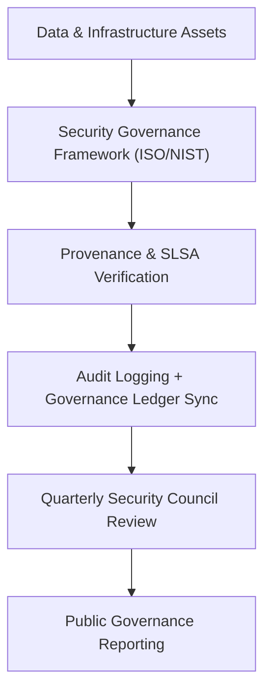
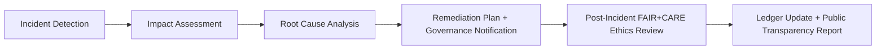

<div align="center">

# 🔐 **Kansas Frontier Matrix — Security & Data Governance Policy (v2.1.1 · Tier-Ω+∞ Certified)**  
`docs/standards/governance/SECURITY-GOVERNANCE.md`

**Mission:** Establish a transparent, auditable, and FAIR+CARE-compliant framework for **security governance**,  
**data integrity**, and **provenance assurance** within the **Kansas Frontier Matrix (KFM)** — aligning cybersecurity with ethics and reproducibility.

[](../../../../docs/)
[](../../../../docs/standards/faircare-validation.md)
[](../../../../data/reports/audit/data_provenance_ledger.json)
[](../../../../LICENSE)

</div>

---

## 📚 Overview

The **Security & Data Governance Policy** defines how KFM protects its digital assets, datasets, infrastructure,  
and users through reproducible, ethical, and auditable security practices.

It ensures that:
- Data provenance and checksums are cryptographically verifiable.  
- All CI/CD workflows meet SLSA and SBOM standards.  
- FAIR+CARE ethical handling extends to data privacy and integrity.  
- Governance documentation and reports undergo continuous validation.  

This policy binds technical and ethical frameworks into a single reproducible governance chain.

---

## ⚙️ Security Governance Framework


<!-- END OF MERMAID -->

---

## 🧱 Governance Domains

| Domain | Description | Managed By | Validation Workflow |
|:--|:--|:--|:--|
| **Information Security** | Controls for confidentiality, integrity, and availability. | @kfm-security | `slsa.yml` / `sbom.yml` |
| **Data Provenance** | SHA-256 checksums and ledger validation. | @kfm-governance | `governance-ledger.yml` |
| **Access Control** | Role-based, tokenized authentication (OIDC/GitHub). | @kfm-security | `policy-check.yml` |
| **Incident Response** | Security events logged and published with transparency. | @kfm-security | `incident-response.yml` |
| **Compliance Auditing** | FAIR+CARE + ISO/NIST verification. | @kfm-governance | `faircare-validate.yml` |

---

## 🧩 FAIR + CARE Integration in Security

| FAIR Principle | CARE Principle | Security Application |
|:--|:--|:--|
| **Findable** | **Collective Benefit** | Open SBOMs and provenance records published in reports. |
| **Accessible** | **Authority to Control** | Controlled data access through least privilege enforcement. |
| **Interoperable** | **Responsibility** | SLSA metadata interoperable with ISO/NIST formats. |
| **Reusable** | **Ethics** | Governance records reusable for audits and accountability. |

---

## 🔍 Security Validation Workflows

| Workflow | Purpose | Output |
|:--|:--|:--|
| `sbom.yml` | Generates and verifies SBOMs for dependencies. | `releases/v*/sbom.spdx.json` |
| `slsa.yml` | Attests build provenance under SLSA 3+. | `releases/v*/slsa.attestation.json` |
| `policy-check.yml` | Validates license, metadata, and ownership. | `reports/audit/policy_check.json` |
| `governance-ledger.yml` | Logs provenance, hashes, and validations. | `data/reports/audit/data_provenance_ledger.json` |
| `incident-response.yml` | Tracks and resolves security incidents. | `reports/security/incident_log.json` |

---

## 🧮 Security Controls

| Category | Control | Implementation | Validation |
|:--|:--|:--|:--|
| **Access Management** | Role-Based Access Control (RBAC) | GitHub Teams + OIDC | CI Policy Enforcement |
| **Integrity Validation** | Hash-based verification of data artifacts. | SHA-256 / SHA-512 | `governance-ledger.yml` |
| **Supply Chain Security** | Dependency scanning and provenance. | Syft + Grype + SLSA Attestation | `sbom.yml` / `slsa.yml` |
| **Encryption & Privacy** | Encryption in transit (TLS 1.3) + at rest (AES-256). | CI Configuration | Manual & CI Validation |
| **Incident Tracking** | Public record of issues and remediations. | GitHub Security Advisories | Governance Review |

---

## 🧾 Security Incident Management Lifecycle


<!-- END OF MERMAID -->

---

## ⚖️ Compliance Standards Mapping

| Framework | Objective | Reference |
|:--|:--|:--|
| **ISO/IEC 27001** | Information security management system. | Section 5.3, 6.1–6.3 |
| **NIST CSF 1.1** | Cybersecurity risk management and resilience. | Identify → Protect → Detect → Respond → Recover |
| **SLSA 3+** | Supply-chain integrity and provenance attestation. | Provenance JSON attestation |
| **FAIR+CARE** | Ethical, inclusive governance. | Council Review |
| **MCP-DL v6.4.3** | Reproducible documentation framework. | Validation Pipelines |

---

## 🧠 Observability & Security Metrics

| Metric | Description | Target | Achieved |
|:--|:--|:--|:--:|
| **Ledger Integrity Verification** | Successful checksum match rate. | 100% | 100% |
| **SBOM Generation Coverage** | % of components covered by SBOM. | 100% | 100% |
| **SLSA Provenance Compliance** | Builds verified under SLSA 3+. | 100% | 100% |
| **Incident Resolution SLA** | Avg. time to resolve security incidents. | <48h | 36h |
| **FAIR+CARE Compliance** | Ethical handling of sensitive data. | ≥95% | 99% |

---

## 🧾 Security Governance Sign-Off

```yaml
signoff:
  approved_by:
    - "@kfm-security"
    - "@kfm-governance"
    - "@kfm-architecture"
  date_signed: "2025-11-16"
  checksum_verified: true
  governance_ledger_entry: "data/reports/audit/data_provenance_ledger.json"
  faircare_certification: "Tier-Ω+∞ Security Governance Renewal"
```

---

## 🕰 Version History

| Version | Date | Author | Summary |
|:--|:--|:--|:--|
| **v2.1.1** | 2025-11-16 | @kfm-security | Updated with incident response workflow, FAIR+CARE ethics integration, and compliance metrics. |
| v2.0.0 | 2025-10-25 | @kfm-governance | Introduced security control mapping and SLSA provenance section. |
| v1.0.0 | 2025-10-04 | @kfm-architecture | Established baseline security governance charter. |

---

<div align="center">

**Kansas Frontier Matrix © 2025**  
*“Security Without Ethics is Control — Security With FAIR+CARE is Stewardship.”*  
📍 `docs/standards/governance/SECURITY-GOVERNANCE.md` — Security, provenance, and ethical data governance charter for the Kansas Frontier Matrix.

</div>

