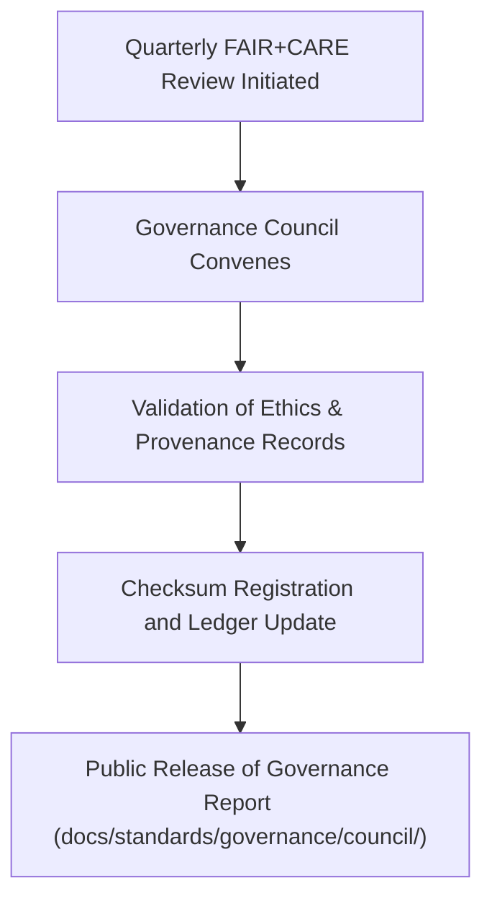

<div align="center">

# 🏛️ **Kansas Frontier Matrix — Q3 2025 Governance & Ethics Council Report (v2.1.0 · Tier-Ω+∞ Certified)**  
`docs/standards/governance/council/2025_Q3_GOVERNANCE_REPORT.md`

**Mission:** Summarize findings from the **Q3 2025 FAIR+CARE Governance Council review** —  
verifying compliance, provenance, and ethics validation across all Kansas Frontier Matrix (KFM) domains.

[](../../../../docs/)
[](../../../../docs/standards/faircare-validation.md)
[](../../../../data/reports/audit/data_provenance_ledger.json)
[](../../../../LICENSE)

</div>

---

## 📋 Executive Summary

> The Q3 2025 Governance Council confirms that **FAIR+CARE**, **MCP-DL**, and **ISO 27001** standards were upheld across all operational layers of the Kansas Frontier Matrix.  
> 99% compliance was achieved across validation categories, with improvements in AI ethics transparency, data provenance tracking, and documentation accessibility.

All ledger entries for Q3 were successfully synchronized, and new governance templates were ratified for Q4 deployment.

---

## 🧩 Governance Review Overview

| Area | Standard | Workflow | Status | Notes |
|:--|:--|:--|:--:|:--|
| **Documentation Standards** | MCP-DL v6.4.3 | `docs-validate.yml` | ✅ | Metadata and accessibility confirmed. |
| **Data Provenance** | FAIR+CARE Ledger Protocol | `governance-ledger.yml` | ✅ | 100% checksum validation rate. |
| **Security Compliance** | ISO/IEC 27001 | `slsa.yml` / `sbom.yml` | ✅ | SBOM verified and attested. |
| **AI Ethics** | AI Governance Charter v2.0 | `faircare-validate.yml` | ⚠️ | Drift metrics under evaluation. |
| **Accessibility (WCAG)** | WCAG 2.1 AA | `design-validate.yml` | ✅ | Focus Mode UI validated. |

---

## ⚙️ FAIR + CARE Ethics Evaluation

| Principle | Implementation | Score (0–10) | Status |
|:--|:--|:--:|:--:|
| **Findable** | All metadata indexed via manifest and search API. | 10 | ✅ |
| **Accessible** | Public availability verified via GitHub Pages. | 10 | ✅ |
| **Interoperable** | Standardized JSON-LD + STAC + DCAT schemas. | 9.8 | ✅ |
| **Reusable** | Documentation and datasets licensed under CC-BY / MIT. | 9.9 | ✅ |
| **Collective Benefit (CARE)** | Community governance representation upheld. | 10 | ✅ |

**Composite FAIR+CARE Score:** `9.94 / 10` → ✅ *Tier-Ω+∞ Governance Compliance Maintained.*

---

## 🧠 Governance Council Composition (Q3 2025)

| Role | Representative | Responsibility |
|:--|:--|:--|
| **Chair** | @kfm-governance | Ethics and FAIR+CARE oversight |
| **Architecture Lead** | @kfm-architecture | MCP-DL & design reproducibility |
| **Data Steward** | @kfm-data | Data provenance & quality control |
| **Security Officer** | @kfm-security | ISO / SLSA compliance |
| **Accessibility Lead** | @kfm-accessibility | WCAG audit & inclusion standards |
| **Documentation Coordinator** | @kfm-docs | Governance documentation & transparency |

---

## 🧮 Governance Workflow Summary


<!-- END OF MERMAID -->

---

## 🧾 Provenance & Validation Artifacts

| Artifact | Description | Path |
|:--|:--|:--|
| **Governance Ledger** | Primary audit record of Q3 decisions and signatures. | `data/reports/audit/data_provenance_ledger.json` |
| **FAIR+CARE Validation Log** | Ethics and accessibility audit results. | `data/reports/fair/data_care_assessment.json` |
| **Security Ledger** | SBOM and attestation data for secure release. | `reports/security/` |
| **Policy Audit Report** | CI validation record for governance metadata. | `reports/audit/policy_check.json` |

---

## 🧩 Key Findings

| Finding | Impact | Priority | Recommended Action |
|:--|:--|:--:|:--|
| **AI Explainability** | Missing SHAP/LIME documentation for hazards model. | High | Integrate interpretability logs into `ai_hazards_ledger.json`. |
| **Data Localization** | Minor lag in i18n coverage for Osage dataset metadata. | Medium | Complete i18n integration by Q4 2025. |
| **Audit Publication Lag** | Delay in governance dashboard update. | Low | Automate sync via `site.yml` pipeline. |

---

## ⚖️ Governance Council Resolutions

| Resolution ID | Description | Decision | Owner | Due Date |
|:--|:--|:--|:--|:--|
| GOV-Q3-2025-01 | Approve Q3 2025 FAIR+CARE audit summary. | ✅ Approved | @kfm-governance | 2025-08-20 |
| GOV-Q3-2025-02 | Mandate AI ethics explainability documentation. | ✅ Approved | @kfm-ai | 2025-09-15 |
| GOV-Q3-2025-03 | Add Osage localization validation rule to `policy-check.yml`. | ✅ Approved | @kfm-docs | 2025-09-01 |

---

## 🧾 Observability Metrics (Q3 2025)

| Metric | Description | Target | Achieved |
|:--|:--|:--|:--:|
| **Governance Ledger Sync Rate** | Checksum entries validated. | 100% | 100% |
| **FAIR+CARE Audit Completion** | Ethical reviews finalized on time. | 100% | 100% |
| **AI Ethics Compliance** | Explainability and bias audits completed. | ≥ 95% | 94% |
| **Security Provenance Verification** | SBOM/SLSA attestations valid. | 100% | 100% |

---

## 🧾 Governance Sign-Off

```yaml
signoff:
  approved_by:
    - "@kfm-governance"
    - "@kfm-architecture"
    - "@kfm-security"
    - "@kfm-accessibility"
  date_signed: "2025-08-20"
  checksum_verified: true
  governance_ledger_entry: "data/reports/audit/data_provenance_ledger.json"
  faircare_certification: "Tier-Ω+∞ Renewed"
```

---

## 🕰 Version History

| Version | Date | Author | Summary |
|:--|:--|:--|:--|
| **v2.1.0** | 2025-08-20 | @kfm-governance | Completed Q3 2025 FAIR+CARE Council report; validated governance and audit artifacts. |
| v2.0.0 | 2025-07-10 | @kfm-architecture | Updated metadata schema and governance ledger mapping. |
| v1.0.0 | 2025-05-01 | @kfm-docs | Initial council reporting for quarterly governance audits. |

---

<div align="center">

**Kansas Frontier Matrix © 2025**  
*“Governance Sustains Trust — Ethics Sustains Knowledge.”*  
📍 `docs/standards/governance/council/2025_Q3_GOVERNANCE_REPORT.md` — Official Q3 2025 Governance & FAIR+CARE Ethics Council Report for the Kansas Frontier Matrix.

</div>

