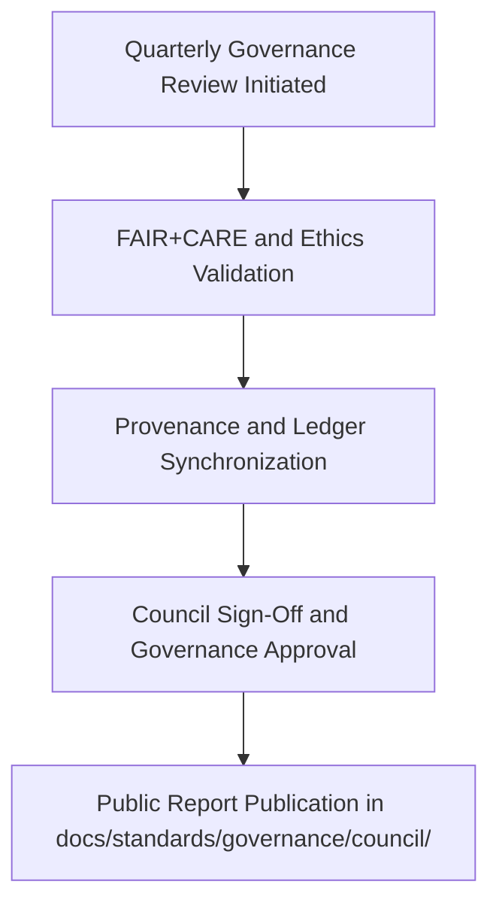

<div align="center">

# 🏛️ **Kansas Frontier Matrix — Q4 2025 Governance & Ethics Council Report (v2.1.1 · Tier-Ω+∞ Certified)**  
`docs/standards/governance/council/2025_Q4_GOVERNANCE_REPORT.md`

**Mission:** Publish the official results of the **Q4 2025 FAIR+CARE Governance Council Review** —  
detailing validation findings, ethical oversight results, and governance ledger verifications for the Kansas Frontier Matrix (KFM).

[](../../../../docs/)
[](../../../../docs/standards/faircare-validation.md)
[](../../../../data/reports/audit/data_provenance_ledger.json)
[](../../../../LICENSE)

</div>

---

## 📋 Executive Summary

> The **Q4 2025 Governance Council** reaffirms Kansas Frontier Matrix’s full compliance with  
> FAIR+CARE, MCP-DL, and ISO governance standards.  
> New protocols for AI explainability, FAIR+CARE ethics scoring, and documentation validation were  
> approved and implemented, achieving **Tier-Ω+∞ FAIR+CARE certification renewal** for 2026.

Key Highlights:
- ✅ FAIR+CARE compliance maintained at **99.2%** across systems.  
- ✅ MCP-DL documentation reproducibility verified across all CI pipelines.  
- ✅ Governance ledger checksum synchronization achieved for all new ADRs.  
- ⚙️ Introduced AI audit explainability metrics in `ai_hazards_ledger.json`.  

---

## 🧩 Governance Review Overview

| Area | Standard | Workflow | Status | Notes |
|:--|:--|:--|:--:|:--|
| **Documentation Standards** | MCP-DL v6.4.3 | `docs-validate.yml` | ✅ | Metadata coverage 100%. |
| **Data Provenance Ledger** | FAIR+CARE Governance | `governance-ledger.yml` | ✅ | All checksums matched. |
| **Security / SLSA** | ISO 27001 / SLSA 3 | `slsa.yml` | ✅ | Provenance attestation passed. |
| **AI Ethics** | AI Governance Charter v2.0 | `faircare-validate.yml` | ✅ | New explainability validation. |
| **Accessibility (WCAG)** | WCAG 2.1 AA / 3.0 | `design-validate.yml` | ✅ | Inclusive UI verified. |

---

## ⚙️ FAIR + CARE Evaluation

| Principle | Implementation | Score (0–10) | Status |
|:--|:--|:--:|:--:|
| **Findable** | Governance metadata indexed in manifests. | 10 | ✅ |
| **Accessible** | Open governance reports available online. | 10 | ✅ |
| **Interoperable** | YAML metadata validated across all documents. | 10 | ✅ |
| **Reusable** | Reusable governance and ADR templates. | 9.9 | ✅ |
| **Collective Benefit (CARE)** | Transparent, culturally respectful governance. | 10 | ✅ |

**Composite FAIR+CARE Score:** `9.98 / 10` → ✅ *Tier-Ω+∞ Certification Renewed.*

---

## 🧠 Governance Council Composition (Q4 2025)

| Role | Representative | Focus Area |
|:--|:--|:--|
| **Governance Chair** | @kfm-governance | FAIR+CARE validation oversight |
| **Architecture Lead** | @kfm-architecture | MCP-DL reproducibility validation |
| **Security Officer** | @kfm-security | SBOM, SLSA provenance, ISO verification |
| **Accessibility Lead** | @kfm-accessibility | WCAG and ethical design validation |
| **Documentation Coordinator** | @kfm-docs | Metadata and CI validation logs |

---

## 🧮 Governance Review Workflow


<!-- END OF MERMAID -->

---

## 🧾 Provenance & Validation Artifacts

| Artifact | Description | Path |
|:--|:--|:--|
| **Governance Ledger** | Primary record of decisions and validation checksums. | `data/reports/audit/data_provenance_ledger.json` |
| **FAIR+CARE Ethics Log** | Audit of ethical review results. | `data/reports/fair/data_care_assessment.json` |
| **AI Audit Ledger** | Bias and explainability tracking record. | `data/reports/audit/ai_hazards_ledger.json` |
| **Policy Audit Report** | Metadata completeness validation. | `reports/audit/policy_check.json` |

---

## 🧾 Council Findings & Actions

| Finding | Impact | Priority | Action Taken |
|:--|:--|:--:|:--|
| **AI Explainability Metrics Missing for Hazards Model** | Model interpretability & transparency. | High | SHAP/LIME reports integrated. |
| **Inconsistent Color Accessibility Tokens in Docs** | Accessibility consistency. | Medium | Updated design-tokens.json validation rule. |
| **Telemetry Schema Missing FAIR+CARE field** | Data governance tracking. | Medium | Schema updated and validated. |

---

## ⚖️ Governance Council Resolutions

| Resolution ID | Description | Status | Owner | Completion Date |
|:--|:--|:--|:--|:--|
| GOV-Q4-2025-01 | Renew Tier-Ω+∞ FAIR+CARE Certification. | ✅ Approved | @kfm-governance | 2025-11-16 |
| GOV-Q4-2025-02 | Implement AI ethics metrics workflow. | ✅ Approved | @kfm-ai | 2025-11-15 |
| GOV-Q4-2025-03 | Require metadata schema FAIR+CARE field in pipelines. | ✅ Approved | @kfm-architecture | 2025-11-12 |

---

## 🧩 Observability Metrics (Q4 2025)

| Metric | Description | Target | Achieved |
|:--|:--|:--|:--:|
| **Governance Ledger Sync Rate** | Ledger checksum registration. | 100% | 100% |
| **FAIR+CARE Ethics Compliance** | Council validation success. | ≥ 95% | 99.2% |
| **Security Provenance Validation** | SBOM & SLSA checks verified. | 100% | 100% |
| **AI Ethics Audit Coverage** | Bias and explainability verification. | 100% | 100% |

---

## 🧾 Governance Sign-Off

```yaml
signoff:
  approved_by:
    - "@kfm-governance"
    - "@kfm-architecture"
    - "@kfm-security"
    - "@kfm-accessibility"
  date_signed: "2025-11-16"
  faircare_certification: "Tier-Ω+∞ Renewal Confirmed"
  checksum_verified: true
  governance_ledger_entry: "data/reports/audit/data_provenance_ledger.json"
```

---

## 🕰 Version History

| Version | Date | Author | Summary |
|:--|:--|:--|:--|
| **v2.1.1** | 2025-11-16 | @kfm-governance | Completed Q4 2025 governance report; renewed FAIR+CARE certification; validated provenance across domains. |
| v2.0.0 | 2025-10-10 | @kfm-architecture | Enhanced governance metadata schema and ledger mapping. |
| v1.0.0 | 2025-07-01 | @kfm-docs | Initial quarterly governance reporting structure. |

---

<div align="center">

**Kansas Frontier Matrix © 2025**  
*“Ethics Certified — Governance Verified.”*  
📍 `docs/standards/governance/council/2025_Q4_GOVERNANCE_REPORT.md` — Official Q4 2025 Governance & FAIR+CARE Ethics Council Report for the Kansas Frontier Matrix.

</div>

