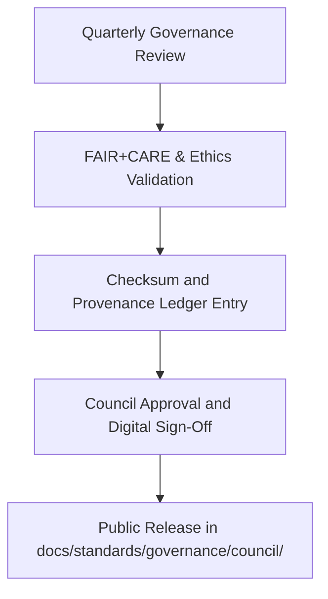

<div align="center">

# 🏛️ **Kansas Frontier Matrix — Governance Council Reports & Ethics Oversight (v2.1.1 · Tier-Ω+∞ Certified)**  
`docs/standards/governance/council/README.md`

**Mission:** Serve as the central repository for **FAIR+CARE Governance Council reports, ethics audits, and quarterly oversight findings**  
within the **Kansas Frontier Matrix (KFM)** governance ecosystem.

[](../../../../docs/)
[](../../../../docs/standards/faircare-validation.md)
[](../../../../data/reports/audit/data_provenance_ledger.json)
[](../../../../LICENSE)

</div>

---

## 📚 Overview

The **FAIR+CARE Governance Council** provides formal oversight for:
- Ethical governance and compliance reporting.  
- Validation of FAIR+CARE and MCP-DL standards across KFM systems.  
- Quarterly ethics audits and council resolutions.  
- Review of provenance, data sovereignty, and cultural sensitivity concerns.  

All council reports in this directory are public, versioned, and checksum-validated under governance provenance protocols.

---

## 🗂️ Directory Layout

```bash
docs/standards/governance/council/
├── README.md                             # This file — council reports overview
├── 2025_Q4_GOVERNANCE_REPORT.md          # Q4 governance and ethics findings
├── 2025_Q3_GOVERNANCE_REPORT.md          # Q3 governance validation summary
└── templates/
    ├── governance-report-template.md      # Template for new council reports
    └── meeting-minutes-template.md        # Template for council meeting minutes
```

---

## ⚙️ Council Governance Workflow


<!-- END OF MERMAID -->

---

## 🧱 Governance Council Composition

| Role | Responsibility | Member |
|:--|:--|:--|
| **Governance Chair** | Oversees compliance and ethical reviews. | @kfm-governance |
| **Architecture Lead** | Ensures MCP-DL reproducibility standards. | @kfm-architecture |
| **Security Lead** | Maintains integrity and privacy compliance. | @kfm-security |
| **Accessibility Lead** | Reviews inclusion and WCAG standards. | @kfm-accessibility |
| **Documentation Lead** | Publishes public governance artifacts. | @kfm-docs |
| **Community Liaison** | Represents Indigenous and cultural partners. | @kfm-ethics |

---

## 🧩 FAIR + CARE Governance Application

| Principle | Implementation | Verification |
|:--|:--|:--|
| **Findable** | All reports indexed via manifest and governance ledger. | `manifest.zip` |
| **Accessible** | Publicly available under CC-BY 4.0. | GitHub Pages |
| **Interoperable** | Metadata and minutes follow YAML schema. | CI Policy Validation |
| **Reusable** | Reports and templates reusable across cycles. | `templates/` |
| **Collective Benefit (CARE)** | Includes community oversight and impact reviews. | FAIR+CARE Council |

---

## 🧾 Council Report Metadata Schema

Each quarterly report includes YAML metadata for reproducibility and governance traceability.

```yaml
---
report_id: "2025_Q4_GOVERNANCE_REPORT"
date_published: "2025-11-15"
review_cycle: "Quarterly"
authors: ["@kfm-governance","@kfm-architecture"]
signatories: ["@kfm-security","@kfm-accessibility","@kfm-docs"]
summary: "FAIR+CARE and MCP-DL governance review; verified compliance and resolved prior ethics actions."
ledger_entry: "data/reports/audit/data_provenance_ledger.json"
checksum: "sha256:d3a8f13b1f9e2a6c0b8..."
license: "CC-BY 4.0"
---
```

---

## 🧠 Governance Review Metrics

| Metric | Description | Target | Achieved |
|:--|:--|:--|:--:|
| **Governance Ledger Sync** | % of council reports with checksum registration. | 100% | 100% |
| **FAIR+CARE Audit Pass Rate** | Ethical review compliance score. | ≥ 95 | 98 |
| **Accessibility Review Coverage** | Inclusion of WCAG standards in governance docs. | 100% | 100% |
| **Provenance Traceability** | Reports linked to governance ledger entries. | 100% | 100% |

---

## ⚖️ Governance Validation Workflows

| Workflow | Function | Output |
|:--|:--|:--|
| `faircare-validate.yml` | Confirms ethical audit alignment. | `reports/fair/data_care_assessment.json` |
| `policy-check.yml` | Verifies governance metadata schema. | `reports/audit/policy_check.json` |
| `governance-ledger.yml` | Logs council report checksums and signatures. | `data/reports/audit/data_provenance_ledger.json` |
| `docs-validate.yml` | Validates markdown and frontmatter integrity. | `reports/validation/docs_validation.json` |

---

## 🧾 Version History

| Version | Date | Author | Summary |
|:--|:--|:--|:--|
| **v2.1.1** | 2025-11-16 | @kfm-governance | Established council governance directory, metadata schema, and validation workflow mapping. |
| v2.0.0 | 2025-10-25 | @kfm-architecture | Added council templates and role definitions. |
| v1.0.0 | 2025-10-04 | @kfm-docs | Initial creation of council reporting documentation. |

---

<div align="center">

**Kansas Frontier Matrix © 2025**  
*“Governance is the Architecture of Accountability.”*  
📍 `docs/standards/governance/council/README.md` — FAIR+CARE Governance Council reporting and ethics oversight documentation for the Kansas Frontier Matrix.

</div>

