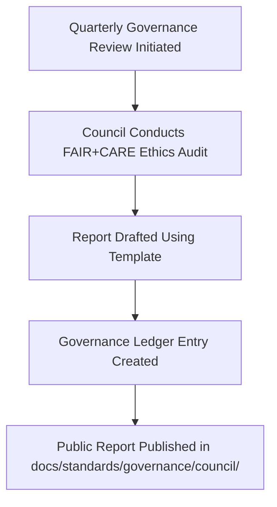

<div align="center">

# 📄 **Kansas Frontier Matrix — Governance Council Report Templates (v2.1.1 · Tier-Ω+∞ Certified)**  
`docs/standards/governance/council/templates/README.md`

**Mission:** Provide official, FAIR+CARE-aligned templates for creating **Governance Council Reports**,  
**Ethics Audit Records**, and **Meeting Minutes** for the **Kansas Frontier Matrix (KFM)**.

[](../../../../../docs/)
[](../../../../../docs/standards/faircare-validation.md)
[](../../../../../data/reports/audit/data_provenance_ledger.json)
[](../../../../../LICENSE)

</div>

---

## 📚 Overview

The **Governance Council Templates** define the structure and metadata requirements for all  
FAIR+CARE governance reporting, meeting documentation, and compliance summaries.  

Each report template includes:
- FAIR+CARE metadata schema  
- Ledger integration fields (checksum + provenance entry)  
- Validation rules enforced by `policy-check.yml`  
- Accessibility and documentation alignment (WCAG + MCP-DL)

---

## 🗂️ Directory Layout

```bash
docs/standards/governance/council/templates/
├── README.md                               # This file — overview of templates
├── governance-report-template.md            # Template for quarterly governance reports
└── meeting-minutes-template.md              # Template for council meeting minutes and resolutions
```

---

## ⚙️ Governance Reporting Workflow


<!-- END OF MERMAID -->

---

## 🧩 Template Metadata Schema

Each council document must begin with YAML frontmatter to ensure traceability and governance compliance.

```yaml
---
report_id: "2025_Q4_GOVERNANCE_REPORT"
date_created: "2025-11-15"
authors: ["@kfm-governance","@kfm-architecture"]
review_cycle: "Quarterly"
status: "Draft | Approved | Archived"
ledger_reference: "data/reports/audit/data_provenance_ledger.json"
checksum: "<sha256-value>"
license: "CC-BY 4.0"
---
```

---

## 🧱 Template Types

| Template | Purpose | Maintained By | Validation Workflow |
|:--|:--|:--|:--|
| **governance-report-template.md** | Records quarterly governance and ethics review findings. | @kfm-governance | `policy-check.yml` |
| **meeting-minutes-template.md** | Captures decisions, motions, and resolutions from council meetings. | @kfm-docs | `docs-validate.yml` |

---

## 🧠 FAIR + CARE Integration

| Principle | Implementation | Validation |
|:--|:--|:--|
| **Findable** | All reports indexed in manifest and ledger. | `manifest.zip` |
| **Accessible** | Published under open license (CC-BY 4.0). | Docs CI |
| **Interoperable** | YAML + Markdown standards ensure cross-compatibility. | `policy-check.yml` |
| **Reusable** | Templates reused for all governance periods. | Docs Governance |
| **Collective Benefit (CARE)** | Ethics and inclusivity recorded in council proceedings. | FAIR+CARE Board Review |

---

## 🧾 Example Governance Report Metadata Block

```yaml
---
report_id: "2025_Q3_GOVERNANCE_REPORT"
authors: ["@kfm-governance"]
date_published: "2025-08-20"
summary: "Ethics audit summary; verification of provenance and FAIR+CARE compliance."
approved_by: ["@kfm-security","@kfm-accessibility"]
ledger_reference: "data/reports/audit/data_provenance_ledger.json"
checksum: "sha256:ad4be7f31a9b7f3dc61..."
license: "CC-BY 4.0"
---
```

---

## 🧩 Validation Workflows

| Workflow | Function | Output |
|:--|:--|:--|
| `policy-check.yml` | Confirms metadata compliance and licensing. | `reports/audit/policy_check.json` |
| `docs-validate.yml` | Validates markdown syntax and diagrams. | `reports/validation/docs_validation.json` |
| `governance-ledger.yml` | Registers checksum and governance approval in ledger. | `data/reports/audit/data_provenance_ledger.json` |

---

## 🧾 Version History

| Version | Date | Author | Summary |
|:--|:--|:--|:--|
| **v2.1.1** | 2025-11-16 | @kfm-governance | Added FAIR+CARE council template metadata schema and workflow integration. |
| v2.0.0 | 2025-10-25 | @kfm-architecture | Introduced report and meeting template directory. |
| v1.0.0 | 2025-10-04 | @kfm-docs | Initial governance council template repository. |

---

<div align="center">

**Kansas Frontier Matrix © 2025**  
*“Accountability is a Template — Ethics is Its Signature.”*  
📍 `docs/standards/governance/council/templates/README.md` — Governance Council template and reporting framework for Kansas Frontier Matrix.

</div>

