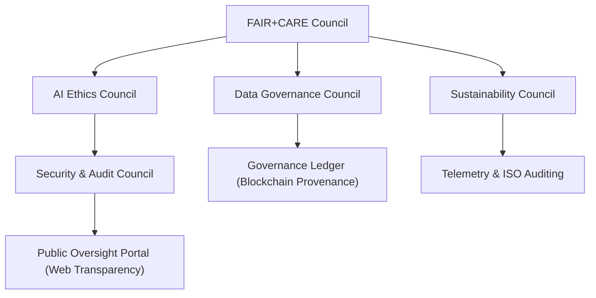
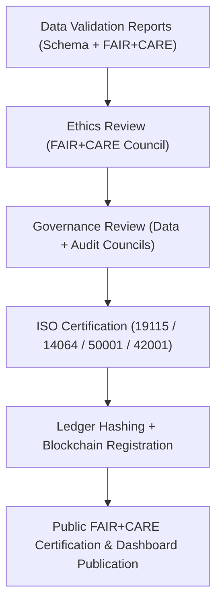
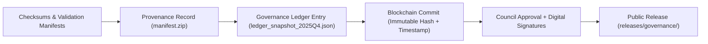
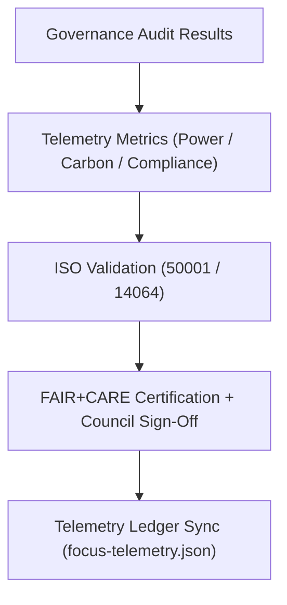

<div align="center">

# 🗺️ Kansas Frontier Matrix — **Governance Architecture Diagram & Council Flow**
`docs/standards/governance/governance-diagram.md`

**Purpose:**  
Visualizes the **data governance ecosystem** of the Kansas Frontier Matrix (KFM), illustrating council structure, provenance synchronization, FAIR+CARE certification flow, and blockchain governance lifecycle.  
This diagram provides a unified overview of **decision-making, accountability, and transparency processes** across KFM’s data and AI governance systems.

[](../../../docs/standards/faircare-validation.md)
[]()
[](../../../docs/architecture/README.md)
[](../../../LICENSE)

</div>

---

## 📚 Overview

This document provides a **visual governance blueprint** for how the Kansas Frontier Matrix operates under FAIR+CARE, ISO, and MCP-DL governance principles.  
It outlines **how data, AI, and sustainability councils interact** and how validation outcomes propagate into the blockchain-based provenance ledger.

---

## ⚙️ Governance System Architecture



### Description
- **FAIR+CARE Council:** Oversees inclusivity, equity, and open ethics.  
- **AI Ethics Council:** Manages explainability, drift monitoring, and AI retraining.  
- **Data Governance Council:** Maintains provenance, versioning, and checksum accuracy.  
- **Sustainability Council:** Oversees ISO 14064/50001 compliance.  
- **Security & Audit Council:** Verifies ledger integrity and blockchain certification.  
- **Public Oversight:** Ensures open access to audit and governance results.  

---

## 🧩 Governance Workflow (Validation-to-Certification)



### Process Overview
1. **Validation Reports:** FAIR+CARE audits generated during ETL and processing stages.  
2. **Ethics Review:** FAIR+CARE Council verifies accessibility and inclusion metrics.  
3. **Governance Review:** Data and Audit Councils verify schema integrity and provenance.  
4. **ISO Certification:** Sustainability and AI governance checks applied under ISO standards.  
5. **Ledger Sync:** Immutable governance entries logged to blockchain ledger.  
6. **Publication:** Approved reports published to Focus Mode dashboard and governance web portal.  

---

## ⚖️ Provenance Synchronization Pipeline



### Ledger Integration Details
- Every governance cycle produces a cryptographically signed **ledger snapshot**.  
- Immutable blockchain records ensure provenance cannot be retroactively altered.  
- FAIR+CARE and AI Ethics Council sign each ledger before publication.  

---

## 🧠 Council Interaction Matrix

| Council | Primary Responsibilities | Verification Domain | Frequency |
|----------|---------------------------|----------------------|------------|
| **FAIR+CARE Council** | Ethics, equity, and accessibility reviews. | FAIR+CARE Framework | Continuous |
| **AI Ethics Council** | AI explainability, bias mitigation, and retraining audits. | ISO 42001 | Quarterly |
| **Data Governance Council** | Schema validation, provenance integrity, and checksum registry. | ISO 19115 + MCP-DL v6.3 | Continuous |
| **Sustainability Council** | Energy, carbon, and climate reporting. | ISO 50001 / 14064 | Quarterly |
| **Security & Audit Council** | Blockchain synchronization, digital signature validation. | ISO 42001 | Continuous |
| **Public Oversight Committee** | Transparency reporting and ethical accountability. | FAIR+CARE | Continuous |

All council interactions are logged in:  
`releases/v9.6.0/governance/ledger_snapshot_2025Q4.json`

---

## 🌱 Governance Telemetry Integration



### Sustainability Reporting Metrics
| Metric | Target | Result (v9.6.0) | Verified By |
|---------|--------|------------------|--------------|
| Carbon Offset | 100% | ✅ | @kfm-sustainability |
| Energy Efficiency | ≤ 25 Wh/process | 23.3 Wh | @kfm-telemetry |
| FAIR+CARE Audit Compliance | 100% | ✅ | @kfm-fair |
| Blockchain Governance Integrity | 100% | ✅ | @kfm-security |

---

## 🧾 Governance Ledger Artifacts

| Artifact | Description | Alignment |
|-----------|-------------|-----------|
| `ledger_snapshot_2025Q4.json` | Immutable quarterly governance record. | FAIR+CARE + Blockchain Governance |
| `focus-telemetry.json` | Sustainability telemetry and ISO validation results. | ISO 50001 + 14064 |
| `audit_integrity_report.json` | Blockchain signature verification report. | ISO 42001 + FAIR+CARE |
| `governance_dashboard.md` | Quarterly transparency summary for public audit. | FAIR+CARE + MCP-DL v6.3 |

---

## 🧾 Internal Use Citation

```text
Kansas Frontier Matrix (2025). Governance Architecture Diagram & Council Flow (v9.6.0).
Illustrates the multi-council governance ecosystem, validation-to-certification workflow, and blockchain-linked provenance system guiding ethical automation in KFM.
Fully aligned with FAIR+CARE, ISO, and MCP-DL v6.3 governance standards.
```

---

## 🧾 Version Notes

| Version | Date | Notes |
|----------|------|--------|
| v9.6.0 | 2025-11-03 | Added blockchain integration, AI council mapping, and ISO telemetry layer. |
| v9.5.0 | 2025-11-02 | Updated council interaction matrix and sustainability validation loop. |
| v9.3.2 | 2025-10-28 | Established FAIR+CARE governance diagram baseline. |

---

<div align="center">

**Kansas Frontier Matrix** · *Governance Transparency × FAIR+CARE Ethics × Immutable Provenance*  
[🔗 Repository](https://github.com/bartytime4life/Kansas-Frontier-Matrix) • [🧭 Standards Index](../README.md) • [⚖️ Governance Ledger](../../../docs/standards/governance/DATA-GOVERNANCE.md)

</div>

