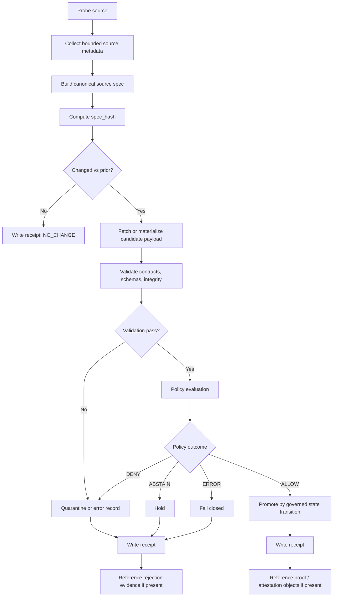

<!-- [KFM_META_BLOCK_V2]
doc_id: kfm://doc/<NEEDS-VERIFICATION-UUID>
title: Governed External Update Flow
type: standard
version: v1
status: draft
owners: [@bartytime4life]
created: 2026-04-11
updated: 2026-04-11
policy_label: governed
related: [../../policy/README.md, ../../tools/probes/README.md, ../../tools/diff/README.md, ../../tools/validators/README.md, ../../tools/attest/README.md, ../../data/receipts/README.md, ../../data/work/README.md, ../../data/quarantine/README.md]
tags: [kfm, external-updates, receipts, attestations, policy, spec-hash]
notes: [doc_id is a placeholder until a registry UUID is surfaced, repo fit and related links are inherited from the uploaded draft and NEEDS VERIFICATION against the mounted repository]
[/KFM_META_BLOCK_V2] -->

# Governed External Update Flow
Define how KFM detects, evaluates, and promotes external-source updates under evidence-first, fail-closed governance.

<p align="left">
  
  
  
  
  
</p>

**Quick jumps:** [Scope](#scope) · [Status and evidence posture](#status-and-evidence-posture) · [Repository fit](#repository-fit) · [Normative rules](#normative-rules) · [Flow](#flow) · [Finite outcomes](#finite-outcomes) · [`spec_hash`](#spec_hash-standard) · [Run receipt](#run-receipt-standard) · [Lane boundaries](#lane-boundaries) · [Conformance](#conformance-checklist)

> [!IMPORTANT]
> This standard is grounded in the uploaded draft plus attached April 2026 KFM doctrine. The suggested repo path and adjacent homes below are inherited from that draft and remain **NEEDS VERIFICATION** until the mounted repository tree is surfaced.

| Item | Value |
|---|---|
| Status | Draft |
| Suggested repo fit | `docs/standards/governed-external-update-flow.md` *(draft-derived; NEEDS VERIFICATION)* |
| Doctrinal anchor | Attached April 2026 KFM working manuals plus the uploaded draft |
| Runtime proof depth | PDF-visible only in this session |
| Next companion artifact | `schemas/run-receipt.schema.json` *(PROPOSED)* |

## Scope

This standard governs how KFM checks for, evaluates, and handles updates from external data sources.

### Applies to

- Remote HTTP or HTTPS sources
- Object storage sources
- Feed-like metadata surfaces
- Externally published dataset manifests
- Authoritative catalogs and service endpoints

### Does not define

- Source-onboarding identity records themselves
- Release-manifest or proof-pack formats
- Business-domain policy semantics outside promotion decisions
- Runtime answer-generation behavior

## Status and evidence posture

| Area | Status | Meaning here |
|---|---|---|
| Core doctrine | **CONFIRMED** | Evidence-first evaluation, fail-closed behavior, receipt/proof separation, and governed promotion are stable project doctrine. |
| Repo path and lane homes | **INFERRED / NEEDS VERIFICATION** | The path and adjacent homes below are inherited from the uploaded draft, not directly reverified from a mounted repo tree. |
| Companion schema filenames | **PROPOSED** | They fit the draft and KFM artifactization pressure, but mounted file existence is not proved in this session. |
| Mounted CI, validator, and runtime depth | **UNKNOWN** | Current-session evidence is PDF-heavy; no mounted workflow inventory, tests, manifests, or emitted proof packs were directly surfaced. |

## Repository fit

**Suggested path:** `docs/standards/governed-external-update-flow.md` *(draft-derived; NEEDS VERIFICATION)*

This standard exists to keep the following concerns separate and stable:

| Concern | Suggested home |
|---|---|
| Bounded source inspection and freshness checks | `tools/probes/` |
| Canonical comparison and change detection | `tools/diff/` |
| Contract and schema validation | `tools/validators/` |
| Allow/deny/abstain obligations and reasons | `policy/` |
| Candidate staging before publication | `data/work/` |
| Blocked or denied material | `data/quarantine/` |
| Process memory for runs | `data/receipts/` |
| Release-significant signing and proof assembly | `tools/attest/` |

## Design goals

The governed external update flow shall:

1. detect material change deterministically,
2. use stable dataset-version identity through `spec_hash`,
3. evaluate promotion under deny-by-default policy,
4. fail closed on ambiguity, validation error, or policy error,
5. preserve a replayable process trail through receipts,
6. keep receipts distinct from proofs and release attestations,
7. support small, reviewable, machine-readable evidence objects, and
8. make promotion legible as a governed state transition rather than an incidental file move.

## Non-goals

This standard does not require:

- a specific orchestrator,
- a specific signing backend,
- a specific cloud provider,
- a specific storage engine, or
- best-effort promotion when policy or validation is uncertain.

## Minimum emitted objects

| Object | Status in this standard | Purpose |
|---|---|---|
| Canonical source specification or stable reference | Required | Defines material source state for identity and comparison. |
| Run receipt | Required | Records process memory for one governed run. |
| Policy decision record | Recommended | Separates decision reasoning from receipt structure. |
| Quarantine record | Required when quarantined or blocked | Makes denied, invalid, or ambiguous material reviewable. |
| Proof or attestation references | Optional but separate | Links release-significant proof objects without collapsing them into the receipt. |

## Normative rules

The rules in this section are normative.

### R1. Every external update check is a governed run

Each check of an external source shall produce a bounded run with a unique `run_id`.

### R2. Change detection shall be based on canonicalized material state

A source shall not be considered materially changed solely because polling metadata changed. Material change shall be determined from a canonicalized source specification and its hash.

### R3. `spec_hash` is the dataset-version identity anchor

The canonical source specification shall be hashed deterministically. That digest is the `spec_hash`. KFM shall use `spec_hash` as the idempotency key and dataset-version identity anchor for the evaluated update.

### R4. Validation precedes promotion

A changed source shall not be promoted unless required contracts, schemas, and integrity checks pass.

### R5. Promotion is a governed state transition

Promotion shall be treated as a governed state transition, not as a file move, staging convenience, or transport side effect.

### R6. Promotion is policy-controlled

Validation success alone shall not authorize promotion. Promotion requires an explicit policy outcome of `ALLOW`.

### R7. Fail closed

Validation failure, policy denial, policy error, missing required evidence, or ambiguous state shall not result in promotion.

### R8. Receipts are process memory, not proofs

Each governed run shall emit a run receipt into `data/receipts/`. That receipt records what happened in the run. It is not itself the release proof object.

### R9. Proof artifacts remain separate

Signing, attestations, proof packs, and release manifests shall remain separate from run receipts and shall be owned by the appropriate proof surface.

### R10. Quarantine is explicit

Denied, invalid, or ambiguous materials shall be placed in a quarantine path or quarantine state with a reviewable record.

### R11. Finite outcomes only

The flow shall resolve to a finite outcome from the approved grammar in this standard.

## Flow



## Finite outcomes

### Decision outcomes

The policy decision grammar is:

- `ALLOW`
- `DENY`
- `ABSTAIN`
- `ERROR`

### Final run outcomes

The final run outcome grammar is:

- `NO_CHANGE`
- `PROMOTED`
- `QUARANTINED`
- `HELD`
- `ERROR`

### Required mapping

| Condition | Final outcome |
|---|---|
| no material change | `NO_CHANGE` |
| validation pass + policy `ALLOW` | `PROMOTED` |
| validation fail | `QUARANTINED` |
| policy `DENY` | `QUARANTINED` |
| policy `ABSTAIN` | `HELD` |
| policy error or system error | `ERROR` |

> [!NOTE]
> `PROMOTED` means that a governed state transition completed. It does not mean a payload merely landed in a directory or crossed a transport boundary.

A system may use finer internal statuses, but emitted run receipts shall map cleanly to the above final outcomes.

## Flow stages

### 1. Probe

The probe stage performs bounded, read-only inspection sufficient to decide whether deeper work is needed.

Examples include:

- HTTP `HEAD`
- retrieval of `ETag` or `Last-Modified`
- source availability checks
- lightweight catalog listing inspection
- freshness lag inspection

Probe outputs are cues, not promotion authority.

### 2. Canonicalize

The canonicalization stage constructs the source specification used for identity and comparison.

This stage shall:

- normalize field ordering,
- normalize serialization,
- sort unordered collections where order is not semantically meaningful,
- exclude transient transport-only fields unless explicitly required, and
- record the canonical specification or a stable reference to it.

### 3. Hash

The hash stage computes `spec_hash` from the canonical source specification.

### 4. Fetch or materialize candidate

If change is detected, the system may fetch, stage, or materialize the candidate payload into a work surface for validation.

### 5. Validate

Validation checks may include:

- schema validation,
- contract validation,
- integrity checks,
- media-type checks,
- required artifact presence,
- bounded geometry or extent checks, and
- catalog closure checks when applicable.

### 6. Policy

Policy evaluates whether the candidate may advance.

Policy may consider:

- source trust or publisher allowlists,
- rights and sensitivity labels,
- schema-version compatibility,
- scale or size limits,
- geographic or temporal scope constraints,
- release-state constraints, and
- obligations required before promotion.

### 7. Promote, quarantine, or hold

Only explicit `ALLOW` may promote. `DENY`, `ABSTAIN`, validation failure, or error shall not promote.

### 8. Receipt and proof linkage

Each run writes a receipt. If attestations or proofs are produced, the receipt shall reference them without collapsing the receipt into the proof object.

## `spec_hash` standard

### Definition

`spec_hash` is the deterministic digest of the canonical source specification for the candidate dataset version.

### Purpose

`spec_hash` is used as:

- the update idempotency key,
- the dataset-version identity anchor,
- the primary linkage handle across receipt, work, quarantine, and proof references, and
- the replay comparison anchor.

### Canonical source specification

The canonical source specification shall include only fields that are intended to define material source state.

Recommended minimum sections:

```json
{
  "source": {
    "uri": "string",
    "publisher": "string",
    "dataset_key": "string"
  },
  "metadata": {},
  "assets": [],
  "schema_version": "string",
  "geometry_fingerprints": [],
  "declared_time_range": null
}
```

### Canonicalization requirements

The canonical source specification shall:

- use deterministic key order,
- sort asset references by a stable key,
- normalize null and empty values consistently,
- normalize URI formatting where the same source can vary syntactically,
- exclude timestamps generated by the checker itself, and
- exclude ephemeral transport headers unless explicitly chosen as material.

### Hash algorithm

The default algorithm shall be `sha256`, encoded as lowercase hexadecimal unless another encoding is explicitly standardized elsewhere.

## Run receipt standard

### Purpose

A run receipt records the process memory of one governed run.

### Minimum required fields

```json
{
  "run_id": "string",
  "source_uri": "string",
  "dataset_key": "string",
  "checked_at": "RFC3339 timestamp",
  "spec_hash": "hex sha256",
  "previous_spec_hash": "hex sha256 or null",
  "change_detected": true,
  "validation_outcome": "PASS | FAIL | SKIPPED | ERROR",
  "policy_outcome": "ALLOW | DENY | ABSTAIN | ERROR | SKIPPED",
  "final_outcome": "NO_CHANGE | PROMOTED | QUARANTINED | HELD | ERROR",
  "reason": "string",
  "obligations": [],
  "canonical_spec_ref": "string or null",
  "candidate_artifact_refs": {},
  "proof_refs": {},
  "quarantine_ref": "string or null"
}
```

### Receipt requirements

A run receipt shall:

- be machine-readable,
- be write-once for the completed run,
- include the final outcome,
- include a human-reviewable reason string,
- include any obligations returned by policy,
- include linkage references rather than embedding large payloads, and
- avoid redefining proof or release-manifest schemas.

## Policy decision record

If policy emits a standalone decision record, it should minimally include:

```json
{
  "run_id": "string",
  "spec_hash": "string",
  "decision": "ALLOW | DENY | ABSTAIN | ERROR",
  "reason_code": "string",
  "reason": "string",
  "obligations": [],
  "policy_package": "string",
  "policy_version": "string"
}
```

This object may be referenced from the receipt rather than duplicated inside it.

## Quarantine record

Quarantined material should be traceable with a small review object.

Recommended fields:

```json
{
  "run_id": "string",
  "spec_hash": "string",
  "quarantine_reason": "string",
  "quarantine_class": "VALIDATION_FAIL | POLICY_DENY | POLICY_ERROR | SYSTEM_ERROR | UNKNOWN",
  "artifact_refs": {},
  "review_state": "PENDING | REVIEWED | RELEASED | DISCARDED"
}
```

## Lane boundaries

| Home | Owns | Does not own |
|---|---|---|
| `tools/probes/` | bounded inspection, freshness and availability checks, source polling, lightweight metadata acquisition | policy decisions, schema authority, proof semantics, publication |
| `tools/diff/` | canonicalization helpers, deterministic comparison, `spec_hash` computation, reviewer-facing change summaries | policy approval, source-acquisition orchestration, schema contracts |
| `tools/validators/` | fail-closed contract checks, schema validation, structural linkage validation | policy logic, proof signing, publication orchestration |
| `policy/` | allow/deny logic, obligations, reason semantics, sensitivity and rights gating | hashing, transport fetching, reviewer summaries |
| `data/work/` | candidate staging between intake and publication, intermediate normalized or validated handoff materials | authoritative publication identity, quarantine state, proof storage |
| `data/quarantine/` | blocked, denied, invalid, or ambiguous materials, reviewable quarantine records | policy logic itself, publication state |
| `data/receipts/` | process memory for runs, replay and correction-ready records, receipt linkage to evidence and proofs | release manifests, attestations as the authority surface |
| `tools/attest/` | signing helpers, proof-pack assembly, digest and verification helpers, attestation linkage for release-significant artifacts | receipt schema authority, promotion policy authority |

## Security and fail-closed behavior

The governed external update flow shall fail closed under any of the following:

- required source metadata missing,
- canonical specification cannot be built,
- `spec_hash` cannot be computed,
- candidate fetch fails after change detection when fetch is required,
- validation errors,
- policy engine unavailable or errored,
- required receipt cannot be written, or
- required evidence references cannot be produced.

Under fail-closed behavior:

- no promotion occurs,
- a reviewable error or quarantine record should be produced when possible, and
- the final outcome shall be `ERROR`, `HELD`, or `QUARANTINED`, never `PROMOTED`.

## Idempotency and replay

The system shall support idempotent handling keyed by `spec_hash`.

Recommended behavior:

- repeated checks with unchanged `spec_hash` emit `NO_CHANGE`,
- repeated processing of the same `spec_hash` should not create duplicate promoted versions, and
- replay should be able to reconstruct the decision path from receipt, canonical-spec reference, and policy-decision reference.

## Observability

Recommended emitted metrics include:

- source checks attempted,
- source checks succeeded,
- material changes detected,
- validation pass/fail counts,
- policy outcome counts,
- promotion counts,
- quarantine counts,
- hold counts, and
- end-to-end run duration.

Logs should avoid secrets and should reference `run_id` and `spec_hash` for linkage.

## Minimal reference sequence

```text
1. Probe source
2. Build canonical source specification
3. Compute spec_hash
4. Compare against prior spec_hash
5. If unchanged, write receipt with NO_CHANGE
6. If changed, fetch or materialize candidate
7. Validate candidate
8. Evaluate policy
9. Promote, quarantine, or hold
10. Write receipt
11. Optionally attach proof or attestation refs
```

## Example outcome matrix

| Changed | Validation | Policy | Final outcome |
|---|---:|---:|---|
| No | SKIPPED | SKIPPED | `NO_CHANGE` |
| Yes | PASS | ALLOW | `PROMOTED` |
| Yes | PASS | DENY | `QUARANTINED` |
| Yes | PASS | ABSTAIN | `HELD` |
| Yes | FAIL | SKIPPED | `QUARANTINED` |
| Yes | ERROR | SKIPPED | `ERROR` |
| Yes | PASS | ERROR | `ERROR` |

## Conformance checklist

A governed external update implementation conforms to this standard when it satisfies all of the following:

- emits a unique `run_id` per run,
- computes deterministic `spec_hash` from a canonical source specification,
- does not promote on probe metadata alone,
- validates changed candidates before promotion,
- treats promotion as a governed state transition,
- uses explicit policy outcomes with deny-by-default posture,
- resolves to a finite final outcome from this standard,
- writes a machine-readable run receipt,
- keeps receipts distinct from proofs,
- supports quarantine or equivalent blocked state, and
- fails closed on validation, policy, or system ambiguity.

## Recommended companion schemas

Recommended schema files:

- `schemas/external-update-canonical-spec.schema.json`
- `schemas/run-receipt.schema.json`
- `schemas/policy-decision.schema.json`
- `schemas/quarantine-record.schema.json`

## Suggested next artifact *(PROPOSED)*

Start with `schemas/run-receipt.schema.json`.

Why first:

- it locks the emitted vocabulary for the run path,
- it stabilizes the linkage point between policy, quarantine, and proof references,
- it makes valid/invalid fixtures straightforward to add next, and
- it reduces drift across later lane docs and implementation notes.

## Open standardization items

<details>
<summary><strong>Open items</strong></summary>

- exact canonical source specification field set per source family,
- geometry fingerprint algorithm,
- receipt storage layout and partitioning,
- proof format and signing backend,
- catalog integration details for STAC, DCAT, and PROV emission, and
- correction and rollback linkage extensions.

</details>

<details>
<summary><strong>Terminology</strong></summary>

| Term | Meaning |
|---|---|
| governed run | one bounded execution of the external update flow |
| canonical source specification | normalized material definition of the candidate source state |
| `spec_hash` | deterministic digest of the canonical source specification |
| receipt | process-memory record of a run |
| proof | release-significant manifest, attestation, or proof pack |
| quarantine | explicit blocked state for denied, invalid, or ambiguous material |
| hold | non-promoted state used when policy abstains |
| finite outcome | closed outcome vocabulary used for accountability |

</details>

## Implementation note

A practical implementation can use inexpensive source probing such as `HEAD`, feed listings, or manifest fetches to avoid unnecessary payload transfers. Those signals are optimization inputs only. Material identity still comes from the canonical source specification and `spec_hash`, not from transport metadata alone.
